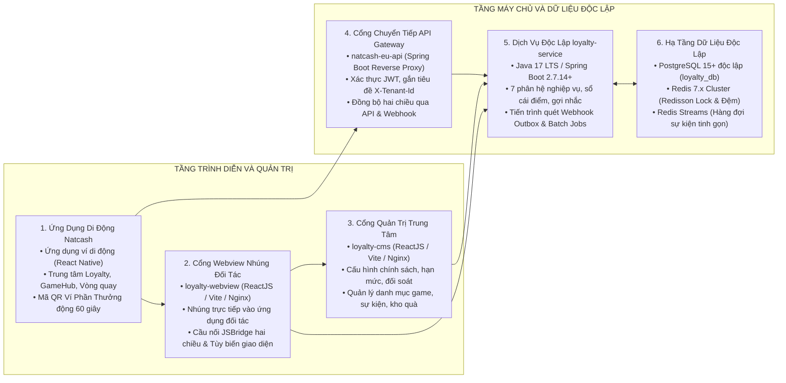

# HỆ SINH THÁI KHÁCH HÀNG THÂN THIẾT LIÊN MINH VÀ CỔNG GAME ĐA THUÊ BAO (MICRO-LOYALTY)

Tài liệu tổng quan hệ sinh thái phần mềm Dịch vụ Khách hàng thân thiết liên minh và Cổng Game đa thuê bao, cung cấp nền tảng tích điểm hợp nhất, phân hạng hội viên, liên thông Ví Phần Thưởng tại điểm bán và trò chơi hóa giải trí.

---

## 1. TỔNG QUAN HỆ THỐNG VÀ BỘ SẢN PHẨM BÀN GIAO

Hệ thống được thiết kế theo kiến trúc dịch vụ vi mô độc lập (Microservices), phục vụ mô hình phần mềm dịch vụ đa thuê bao (Multi-tenant SaaS) bao trùm dịch vụ ví điện tử Natcash, mạng viễn thông Natcom và mạng lưới các đối tác thương mại bán lẻ liên minh.



### Bộ Sản Phẩm Bàn Giao Cốt Lõi:
1. **Dịch vụ máy chủ nghiệp vụ độc lập (`loyalty-service`):** Xây dựng trên nền tảng Java 17 LTS và Spring Boot 2.7.14+, quản lý cơ sở dữ liệu quan hệ độc lập `loyalty_db` trên PostgreSQL 15+ (tách biệt 100% với `natcash_db`).
2. **Cổng thông tin quản trị trung tâm (`loyalty-cms`):** Xây dựng trên nền tảng ReactJS 18+, TypeScript, Vite, Ant Design 5.x, đóng gói ứng dụng trang đơn (SPA) tĩnh phục vụ qua máy chủ Nginx.
3. **Cổng Webview nhúng đa nền tảng (`loyalty-webview`):** Xây dựng trên nền tảng ReactJS 18+, Vite, TailwindCSS Mobile-First, tích hợp thư viện cầu nối `LoyaltyJSBridge` và xác thực vé một lần (SSO Ticket).
4. **Cổng nhà phát triển và trình giả lập (`loyalty-sandbox`):** Cổng tự phục vụ dành cho nhà phát triển đối tác để tra cứu API, tính chữ ký HMAC-SHA256 và thử nghiệm bắn Webhook.
5. **Bộ tích hợp Ứng dụng di động (`natcash-eu-app`):** Tích hợp màn hình Trung tâm Loyalty, Mã QR Ví Phần Thưởng động 60 giây, Cổng Game và Vòng quay may mắn trên ứng dụng React Native.
6. **Cổng chuyển tiếp trung gian (`natcash-eu-api`):** Đóng vai trò Cổng kết nối chuyển tiếp (Reverse Proxy) xác thực người dùng, đồng bộ hai chiều và tiếp nhận Webhook.

---

## 2. CẤU TRÚC THƯ MỤC MÃ NGUỒN VÀ TÀI LIỆU

```
micro-loyalty/
├── .gitignore                          # Cấu hình bỏ qua tệp tập trung cho toàn bộ dự án
├── pom.xml                             # Quản lý 15 modules Maven cha (Root POM)
├── deploy/                             # Cấu hình triển khai hạ tầng & Docker Stack
│   └── docker-compose.yml              # Môi trường PostgreSQL 15, Redis 7, Backend & Frontend
├── docs/                               # Hồ sơ tài liệu thiết kế và giải pháp
│   ├── ba/                             # Khối tài liệu nghiệp vụ
│   │   ├── solution.md                 # Phương án giải pháp tổng thể
│   │   └── detailed_design.md          # Đặc tả yêu cầu kỹ thuật chi tiết
│   └── dev/                            # Khối tài liệu kỹ thuật
│       └── codebase.md                 # Bản đồ cấu trúc và đối sánh tái sử dụng mã nguồn
├── plan/                               # Kế hoạch sản xuất và theo dõi tiến độ
│   ├── production_plan.md              # Kế hoạch sản xuất 42 Tasks kèm Cột Tình Trạng
│   ├── project_status.md               # Bảng WBS Master Tracker theo dõi 11 Phân hệ
│   ├── prompt_audit.md                 # Quy chuẩn rà soát mã nguồn tự động
│   └── audit/                          # Hồ sơ lưu vết lịch sử rà soát
│       └── audit_report_20260823.md    # Báo cáo đánh giá chất lượng mã nguồn Sprint 1
└── src/                                # Toàn bộ mã nguồn triển khai thực tế
    ├── lib/                            # Thư viện dùng chung và động cơ lõi
    │   ├── ims-libraries/              # 11 modules thư viện nền tảng độc lập
    │   └── loyalty-engine/             # POM quản lý phụ thuộc tập trung
    ├── service/                        # Dịch vụ nghiệp vụ máy chủ
    │   └── loyalty-service/            # Java 17 LTS / Spring Boot 2.7.14+
    ├── cms/                            # Cổng quản trị trung tâm
    │   └── loyalty-cms/                # ReactJS 18+ / Ant Design 5.x / Vite
    ├── webview/                        # Cổng Webview nhúng di động
    │   └── loyalty-webview/            # ReactJS 18+ / TailwindCSS / LoyaltyJSBridge
    └── sandbox/                        # Cổng nhà phát triển và trình mô phỏng
        └── loyalty-sandbox/            # ReactJS 18+ / HMAC Calculator / Simulator
```

---

## 3. DANH MỤC HỒ SƠ TÀI LIỆU VÀ KẾ HOẠCH

| STT | Tên tài liệu | Tệp tài liệu | Phạm vi và Mục đích nội dung |
| :---: | :--- | :--- | :--- |
| 1 | **Phương Án Giải Pháp Tổng Thể** | [docs/ba/solution.md](docs/ba/solution.md) | Tổng quan bối cảnh, mục tiêu chiến lược, kiến trúc giải pháp, mô hình liên thông Ví Phần Thưởng, cơ chế bù trừ tài chính liên minh, động cơ cột mốc chiến dịch, gợi nhắc ngữ cảnh và kinh tế Cổng Game. |
| 2 | **Thiết Kế Kỹ Thuật Chi Tiết** | [docs/ba/detailed_design.md](docs/ba/detailed_design.md) | Kiến trúc đa thuê bao, khóa phân tán Redisson RLock, Transactional Outbox, xác thực Khóa kép HMAC-SHA256, thiết kế cơ sở dữ liệu 17 bảng PostgreSQL 15+ và đặc tả chi tiết các RESTful API. |
| 3 | **Kế Hoạch Sản Xuất Chi Tiết** | [plan/production_plan.md](plan/production_plan.md) | Kế hoạch 4 Giai đoạn – 8 Đợt nước rút – 42 Tác vụ kỹ thuật có tiêu chí nghiệm thu (DoD) và Cột Tình Trạng theo dõi trực tiếp. |
| 4 | **Bảng Theo Dõi Tiến Độ Master Tracker** | [plan/project_status.md](plan/project_status.md) | Ma trận WBS theo dõi % tiến độ chi tiết của 11 Phân hệ nghiệp vụ (D0 → D10, QA) và bảng phân loại các vấn đề kỹ thuật (Blockers). |
| 5 | **Quy Chuẩn Rà Soát Mã Nguồn Tự Động** | [plan/prompt_audit.md](plan/prompt_audit.md) | Quy định thang điểm đánh giá tiến độ thực tế, tiêu chuẩn Zero Mock/Stub, quy trình rà soát 4 bước và cập nhật đồng bộ các tệp theo dõi. |
| 6 | **Bản Đồ Cấu Trúc Mã Nguồn** | [docs/dev/codebase.md](docs/dev/codebase.md) | Báo cáo chi tiết về việc kế thừa 11 module thư viện `ims-libraries`, bảo mật HMAC và hạ tầng container hóa. |

---

## 4. HƯỚNG DẪN KHỞI CHẠY VÀ KIỂM THỬ CỤC BỘ

### 4.1. Khởi chạy Hạ tầng Dữ liệu & Container (Docker)
```bash
# Di chuyển vào thư mục deploy và khởi chạy PostgreSQL 15 + Redis 7
cd deploy
docker compose up -d postgres redis
```

### 4.2. Biên dịch và Kiểm thử Backend Java (Spring Boot)
```bash
# Biên dịch toàn bộ 15 modules Maven từ thư mục gốc
mvn clean install -DskipTests

# Chạy kiểm thử tự động tầng Backend
mvn test
```

### 4.3. Đóng gói và Kiểm tra Frontend (CMS, Webview, Sandbox)
```bash
# Cổng quản trị trung tâm CMS
cd src/cms/loyalty-cms && npm run lint && npm run build

# Cổng Webview nhúng di động
cd ../../webview/loyalty-webview && npm run lint && npm run build

# Cổng Developer Sandbox
cd ../../sandbox/loyalty-sandbox && npm run lint && npm run build
```

---

## 5. CÁC NGUYÊN TẮC AN NINH VÀ TOÀN VẸN DỮ LIỆU

* **Tách biệt cơ sở dữ liệu hoàn toàn:** Cơ sở dữ liệu `loyalty_db` trên PostgreSQL 15+ độc lập 100% với cơ sở dữ liệu ví `natcash_db`. Hai hệ thống không chia sẻ bảng và chỉ giao tiếp qua giao thức mạng chuẩn hóa (API RESTful có ký số HMAC và Webhook Outbox).
* **Bảo vệ an toàn tài chính và chống tiêu điểm kép:** Sử dụng khóa phân tán `RLock` của Redisson theo cú pháp `lock:burn:tenant_id:user_id` với thời gian chờ tối đa 3.000ms kết hợp khóa mức dữ liệu `Pessimistic Write Lock` trong giao dịch cơ sở dữ liệu.
* **Xác thực đa tầng chuẩn hóa:**
  * Giao tiếp máy chủ sang máy chủ (B2B): Xác thực Khóa kép (`X-Api-Key`, `SecretKey`), ký số `HMAC-SHA256` và kiểm tra sai lệch thời gian `X-Timestamp` (tối đa ±300 giây).
  * Giao tiếp Webview nhúng: Xác thực vé phiên một lần (`session_ticket` thời hạn 60 giây) đổi lấy mã truy cập ngắn hạn JWT (15 phút).
* **Đồng bộ phi tập trung qua Transactional Outbox:** Đảm bảo 100% sự kiện thăng hạng và biến động điểm được gửi đến đích thành công qua cơ chế Outbox Publisher và tự động thử lại theo cấp số nhân (5 lần).
* **Kiểm soát tần suất thông báo:** Giới hạn tối đa 1 thông báo đẩy mỗi ngày cho mỗi khách hàng, chỉ gửi trong khung giờ thân thiện từ 8h00 sáng đến 20h00 tối và ưu tiên hiển thị thông điệp gợi nhắc âm thầm trong ứng dụng.