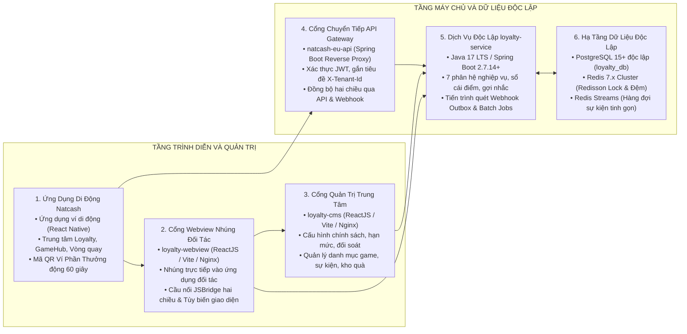

# HỆ SINH THÁI KHÁCH HÀNG THÂN THIẾT LIÊN MINH VÀ CỔNG GAME ĐA THUÊ BAO (MICRO-LOYALTY)

Tài liệu tổng quan hệ sinh thái phần mềm Dịch vụ Khách hàng thân thiết liên minh và Cổng Game đa thuê bao, cung cấp nền tảng tích điểm hợp nhất, phân hạng hội viên, liên thông Ví Phần Thưởng tại điểm bán và trò chơi hóa giải trí.

---

## 1. TỔNG QUAN HỆ THỐNG VÀ BỘ SẢN PHẨM BÀN GIAO

Hệ thống được thiết kế theo kiến trúc dịch vụ vi mô độc lập (Microservices), phục vụ mô hình phần mềm dịch vụ đa thuê bao (Multi-tenant SaaS) bao trùm dịch vụ ví điện tử Natcash, mạng viễn thông Natcom và mạng lưới các đối tác thương mại bán lẻ liên minh.

### Bộ Sản Phẩm Bàn Giao Chính Thức
1. **Dịch vụ máy chủ nghiệp vụ độc lập (`loyalty-service`):** Xây dựng trên nền tảng Java 17 LTS và Spring Boot 2.7.14+, quản lý cơ sở dữ liệu quan hệ độc lập `loyalty_db` trên PostgreSQL 15+ (tách biệt 100% với `natcash_db`).
2. **Cổng thông tin quản trị trung tâm (`loyalty-cms`):** Xây dựng trên nền tảng ReactJS 18+, TypeScript, Vite, Ant Design 5.x, đóng gói ứng dụng trang đơn (SPA) tĩnh phục vụ qua máy chủ Nginx.
3. **Cổng Webview nhúng đa nền tảng (`loyalty-webview`):** Xây dựng trên nền tảng ReactJS 18+, Vite, TailwindCSS Mobile-First, tích hợp thư viện cầu nối `LoyaltyJSBridge` và giao chế xác thực một lần (SSO Ticket).
4. **Bộ tích hợp Ứng dụng di động (`natcash-eu-app`):** Tích hợp màn hình Trung tâm Loyalty, Mã QR Ví Phần Thưởng động 60 giây, Cổng Game và Vòng quay may mắn trên ứng dụng React Native.
5. **Cổng chuyển tiếp trung gian (`natcash-eu-api`):** Đóng vai trò Cổng kết nối chuyển tiếp (Reverse Proxy) xác thực người dùng, đồng bộ hai chiều và tiếp nhận Webhook.

---

## 2. DANH MỤC HỒ SƠ TÀI LIỆU KỸ THUẬT VÀ NGHIỆP VỤ

Toàn bộ hồ sơ tài liệu được chuẩn hóa và lưu trữ tại thư mục [docs/ba](file:///Users/micro/Source/chapisoft/micro-loyalty/docs/ba):

| STT | Tên tài liệu | Tệp tài liệu | Phạm vi và Mục đích nội dung |
| :---: | :--- | :--- | :--- |
| 1 | **Tài Liệu Giải Pháp, Nghiệp Vụ và Thiết Kế Tổng Thể** | [gamehub_loyalty_solution.md](file:///Users/micro/Source/chapisoft/micro-loyalty/docs/ba/gamehub_loyalty_solution.md) | Tổng quan bối cảnh, mục tiêu chiến lược, kiến trúc giải pháp, phân định trách nhiệm các tầng, mô hình liên thông Ví Phần Thưởng, cơ chế thanh toán bù trừ tài chính liên minh, 4 trụ cột nghiệp vụ Loyalty, động cơ cột mốc chiến dịch, gợi nhắc thông minh và kinh tế Cổng Game. |
| 2 | **Tài Liệu Thiết Kế Kỹ Thuật Chi Tiết Hệ Thống** | [gamehub_loyalty_detailed_design.md](file:///Users/micro/Source/chapisoft/micro-loyalty/docs/ba/gamehub_loyalty_detailed_design.md) | Kiến trúc phân lớp đa thuê bao, ngăn xếp công nghệ chính thức, cơ chế khóa phân tán Redisson, xử lý Transactional Outbox, cơ chế xác thực B2B / SSO / Webhook, thiết kế cơ sở dữ liệu 17 bảng PostgreSQL 15+, đặc tả API, sequence diagram chi tiết và kế hoạch chuyển đổi kỹ thuật. |
| 3 | **Tài Liệu Phương Án, Giải Pháp và Kế Hoạch Sản Xuất Chi Tiết** | [gamehub_loyalty_production_plan.md](file:///Users/micro/Source/chapisoft/micro-loyalty/docs/ba/gamehub_loyalty_production_plan.md) | Đặc tả Webview nhúng và thư viện JSBridge, cấu trúc 7 module trên CMS, ma trận phân rã chi tiết 4 Giai đoạn (Phases) – 8 Đợt nước rút (Sprints) – 42 Tác vụ (Tasks) kèm tiêu chí hoàn thành, ma trận RACI, kế hoạch kiểm thử tải 1.000 RPS và quản trị rủi ro. |
| 4 | **Báo Cáo Nghiên Cứu Đối Sánh & Kế Hoạch Tái Sử Dụng Mã Nguồn** | [codebase.md](file:///Users/micro/Source/chapisoft/micro-loyalty/docs/dev/codebase.md) | Đánh giá khả năng kế thừa 11 module lõi `ims-libraries`, bảo mật khóa kép HMAC-SHA256, khung CMS/Sandbox và hạ tầng Private LAN / Docker từ dự án `smart-otp` sang `micro-loyalty`, ước tính tiết kiệm 8-10 tuần-người. |

---

## 3. CÁC NGUYÊN TẮC KIẾN TRÚC VÀ CÔNG NGHỆ CỐT LÕI

* **Tách biệt cơ sở dữ liệu hoàn toàn:** Cơ sở dữ liệu `loyalty_db` trên PostgreSQL 15+ độc lập 100% với cơ sở dữ liệu ví `natcash_db`. Hai hệ thống không chia sẻ bảng và chỉ giao tiếp qua giao thức mạng chuẩn hóa (API RESTful có ký số và Webhook Outbox).
* **Bảo vệ an toàn tài chính và chống tiêu điểm kép:** Sử dụng khóa phân tán `RLock` của Redisson theo cú pháp `lock:burn:tenant_id:user_id` với thời gian chờ tối đa 3.000ms kết hợp khóa mức dữ liệu `Pessimistic Write Lock` trong giao dịch cơ sở dữ liệu.
* **Xác thực đa tầng chuẩn hóa:**
  * Giao tiếp máy chủ sang máy chủ (B2B): Xác thực Khóa kép (`X-Api-Key`, `SecretKey`), ký số `HMAC-SHA256` và kiểm tra sai lệch thời gian `X-Timestamp` (tối đa ±300 giây).
  * Giao tiếp Webview nhúng: Xác thực vé phiên một lần (`session_ticket` thời hạn 60 giây) đổi lấy mã truy cập ngắn hạn JWT (15 phút).
* **Đồng bộ phi tập trung qua Transactional Outbox:** Đảm bảo 100% sự kiện thăng hạng và biến động điểm được gửi đến đích thành công qua cơ chế Outbox Publisher và tự động thử lại theo cấp số nhân (Exponential Backoff).
* **Kiểm soát tần suất chống làm phiền:** Giới hạn tối đa 1 thông báo đẩy mỗi ngày cho mỗi khách hàng, chỉ gửi trong khung giờ thân thiện từ 8h00 sáng đến 20h00 tối và ưu tiên hiển thị thông điệp âm thầm trong ứng dụng.