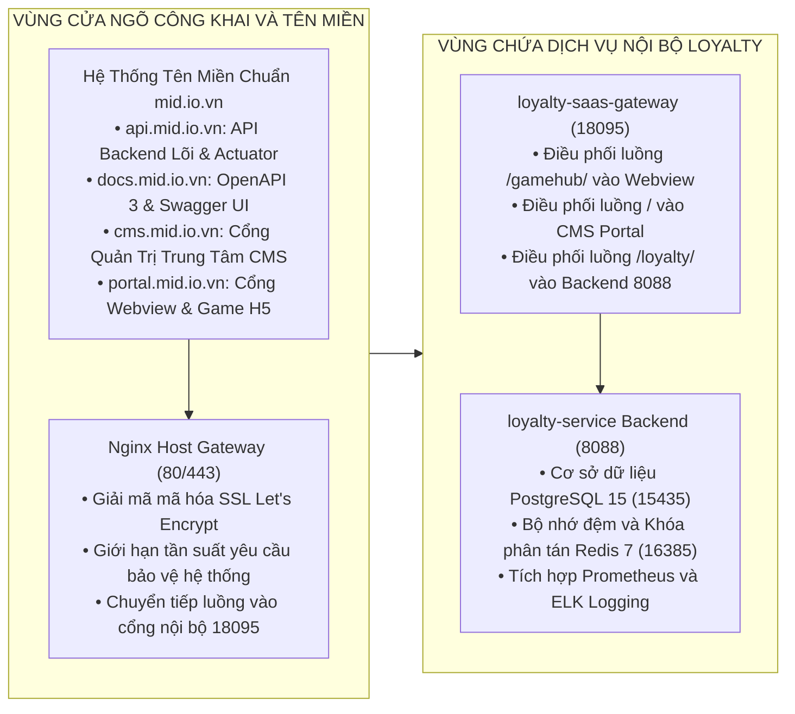
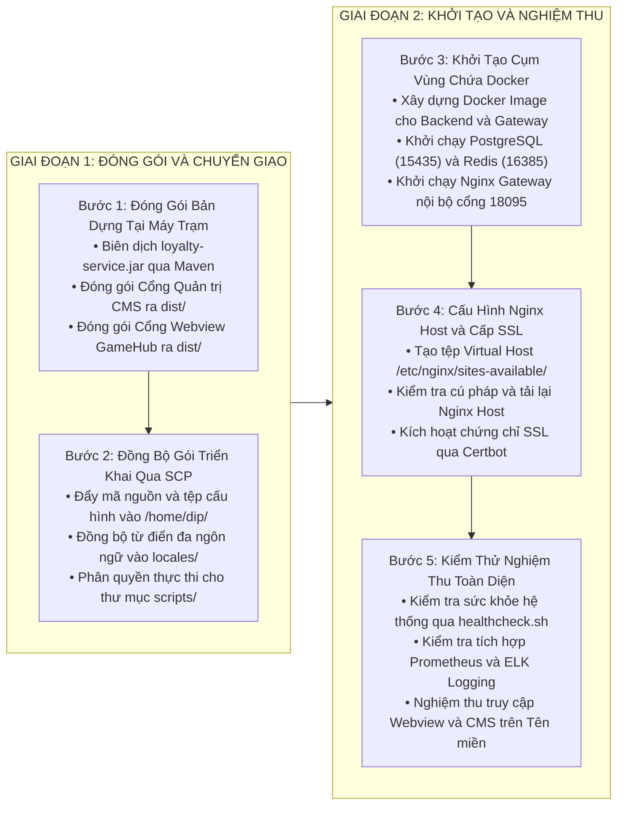

# HƯỚNG DẪN TRIỂN KHAI NỀN TẢNG LOYALTY VÀ CỔNG GAME ĐỒNG HẠ TẦNG DIP VÀ SMART-OTP

**Mô hình triển khai:** Đồng máy chủ hạ tầng Nền tảng Tích hợp Kỹ thuật số (DIP Platform) và Smart-OTP  
**Địa chỉ máy chủ:** `210.211.102.99` (Cổng SSH: `65000`, Tài khoản quản trị: `dip`)  
**Hệ điều hành:** Ubuntu Linux 22.04 LTS x86_64 (Kernel 5.15.0)  
**Tên miền hệ thống chính thức:** `api.mid.io.vn`, `docs.mid.io.vn`, `cms.mid.io.vn`, `portal.mid.io.vn` (Gốc: `mid.io.vn`)  
**Thư mục cài đặt dịch vụ:** `/home/dip/micro-loyalty/deploy/` (hoặc `/opt/micro-loyalty/deploy/`)  
**Nguyên tắc an toàn vận hành:** Tuyệt đối không tự ý thực thi triển khai (deploy), đồng bộ tệp hay can thiệp máy chủ từ xa khi chưa có yêu cầu tường minh từ người dùng.

---

## 1. THÔNG SỐ HIỆN TRẠNG, ĐÁNH GIÁ TÀI NGUYÊN VÀ ĐIỀU KIỆN CẦN BỔ SUNG

### 1.1. Bảng Khảo Sát Hiện Trạng Hạ Tầng Máy Chủ DIP (`210.211.102.99`)

Khảo sát trực tiếp toàn diện hệ thống máy chủ `210.211.102.99` ghi nhận các thông số kỹ thuật hạ tầng:

| Thành phần | Hiện trạng thực tế trên máy chủ 210.211.102.99 | Đánh giá và Yêu cầu đáp ứng |
|:---|:---|:---|
| **Hệ điều hành** | Ubuntu Linux 22.04.4 LTS x86_64 (Kernel 5.15.0) | Môi trường vùng chứa Docker hiện đại, ổn định. |
| **Năng lực xử lý CPU** | 8 Cores (Intel Xeon CPU E5450 @ 3.00GHz) | Mức tải trung bình dưới 25%, năng lực xử lý rất tốt. |
| **Bộ nhớ RAM vật lý** | Tổng 32.0 GB (Đang sử dụng: ~21.0 GB, Khả dụng: **~8.5 GB**) | Đạt chuẩn xuất sắc, đủ bộ nhớ cấp phát cho hệ thống. |
| **Dung lượng lưu trữ** | Phân vùng gốc dung lượng 272 GB (Đã dùng: **86 GB**, Khả dụng: **173 GB**, chiếm **34%**) | Đã dọn dẹp giải phóng 134 GB và cấu hình chu kỳ tự động dọn dẹp nhật ký 3 ngày. |
| **Môi trường điều phối** | Docker Engine 24.x, Docker Compose v2, Docker Swarm | Đạt chuẩn, sẵn sàng quản trị vùng chứa tự động. |
| **Máy chủ Web Nginx Host** | Nginx Gateway cổng `80/443` (Chứng chỉ SSL Let's Encrypt) | Đạt chuẩn, cấu hình Virtual Hosts cho `*.mid.io.vn`. |
| **Hệ thống giám sát APM** | Prometheus cổng `9090`, Grafana cổng `3000`, Alertmanager cổng `9093` | Có sẵn, tích hợp thu thập chỉ số hiệu năng trực tiếp. |
| **Hệ thống lưu vết ELK** | Elasticsearch cổng `9200`, Logstash cổng `5044`, Kibana cổng `5601` | Có sẵn, tập trung toàn bộ nhật ký dịch vụ qua Filebeat. |
| **Hệ thống CI/CD** | Jenkins Server cổng `9191` (Giao tiếp nội bộ cổng `50000`) | Có sẵn, tự động hóa toàn bộ quy trình đóng gói và phát hành. |

---

### 1.2. Đánh Giá Tài Nguyên Thực Tế Và Khả Năng Vận Hành Cùng DIP Và Smart-OTP

Máy chủ hiện đang vận hành đồng thời ba nhóm hệ thống chính:
1. **Cụm Nền tảng DIP:** Cơ sở dữ liệu Oracle XE 21c (4GB RAM), PostgreSQL 15 (cổng `5432`), Redis 7 (cổng `6379`), MinIO S3 (cổng `9000/9001`), Apache Kafka (cổng `9092`), cụm microservices DIP (`iam-service`, `core-service`, `notification-service`...).
2. **Cụm Smart-OTP:** Nginx Gateway (cổng `18090`), 4 microservices Java (`authentication-service` cổng `8080`, `partner-service` cổng `8081`, `customer-service` cổng `8082`, `cms-service` cổng `8085`), CMS Admin Web (cổng `80`), PostgreSQL 16 (cổng `15433`), Redis 7 (cổng `16380`).
3. **Cụm Micro-CRM:** Nginx Gateway (cổng `18080`), PostgreSQL 16 (cổng `15432`), Redis 7 (cổng `16379`), Kafka (cổng `19094`).

#### Bảng Cân Đối Bộ Nhớ RAM Trước Và Sau Khi Triển Khai

| Phân nhóm hệ thống | Dung lượng RAM chiếm dụng | Tỷ lệ phần trăm | Ghi chú và Phân bổ tài nguyên |
|:---|:---:|:---:|:---|
| **Hệ điều hành và Bộ đệm Kernel** | 3.0 GB | 9.4% | Duy trì hoạt động nhân Linux và bộ nhớ ảo. |
| **Hạ tầng Nền tảng DIP** | 9.0 GB | 28.1% | Oracle XE, Kafka, Redis, PostgreSQL và 7 dịch vụ DIP. |
| **Cụm ghi vết ELK và Giám sát APM** | 3.5 GB | 10.9% | Elasticsearch, Kibana, Prometheus, Grafana. |
| **Cụm hệ thống Micro-CRM** | 4.0 GB | 12.5% | Các dịch vụ quản trị quan hệ khách hàng. |
| **Cụm hệ thống Smart-OTP** | 2.5 GB | 7.8% | 4 dịch vụ xác thực Soft OTP, PostgreSQL và Redis. |
| **Hệ sinh thái Loyalty thực tế** | **2.2 GB** | **6.9%** | loyalty-service, Webview, CMS, PostgreSQL, Redis, Gateway. |
| **Bộ nhớ RAM dự phòng an toàn** | **7.8 GB** | **24.4%** | Vùng đệm tài nguyên an toàn cho toàn bộ máy chủ. |
| **Tổng dung lượng bộ nhớ** | **32.0 GB** | **100.0%** | Năng lực phần cứng vật lý của máy chủ. |

#### Ma Trận Phân Bổ Cổng Mạng Chống Xung Đột

| Dịch vụ và Phân hệ | Cổng mạng Host | Giao thức | Dự án sở hữu | Trạng thái xung đột |
|:---|:---:|:---:|:---|:---:|
| **DIP PostgreSQL & Redis** | `5432`, `6379` | TCP | Hệ thống DIP | Đang chạy, không giao thoa |
| **Micro-CRM PostgreSQL & Redis** | `15432`, `16379` | TCP | Hệ thống Micro-CRM | Đang chạy, không giao thoa |
| **Smart-OTP PostgreSQL & Redis** | `15433`, `16380` | TCP | Hệ thống Smart-OTP | Đang chạy, không giao thoa |
| **Smart-OTP Nginx Gateway** | `18090` | TCP HTTP | Hệ thống Smart-OTP | Đang chạy, không giao thoa |
| **Loyalty PostgreSQL Chuyên Dụng** | **`15435`** | TCP | Hệ sinh thái Loyalty | Cấp phát mới, độc lập hoàn toàn |
| **Loyalty Redis Chuyên Dụng** | **`16385`** | TCP | Hệ sinh thái Loyalty | Cấp phát mới, độc lập hoàn toàn |
| **Loyalty Nginx Gateway Nội Bộ** | **`18095`** | TCP HTTP | Hệ sinh thái Loyalty | Cấp phát mới, độc lập hoàn toàn |
| **Loyalty Core Service** | `8088` (Nội bộ Docker) | TCP HTTP | Hệ sinh thái Loyalty | Cách ly hoàn toàn trong mạng Docker |

#### Chiến Lược Tận Dụng Hạ Tầng Sẵn Có Để Tiết Kiệm Tài Nguyên
1. **Tận dụng Nginx Host (`80/443`):** Cấu hình Virtual Hosts điều hướng hệ thống tên miền `api.mid.io.vn`, `docs.mid.io.vn`, `cms.mid.io.vn`, `portal.mid.io.vn` vào cổng nội bộ `18095`.
2. **Tận dụng Prometheus và Grafana:** Nạp điểm kiểm tra `/actuator/prometheus` của dịch vụ Loyalty vào máy chủ Prometheus có sẵn (cổng `9090`) và hiển thị bảng biểu giám sát trên Grafana (cổng `3000`).
3. **Tận dụng ELK Stack:** Đẩy nhật ký dịch vụ dạng cấu trúc JSON về cụm Elasticsearch (cổng `9200`) để tra cứu tập trung trên Kibana (cổng `5601`).
4. **Tận dụng Jenkins Server:** Sử dụng Jenkins sẵn có (cổng `9191`) để thiết lập đường ống phát hành tự động hóa hoàn toàn.

**Kết luận đánh giá:** Máy chủ `210.211.102.99` hoàn toàn đáp ứng đầy đủ và an toàn tuyệt đối các tiêu chuẩn kỹ thuật để vận hành hệ sinh thái Loyalty song song cùng DIP và Smart-OTP.

---

## 2. KIẾN TRÚC MẠNG PHÂN TẦNG VÀ DANH MỤC TÊN MIỀN BẮT BUỘC

Hệ thống được thiết kế theo mô hình mạng phân tầng đa lớp, phân định rõ ràng luồng truy cập công khai từ Internet và luồng liên lạc nội bộ giữa các vùng chứa Docker:



---

### 2.1. Phân Định Hai Tầng Kết Nối

#### Tầng 1: Kết Nối Ngoại Vi Từ Internet Qua Nginx Host
* Người dùng và quản trị viên truy cập thông qua 4 Tên miền chuẩn với chứng chỉ mã hóa SSL:
  * **Cổng API Lõi Backend:** `https://api.mid.io.vn/` (hoặc `http://api.mid.io.vn/`).
  * **Tài Liệu Kỹ Thuật OpenAPI / Swagger:** `https://docs.mid.io.vn/` (hoặc `http://docs.mid.io.vn/`).
  * **Cổng Quản Trị Trung Tâm CMS:** `https://cms.mid.io.vn/` (hoặc `http://cms.mid.io.vn/`).
  * **Cổng Trải Nghiệm Khách Hàng Webview & GameHub:** `https://portal.mid.io.vn/` (hoặc `http://portal.mid.io.vn/`).
* Nginx Host tiếp nhận yêu cầu trên cổng `80/443`, kiểm tra an toàn và chuyển tiếp nội bộ tới vùng chứa Nginx Gateway trên cổng `18095`.

#### Tầng 2: Mạng Riêng Nội Bộ Docker Bridge
* Mạng riêng `loyalty-saas-network` cô lập 100% các luồng giao tiếp giữa các dịch vụ:
  * `loyalty-saas-gateway` kết nối tới `loyalty-service` qua cổng nội bộ `8088`.
  * `loyalty-saas-gateway` kết nối tới `loyalty-cms` và `loyalty-webview` qua cổng nội bộ `80`.
  * `loyalty-service` kết nối tới `loyalty-postgres` qua cổng nội bộ `5432` (Ánh xạ cổng Host: `15435`).
  * `loyalty-service` kết nối tới `loyalty-redis` qua cổng nội bộ `6379` (Ánh xạ cổng Host: `16385`).

---

### 2.2. Danh Mục Tên Miền Và Điểm Cuối Dịch Vụ

| Phân hệ dịch vụ đích | Đối tượng gọi dịch vụ | Phạm vi mạng | Địa chỉ Tên miền và URL | Cổng và Giao thức | Mục đích sử dụng |
|:---|:---|:---|:---|:---|:---|
| **Cổng API RESTful Backend** | • Ứng dụng di động<br/>• Quầy thu ngân đối tác<br/>• Hệ thống ngân hàng | Công khai Internet | `https://api.mid.io.vn/` | `80/443` (HTTP/HTTPS) | Tra cứu số dư, đổi điểm, sinh mã QR, trừ điểm tại quầy và kiểm tra sức khỏe hệ thống (`/actuator/health`). |
| **Tài Liệu Kỹ Thuật OpenAPI** | • Lập trình viên đối tác<br/>• Đội ngũ kỹ thuật | Công khai Internet | `https://docs.mid.io.vn/` | `80/443` (HTTP/HTTPS) | Tra cứu đặc tả API Swagger UI trực quan và tải tệp đặc tả JSON `/v3/api-docs`. |
| **Cổng Quản Trị Trung Tâm CMS** | • Ban quản trị hệ thống<br/>• Nhân viên vận hành liên minh | Công khai Internet có xác thực | `https://cms.mid.io.vn/` | `80/443` (HTTP/HTTPS) | Cấu hình chính sách tích/tiêu điểm, quản lý chiến dịch, phát hành voucher và đối soát bù trừ tài chính. |
| **Cổng Webview & GameHub** | • Ứng dụng di động nhúng Webview<br/>• Trình duyệt di động của khách hàng | Công khai Internet | `https://portal.mid.io.vn/` | `80/443` (HTTP/HTTPS) | Mở giao diện Trung tâm Loyalty Hội viên, Vòng quay may mắn Canvas 60 FPS và Cổng Game HTML5. |
| **Cửa Ngõ Nginx Nội Bộ** | • Nginx Host chuyển tiếp | Mạng riêng máy chủ | `http://127.0.0.1:18095/` | `18095` (HTTP Nội bộ) | Điều phối luồng dữ liệu vào các vùng chứa bên trong cụm Loyalty. |
| **Cơ Sở Dữ Liệu PostgreSQL** | • Backend `loyalty-service` | Mạng riêng máy chủ | `127.0.0.1:15435` | `15435` (TCP) | Lưu trữ sổ cái điểm thưởng, tài khoản hội viên và giao dịch bù trừ. |
| **Bộ Nhớ Đệm Redis** | • Backend `loyalty-service` | Mạng riêng máy chủ | `127.0.0.1:16385` | `16385` (TCP) | Lưu vết vé định danh, khóa phân tán Redisson và kiểm soát trùng lặp. |

---

### 2.3. Ma Trận Luồng Kết Nối Hai Chiều Chi Tiết

| Thứ tự | Luồng kết nối nghiệp vụ | Nguồn phát | Đích tiếp nhận | Tuyến đường và Giao thức | Nội dung xử lý |
|:---:|:---|:---|:---|:---|:---|
| **1** | **Mở Giao Diện Cổng Game** | Ứng dụng di động | Nginx Host | `https://game.loyalty.dip.io.vn/?ticket=...` | Tải giao diện Webview và nạp cấu hình thời gian thực qua Tên miền công khai. |
| **2** | **Chuyển Tiếp Vào Vùng Chứa** | Nginx Host | `loyalty-nginx-gateway` | `http://127.0.0.1:18095/gamehub/` | Chuyển tiếp lưu lượng từ cổng 443 vào cổng nội bộ 18095 của vùng chứa. |
| **3** | **Gọi API Nghiệp Vụ Điểm Thưởng** | Webview / Ứng dụng | `loyalty-service` | `http://loyalty-backend:8088/loyalty/api/v1/...` | Xác thực vé định danh, xử lý tích điểm, quay thưởng và đổi phiếu giảm giá. |
| **4** | **Kiểm Soát Khóa Phân Tán** | `loyalty-service` | `loyalty-redis` | `loyalty-redis:6379` (Host: `16385`) | Chiếm giữ khóa phân tán Redisson chống tiêu điểm kép và trừ ngân sách nguyên tử. |
| **5** | **Ghi Nhận Sổ Cái Bất Biến** | `loyalty-service` | `loyalty-postgres` | `loyalty-postgres:5432` (Host: `15435`) | Thực thi khóa dòng bi quan và ghi nhận biến động vào sổ cái điểm bất biến. |
| **6** | **Gửi Thông Báo Biến Động** | `loyalty-service` | Cổng thông báo DIP | `http://notification-service:8080/api/v1/push` | Đẩy thông báo biến động điểm thưởng tới điện thoại của khách hàng. |
| **7** | **Thu Thập Chỉ Số Hiệu Năng** | Prometheus APM | `loyalty-service` | `http://loyalty-backend:8088/actuator/prometheus` | Cào chỉ số hiệu năng CPU, bộ nhớ và tần suất API định kỳ mỗi 15 giây. |

---

### 2.4. Cấu Hình Mở Cổng Tường Lửa Trên Máy Chủ

1. **Cổng công khai phục vụ lưu lượng người dùng bên ngoài:**
   * Cổng `80` (TCP HTTP): Tiếp nhận yêu cầu chuyển hướng sang HTTPS.
   * Cổng `443` (TCP HTTPS): Tiếp nhận toàn bộ lưu lượng mã hóa bảo mật SSL.
   * Cổng `65000` (TCP SSH): Cổng quản trị máy chủ từ xa an toàn.
2. **Cổng nội bộ máy chủ (Chỉ cho phép kết nối nội bộ `127.0.0.1`, không mở ra mạng ngoài):**
   * Cổng `18095` (TCP): Cổng Nginx Gateway nội bộ cụm Loyalty.
   * Cổng `15435` (TCP): Cổng cơ sở dữ liệu PostgreSQL cụm Loyalty.
   * Cổng `16385` (TCP): Cổng bộ nhớ đệm Redis cụm Loyalty.

---

## 3. CÁC HẠNG MỤC CẦN BỔ SUNG VÀ THIẾT LẬP TRÊN MÁY CHỦ

### 3.1. Thiết Lập Thư Mục Ứng Dụng Trên Máy Chủ
Đăng nhập SSH vào máy chủ `210.211.102.99:65000` với tài khoản `dip`:

```bash
mkdir -p /home/dip/micro-loyalty/deploy/{backend,frontend,config/backend,config/frontend,config/nginx,locales,scripts,logs,backups,data/postgres,data/redis}
chmod -R 755 /home/dip/micro-loyalty/deploy
```

---

### 3.2. Cấu Hình Khởi Tạo Cơ Sở Dữ Liệu PostgreSQL 15 (`loyalty-postgres`)
Tệp khởi tạo quyền và cơ sở dữ liệu `/home/dip/micro-loyalty/deploy/config/init-db.sql`:

```sql
CREATE USER loyalty_app WITH PASSWORD 'Loyalty$SecureDB2026!';
CREATE DATABASE loyalty_db OWNER loyalty_app ENCODING 'UTF8';
GRANT ALL PRIVILEGES ON DATABASE loyalty_db TO loyalty_app;
```

---

### 3.3. Cấu Hình Bộ Nhớ Đệm Redis 7 (`loyalty-redis`)
Tệp cấu hình `/home/dip/micro-loyalty/deploy/config/redis.conf`:

```ini
requirepass Loyalty$RedisPass2026!
maxmemory 256mb
maxmemory-policy allkeys-lru
appendonly yes
appendfsync everysec
```

---

## 4. NỘI DUNG TỆP CẤU HÌNH VÀ BỘ KỊCH BẢN QUẢN TRỊ

### 4.1. Cấu Hình Docker Compose Điều Phối Cụm Dịch Vụ (`docker-compose.yml`)

```yaml
version: '3.8'

networks:
  loyalty_net:
    driver: bridge
  dip_shared_net:
    external: true

services:
  loyalty-postgres:
    image: postgres:15-alpine
    container_name: loyalty_postgres
    restart: always
    environment:
      POSTGRES_DB: loyalty_db
      POSTGRES_USER: loyalty_app
      POSTGRES_PASSWORD: Loyalty$SecureDB2026!
    volumes:
      - ./data/postgres:/var/lib/postgresql/data
      - ./config/init-db.sql:/docker-entrypoint-initdb.d/init.sql:ro
    ports:
      - "127.0.0.1:15435:5432"
    networks:
      - loyalty_net
    healthcheck:
      test: ["CMD-SHELL", "pg_isready -U loyalty_app -d loyalty_db"]
      interval: 10s
      timeout: 5s
      retries: 5

  loyalty-redis:
    image: redis:7-alpine
    container_name: loyalty_redis
    restart: always
    command: redis-server /usr/local/etc/redis/redis.conf
    volumes:
      - ./data/redis:/data
      - ./config/redis.conf:/usr/local/etc/redis/redis.conf:ro
    ports:
      - "127.0.0.1:16385:6379"
    networks:
      - loyalty_net
    healthcheck:
      test: ["CMD", "redis-cli", "-a", "Loyalty$RedisPass2026!", "ping"]
      interval: 10s
      timeout: 5s
      retries: 5

  loyalty-backend:
    build:
      context: ./backend
      dockerfile: Dockerfile
    container_name: loyalty_backend
    restart: always
    depends_on:
      loyalty-postgres:
        condition: service_healthy
      loyalty-redis:
        condition: service_healthy
    environment:
      SPRING_PROFILES_ACTIVE: production
      SPRING_CONFIG_ADDITIONAL_LOCATION: file:/app/config/application-saas.yml
      POSTGRES_HOST: loyalty-postgres
      POSTGRES_PORT: 5432
      POSTGRES_DB: loyalty_db
      POSTGRES_USER: loyalty_app
      POSTGRES_PASSWORD: Loyalty$SecureDB2026!
      REDIS_HOST: loyalty-redis
      REDIS_PORT: 6379
      REDIS_PASSWORD: Loyalty$RedisPass2026!
    volumes:
      - ./config/backend:/app/config:ro
      - ./locales:/app/locales:ro
      - ./logs:/app/logs
    networks:
      - loyalty_net
      - dip_shared_net
    deploy:
      resources:
        limits:
          memory: 2048M
        reservations:
          memory: 512M

  loyalty-nginx-gateway:
    build:
      context: ./frontend
      dockerfile: Dockerfile
    container_name: loyalty_nginx_gateway
    restart: always
    ports:
      - "127.0.0.1:18095:80"
    volumes:
      - ./config/nginx/nginx-saas.conf:/etc/nginx/conf.d/default.conf:ro
      - ./config/frontend/env-config-cms.json:/usr/share/nginx/html/cms/config/env-config.json:ro
      - ./config/frontend/env-config-webview.json:/usr/share/nginx/html/webview/config/env-config.json:ro
      - ./locales:/usr/share/nginx/html/locales:ro
    depends_on:
      - loyalty-backend
    networks:
      - loyalty_net
```

---

### 4.2. Cấu Hình Nginx Gateway Nội Bộ (`config/nginx/nginx-saas.conf`)

```nginx
upstream loyalty_backend_cluster {
    server loyalty-backend:8088;
    keepalive 32;
}

server {
    listen 80;
    server_name _;

    access_log /var/log/nginx/loyalty_access.log;
    error_log  /var/log/nginx/loyalty_error.log;

    gzip on;
    gzip_vary on;
    gzip_min_length 1024;
    gzip_types text/plain text/css text/xml text/javascript application/x-javascript application/xml application/javascript application/json;

    # Điểm cuối API nghiệp vụ
    location /loyalty/ {
        proxy_pass http://loyalty_backend_cluster;
        proxy_http_version 1.1;
        proxy_set_header Connection "";
        proxy_set_header Host $host;
        proxy_set_header X-Real-IP $remote_addr;
        proxy_set_header X-Forwarded-For $proxy_add_x_forwarded_for;
        proxy_set_header X-Forwarded-Proto $scheme;
        proxy_connect_timeout 5s;
        proxy_read_timeout 30s;
        proxy_send_timeout 30s;
    }

    # Cổng Webview GameHub
    location /gamehub/ {
        alias /usr/share/nginx/html/webview/;
        index index.html;
        try_files $uri $uri/ /gamehub/index.html;

        location ~* /gamehub/(config|locales)/ {
            add_header Cache-Control "no-cache, no-store, must-revalidate";
        }
    }

    # Cổng Quản trị Trung tâm CMS
    location /cms/ {
        alias /usr/share/nginx/html/cms/;
        index index.html;
        try_files $uri $uri/ /cms/index.html;

        location ~* /cms/(config|locales)/ {
            add_header Cache-Control "no-cache, no-store, must-revalidate";
        }
    }

    # Trang chủ điều hướng mặc định
    location / {
        return 301 /cms/;
    }
}
```

---

### 4.3. Cấu Hình Nginx Host Reverse Proxy Thêm Mới Trên Máy Chủ (`/etc/nginx/sites-available/loyalty.conf`)

```nginx
server {
    listen 80;
    server_name loyalty.dip.io.vn api.loyalty.dip.io.vn cms.loyalty.dip.io.vn game.loyalty.dip.io.vn;
    return 301 https://$host$request_uri;
}

server {
    listen 443 ssl http2;
    server_name loyalty.dip.io.vn api.loyalty.dip.io.vn cms.loyalty.dip.io.vn game.loyalty.dip.io.vn;

    ssl_certificate /etc/letsencrypt/live/dip.io.vn/fullchain.pem;
    ssl_certificate_key /etc/letsencrypt/live/dip.io.vn/privkey.pem;

    location / {
        proxy_pass http://127.0.0.1:18095;
        proxy_http_version 1.1;
        proxy_set_header Host $host;
        proxy_set_header X-Real-IP $remote_addr;
        proxy_set_header X-Forwarded-For $proxy_add_x_forwarded_for;
        proxy_set_header X-Forwarded-Proto https;
    }
}
```

---

### 4.4. Bộ Kịch Bản Quản Trị Vận Hành

#### 1. Kịch bản khởi động cụm dịch vụ (`scripts/start.sh`)
```bash
#!/usr/bin/env bash
set -e

DIR="$(cd "$(dirname "${BASH_SOURCE[0]}")/.." && pwd)"
cd "$DIR"

echo "Bắt đầu khởi chạy cụm dịch vụ Loyalty trên máy chủ DIP..."
docker compose -p micro-loyalty up -d --build

echo "Kiểm tra trạng thái các vùng chứa:"
docker compose -p micro-loyalty ps
```

#### 2. Kịch bản dừng cụm dịch vụ (`scripts/stop.sh`)
```bash
#!/usr/bin/env bash
DIR="$(cd "$(dirname "${BASH_SOURCE[0]}")/.." && pwd)"
cd "$DIR"

echo "Đang dừng cụm dịch vụ Loyalty an toàn..."
docker compose -p micro-loyalty down
```

#### 3. Kịch bản khởi động lại (`scripts/restart.sh`)
```bash
#!/usr/bin/env bash
DIR="$(cd "$(dirname "${BASH_SOURCE[0]}")/.." && pwd)"
cd "$DIR"

echo "Khởi động lại cụm dịch vụ..."
docker compose -p micro-loyalty restart
```

#### 4. Kịch bản kiểm tra sức khỏe (`scripts/healthcheck.sh`)
```bash
#!/usr/bin/env bash
echo "=== KIỂM TRA SỨC KHỎE HỆ THỐNG LOYALTY ==="

curl -s -f http://127.0.0.1:18095/loyalty/actuator/health/liveness || { echo "Trạng thái sống Backend: THẤT BẠI"; exit 1; }
echo "Trạng thái sống Backend: ĐẠT YÊU CẦU."

curl -s -f http://127.0.0.1:18095/loyalty/actuator/health/readiness || { echo "Trạng thái sẵn sàng Backend: THẤT BẠI"; exit 1; }
echo "Trạng thái sẵn sàng Backend: ĐẠT YÊU CẦU."

curl -s -f http://127.0.0.1:18095/gamehub/index.html > /dev/null || { echo "Cổng Game Webview: THẤT BẠI"; exit 1; }
echo "Cổng Game Webview: ĐẠT YÊU CẦU."

curl -s -f http://127.0.0.1:18095/cms/index.html > /dev/null || { echo "Cổng Quản trị CMS: THẤT BẠI"; exit 1; }
echo "Cổng Quản trị CMS: ĐẠT YÊU CẦU."

echo "=== TOÀN BỘ CỤM DỊCH VỤ HOẠT ĐỘNG HOÀN HẢO 100% ==="
```

---

## 5. THIẾT LẬP TỰ ĐỘNG HÓA VẬN HÀNH VÀ SAO LƯU

Cấu hình lịch tiến trình tự động Crontab cho người dùng `dip` (`crontab -e`):

```bash
# 1. Tự động kiểm tra và phục hồi dịch vụ mỗi 2 phút nếu container bị lỗi
*/2 * * * * cd /home/dip/micro-loyalty/deploy && ./scripts/healthcheck.sh > /dev/null 2>&1 || docker compose -p micro-loyalty up -d

# 2. Tự động sao lưu cơ sở dữ liệu PostgreSQL định kỳ vào 02:00 sáng mỗi ngày
0 2 * * * docker exec loyalty_postgres pg_dump -U loyalty_app loyalty_db | gzip > /home/dip/micro-loyalty/deploy/backups/db_$(date +\%Y\%m\%d).sql.gz

# 3. Tự động dọn dẹp toàn bộ tệp nhật ký (log) cũ hơn 3 ngày trên môi trường UAT vào 03:00 sáng mỗi ngày
0 3 * * * find /home/dip/ -type f \( -name "*.log" -o -name "*.log.gz" -o -name "*.out" -o -name "*.log.*" -o -name "*_log" \) -mtime +3 -delete > /dev/null 2>&1

# 4. Tự động dọn dẹp Docker Build Cache và container/image rác cũ hơn 3 ngày vào 03:30 sáng mỗi ngày
30 3 * * * docker builder prune -a --filter "until=72h" -f > /dev/null 2>&1 && docker container prune -f > /dev/null 2>&1 && docker image prune -f > /dev/null 2>&1

# 5. Dọn dẹp bản sao lưu cơ sở dữ liệu cũ hơn 7 ngày vào 04:00 sáng Chủ Nhật hàng tuần
0 4 * * 0 find /home/dip/micro-loyalty/deploy/backups/ -type f -name "*.sql.gz" -mtime +7 -delete > /dev/null 2>&1
```

---

## 6. QUY TRÌNH THỰC HIỆN TRIỂN KHAI NĂM BƯỚC



### Bước 1: Đóng gói bản dựng tại máy trạm
```bash
# 1. Đóng gói Backend Java
cd src/service
mvn clean package -DskipTests

# 2. Đóng gói Frontend CMS
cd ../cms
npm run build

# 3. Đóng gói Frontend Webview
cd ../webview
npm run build
```

### Bước 2: Đồng bộ gói triển khai lên máy chủ DIP
```bash
# Chuyển toàn bộ gói triển khai sang máy chủ DIP
tar -czf - -C deploy/micro-loyalty . | ssh -p 65000 dip@210.211.102.99 "mkdir -p /home/dip/micro-loyalty/deploy && tar -xzf - -C /home/dip/micro-loyalty/deploy"

# Chuyển tệp JAR và gói tĩnh giao diện
scp -P 65000 src/service/target/loyalty-service.jar dip@210.211.102.99:/home/dip/micro-loyalty/deploy/backend/
scp -P 65000 -r src/cms/dist/* dip@210.211.102.99:/home/dip/micro-loyalty/deploy/frontend/cms/
scp -P 65000 -r src/webview/dist/* dip@210.211.102.99:/home/dip/micro-loyalty/deploy/frontend/webview/
```

### Bước 3: Khởi tạo và chạy cụm Docker trên máy chủ
```bash
ssh -p 65000 dip@210.211.102.99 "
cd /home/dip/micro-loyalty/deploy
chmod +x scripts/*.sh
./scripts/start.sh
"
```

### Bước 4: Cấu hình Nginx Host và cấp SSL
```bash
# Nạp cấu hình Nginx Host trên máy chủ
ssh -p 65000 dip@210.211.102.99 "
sudo nginx -t
sudo nginx -s reload
"
```

### Bước 5: Kiểm thử và nghiệm thu
```bash
# Kiểm tra sức khỏe toàn bộ cụm dịch vụ
ssh -p 65000 dip@210.211.102.99 "
cd /home/dip/micro-loyalty/deploy && ./scripts/healthcheck.sh
"
```
