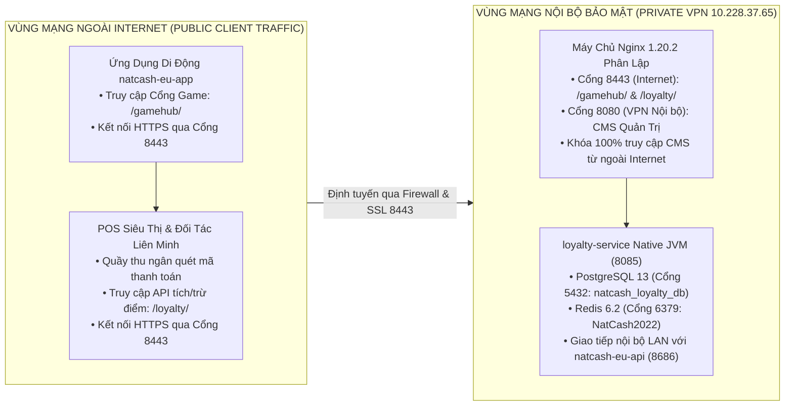
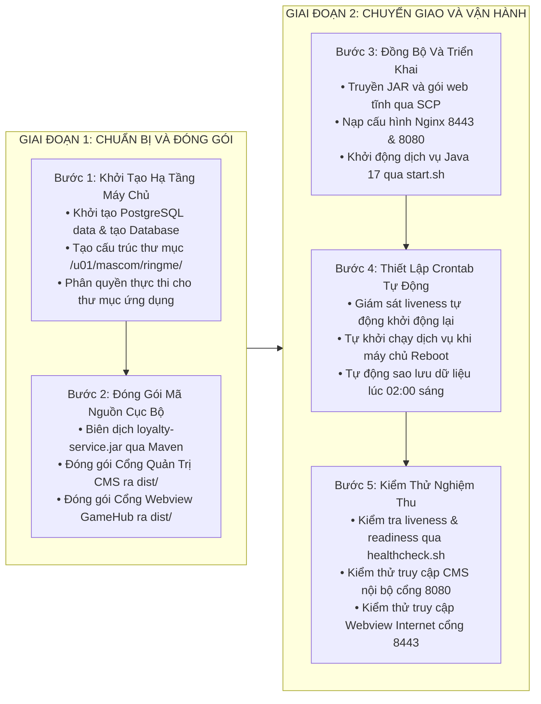

# HƯỚNG DẪN TRIỂN KHAI ON-PREMISE HỆ THỐNG LOYALTY & GAMEHUB CHO VÍ NATCASH
**Máy chủ đích:** `10.228.37.65` (ewallet-mobileapp-test)  
**Thư mục cài đặt dịch vụ:** `/u01/mascom/ringme/loyalty-game/`  
**Thư mục nền tảng & công cụ:** `/u01/mascom/build/`  
**Thư mục cấu hình Nginx:** `/u01/mascom/build/nginx/conf/natcash/`  
**Nguyên tắc an toàn vận hành:** Tuyệt đối không tự ý thực thi triển khai (deploy), đồng bộ tệp hay can thiệp máy chủ từ xa khi chưa có yêu cầu tường minh từ người dùng.

---

## 1. THÔNG SỐ HIỆN TRẠNG VÀ CÁC ĐIỀU KIỆN CẦN BỔ SUNG

### 1.1. Bảng Khảo Sát Hiện Trạng Hạ Tầng Máy Chủ
| Thành phần | Hiện trạng trên máy chủ 10.228.37.65 | Đánh giá & Yêu cầu bổ sung |
|:---|:---|:---|
| **Hệ điều hành** | CentOS Linux 7 (Core) x86_64 | Đạt chuẩn, tương thích hoàn toàn. |
| **Bộ nhớ RAM** | Tổng 32 GB (Khả dụng: 13.3 GB) | Đạt chuẩn, cấp phát 1 GB - 2 GB RAM cho Loyalty Service. |
| **Dung lượng lưu trữ** | Phân vùng `/u01` khả dụng **146 GB** | Rất dồi dào, đáp ứng tốt lưu trữ dữ liệu và log dài hạn. |
| **Java Runtime** | Đã cài JDK 17 tại `/u01/mascom/build/jdk17/bin/java` | **Đạt chuẩn 100%**, sẵn sàng chạy trực tiếp `loyalty-service.jar`. |
| **Nginx** | Đã chạy Nginx 1.20.2 tại `/u01/mascom/build/nginx/` | **Đạt chuẩn 100%**, có sẵn SSL Wildcard `star_natcom.com.ht`. |
| **Redis** | Đang chạy tại cổng `6379` (`node-6379`) | **Đạt chuẩn**, mật khẩu xác thực: `NatCash2022`. |
| **PostgreSQL** | Đã có bộ cài tại `/u01/mascom/build/postgre/` | **CẦN BỔ SUNG**: Khởi tạo thư mục dữ liệu, chạy dịch vụ và tạo database `natcash_loyalty_db`. |
| **Thư mục ứng dụng** | `/u01/mascom/ringme/loyalty-game/` | **CẦN BỔ SUNG**: Tạo cấu trúc cây thư mục con và phân quyền `755`. |
| **Tự động khởi động** | Chưa có dịch vụ auto-restart | **CẦN BỔ SUNG**: Kịch bản Crontab tự khởi động và kiểm tra tiến trình sống. |

---

---

## 2. KIẾN TRÚC MẠNG PHÂN TẦNG VÀ DANH MỤC TÊN MIỀN BẮT BUỘC

Hệ thống vận hành theo **Mô hình Mạng Phân Tầng Kết Hợp (Two-Tier Hybrid Network Architecture)**: Máy chủ ứng dụng nằm trong vùng mạng riêng (Private VPN / Intranet), không kết nối IP trực tiếp ra Internet. Các dịch vụ nội bộ kết nối trực tiếp qua IP mạng riêng, còn người dùng từ ứng dụng di động và trình duyệt ngoài Internet bắt buộc phải đi qua Tên miền công khai có mã hóa SSL/TLS.



---

### 2.1. Phân Định Rõ Ràng 2 Tầng Kết Nối

#### Tầng 1: Kết nối Nội bộ Mạng Riêng (Internal VPN Traffic — An toàn & Bảo mật 100%)
* **Cổng Quản Trị Trung Tâm CMS:** **Chỉ chạy và truy cập trong mạng nội bộ VPN** (qua địa chỉ `http://10.228.37.65:8080/`). Tuyệt đối **KHÔNG mở cổng CMS ra ngoài Internet** để phòng ngừa rủi ro rò rỉ dữ liệu hoặc tấn công từ bên ngoài.
* **Giao tiếp liên dịch vụ:** Các tiến trình `natcash-eu-api:8686`, `loyalty-service:8085`, `PostgreSQL:5432`, `Redis:6379` giao tiếp trực tiếp qua địa chỉ IP nội bộ `127.0.0.1` / `10.228.37.65`.

#### Tầng 2: Kết nối Ngoại vi từ Internet (Chỉ Mở Cổng Game Webview & API)
* **Mobile App (`natcash-eu-app`):** Kết nối mở Webview Cổng Game & Vòng Quay May Mắn qua Domain công khai `https://loyalty.natcom.com.ht:8443/gamehub/`.
* **API Gateway Mobile App:** Gọi qua Domain công khai `https://testeuapi.natcom.com.ht:8443/api/v1/loyalty/...`.
* **Quầy thu ngân POS:** Gọi API khấu trừ điểm qua `https://loyalty.natcom.com.ht:8443/loyalty/api/v1/wallet/redeem`.

---

### 2.2. Danh Mục Tên Miền & Cổng Truy Cập Phân Theo Vùng Mạng

| Phân hệ / Dịch vụ đích | Đối tượng / Dịch vụ gọi | Phạm vi mạng | Địa chỉ URL / Tên miền | Cổng & Giao thức | Mục đích sử dụng |
|:---|:---|:---|:---|:---|:---|
| **Cổng Game & Vòng Quay Webview** | • Ứng dụng di động `natcash-eu-app`<br/>• Trình duyệt Mobile của người dùng | **Công khai Internet & VPN** | `https://loyalty.natcom.com.ht:8443/gamehub/` | `8443` (HTTPS SSL) | Mở giao diện H5 Vòng Quay May Mắn và Mini-game (kèm SSO Ticket: `?ticket={token}`). |
| **Cổng API Gateway Mobile App** | • Ứng dụng di động `natcash-eu-app` | **Công khai Internet & VPN** | `https://testeuapi.natcom.com.ht:8443/api/v1/loyalty/` | `8443` (HTTPS SSL) | Tra cứu số dư điểm, đổi quà, đồng bộ `deviceId` thiết bị và sinh mã QR Ví Phần Thưởng 60 giây. |
| **Điểm cuối API Loyalty Trực tiếp** | • Quầy thu ngân POS Siêu thị Delimart<br/>• Hệ thống đối tác liên minh | **Công khai Internet & VPN** | `https://loyalty.natcom.com.ht:8443/loyalty/` | `8443` (HTTPS SSL) | Quét mã QR Ví Phần Thưởng để khấu trừ điểm hóa đơn trực tiếp tại quầy thanh toán. |
| **Cổng Quản Trị Trung Tâm CMS** | • Ban quản trị Natcash / Lập trình viên<br/>• Nhân viên vận hành liên minh | **CHỈ NỘI BỘ VPN (KHÔNG RA NGOÀI)** | `http://10.228.37.65:8080/` | `8080` (HTTP Nội bộ) | Đăng nhập qua VPN nội bộ để cấu hình chính sách, tạo chiến dịch, quản lý mã voucher và đối soát bù trừ. |
| **Cổng Kết Nối Liên Dịch Vụ Backend** | • API Gateway `natcash-eu-api` (`:8686`) | **CHỈ NỘI BỘ LAN / MÁY CHỦ** | `http://127.0.0.1:8085/loyalty/api/v1/` | `8085` (HTTP Nội bộ) | Chuyển tiếp JWT xác thực, cấp vé SSO, đồng bộ thiết bị và tiếp nhận Webhook. |

---

### 2.3. Ma Trận Luồng Kết Nối Hai Chiều Chi Tiết

| STT | Luồng kết nối | Nguồn phát | Đích tiếp nhận | Tuyến đường & Giao thức | Ý nghĩa & Nội dung xử lý |
|:---:|:---|:---|:---|:---|:---|
| **1** | **Mở Webview Game & Vòng Quay** | `natcash-eu-app` (Internet) | Nginx Reverse Proxy | `https://loyalty.natcom.com.ht:8443/gamehub/?ticket=...` (HTTPS) | App mở Webview H5, tải tài nguyên tĩnh và nạp runtime config qua Domain công khai. |
| **2** | **Gọi API Nghiệp vụ Ví / QR** | `natcash-eu-app` (Internet) | `natcash-eu-api` (Gateway) | `https://testeuapi.natcom.com.ht:8443/api/v1/loyalty/...` (HTTPS) | App gọi Gateway lấy thông tin hội viên, đổi quà và sinh mã QR động 60 giây. |
| **3** | **Chuyển tiếp JWT & Xác thực** | `natcash-eu-api` (Nội bộ) | `loyalty-service` (Nội bộ) | `http://127.0.0.1:8085/loyalty/api/v1/...` (HTTP LAN) | Gateway giải mã JWT, gán `X-Tenant-Id: TENANT_NATCASH` và forward tới Loyalty Service. |
| **4** | **Đồng bộ Device ID** | `natcash-eu-api` (Nội bộ) | `loyalty-service` (Nội bộ) | `http://127.0.0.1:8085/loyalty/api/v1/device/register` (HTTP LAN) | Đồng bộ `deviceId` thiết bị khi đăng nhập để định danh gửi Push Notification chính xác. |
| **5** | **Webhook Biến Động Điểm / Hoàn Tiền** | `loyalty-service` (Nội bộ) | `natcash-eu-api` (Nội bộ) | `http://10.228.37.65:8686/api/v1/loyalty/webhook/...` (HTTP LAN) | Webhook Transactional Outbox gửi thông báo hoàn tiền in-game hoặc biến động số dư. |
| **6** | **Gửi Push Notification** | `loyalty-service` (Nội bộ) | `natcash-eu-api` → FCM/APNs | `http://10.228.37.65:8686/api/v1/loyalty/push-notification` | Đẩy thông báo hiển thị đúng Logo và Thương hiệu Ví Natcash tới thiết bị người dùng. |
| **7** | **Khấu trừ Ví Phần Thưởng tại POS** | POS Siêu thị / Đối tác | Nginx → `loyalty-service` | `https://loyalty.natcom.com.ht:8443/loyalty/api/v1/wallet/redeem` (HTTPS) | Quầy thu ngân quét mã QR Ví Phần Thưởng để trừ điểm (xác thực HMAC-SHA256). |

---

### 2.4. Cấu hình Mở Cổng Tường Lửa (Firewall Rules & Port Whitelisting)

1. **Cổng Công Khai (Mở từ mạng ngoài Internet / VPN Viễn thông qua Domain):**
   * `8443` (TCP): Cổng Nginx HTTPS bảo mật phục vụ Webview, CMS và API qua chứng chỉ SSL Wildcard `*.natcom.com.ht`.
   * `8080` (TCP): Cổng Nginx HTTP phục vụ kiểm thử nội bộ.
2. **Cổng Nội Bộ Máy Chủ (Chỉ cho phép kết nối giữa các tiến trình nội bộ `127.0.0.1` / `10.228.37.65`, tuyệt đối không mở ra ngoài):**
   * `8085` (TCP): Cổng Backend `loyalty-service`.
   * `8686` (TCP): Cổng Backend `natcash-eu-api` (Gateway).
   * `5432` (TCP): Cổng Cơ sở dữ liệu `PostgreSQL`.
   * `6379` (TCP): Cổng Bộ nhớ đệm và Khóa phân tán `Redis`.

---

## 3. CÁC HẠNG MỤC CẦN BỔ SUNG VÀ THIẾT LẬP TRÊN MÁY CHỦ

### 3.1. Bổ sung Khởi tạo & Chạy Cơ Sở Dữ Liệu PostgreSQL
Hiện tại trên máy chủ đã có sẵn bộ mã nguồn/nhị phân PostgreSQL 13.14 tại `/u01/mascom/build/postgre/bin/`. Cần thực hiện khởi tạo và tạo cơ sở dữ liệu như sau:

#### Bước 3.1.1: Khởi tạo thư mục dữ liệu PostgreSQL
Đăng nhập tài khoản `mascom` và thực thi:
```bash
# 1. Tạo thư mục dữ liệu và thư mục log cho PostgreSQL
mkdir -p /u01/mascom/build/postgre/data
mkdir -p /u01/mascom/build/postgre/logs

# 2. Khởi tạo cơ sở dữ liệu với mã hóa UTF-8
/u01/mascom/build/postgre/bin/initdb -D /u01/mascom/build/postgre/data -E UTF8 --locale=en_US.UTF-8
```

#### Bước 3.1.2: Cấu hình kết nối `postgresql.conf` và `pg_hba.conf`
1. Mở tệp `/u01/mascom/build/postgre/data/postgresql.conf`:
   * Thiết lập `listen_addresses = '127.0.0.1,10.228.37.65'`
   * Thiết lập `port = 5432`
   * Thiết lập `max_connections = 100`
   * Thiết lập `shared_buffers = 512MB`
2. Mở tệp `/u01/mascom/build/postgre/data/pg_hba.conf` và bổ sung quyền truy cập nội bộ:
   ```text
   # IPv4 local connections:
   host    all             all             127.0.0.1/32            md5
   host    all             all             10.228.37.65/32         md5
   ```

#### Bước 3.1.3: Tạo kịch bản khởi động và dừng PostgreSQL
1. Tạo kịch bản `/u01/mascom/build/postgre/start.sh`:
   ```bash
   #!/usr/bin/env bash
   /u01/mascom/build/postgre/bin/pg_ctl -D /u01/mascom/build/postgre/data -l /u01/mascom/build/postgre/logs/postgres.log start
   echo "[POSTGRES] PostgreSQL đã khởi động thành công trên cổng 5432."
   ```
2. Tạo kịch bản `/u01/mascom/build/postgre/stop.sh`:
   ```bash
   #!/usr/bin/env bash
   /u01/mascom/build/postgre/bin/pg_ctl -D /u01/mascom/build/postgre/data stop -m fast
   echo "[POSTGRES] PostgreSQL đã dừng an toàn."
   ```
3. Cấp quyền thực thi:
   ```bash
   chmod +x /u01/mascom/build/postgre/start.sh /u01/mascom/build/postgre/stop.sh
   /u01/mascom/build/postgre/start.sh
   ```

#### Bước 3.1.4: Tạo User và Database `natcash_loyalty_db`
Chạy lệnh tạo người dùng và cơ sở dữ liệu:
```bash
/u01/mascom/build/postgre/bin/psql -h 127.0.0.1 -p 5432 -U $(whoami) -d postgres -c "
CREATE USER natcash_loyalty WITH PASSWORD 'Natcash\$SecureDB2026!';
CREATE DATABASE natcash_loyalty_db OWNER natcash_loyalty ENCODING 'UTF8';
GRANT ALL PRIVILEGES ON DATABASE natcash_loyalty_db TO natcash_loyalty;
"
```
*(Ghi chú: 17 bảng cơ sở dữ liệu và dữ liệu ban đầu sẽ được Spring Boot Flyway Migration tự động tạo khi `loyalty-service` khởi động lần đầu).*

---

### 3.2. Bổ sung Cấu hình Bộ Nhớ Đệm Redis 7
* Cụm Redis đang chạy tại cổng `6379` (`/u01/mascom/build/redis/node-6379/`).
* Thông số xác thực kết nối vào Redis cho Loyalty Service:
  * **Host:** `127.0.0.1`
  * **Port:** `6379`
  * **Password:** `NatCash2022`
  * **Database:** `0`
  * **Timeout:** `2000ms`

---

### 3.3. Bổ sung Cấu trúc Thư Mục Ứng Dụng `/u01/mascom/ringme/loyalty-game/`
Chạy lệnh tạo toàn bộ cây thư mục khép kín:
```bash
mkdir -p /u01/mascom/ringme/loyalty-game/{bin,config,locales,web/cms,web/webview,scripts,logs,backups}
chmod -R 755 /u01/mascom/ringme/loyalty-game
```

Cây thư mục chuẩn hóa:
```
/u01/mascom/ringme/loyalty-game/
├── bin/                            # Chứa file loyalty-service.jar
├── config/                         # Chứa application-onprem.yml, env-config-*.json
├── locales/                        # Chứa vi.json, en.json, fr.json, ht.json
├── web/
│   ├── cms/                        # Gói tĩnh Cổng Quản Trị Trung Tâm CMS
│   └── webview/                    # Gói tĩnh Cổng Game Webview & Lucky Wheel
├── scripts/                        # Kịch bản quản trị start, stop, restart, healthcheck
├── logs/                           # Nhật ký hoạt động app.log, gc.log
└── backups/                        # Lưu trữ bản backup DB định kỳ
```

---

## 4. NỘI DUNG TỆP CẤU HÌNH VÀ KỊCH BẢN VẬN HÀNH

### 4.1. Tệp Cấu hình Ngoại Vi Backend (`config/application-onprem.yml`)

```yaml
server:
  port: 8085
  shutdown: graceful
  servlet:
    context-path: /

spring:
  application:
    name: loyalty-service-natcash
  lifecycle:
    timeout-per-shutdown-phase: 30s
  datasource:
    url: jdbc:postgresql://127.0.0.1:5432/natcash_loyalty_db?sslmode=disable
    username: natcash_loyalty
    password: Natcash$SecureDB2026!
    driver-class-name: org.postgresql.Driver
    hikari:
      maximum-pool-size: 30
      minimum-idle: 5
      pool-name: LoyaltyNatcashHikariCP
  redis:
    host: 127.0.0.1
    port: 6379
    password: NatCash2022
    database: 0
    timeout: 2000ms
  messages:
    basename: file:/u01/mascom/ringme/loyalty-game/locales/messages
    encoding: UTF-8
    cache-duration: 3600

loyalty:
  deployment-mode: ON_PREMISE
  default-tenant-id: TENANT_NATCASH
  partner-code: NATCASH_WALLET
  gateway:
    endpoint: http://10.228.37.65:8686
  security:
    timestamp-tolerance-seconds: 300
  outbox:
    max-retries: 5
    publish-interval-ms: 2000
  locales-path: /u01/mascom/ringme/loyalty-game/locales

management:
  endpoints:
    web:
      exposure:
        include: health,info,metrics
  endpoint:
    health:
      show-details: when_authorized
      probes:
        enabled: true
```

---

### 3.2. Cấu hình Nginx (`/u01/mascom/build/nginx/conf/natcash/loyalty_game.conf`)

Tệp này được nạp tự động thông qua dòng `include /u01/mascom/build/nginx/conf/natcash/*.conf;` trong `nginx.conf`:

```nginx
# ==============================================================================
# CẤU HÌNH NGINX CHO HỆ THỐNG LOYALTY & GAMEHUB ON-PREMISE (NATCASH)
# Vị trí: /u01/mascom/build/nginx/conf/natcash/loyalty_game.conf
# ==============================================================================

upstream loyalty_backend_upstream {
    server 127.0.0.1:8085;
    keepalive 32;
}

# ------------------------------------------------------------------------------
# KHỐI SERVER 1: MỞ RA INTERNET (CỔNG 8443 HTTPS SSL — CHỈ MỞ WEBVIEW & API)
# Tuyệt đối KHÔNG phục vụ Cổng Quản trị CMS tại khối này
# ------------------------------------------------------------------------------
server {
    listen 8443 ssl;
    server_name loyalty.natcom.com.ht testloyalty.natcom.com.ht;

    ssl_certificate     /u01/mascom/build/nginx/conf/natcash/star_natcom.com.ht-nginx.crt;
    ssl_certificate_key /u01/mascom/build/nginx/conf/natcash/star_natcom.com.ht.key;

    access_log /u01/mascom/build/nginx/logs/natcash/loyalty_public.access.log;
    error_log  /u01/mascom/build/nginx/logs/natcash/loyalty_public.error.log;

    gzip on;
    gzip_vary on;
    gzip_min_length 1024;
    gzip_types text/plain text/css text/xml text/javascript application/x-javascript application/xml application/javascript application/json;

    # 1. API Reverse Proxy (Nhận request từ Mobile App / Webview / POS)
    location /loyalty/ {
        proxy_pass http://loyalty_backend_upstream;
        proxy_http_version 1.1;
        proxy_set_header Connection "";
        proxy_set_header Host $host;
        proxy_set_header X-Real-IP $remote_addr;
        proxy_set_header X-Forwarded-For $proxy_add_x_forwarded_for;
        proxy_set_header X-Forwarded-Proto $scheme;
        proxy_connect_timeout 5s;
        proxy_read_timeout 30s;
        proxy_send_timeout 30s;
    }

    # 2. Cổng Webview & Game H5 Decoupled cho Mobile App
    location /gamehub/ {
        alias /u01/mascom/ringme/loyalty-game/web/webview/;
        index index.html;
        try_files $uri $uri/ /gamehub/index.html;

        location ~* /gamehub/(config|locales)/ {
            add_header Cache-Control "no-cache, no-store, must-revalidate";
            add_header Pragma "no-cache";
            add_header Expires 0;
        }

        location ~* \.(?:ico|css|js|gif|jpe?g|png|woff2?|eot|ttf|svg)$ {
            expires 30d;
            add_header Cache-Control "public, no-transform";
        }
    }

    # 3. Khóa toàn bộ truy cập CMS từ ngoài Internet
    location / {
        return 403 "Forbidden: Admin CMS is only accessible via internal VPN network.";
    }
}

# ------------------------------------------------------------------------------
# KHỐI SERVER 2: CHỈ MỞ NỘI BỘ VPN (CỔNG 8080 HTTP — PHỤC VỤ CMS CHO QUẢN TRỊ VIÊN)
# ------------------------------------------------------------------------------
server {
    listen 8080;
    server_name 10.228.37.65 localhost loyalty-admin.natcom.com.ht;

    access_log /u01/mascom/build/nginx/logs/natcash/loyalty_internal.access.log;
    error_log  /u01/mascom/build/nginx/logs/natcash/loyalty_internal.error.log;

    gzip on;
    gzip_vary on;
    gzip_min_length 1024;
    gzip_types text/plain text/css text/xml text/javascript application/x-javascript application/xml application/javascript application/json;

    # 1. Cổng Quản Trị Trung Tâm CMS Nội Bộ
    location / {
        root /u01/mascom/ringme/loyalty-game/web/cms;
        index index.html;
        try_files $uri $uri/ /index.html;

        location ~* /(config|locales)/ {
            add_header Cache-Control "no-cache, no-store, must-revalidate";
            add_header Pragma "no-cache";
            add_header Expires 0;
        }

        location ~* \.(?:ico|css|js|gif|jpe?g|png|woff2?|eot|ttf|svg)$ {
            expires 30d;
            add_header Cache-Control "public, no-transform";
        }
    }

    # 2. API Reverse Proxy cho CMS nội bộ
    location /loyalty/ {
        proxy_pass http://loyalty_backend_upstream;
        proxy_http_version 1.1;
        proxy_set_header Host $host;
        proxy_set_header X-Real-IP $remote_addr;
        proxy_set_header X-Forwarded-For $proxy_add_x_forwarded_for;
    }
}
```

---

### 4.3. Kịch bản Quản trị Dịch vụ (`scripts/`)

#### 1. `scripts/start.sh`: Khởi động dịch vụ Java 17 ngầm
```bash
#!/usr/bin/env bash
set -e

APP_DIR="/u01/mascom/ringme/loyalty-game"
JAVA_BIN="/u01/mascom/build/jdk17/bin/java"
JAR_FILE="$APP_DIR/bin/loyalty-service.jar"
CONFIG_FILE="$APP_DIR/config/application-onprem.yml"
LOG_FILE="$APP_DIR/logs/app.log"
PID_FILE="$APP_DIR/scripts/app.pid"

if [ -f "$PID_FILE" ] && kill -0 $(cat "$PID_FILE") 2>/dev/null; then
    echo "[CẢNH BÁO] Loyalty Service đang chạy với PID: $(cat "$PID_FILE")"
    exit 0
fi

echo "[START] Đang khởi động Loyalty Service với JDK 17..."
JAVA_OPTS="-Xms512m -Xmx1024m -XX:+UseG1GC -XX:MaxGCPauseMillis=200 -XX:+ExitOnOutOfMemoryError"

cd "$APP_DIR"
nohup $JAVA_BIN $JAVA_OPTS \
    -Dspring.config.additional-location=file:$CONFIG_FILE \
    -jar $JAR_FILE > $LOG_FILE 2>&1 &

PID=$!
echo $PID > "$PID_FILE"
echo "[START] Khởi động thành công với PID: $PID"
echo "[START] Theo dõi nhật ký: tail -f $LOG_FILE"
```

#### 2. `scripts/stop.sh`: Dừng dịch vụ êm ái
```bash
#!/usr/bin/env bash
APP_DIR="/u01/mascom/ringme/loyalty-game"
PID_FILE="$APP_DIR/scripts/app.pid"

if [ ! -f "$PID_FILE" ]; then
    echo "[INFO] Không tìm thấy tệp PID. Loyalty Service không chạy."
    exit 0
fi

PID=$(cat "$PID_FILE")
echo "[STOP] Đang gửi tín hiệu dừng êm ái tới PID: $PID..."
kill -15 $PID 2>/dev/null || true

COUNT=0
while kill -0 $PID 2>/dev/null; do
    sleep 1
    COUNT=$((COUNT+1))
    if [ $COUNT -ge 30 ]; then
        echo "[STOP] Hết thời gian chờ 30s. Bắt buộc dừng tiến trình (kill -9)..."
        kill -9 $PID 2>/dev/null || true
        break
    fi
done

rm -f "$PID_FILE"
echo "[STOP] Loyalty Service đã dừng hoàn toàn."
```

#### 3. `scripts/restart.sh`: Khởi động lại
```bash
#!/usr/bin/env bash
DIR="$(cd "$(dirname "${BASH_SOURCE[0]}")" && pwd)"
$DIR/stop.sh
sleep 2
$DIR/start.sh
```

#### 4. `scripts/healthcheck.sh`: Kiểm tra sức khỏe dịch vụ
```bash
#!/usr/bin/env bash
echo "=== KIỂM TRA SỨC KHỎE DỊCH VỤ LOYALTY ==="
curl -s -f http://127.0.0.1:8085/actuator/health/liveness || { echo "[LỖI] Liveness FAILED"; exit 1; }
echo " -> Liveness: OK (Tiến trình đang sống)"

curl -s -f http://127.0.0.1:8085/actuator/health/readiness || { echo "[LỖI] Readiness FAILED"; exit 1; }
echo " -> Readiness: OK (Sẵn sàng tiếp nhận lưu lượng)"
echo "=== TOÀN BỘ HỆ THỐNG HOẠT ĐỘNG TỐT 100% ==="
```

---

## 5. BỔ SUNG TỰ ĐỘNG HÓA VẬN HÀNH & GIÁM SÁT SỐNG (CRONTAB)

Để đảm bảo hệ thống tự phục hồi khi gặp sự cố hoặc sau khi máy chủ khởi động lại, bổ sung các tác vụ Crontab sau cho người dùng `mascom` (`crontab -e`):

```bash
# 1. Tự động khởi động lại PostgreSQL và Loyalty Service khi máy chủ Reboot
@reboot /u01/mascom/build/postgre/start.sh > /dev/null 2>&1
@reboot sleep 10 && /u01/mascom/ringme/loyalty-game/scripts/start.sh > /dev/null 2>&1

# 2. Giám sát tự động (Liveness Monitor) mỗi 2 phút: Tự khởi động lại nếu tiến trình bị chết
*/2 * * * * curl -s -f http://127.0.0.1:8085/actuator/health/liveness > /dev/null 2>&1 || /u01/mascom/ringme/loyalty-game/scripts/start.sh > /dev/null 2>&1

# 3. Tự động sao lưu dữ liệu cơ sở dữ liệu hàng ngày vào 02:00 sáng
0 2 * * * /u01/mascom/build/postgre/bin/pg_dump -h 127.0.0.1 -U natcash_loyalty natcash_loyalty_db | gzip > /u01/mascom/ringme/loyalty-game/backups/db_$(date +\%Y\%m\%d).sql.gz
```

---

## 6. QUY TRÌNH THỰC HIỆN TRIỂN KHAI 5 BƯỚC (STEP-BY-STEP)



### Bước 1: Khởi tạo PostgreSQL và cấu trúc thư mục trên máy chủ
Đăng nhập SSH vào `10.228.37.65` với tài khoản `mascom`:
```bash
# 1. Khởi tạo PostgreSQL
mkdir -p /u01/mascom/build/postgre/data /u01/mascom/build/postgre/logs
/u01/mascom/build/postgre/bin/initdb -D /u01/mascom/build/postgre/data -E UTF8 --locale=en_US.UTF-8
/u01/mascom/build/postgre/bin/pg_ctl -D /u01/mascom/build/postgre/data -l /u01/mascom/build/postgre/logs/postgres.log start

# 2. Tạo User & DB
/u01/mascom/build/postgre/bin/psql -h 127.0.0.1 -p 5432 -U mascom -d postgres -c "
CREATE USER natcash_loyalty WITH PASSWORD 'Natcash\$SecureDB2026!';
CREATE DATABASE natcash_loyalty_db OWNER natcash_loyalty ENCODING 'UTF8';
"

# 3. Tạo thư mục ứng dụng
mkdir -p /u01/mascom/ringme/loyalty-game/{bin,config,locales,web/cms,web/webview,scripts,logs,backups}
chmod -R 755 /u01/mascom/ringme/loyalty-game
```

### Bước 2: Đóng gói mã nguồn tại máy phát triển
```bash
# 1. Đóng gói Backend Java
cd src/service
mvn clean package -DskipTests

# 2. Đóng gói Frontend CMS
cd ../cms
npm run build

# 3. Đóng gói Frontend Webview
cd ../webview
npm run build
```

### Bước 3: Đẩy tệp lên máy chủ (SCP)
```bash
# 1. Đẩy Backend JAR
scp src/service/target/loyalty-service.jar mascom@10.228.37.65:/u01/mascom/ringme/loyalty-game/bin/

# 2. Đẩy Frontend CMS & Webview
scp -r src/cms/dist/* mascom@10.228.37.65:/u01/mascom/ringme/loyalty-game/web/cms/
scp -r src/webview/dist/* mascom@10.228.37.65:/u01/mascom/ringme/loyalty-game/web/webview/

# 3. Đẩy cấu hình và từ điển đa ngôn ngữ
scp deploy/natcash/config/backend/application-natcash.yml mascom@10.228.37.65:/u01/mascom/ringme/loyalty-game/config/application-onprem.yml
scp deploy/natcash/config/frontend/env-config.json mascom@10.228.37.65:/u01/mascom/ringme/loyalty-game/config/env-config-cms.json
scp deploy/natcash/config/frontend/env-config.json mascom@10.228.37.65:/u01/mascom/ringme/loyalty-game/config/env-config-webview.json
scp -r deploy/natcash/locales/* mascom@10.228.37.65:/u01/mascom/ringme/loyalty-game/locales/
```

### Bước 4: Thiết lập và tải lại cấu hình Nginx
```bash
# 1. Đẩy file cấu hình Nginx
scp deploy/natcash/config/nginx/nginx-natcash.conf mascom@10.228.37.65:/u01/mascom/build/nginx/conf/natcash/loyalty_game.conf

# 2. Kiểm tra và tải lại trên máy chủ
/u01/mascom/build/nginx/sbin/nginx -t
/u01/mascom/build/nginx/sbin/nginx -s reload
```

### Bước 5: Khởi chạy và Nghiệm thu
```bash
# 1. Khởi động Loyalty Service
chmod +x /u01/mascom/ringme/loyalty-game/scripts/*.sh
/u01/mascom/ringme/loyalty-game/scripts/start.sh

# 2. Kiểm tra sức khỏe dịch vụ
/u01/mascom/ringme/loyalty-game/scripts/healthcheck.sh

# 3. Kiểm tra các cổng dịch vụ
# API Gateway Backend: http://10.228.37.65:8080/loyalty/
# Cổng Game Webview:  http://10.228.37.65:8080/gamehub/  (hoặc https://10.228.37.65:8443/gamehub/)
# Cổng Quản Trị CMS:   http://10.228.37.65:8080/          (hoặc https://10.228.37.65:8443/)
```
