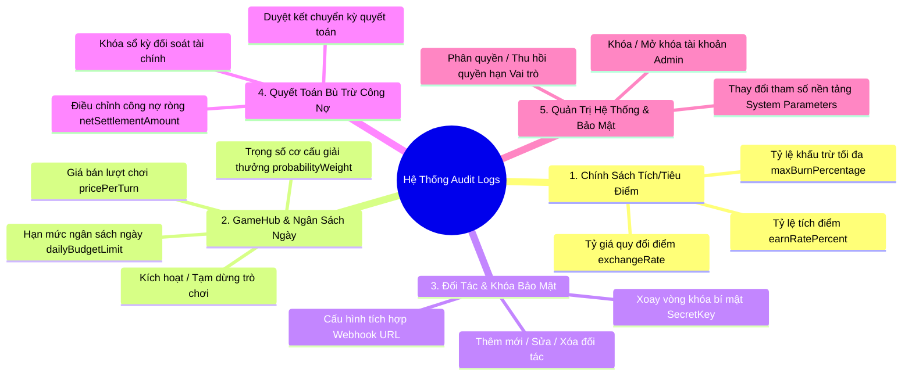
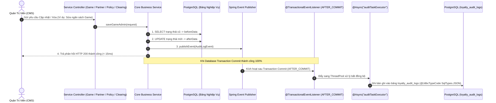

# BÁO CÁO ĐỐI SOÁT BASE CODE & PHƯƠNG ÁN TRIỂN KHAI PHÂN HỆ NHẬT KÝ HOẠT ĐỘNG (AUDIT LOGS)
## HỆ SINH THÁI LOYALTY & GAMEHUB (`micro-loyalty`)

> **Mã tài liệu:** REPORT-LOYALTY-AUDITLOG-GAP-ANALYSIS-20260828  
> **Ngày lập:** 28/08/2026  
> **Dự án áp dụng:** `micro-loyalty` (Java 17 LTS / Spring Boot 2.7.14+ / PostgreSQL 15+ / ReactJS 18+ / Vite / PrimeReact)  
> **Tài liệu tham chiếu:** [docs/ba/detailed_design.md](file:///c:/Users/hovan/micro-loyalty/docs/ba/detailed_design.md), [docs/ba/solution.md](file:///c:/Users/hovan/micro-loyalty/docs/ba/solution.md), [docs/dev/codebase.md](file:///c:/Users/hovan/micro-loyalty/docs/dev/codebase.md), [docs/ops/pilot-and-operations-runbook.md](file:///c:/Users/hovan/micro-loyalty/docs/ops/pilot-and-operations-runbook.md), [docs/bug.md](file:///c:/Users/hovan/micro-loyalty/docs/bug.md) (Mã C23).

---

## 1. TỔNG QUAN VÀ TẦM NHÌN NGHIỆP VỤ (BUSINESS OVERVIEW)

Trong một hệ sinh thái Loyalty & GameHub liên minh đa đối tác (`micro-loyalty`), phân hệ **Nhật Ký Hoạt Động (Audit Logs)** đóng vai trò là **Trục Kiểm Toán & Pháp Lý Bất Biến (Non-repudiation & Regulatory Compliance Trail)**, bảo đảm:
1. **Tính Minh Bạch & Toàn Vẹn Tài Chính:** Ghi vết 100% mọi hành động can thiệp dữ liệu nhạy cảm của Quản trị viên (sửa tỷ lệ tích/tiêu điểm, điều chỉnh hạn mức ngân sách minigame, thay đổi tỷ giá quy đổi 1 điểm = 1 HTG, chốt kỳ quyết toán bù trừ công nợ giữa Ví Natcash và Đối tác liên minh).
2. **Khả Năng Phục Hồi & Điều Tra Sự Cố (Forensics & RCA):** Cung cấp ảnh chụp trạng thái dữ liệu Trước và Sau khi thay đổi (**Before/After State Diff** dạng JSON) giúp xác định chính xác Ai làm, Vào lúc nào, Tác động lên bản ghi nào và giá trị thay đổi cụ thể là gì.
3. **Phân Lập Đa Thuê Bao (Multi-tenant Isolation):** Đối tác nào chỉ được xem vết kiểm toán của đối tác đó (`TENANT_NATCASH` vs `TENANT_MICRO_CRM` vs `TENANT_DELIMART`).

---

## 2. BẢNG ĐỐI SOÁT HIỆN TRẠNG BASE CODE (WHAT EXISTS VS. WHAT IS MISSING)

| Tầng Kiến Trúc | Hạng Mục | Hiện Trạng Trong Base Code | Tỷ Lệ Hoàn Thiện | Đánh Giá & Điểm Cần Hoàn Thiện |
| :--- | :--- | :--- | :---: | :--- |
| **Giao Diện CMS** | Màn hình `/admin/audit-logs` | [audit-management.tsx](file:///c:/Users/hovan/micro-loyalty/src/cms/src/pages/admin/audit-management.tsx) | **85%** | • **Đã có:** Bảng DataTable, phân trang server (`query.page`, `query.size`), bộ lọc Bảng / Hành động / Username / Khoảng ngày (max 31 ngày), JSON before/after viewer.<br/>• **Thiếu:** `TenantSelector` chuyển đổi xem log theo đối tác, nút Xuất Excel kiểm toán, danh sách bảng chưa khớp với các bảng CSDL thực tế. |
| **Giao Diện CMS** | API Client & Hooks | [audit.ts](file:///c:/Users/hovan/micro-loyalty/src/cms/src/service/admin/audit.ts), [audit-hooks.ts](file:///c:/Users/hovan/micro-loyalty/src/cms/src/service/admin/audit-hooks.ts) | **100%** | • **Đã có:** Kết nối endpoint `GET /api/audit-logs`, tích hợp React Query caching tự động. |
| **Phân Quyền RBAC** | Quyền hạn & Vai trò | [AdminRoleController.java](file:///c:/Users/hovan/micro-loyalty/src/service/src/main/java/com/natcash/loyalty/auth/controller/AdminRoleController.java) | **100%** | • **Đã có:** Mã quyền `AUDIT_LOG_VIEW` thuộc module `AUDIT`, gán cho vai trò `FINANCE_AUDITOR` và `SUPER_ADMIN`. |
| **Backend API** | Controller API | [AuditLogController.java](file:///c:/Users/hovan/micro-loyalty/src/service/src/main/java/com/natcash/loyalty/audit/controller/AuditLogController.java) | **40%** | • **Đã có:** Endpoint mapped tại `/api/audit-logs`, `/loyalty/v1/admin/audit-logs`, `/admin/audit-logs`, hỗ trợ phân trang & lọc.<br/>• **Thiếu:** Đang dùng bộ nhớ RAM `initSampleLogs()` in-memory tạm thời, chưa kết nối CSDL PostgreSQL thật. |
| **Cơ Sở Dữ Liệu** | Bảng CSDL PostgreSQL | Thư mục `db/migration` (`V1` $\rightarrow$ `V13`) | **0%** | • **Chưa có:** Bảng vật lý `loyalty_audit_logs` trong Flyway Migration (cần tạo bản `V14`). |
| **Tầng Ghi Vết Tự Động** | Entity, Repository & Service | Tầng `loyalty-service` | **0%** | • **Chưa có:** `AuditLogEntity.java`, `AuditLogRepository.java`, `AuditLogService.java`.<br/>• **Chưa có:** Cơ chế Event Listener để tự động ghi log sau khi Transaction commit thành công (`AFTER_COMMIT`). |
| **Xử Lý Bất Đồng Bộ** | Async Non-blocking Queue | Hạ tầng Spring / Redis | **0%** | • **Chưa có:** `ThreadPoolTaskExecutor` chuyên dụng `@Async("auditTaskExecutor")` hoặc hàng đợi Redis Streams `loyalty.audit.stream`. |

---

## 3. PHẠM VI NGHIỆP VỤ CẦN ĐƯỢC GHI VẾT KIỂM TOÁN (AUDIT SCOPE MATRIX)

Hệ thống quy chuẩn **5 Phân Nhóm Nghiệp Vụ Trọng Điểm** bắt buộc phải ghi vết kiểm toán:



---

## 4. THIẾT KẾ CƠ SỞ DỮ LIỆU POSTGRESQL 15+ (`V14__add_loyalty_audit_logs_schema.sql`)

Cơ sở dữ liệu độc lập `loyalty_db` lưu trữ bảng vật lý `loyalty_audit_logs`:

```sql
CREATE TABLE IF NOT EXISTS loyalty_audit_logs (
    id BIGINT GENERATED ALWAYS AS IDENTITY PRIMARY KEY,
    tenant_id VARCHAR(50) NOT NULL DEFAULT 'TENANT_NATCASH',
    module VARCHAR(50) NOT NULL,                -- POLICY, GAMEHUB, PARTNER, CLEARING, AUTH, SYSTEM
    table_name VARCHAR(100) NOT NULL,          -- loyalty_games, loyalty_acceptance_policies, loyalty_partners...
    operation VARCHAR(50) NOT NULL,            -- INSERT, UPDATE, DELETE, SETTLEMENT, LOCK, UNLOCK, LOGIN
    entity_id VARCHAR(100) NOT NULL,           -- GameCode, PartnerCode, BatchId, PolicyId...
    actor_user_id VARCHAR(100) NOT NULL,       -- ID người thực hiện
    actor_username VARCHAR(100) NOT NULL,      -- Tên đăng nhập (admin, operator, finance_auditor...)
    actor_role VARCHAR(100),                   -- SUPER_ADMIN, FINANCE_AUDITOR, OPERATOR...
    ip_address VARCHAR(100),                   -- IP máy trạm thao tác
    user_agent VARCHAR(500),                   -- Trình duyệt / Thiết bị
    client_message_id VARCHAR(100),            -- Correlation-ID từ LogMDCFilter
    before_data JSONB,                         -- Ảnh chụp JSON trước khi sửa (NULL nếu INSERT)
    after_data JSONB,                          -- Ảnh chụp JSON sau khi sửa (NULL nếu DELETE)
    changed_fields JSONB,                      -- Danh sách thuộc tính bị thay đổi để highlight
    status VARCHAR(30) NOT NULL DEFAULT 'SUCCESS', -- SUCCESS, FAILED
    error_message TEXT,                        -- Thông điệp lỗi nếu thao tác thất bại
    created_at TIMESTAMPTZ NOT NULL DEFAULT CURRENT_TIMESTAMP
);

-- Tạo chỉ mục hiệu năng cao cho việc tra cứu phân trang và bộ lọc
CREATE INDEX IF NOT EXISTS idx_audit_tenant_created ON loyalty_audit_logs(tenant_id, created_at DESC);
CREATE INDEX IF NOT EXISTS idx_audit_module_table ON loyalty_audit_logs(module, table_name, operation);
CREATE INDEX IF NOT EXISTS idx_audit_actor ON loyalty_audit_logs(actor_username);
CREATE INDEX IF NOT EXISTS idx_audit_entity ON loyalty_audit_logs(entity_id);
```

---

## 5. PHƯƠNG ÁN KIẾN TRÚC KỸ THUẬT (TECHNICAL ARCHITECTURE)



### 3 Nguyên Tắc Kỹ Thuật Bắt Buộc:
1. **An Toàn Giao Dịch Tuyệt Đối (`TransactionPhase.AFTER_COMMIT`):**
   * Chỉ ghi log kiểm toán khi và chỉ khi giao dịch nghiệp vụ đã commit thành công vào PostgreSQL.
   * Ngăn chặn triệt để tình trạng "Giao dịch lỗi bị Rollback nhưng Audit Log vẫn bị ghi khống".
2. **Không Ảnh Hưởng Hiệu Năng Người Dùng (Zero Latency Overhead):**
   * Tác vụ ghi log được thực thi bất đồng bộ trên luồng riêng `auditTaskExecutor`, không làm tăng thời gian phản hồi của API người dùng.
3. **Tuân Thủ Chuẩn PostgreSQL JSONB (@JdbcTypeCode):**
   * Các trường `before_data`, `after_data`, `changed_fields` sử dụng `@JdbcTypeCode(SqlTypes.JSON)` trên `AuditLogEntity.java` để ngăn chặn lỗi Type Mismatch 500.

---

## 6. KẾ HOẠCH TRIỂN KHAI HOÀN THIỆN TỪNG BƯỚC (IMPLEMENTATION PHASES)

### Bước 1: Cơ Sở Dữ Liệu Flyway Migration
* Tạo tệp `src/service/src/main/resources/db/migration/V14__add_loyalty_audit_logs_schema.sql` tạo bảng `loyalty_audit_logs` và seed dữ liệu mẫu khởi tạo.

### Bước 2: Tầng Thực Thể & Dịch Vụ Backend
* Tạo `src/service/src/main/java/com/natcash/loyalty/audit/entity/AuditLogEntity.java`.
* Tạo `src/service/src/main/java/com/natcash/loyalty/audit/repository/AuditLogRepository.java`.
* Tạo `src/service/src/main/java/com/natcash/loyalty/audit/service/AuditLogService.java` hỗ trợ hàm `recordActionAsync(...)` và `getAuditLogs(...)`.
* Cập nhật `AuditLogController.java` chuyển từ in-memory sang gọi `AuditLogService` truy vấn từ PostgreSQL `loyalty_audit_logs`.

### Bước 3: Tích Hợp Ghi Vết Tự Động Vào Các Service Nghiệp Vụ
* Tích hợp gọi `auditLogService.recordActionAsync(...)` tại:
  1. `GameHubService.java` (Khi thêm mới, sửa game, lưu giải thưởng, xóa giải thưởng).
  2. `PartnerService.java` (Khi thêm, sửa, xóa đối tác).
  3. `PolicyService.java` (Khi tạo, sửa, xóa chính sách tích/tiêu điểm).
  4. `VoucherService.java` (Khi tạo, sửa, xóa, batch import voucher).
  5. `ClearingSettlementService.java` (Khi chốt kỳ quyết toán bù trừ tài chính).
  6. `AdminUserService.java` (Khi khóa, mở khóa tài khoản admin).

### Bước 4: Tối Ưu Hóa Giao Diện CMS (`/admin/audit-logs`)
* Tích hợp `TenantSelector` trên đầu trang `audit-management.tsx`.
* Cập nhật Dropdown Bảng Dữ Liệu khớp 100% với tên bảng thực tế trong CSDL (`loyalty_games`, `loyalty_acceptance_policies`, `loyalty_partners`, `loyalty_vouchers`, `clearing_transactions`, `admin_users`).
* Bổ sung nút Xuất Excel kiểm toán định kỳ.
