# TÀI LIỆU THIẾT KẾ KỸ THUẬT CHI TIẾT HỆ THỐNG
## Nền Tảng Độc Lập Khách Hàng Thân Thiết Liên Minh và Cổng Game Đa Thuê Bao

> **Đơn vị xây dựng:** Nhóm Kiến trúc và Giải pháp Số — Natcash  
> **Tên dịch vụ độc lập:** `loyalty-service`  
> **Phương án công nghệ chính thức duy nhất:**  
> • Cơ sở dữ liệu quan hệ độc lập: **PostgreSQL 15+** (`loyalty_db` tách biệt 100% với `natcash_db`).  
> • Máy chủ nghiệp vụ độc lập: **Java 17 LTS / Spring Boot 2.7.14+** (`loyalty-service`).  
> • Khóa phân tán và Bộ nhớ đệm: **Redis 7.x Cluster** (Thư viện Redisson 3.20+).  
> • Truyền thông sự kiện và Đồng bộ: **Mẫu Hộp thư đi (Transactional Outbox Pattern)** kết hợp **Redis Streams**.  
> • Cổng Quản trị Trung tâm: **ReactJS 18+ / TypeScript / Vite / Ant Design 5.x** (`loyalty-cms` đóng gói tĩnh qua Nginx).  
> • Cổng Webview nhúng đối tác: **ReactJS 18+ / TypeScript / Vite / TailwindCSS Mobile-First** (`loyalty-webview` đóng gói tĩnh qua Nginx).  
> • Ứng dụng di động ví: **React Native** (`natcash-eu-app`).  
> • Cổng kết nối chuyển tiếp: **Java Spring Boot Reverse Proxy** (`natcash-eu-api`).  
> • Quản lý phiên bản cơ sở dữ liệu: **Flyway Migration** (Tập lệnh SQL chuẩn hóa PostgreSQL 15+).  
> **Cấu trúc tài liệu:** Đi từ Kiến trúc phân lớp đa thuê bao → Ngăn xếp công nghệ & Cơ chế thực thi kỹ thuật → Kiến trúc phân tách cơ sở dữ liệu & Đồng bộ hai chiều qua API / Webhook → Hướng dẫn tích hợp hệ thống & Phân định trách nhiệm các tầng → Cơ chế xác thực và bảo mật đối tác tích hợp → Phân rã phân hệ → Thiết kế cơ sở dữ liệu → Đặc tả API, Liên thông Ví Phần Thưởng & Bù trừ tài chính → Tiến trình xử lý → Thiết kế màn hình → Ma trận đánh giá hiện trạng và Kế hoạch chuyển đổi.

---

## 1. KIẾN TRÚC PHÂN LỚP KỸ THUẬT ĐA THUÊ BAO

Dịch vụ độc lập `loyalty-service` được thiết kế theo kiến trúc 4 tầng phân lập rõ ràng, sẵn sàng phục vụ mô hình phần mềm dịch vụ đa thuê bao dùng chung hoặc triển khai cục bộ tại chỗ:

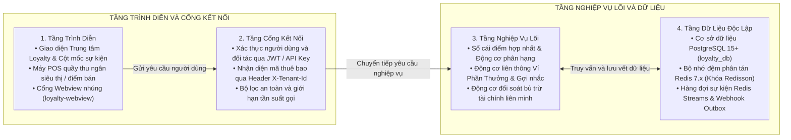

---

## 2. NGĂN XẾP CÔNG NGHỆ VÀ CƠ CHẾ THỰC THI KỸ THUẬT

### 2.1. Ma Trận Ngăn Xếp Công Nghệ Chính Thức Duy Nhất

| Tầng chức năng | Công nghệ lựa chọn chính thức | Phiên bản chuẩn hóa | Vai trò và Lý do lựa chọn tối ưu |
| :--- | :--- | :--- | :--- |
| **Môi trường & Khung lõi** | Java LTS, Spring Boot | Java 17 LTS, Spring Boot 2.7.14+ | Nền tảng dịch vụ vi mô độc lập chuẩn hóa của Natcash, hiệu năng cao, ổn định dài hạn. |
| **Bảo mật & Phân quyền** | Spring Security, JJWT, BouncyCastle | 5.7+ / 0.11+ | Xác thực đa tầng qua JWT Token, mã hóa HMAC-SHA256 và AES-256. |
| **Truy cập Dữ liệu** | Spring Data JPA, Hibernate Core | 2.7+ / 5.6+ | Quản lý thực thể, tự động kích hoạt bộ lọc cô lập đa thuê bao `Hibernate Filter`. |
| **Cơ sở Dữ liệu Quan hệ** | PostgreSQL | PostgreSQL 15+ | Cơ sở dữ liệu quan hệ độc lập (`loyalty_db`), miễn phí bản quyền, hỗ trợ native JSONB cực mạnh và phân vùng bảng. |
| **Bộ nhớ đệm & Khóa phân tán** | Redis Cluster, Redisson | Redis 7.x, Redisson 3.20+ | Đệm dữ liệu, khóa phân tán chống tiêu điểm kép, đếm nguyên tử và lưu vé phiên SSO. |
| **Hàng đợi Sự kiện & Tin nhắn** | Transactional Outbox + Redis Streams | Redis 7.x Streams | Xử lý sự kiện bất đồng bộ và truyền tải Webhook tinh gọn, dùng chung Redis, tiết kiệm RAM máy chủ. |
| **Tác vụ Hàng loạt & Lập lịch** | Spring Batch, Quartz Scheduler | Spring Batch 4.3+, Quartz 2.3+ | Xử lý khối dữ liệu lớn: quét điểm hết hạn, tính toán gợi nhắc, đối soát bù trừ. |
| **Chống Quá tải & Kháng đứt gãy** | Resilience4j | 1.7+ | Cơ chế ngắt mạch, giới hạn tần suất gọi Token Bucket qua Lua script và tự động thử lại. |
| **Đo kiểm & Giám sát** | Micrometer, Prometheus, Grafana | Chuẩn OpenTelemetry | Thu thập chỉ số hiệu năng, đo thời gian xử lý API và cảnh báo lỗi tức thì. |
| **Cổng Quản trị (CMS)** | ReactJS, Vite, Ant Design, TailwindCSS | React 18+, Vite 5.x | Đóng gói SPA tĩnh 100% phục vụ qua Nginx siêu nhẹ (< 20MB RAM), không cần Node.js runtime. |
| **Cổng Webview Đối tác** | ReactJS, Vite, TailwindCSS Mobile-First | React 18+, Vite 5.x | Đóng gói SPA tĩnh phục vụ qua Nginx, nạp dưới 0.5s, tích hợp thư viện cầu nối `LoyaltyJSBridge`. |
| **Quản lý Di chuyển DB** | Flyway Migration | Flyway 8.5+ | Tự động thực thi các tập lệnh di chuyển dữ liệu SQL chuẩn hóa trên PostgreSQL 15+. |

---

### 2.2. Các Cơ Chế Thực Thi Kỹ Thuật Chi Tiết Cho Từng Loại Tiến Trình

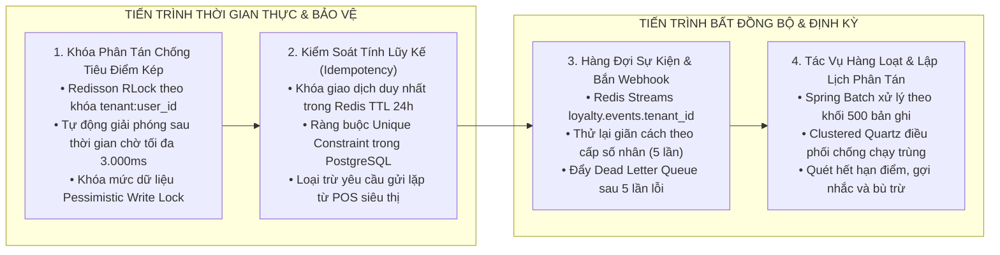

#### 1. Cơ chế Xử lý Giao dịch Thời gian Thực và Chống Tiêu Điểm Kép
* **Khóa phân tán qua Redis:** Khi phát sinh giao dịch trừ điểm tại quầy thu ngân siêu thị, dịch vụ chiếm giữ khóa `RLock` của Redisson theo cú pháp `lock:burn:tenant_id:user_id` với thời gian giữ khóa tối đa 3.000ms. Mọi yêu cầu trừ điểm song song khác của cùng một tài khoản sẽ bị xếp hàng chờ, ngăn chặn triệt để nguy cơ số dư điểm bị trừ vượt quá mức thực tế.
* **Khóa bản ghi cơ sở dữ liệu:** Áp dụng mức cô lập giao dịch `READ_COMMITTED` kết hợp khóa ghi `Pessimistic Write Lock` trên bảng `LOYALTY_ACCOUNTS` trong thời gian cập nhật số dư điểm.
* **Kiểm tra tính lũy kế:** Sử dụng mã `transaction_code` làm khóa kiểm tra lũy kế trong Redis với thời gian sống 24 giờ và thiết lập ràng buộc duy nhất trong cơ sở dữ liệu để loại trừ các yêu cầu gửi lặp lại do mất kết nối mạng.

#### 2. Cơ chế Xử lý Sự kiện Bất đồng bộ và Động cơ Webhook
* **Mô hình Xuất bản / Đăng ký qua Redis Streams:** Khi giao dịch thanh toán ví thành công, hệ thống đẩy một sự kiện `LOYALTY_EARN_EVENT` vào Redis Stream `loyalty.events.tenant_id`. Nhóm tiến trình lắng nghe sự kiện sẽ tiêu thụ thông điệp để thực hiện cộng điểm thưởng, tính điểm xét hạng, kiểm tra điều kiện thăng hạng và cộng lượt quay may mắn mà không làm ảnh hưởng đến độ trễ của giao dịch ví chính.
* **Động cơ Webhook thông minh:** Tự động gửi thông báo biến động hạng hội viên và kết quả đối soát sang hệ thống của đối tác. Nếu đối tác gặp sự cố, hệ thống tự động thử lại theo cấp số nhân (1 phút → 5 phút → 30 phút → 2 giờ → 6 giờ) và đẩy vào bảng thông điệp chết `WEBHOOK_DEAD_LETTER` nếu quá 5 lần thất bại.

#### 3. Cơ chế Xử lý Tác vụ Hàng loạt và Lập lịch Phân tán
* **Xử lý theo khối dữ liệu lớn qua Spring Batch:** Các tác vụ quét định kỳ được chia thành các khối 500 bản ghi mỗi lần đọc/ghi để tối ưu hóa bộ nhớ RAM và không làm khóa bảng cơ sở dữ liệu:
  1. *Tiến trình quét điểm hết hạn:* Tự động kích hoạt lúc 00:30 hàng ngày, quét các giao dịch trong sổ cái có ngày hết hạn nhỏ hơn hoặc bằng ngày hiện tại, tự động ghi nợ trừ điểm hết hạn và phát sinh sự kiện thông báo.
  2. *Tiến trình tính toán gợi nhắc nâng hạng và chăm sóc khách hàng:* Tự động kích hoạt lúc 08:00 hàng ngày, quét các hội viên đạt từ 80% đến 95% điểm xét hạng của cấp tiếp theo hoặc có ngày sinh nhật trong ngày, kiểm tra bảng giới hạn tần suất gửi tin và đẩy lệnh thông báo đẩy vào hàng đợi.
  3. *Tiến trình đối soát và thanh toán bù trừ đa phương:* Tự động kích hoạt vào ngày đầu tiên của chu kỳ quyết toán, tổng hợp giao dịch chéo giữa Đơn vị phát hành và Đơn vị chấp nhận tiêu điểm, tính toán công nợ ròng và xuất báo cáo thanh toán bù trừ.
* **Điều phối phân tán qua Quartz Scheduler:** Quản lý trạng thái lập lịch trong cơ sở dữ liệu PostgreSQL chung, đảm bảo khi triển khai cụm nhiều máy chủ thì mỗi tác vụ định kỳ chỉ được thực thi bởi duy nhất một máy chủ tại một thời điểm.

#### 4. Cơ chế Cô lập Đa Thuê bao Tuyệt đối
* **Bộ lọc dữ liệu tự động:** Áp dụng mô hình Cột phân biệt (`tenant_id`) trên cơ sở dữ liệu dùng chung. Mỗi yêu cầu HTTP gửi đến đều đi qua `TenantContextFilter` để trích xuất mã thuê bao từ Header `X-Tenant-Id` và kích hoạt bộ lọc `Hibernate Filter` tự động thêm điều kiện `WHERE tenant_id = :currentTenantId` vào mọi câu lệnh truy vấn SQL.
* **Phân tách không gian lưu trữ bộ nhớ đệm:** Mọi khóa lưu trong Redis đều được gắn tiền tố theo mã thuê bao (ví dụ: `NATCASH:user:12345:points`), triệt tiêu hoàn toàn nguy cơ đọc chéo dữ liệu giữa các thị trường hoặc các bên thuê dịch vụ khác nhau.

#### 5. Thuật toán Xác suất Có Trọng số và Chống Vượt Quỹ Quà Tặng
* **Bộ sinh số ngẫu nhiên an toàn mật mã:** Sử dụng `java.security.SecureRandom` kết hợp cấu trúc dữ liệu `NavigableMap<Double, Prize>` để chia đoạn xác suất trúng thưởng chính xác đến 4 chữ số thập phân.
* **Khống chế ngân sách trúng thưởng theo thời gian thực:** Sử dụng lệnh nguyên tử `DECRBY` của Redis để trừ trực tiếp hạn ngạch giải thưởng lớn trong ngày ngay trước khi trả kết quả cho người dùng, ngăn chặn tuyệt đối tình trạng nhiều người cùng trúng giải vượt quá ngân sách cho phép.

#### 6. Cơ chế Giới hạn Tần suất Gọi và Phòng vệ Quá tải
* **Thuật toán Thùng chứa Thẻ bài:** Triển khai trên Redis thông qua tập lệnh Lua Script, cho phép cấu hình giới hạn tần suất gọi API linh hoạt: tối đa 100 yêu cầu/giây đối với hệ thống máy POS siêu thị và tối đa 10 yêu cầu/giây đối với ứng dụng di động của người dùng cuối. Khi vượt ngưỡng, hệ thống trả về mã lỗi `429 Too Many Requests` giúp bảo vệ an toàn cho hạ tầng máy chủ.

---

## 3. KIẾN TRÚC PHÂN TÁCH CƠ SỞ DỮ LIỆU VÀ ĐỒNG BỘ HAI CHIỀU QUA API & WEBHOOK

Tương tự như giải pháp Điểm thanh toán (Payment Point), cơ sở dữ liệu của dịch vụ `loyalty-service` (`loyalty_db` trên PostgreSQL 15+) được thiết kế tách biệt 100% với cơ sở dữ liệu của hệ thống ví lõi (`natcash_db`). Hai hệ thống không chia sẻ bảng và không truy vấn trực tiếp cơ sở dữ liệu của nhau:

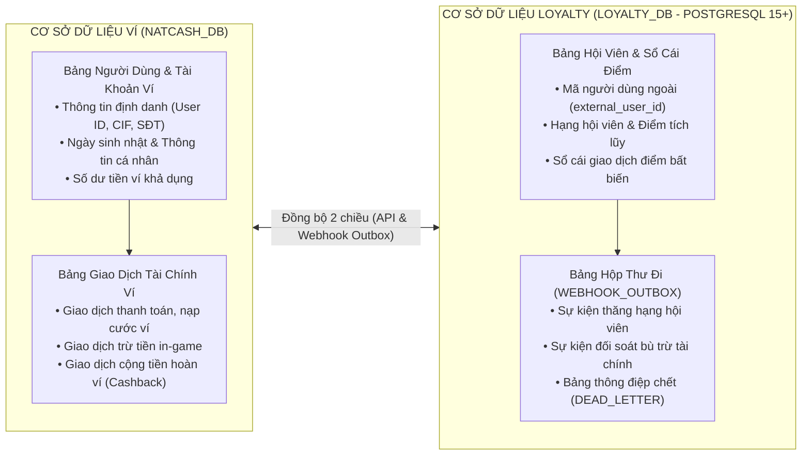

---

### 3.1. Ma Trận Luồng Đồng Bộ Dữ Liệu Hai Chiều

| Hướng đồng bộ | Nghiệp vụ thực thi | Giao thức / Endpoint | Cơ chế kích hoạt & Tần suất | Mục đích đồng bộ |
| :--- | :--- | :--- | :--- | :--- |
| **Ví → Loyalty** | Đồng bộ Hồ sơ & Ngày sinh | `POST /loyalty/v1/sync/user-profile` | Realtime API khi tạo ví hoặc cập nhật thông tin | Lưu ngày sinh nhật để chăm sóc, lưu thông tin định danh hội viên. |
| **Ví → Loyalty** | Tích điểm giao dịch ví | `POST /loyalty/v1/earn` | Bất đồng bộ qua Redis Streams hoặc Webhook sau giao dịch ví | Tích lũy điểm thưởng và điểm xét hạng thăng cấp. |
| **Loyalty → Ví** | Cập nhật Hạng hội viên | `POST /wallet/v1/webhooks/loyalty-tier-update` | Webhook bất đồng bộ khi thăng hạng/hạ hạng | Ví áp dụng biểu phí ưu đãi và hiển thị huy hiệu VIP trên trang chủ. |
| **Loyalty → Ví** | Hoàn tiền ví từ đổi điểm | `POST /wallet/v1/credit-cashback` | Synchronous RESTful API có khóa chống lặp | Trừ điểm Loyalty và cộng tiền mặt tương ứng vào số dư ví của khách. |
| **Loyalty → Ví** | Thanh toán in-game mua lượt | `POST /wallet/v1/debit-in-game` | Synchronous RESTful API xác thực mã PIN | Trừ tiền số dư ví để mua lượt chơi game hoặc vật phẩm trên GameHub. |
| **Loyalty → Ví** | Bắn thông báo chăm sóc | `POST /wallet/v1/notifications/push` | RESTful API / Hàng đợi thông báo | Gửi thông báo đẩy nhắc lên hạng, cảnh báo hết hạn điểm/quà, chúc mừng sinh nhật. |

---

### 3.2. Cơ Chế Đảm Bảo Tính Nhất Quán và Chống Thất Thoát Dữ Liệu

1. **Mẫu Thiết kế Hộp thư Đi (Transactional Outbox Pattern):**
   * Khi Loyalty phát sinh sự kiện cần gửi sang Ví (ví dụ: thăng hạng hội viên, đổi quà hoàn tiền), Loyalty lưu dữ liệu nghiệp vụ và bản ghi sự kiện vào bảng `WEBHOOK_OUTBOX` trong cùng một Transaction cơ sở dữ liệu nội bộ.
   * Một tiến trình nền (Outbox Publisher) quét bảng `WEBHOOK_OUTBOX` mỗi 1 giây để gửi Webhook sang Ví và đánh dấu trạng thái `PROCESSED`.
2. **Ký số HMAC-SHA256 và Xác thực Hai Chiều:**
   * Mọi Webhook và API giữa 2 hệ thống đều được ký bằng chữ ký số `X-Signature = HMAC-SHA256(SecretKey, Payload)` kèm `X-Timestamp`.
   * Bên nhận kiểm tra chữ ký và đối chiếu thời gian lệch không quá 300 giây để chống tấn công phát lại.
3. **Cơ chế Xác nhận Biên nhận và Thử lại Giãn cách (Ack/Nack & Exponential Backoff):**
   * Bên nhận phản hồi HTTP 200 OK kèm mã `{"code": "SUCCESS"}` trong vòng 3.000ms.
   * Nếu timeout hoặc lỗi 5xx, bên gửi tự động thử lại theo lịch: lần 1 sau 1 phút, lần 2 sau 5 phút, lần 3 sau 30 phút, lần 4 sau 2 giờ, lần 5 sau 6 giờ.
   * Sau 5 lần thất bại, bản ghi được chuyển vào Bảng Thông điệp Chết `WEBHOOK_DEAD_LETTER` để cảnh báo cho đội ngũ giám sát vận hành.
4. **Tiến trình Đối soát và Tự Phục Hồi Dữ Liệu Định Kỳ (Reconciliation & Self-Healing Job):**
   * Chạy lúc 02:00 sáng hàng ngày giữa 2 hệ thống, đối chiếu tổng số giao dịch tích/tiêu điểm, đổi hoàn tiền cashback và số dư để tự động phát hiện và bù đắp các bản ghi bị lệch do sự cố đường truyền mạng.

---

## 4. HƯỚNG DẪN TÍCH HỢP HỆ THỐNG VÀ PHÂN ĐỊNH TRÁCH NHIỆM CÁC TẦNG

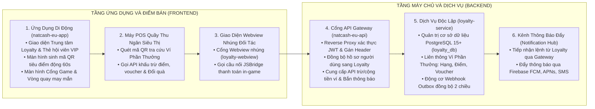

---

### 4.1. Trách Nhiệm Chi Tiết Của Tầng Ứng Dụng Di Động (`natcash-eu-app`) và Cổng Webview (`loyalty-webview`)

| STT | Thành phần giao diện / Chức năng | Chi tiết công việc Tầng App & Webview cần thực hiện | Giao thức / Dữ liệu tương tác |
| :---: | :--- | :--- | :--- |
| **1** | **Trung tâm Khách hàng thân thiết** | Xây dựng màn hình `LoyaltyScreen`: Hiển thị thẻ VIP (Bạc, Vàng, Bạch Kim, Kim Cương), thanh tiến độ điểm xét hạng chu kỳ 12 tháng, danh sách nhiệm vụ điểm danh ngày và các thẻ gợi nhắc thông minh (sinh nhật, nâng hạng). | Gọi `POST /loyalty/v1/profile`, `POST /loyalty/v1/missions/list`, `POST /loyalty/v1/engagement/in-app-nudges` qua Gateway. |
| **2** | **Màn hình Sinh mã QR Tiêu điểm** | Xây dựng modal/màn hình sinh mã QR động chứa token bảo mật mã hóa có hiệu lực trong 60 giây để máy POS siêu thị quét tra cứu Ví Phần Thưởng và trừ điểm/dùng voucher trực tiếp trên hóa đơn. | Tạo chuỗi mã hóa: `QR:tenant_id:user_id:timestamp:hash` kèm đếm lùi thời gian tự làm mới. |
| **3** | **Cổng GameHub & Trình chơi Webview Độc Lập** | Phân tách `loyalty-webview` thành module độc lập chứa FE Loyalty, GameHub và các Game H5: Lưới danh sách game theo thể loại, kho lượt chơi cá nhân, bảng xếp hạng và cầu nối `LoyaltyJSBridge` cho game H5. Hỗ trợ mở Cổng GameHub độc lập trực tiếp không cần qua Loyalty. | Nhận sự kiện `window.LoyaltyJSBridge.requestPayment(payload)` từ Webview để mở modal xác thực ví. |
| **4** | **Phím Tắt Động & Deep Link Chơi Game 1 Chạm** | Cài đặt cơ chế Dynamic Shortcuts và Deep Link Scheme (`natcash://game/:gameCode`, `natcash://gamehub`): Hiển thị icon/banner game động trên trang chủ ví Natcash, người dùng bấm 1 chạm là vào chơi ngay game tương ứng. | Mở trực tiếp Webview URL: `.../webview/game/:gameCode?ticket={ticket}&theme=natcash&source=home_shortcut`. |
| **5** | **Vòng quay may mắn (Lucky Draw)** | Nhúng component đĩa quay may mắn Canvas 60 FPS, phát âm thanh `lucky_rotate_sound.mp3`, nhận diện số lượt quay, gọi API quay thưởng và hiển thị popup kết quả trúng thưởng. | Gọi `POST /luckydraw/v1/config` để lấy số lượt và `POST /luckydraw/v1/spin` để thực hiện quay. |
| **6** | **Lưu trữ đệm ngoại tuyến** | Lưu đệm thông tin thẻ hội viên và danh mục game trên Redux Toolkit / AsyncStorage để hiển thị tức thì khi mở app. | Đồng bộ ngầm khi có kết nối mạng. |

---

### 4.2. Trách Nhiệm Chi Tiết Của Tầng API Gateway Hiện Có (`natcash-eu-api`)

| STT | Phân hệ nghiệp vụ | Chi tiết công việc Tầng Gateway cần thực hiện | Endpoint tiếp nhận / Chuyển tiếp |
| :---: | :--- | :--- | :--- |
| **1** | **Cổng Chuyển tiếp Bảo mật (Reverse Proxy)** | Tiếp nhận mọi request từ App, giải mã JWT token người dùng, trích xuất `User ID` / `Phone` / `Tenant ID`, ký số `X-Signature` HMAC-SHA256 và chuyển tiếp sang `loyalty-service`. | Chuyển tiếp các nhóm endpoint `/loyalty/*`, `/gamehub/*`, `/luckydraw/*`. |
| **2** | **Đồng bộ Hồ sơ Người dùng** | Lắng nghe sự kiện đăng ký ví mới hoặc cập nhật thông tin cá nhân (SĐT, Họ tên, Ngày sinh), tự động gọi API sang Loyalty để lưu dữ liệu phục vụ chăm sóc sinh nhật. | Gọi `POST /loyalty/v1/sync/user-profile` sang `loyalty-service`. |
| **3** | **Tiếp nhận Webhook Cập nhật Hạng** | Cung cấp endpoint đón Webhook từ Loyalty khi người dùng được thăng hạng; cập nhật mức phí chuyển tiền ưu đãi và hiển thị huy hiệu VIP trên trang chủ ví. | Tiếp nhận `POST /wallet/v1/webhooks/loyalty-tier-update`. |
| **4** | **Cung cấp API Trừ tiền In-Game** | Tiếp nhận yêu cầu trừ tiền ví khi người dùng mua lượt/vật phẩm game; kiểm tra số dư ví, trừ tiền an toàn và phản hồi trạng thái giao dịch. | Cung cấp `POST /wallet/v1/debit-in-game`. |
| **5** | **Cung cấp API Hoàn tiền Ví (Cashback)** | Tiếp nhận yêu cầu cộng tiền khi người dùng đổi điểm sang tiền mặt; cộng tiền vào số dư ví của khách và ghi sổ cái giao dịch tài chính. | Cung cấp `POST /wallet/v1/credit-cashback`. |
| **6** | **Chuyển tiếp Thông báo Đẩy (Notification Hub)** | Tiếp nhận lệnh gửi thông báo từ Loyalty; chuyển tiếp qua Firebase Cloud Messaging (FCM), Apple APNs hoặc SMS Brandname đến máy người dùng. | Cung cấp `POST /wallet/v1/notifications/push`. |

---

### 4.3. Trách Nhiệm Chi Tiết Của Dịch Vụ Độc Lập (`loyalty-service`)
1. **Quản trị Cơ sở dữ liệu độc lập `loyalty_db` trên PostgreSQL 15+:** Quản lý toàn bộ các bảng hội viên, sổ cái điểm, kho voucher, danh mục quà tặng, đối tác liên minh, chính sách tiêu điểm và bù trừ tài chính.
2. **Cung cấp Bộ máy Liên thông Ví Phần Thưởng (Reward Wallet):** Cho phép đối tác tra cứu đồng thời thông tin Hạng, Điểm khả dụng, Voucher hợp lệ và Quà tặng đổi tại quầy trong 1 API duy nhất (`inquiry`), đồng thời xử lý giao dịch khấu trừ đa phương tiện (`redeem`).
3. **Động cơ Webhook Outbox:** Đảm bảo 100% sự kiện được gửi thành công sang hệ thống ví và đối tác thông qua Transactional Outbox Pattern kết hợp cơ chế tự động thử lại theo cấp số nhân.
4. **Đối soát bù trừ tài chính liên minh:** Tổng hợp công nợ ròng giữa Đơn vị phát hành điểm (Natcom) và Đơn vị chấp nhận tiêu điểm (Siêu thị Delimart, Xăng dầu).

---

### 4.4. Trách Nhiệm Của Hệ Thống Đối Tác Bán Lẻ và Nhà Phát Triển Game
* **Hệ thống POS Siêu thị / Cây xăng đối tác:**
  * Tích hợp gọi `POST /loyalty/v1/partners/reward-wallet/inquiry` khi quét mã khách hàng để tra cứu toàn bộ quyền lợi Ví Phần Thưởng (Hạng, Điểm, Voucher, Quà).
  * Tích hợp gọi `POST /loyalty/v1/partners/reward-wallet/redeem` để trừ điểm, áp dụng voucher hoặc đổi quà tặng trực tiếp trên hóa đơn mua sắm.
* **Đối tác Nhà phát triển Game lẻ:**
  * Đóng gói mã nguồn game HTML5 tuân thủ chuẩn giao diện Webview tập trung của GameHub.
  * Tích hợp cầu nối JSBridge để gọi hàm thanh toán ví `window.LoyaltyJSBridge.requestPayment()` và nhận kết quả trả về từ App.

---

## 5. CƠ CHẾ XÁC THỰC VÀ BẢO MẬT ĐỐI TÁC TÍCH HỢP CHI TIẾT

Hệ thống thiết lập 4 cơ chế xác thực chuyên biệt cho 4 nhóm đối tác tích hợp khác nhau:

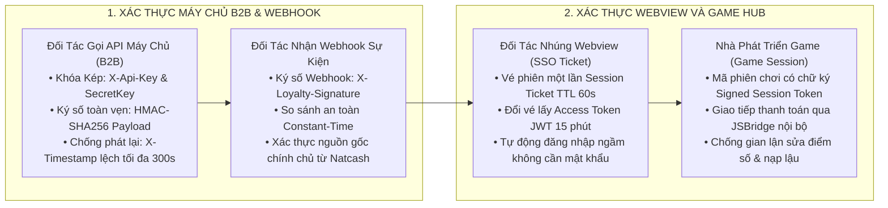

---

### 5.1. Cơ Chế Xác Thực Đối Tác Gọi API Máy Chủ Sang Máy Chủ (B2B API)
Áp dụng cho các hệ thống: Máy POS quầy thu ngân siêu thị (Delimart), Cây xăng Total, Hệ thống ERP viễn thông Natcom.
* **Nguyên lý Khóa Kép (Dual-Key Authentication):**
  1. `X-Api-Key`: Khóa định danh công khai của đối tác (ví dụ: `pk_live_delimart_893ab4f2`).
  2. `SecretKey`: Khóa bí mật dùng để ký số (ví dụ: `sk_live_secret_7721df983a...`), chỉ được lưu an toàn tại máy chủ đối tác và cơ sở dữ liệu `loyalty_db` (mã hóa AES-256), **tuyệt đối không truyền trên đường truyền mạng**.
* **Công thức Ký Số Băm Mật Mã Chuẩn Hóa (HMAC-SHA256):**
  Bên gửi tạo một chuỗi chuẩn hóa trước khi ký:
  ```
  CanonicalString = HttpMethod + "\n" + RequestPath + "\n" + X-Timestamp + "\n" + SHA256(RequestBodyJson)
  X-Signature = Hex(HMAC-SHA256(SecretKey, CanonicalString))
  ```
* **Quy trình Kiểm tra tại Cổng Gateway / Loyalty Service:**
  1. Kiểm tra `X-Timestamp`: Nếu chênh lệch quá ±300 giây so với giờ máy chủ → Từ chối `401 Unauthorized (Request Expired)`.
  2. Tra cứu `SecretKey` từ bộ nhớ đệm Redis theo `X-Api-Key`.
  3. Tính toán lại chữ ký số `ExpectedSignature` theo công thức trên.
  4. So sánh chữ ký bằng thuật toán thời gian hằng số `MessageDigest.isEqual()` để chống tấn công phân tích thời gian thực thi (Timing Attack).
  5. Kiểm tra danh sách địa chỉ IP gửi yêu cầu (IP Whitelisting).

---

### 5.2. Cơ Chế Xác Thực Đối Tác Nhúng Webview Vào Ứng Dụng Di Động (SSO Ticket)
Áp dụng khi Ứng dụng di động của Đối tác mở Cổng Webview Khách hàng thân thiết:
1. **Bước 1 (Backend đối tác gọi Loyalty):** Máy chủ đối tác gửi lệnh `POST /loyalty/v1/sso/generate-session-ticket` (xác thực qua API Key & HMAC ở Mục 5.1), truyền định danh khách hàng `external_user_id` và `phone_number`.
2. **Bước 2 (Loyalty cấp vé phiên):** Loyalty Service sinh chuỗi ngẫu nhiên an toàn 32 bytes (Hex format) làm `session_ticket`, lưu vào Redis với thời hạn sống **60 giây** và đánh dấu trạng thái `UNUSED`.
3. **Bước 3 (Mở Webview):** App đối tác mở URL: `https://loyalty.natcash.com/hub?ticket={session_ticket}&theme={partner_theme}`.
4. **Bước 4 (Đổi vé lấy Token):** Trang Webview tự động gửi yêu cầu `POST /loyalty/v1/sso/exchange-token` truyền `session_ticket`. Loyalty Service kiểm tra vé trong Redis, ngay lập tức xóa vé (One-Time Use) và trả về cặp mã `Access Token` (JWT có hạn 15 phút) và `Refresh Token`. Webview lưu `Access Token` vào bộ nhớ phiên `sessionStorage` để nạp dữ liệu hội viên.

---

### 5.3. Cơ Chế Xác Thực Đối Tác Nhận Webhook Sự Kiện
Áp dụng khi Loyalty Service bắn thông báo biến động hạng hoặc kết quả đối soát sang hệ thống đối tác:
* Loyalty Service gửi kèm tiêu đề:
  * `X-Loyalty-Timestamp`: Thời gian gửi (Unix Timestamp).
  * `X-Loyalty-Signature`: `HMAC-SHA256(PartnerWebhookSecret, X-Loyalty-Timestamp + "." + RawPayloadJson)`.
* Hệ thống đối tác nhận gói tin, băm lại bằng `PartnerWebhookSecret` đã cấu hình trên CMS và so sánh để đảm bảo gói tin không bị giả mạo trên đường truyền.

---

### 5.4. Quy Trình Quản Trị Vòng Đời Khóa và Thu Hồi Tức Thì
1. **Khởi tạo và Cấp phát trên CMS:** Tự động sinh `API Key`, `Secret Key` và `Webhook Secret` khi tạo mới đối tác; cho phép cấu hình danh sách IP hợp lệ và hạn mức gọi API (Rate Limit).
2. **Cơ chế Xoay Vòng Khóa Không Gián Đoạn (Zero-Downtime Key Rotation):** Cho phép đối tác tạo Khóa Mới trong khi Khóa Cũ vẫn hoạt động song song trong **7 ngày chuyển tiếp** (Grace Period), giúp đối tác cập nhật hệ thống mà không phải dừng dịch vụ.
3. **Vô hiệu hóa Khóa Tức Thì (Instant Revocation):** Khi phát hiện đối tác bị lộ khóa hoặc vi phạm chính sách, Quản trị viên chỉ cần chuyển trạng thái `status = INACTIVE` trên CMS. Hệ thống lập tức xóa toàn bộ khóa và phiên trong Redis trong vòng **dưới 1 giây**, khóa mọi yêu cầu tiếp theo ngay tại Cổng Gateway.

---

## 6. PHÂN RÃ CÁC PHÂN HỆ VÀ TÍNH NĂNG TRONG DỊCH VỤ

Dịch vụ độc lập `loyalty-service` được cấu thành từ 7 phân hệ chức năng chuyên biệt:

```mermaid
flowchart LR
    subgraph COL_LOYALTY ["PHÂN HỆ KHÁCH HÀNG THÂN THIẾT & GỢI NHẮC"]
        direction TB
        MOD_TIER["Phân Hệ 1: Quản Trị Hạng Hội Viên<br/>• Quản lý 4 hạng: Bạc, Vàng, Bạch Kim, Kim Cương<br/>• Tự động nâng hạng và xét duy trì hạng hàng năm<br/>• Quản lý ma trận đặc quyền và hệ số nhân điểm"]
        MOD_POINT["Phân Hệ 2: Sổ Cái Điểm Hợp Nhất & Bù Trừ<br/>• Tích điểm từ viễn thông, ví điện tử và game<br/>• Sổ cái ghi nhận tích, tiêu, hoàn, hết hạn điểm<br/>• Động cơ thanh toán bù trừ tài chính liên minh"]
        MOD_MILESTONE["Phân Hệ 3: Cột Mốc Chiến Dịch & Gợi Nhắc<br/>• Chuỗi cột mốc gắn với khuyến mại và game<br/>• Tính toán gợi nhắc khoảng cách thăng hạng<br/>• Cảnh báo hết hạn điểm/quà & Chúc mừng sinh nhật"]
        MOD_TIER --> MOD_POINT
        MOD_POINT --> MOD_MILESTONE
    end

    subgraph COL_GAME ["PHÂN HỆ ĐỐI TÁC, ĐỔI THƯỞNG VÀ CỔNG GAME"]
        direction TB
        MOD_REWARD_WALLET["Phân Hệ 4: Liên Thông Ví Phần Thưởng<br/>• Tra cứu Hạng, Điểm, Voucher, Quà tặng<br/>• Khấu trừ đa phương tiện tại quầy đối tác<br/>• Kiểm tra điều kiện chấp nhận tiêu điểm"]
        MOD_REWARD["Phân Hệ 5: Quản Trị Kho Quà & Đổi Thưởng<br/>• Quản lý kho phiếu giảm giá điện tử<br/>• Đổi điểm lấy tiền hoàn ví & lượt chơi game"]
        MOD_GAME["Phân Hệ 6: Cổng Game & Trình Chơi Hub<br/>• Quản lý danh mục game và phiên chơi tập trung<br/>• Vòng quay may mắn chính chủ"]
        MOD_BILLING["Phân Hệ 7: Thanh Toán Ví & Đối Soát<br/>• Thu phí in-game qua số dư ví & Đối soát chia sẻ"]
        MOD_REWARD_WALLET --> MOD_REWARD
        MOD_REWARD --> MOD_GAME
        MOD_GAME --> MOD_BILLING
    end

    MOD_MILESTONE --> MOD_REWARD_WALLET
```

---

## 7. THIẾT KẾ CƠ SỞ DỮ LIỆU CHI TIẾT

### 7.1. Sơ Đồ Thực Thể Quan Hệ Tổng Quan

```mermaid
erDiagram
    TENANTS ||--o{ LOYALTY_PARTNERS : "quan_ly"
    TENANTS ||--o{ LOYALTY_TIERS : "dinh_nghia_hang"
    TENANTS ||--o{ LOYALTY_ACCOUNTS : "quan_ly_nguoi_dung"
    TENANTS ||--o{ LOYALTY_CAMPAIGN_MILESTONES : "thiet_lap_cot_moc"
    TENANTS ||--o{ LOYALTY_ENGAGEMENT_TRIGGERS : "cau_hinh_goi_nhac"
    TENANTS ||--o{ WEBHOOK_OUTBOX : "quan_ly_hop_thu_di"
    LOYALTY_PARTNERS ||--o{ LOYALTY_ACCEPTANCE_POLICIES : "thiet_lap_dieu_kien"
    LOYALTY_PARTNERS ||--o{ LOYALTY_CROSS_PARTNER_TRANSACTIONS : "phat_sinh_giao_dich"
    LOYALTY_PARTNERS ||--o{ LOYALTY_CLEARINGHOUSE_SETTLEMENTS : "quyet_toan_bu_tru"
    LOYALTY_TIERS ||--o{ LOYALTY_ACCOUNTS : "phan_hang"
    LOYALTY_ACCOUNTS ||--o{ LOYALTY_POINT_LEDGER : "ghi_so_diem"
    LOYALTY_ACCOUNTS ||--o{ LOYALTY_CROSS_PARTNER_TRANSACTIONS : "thuc_hien_tieu_diem"
    LOYALTY_ACCOUNTS ||--o{ LOYALTY_USER_MILESTONES : "theo_doi_tien_do"
    LOYALTY_CAMPAIGN_MILESTONES ||--o{ LOYALTY_USER_MILESTONES : "dinh_nghia"
    LOYALTY_ACCOUNTS ||--o{ LOYALTY_COMMUNICATION_LOGS : "ghi_nhan_gui_tin"
    LOYALTY_VOUCHERS ||--o{ LOYALTY_VOUCHER_REDEMPTIONS : "doi_phieu"
    LOYALTY_ACCOUNTS ||--o{ LOYALTY_VOUCHER_REDEMPTIONS : "so_huu"
    GAME_PARTNERS ||--o{ GAMES : "cung_cap"
    GAMES ||--o{ PRIZES_STRUCTURE : "chua"
    GAMES ||--o{ GAMES_TURN : "theo_doi"
    GAMES ||--o{ IN_GAME_TRANSACTIONS : "phat_sinh"
    GAMES ||--o{ GAMES_RESULTS : "ghi_nhan"
    GAME_PARTNERS ||--o{ PARTNER_SETTLEMENTS : "doi_soat"
    PRIZES ||--o{ PRIZES_STRUCTURE : "dinh_nghia"
    PRIZES ||--o{ GAMES_RESULTS : "tra_thuong"
```

---

### 7.2. Bảng Mô Tả Cấu Trúc Dữ Liệu Chi Tiết

#### 1. Nhóm Bảng Cột Mốc Chiến Dịch, Gợi Nhắc & Hộp Thư Đi Webhook
* **`LOYALTY_CAMPAIGN_MILESTONES`**: Quản lý các chặng cột mốc gắn với sự kiện/khuyến mại/game (`id`, `tenant_id`, `campaign_code`, `campaign_name`, `milestone_step`, `target_metric`, `target_value`, `reward_points`, `reward_voucher_id`, `reward_game_turns`, `start_date`, `end_date`, `status`).
* **`LOYALTY_USER_MILESTONES`**: Lưu vết tiến độ hoàn thành cột mốc của từng người dùng (`id`, `user_account_id`, `milestone_id`, `current_progress`, `status`, `completed_at`).
* **`LOYALTY_ENGAGEMENT_TRIGGERS`**: Cấu hình các kịch bản gợi nhắc thông minh theo ngữ cảnh (`id`, `tenant_id`, `trigger_type`, `threshold_percentage`, `days_in_advance`, `message_template`, `status`).
* **`LOYALTY_COMMUNICATION_LOGS`**: Lưu vết thông điệp và kiểm soát hạn mức tần suất gửi tin chống làm phiền (`id`, `tenant_id`, `user_account_id`, `channel`, `sent_date`, `trigger_type`, `status`).
* **`WEBHOOK_OUTBOX`**: Lưu trữ các sự kiện cần gửi sang Hệ thống ví lõi và Đối tác (`id`, `tenant_id`, `event_type`, `payload` định dạng JSONB, `target_url`, `retry_count`, `next_retry_at`, `status`, `created_at`).
* **`WEBHOOK_DEAD_LETTER`**: Lưu trữ các sự kiện Webhook gửi thất bại sau 5 lần thử (`id`, `tenant_id`, `event_type`, `payload` định dạng JSONB, `error_message`, `failed_at`).

#### 2. Nhóm Bảng Quản Trị Thuê Bao, Đối Tác Liên Minh & Liên Thông Ví Phần Thưởng
* **`TENANTS`**: Quản trị thông tin các đơn vị thuê bao (`id`, `code`, `name`, `api_key`, `secret_key`, `status`).
* **`LOYALTY_PARTNERS`**: Quản lý danh mục đối tác liên minh (`id`, `tenant_id`, `partner_code`, `partner_name`, `partner_type`, `api_key`, `secret_key`, `webhook_secret`, `ip_whitelist`, `status`).
* **`LOYALTY_ACCEPTANCE_POLICIES`**: Thiết lập điều kiện chấp nhận tiêu điểm và voucher tại điểm bán (`id`, `partner_id`, `point_exchange_rate`, `max_burn_percentage`, `min_burn_points`, `max_burn_points_per_day`, `min_tier_id`, `allowed_point_types`, `status`).
* **`LOYALTY_CROSS_PARTNER_TRANSACTIONS`**: Lưu vết các giao dịch tiêu điểm chéo, áp dụng voucher và đổi quà giữa Đơn vị phát hành và Đơn vị bán lẻ (`id`, `tenant_id`, `transaction_code`, `external_user_id`, `issuer_partner_id`, `redeemer_partner_id`, `points_burned`, `voucher_id_used`, `bill_discount_amount`, `gift_item_id`, `created_at`).
* **`LOYALTY_CLEARINGHOUSE_SETTLEMENTS`**: Báo cáo quyết toán thanh toán bù trừ tài chính đa phương định kỳ (`id`, `tenant_id`, `partner_id`, `period`, `total_points_issued`, `total_points_redeemed`, `net_settlement_amount`, `status`).

#### 3. Nhóm Bảng Khách Hàng Thân Thiết, Sổ Cái Điểm & Kho Quà
* **`LOYALTY_TIERS`**: Định nghĩa 4 hạng hội viên Bạc, Vàng, Bạch Kim, Kim Cương (`id`, `tenant_id`, `code`, `name`, `min_points`, `point_multiplier`, `free_daily_turns`).
* **`LOYALTY_ACCOUNTS`**: Hồ sơ hội viên và số dư điểm hợp nhất (`id`, `tenant_id`, `external_user_id`, `tier_id`, `current_points`, `tier_points`, `tier_updated_at`).
* **`LOYALTY_POINT_LEDGER`**: Sổ cái ghi nhận bất biến mọi giao dịch cộng/trừ điểm thưởng (`id`, `tenant_id`, `user_account_id`, `point_change`, `change_type`, `reference_code`, `expired_at`, `created_at`).
* **`LOYALTY_VOUCHERS` & `LOYALTY_VOUCHER_REDEMPTIONS`**: Quản trị kho quà phiếu ưu đãi điện tử và lịch sử sở hữu/đổi phiếu của người dùng.

#### 4. Nhóm Bảng Cổng Game, Trò Chơi & 7 Nhóm Cấu Hình CMS
* **`GAMES` & `GAME_PARTNERS`**: Quản lý đối tác phát triển game và danh mục trò chơi phát hành (`id`, `tenant_id`, `partner_id`, `game_code`, `game_name`, `category`, `icon_url`, `banner_url`, `h5_bundle_url`, `version`, `screen_orientation`, `status`, `start_time`, `end_time`).
* **`GAME_CONFIG_METADATA`**: Cấu hình thành phần giao diện, theme/skin mùa lễ hội, số ô đĩa quay, danh mục âm thanh BGM, âm quay, âm thắng giải và hiệu ứng pháo hoa.
* **`GAME_TURN_POLICIES`**: Cấu hình chính sách tặng lượt miễn phí (đăng ký mới, điểm danh hàng ngày, theo hạng VIP Bạc/Vàng/Bạch Kim/Kim Cương, nhiệm vụ cột mốc), chính sách đổi điểm lấy lượt (`point_cost_per_turn`, `max_redeem_turns_per_day`) và cơ chế vòng đời lượt (`RESET_DAILY_2359` vs `ROLL_OVER_ACCUMULATIVE`).
* **`GAME_TURN_PACKAGES`**: Quản lý danh mục gói bán lượt chơi combo (`id`, `game_id`, `package_code`, `package_name`, `base_turns`, `bonus_turns`, `price`, `discount_price`, `badge_label`, `status`).
* **`GAME_TURN_BALANCES`**: Sổ theo dõi số dư lượt chơi của người dùng, phân tách rõ ràng: số lượt miễn phí có hạn trong ngày và số lượt mua/đổi điểm tích lũy vĩnh viễn.
* **`IN_GAME_TRANSACTIONS`**: Giao dịch trừ tiền ví khi người dùng mua lượt hoặc gói combo trong game qua API xác thực mã PIN.
* **`PARTNER_SETTLEMENTS`**: Quyết toán doanh thu chia sẻ định kỳ cho từng nhà phát triển game lẻ.
* **`PRIZES`, `PRIZES_STRUCTURE`, `GAMES_RESULTS`**: Quản lý danh mục giải thưởng (Tiền hoàn ví, Điểm loyalty, Voucher, Hiện vật, Lượt chơi thêm, Miss), ma trận xác suất trúng thưởng (%), hạn mức ngân sách tiền mặt tối đa trong ngày, hạn mức số lượng giải lớn và kết quả trúng thưởng.

---

## 8. ĐẶC TẢ GIAO DIỆN LẬP TRÌNH VÀ BÙ TRỪ TÀI CHÍNH LIÊN MINH

Mọi yêu cầu gọi đến `loyalty-service` đều phải truyền kèm các tiêu đề chuẩn hóa:
* `X-Tenant-Id`: Mã định danh thuê bao gọi đến (Ví dụ: `NATCASH`).
* `X-Api-Key`: Khóa định danh bảo mật của thuê bao hoặc đối tác liên kết.
* `X-Signature`: Chữ ký số HMAC-SHA256 để bảo vệ tính toàn vẹn.
* `X-Timestamp`: Thời gian gửi Unix Timestamp (sai lệch tối đa ±300 giây).
* `X-User-Id`: Mã định danh người dùng từ hệ thống gọi đến.

### 8.1. Nhóm Giao Diện Liên Thông Ví Phần Thưởng Cho Đối Tác Bán Lẻ
1. **`POST /loyalty/v1/partners/reward-wallet/inquiry`**: Máy POS quầy thu ngân của đối tác gọi để tra cứu toàn diện Ví Phần Thưởng của khách (Thông tin Hạng hội viên, Số dư điểm khả dụng, Tỷ lệ khấu trừ tối đa, Danh sách mã giảm giá hợp lệ cho hóa đơn hiện tại, Danh mục quà tặng đổi tại quầy).
2. **`POST /loyalty/v1/partners/reward-wallet/redeem`**: Thực thi trừ điểm thưởng, áp dụng mã giảm giá voucher hoặc ghi nhận đổi quà tặng trong cùng một giao dịch tổng hợp, giảm trừ trực tiếp tiền mặt trên hóa đơn mua sắm.
3. **`POST /loyalty/v1/partners/reward-wallet/refund`**: Hoàn lại điểm, mở khóa lại mã voucher hoặc hoàn quà cho khách hàng khi phát sinh trả hàng hoặc hủy hóa đơn tại quầy.

### 8.2. Nhóm Giao Diện Xác Thực Phiên Webview (SSO)
1. **`POST /loyalty/v1/sso/generate-session-ticket`**: Máy chủ đối tác gọi để sinh mã vé phiên một lần (`session_ticket` TTL 60s) cho người dùng.
2. **`POST /loyalty/v1/sso/exchange-token`**: Trang Webview nhúng tự động gọi để đổi vé lấy mã truy cập ngắn hạn (`Access Token JWT`).

### 8.3. Nhóm Giao Diện Đồng Bộ Hồ Sơ & Webhook
1. **`POST /loyalty/v1/sync/user-profile`**: Hệ thống ví gọi để đồng bộ thông tin tài khoản người dùng, số điện thoại và ngày sinh nhật sang `loyalty-service`.
2. **`POST /wallet/v1/webhooks/loyalty-tier-update`**: `loyalty-service` bắn Webhook sang hệ thống ví khi người dùng được nâng hạng hoặc hạ hạng hội viên.

### 8.4. Nhóm Giao Diện Cột Mốc Chiến Dịch & Gợi Nhắc Thông Minh
1. **`POST /loyalty/v1/milestones/active-campaigns`**: Lấy danh sách các chiến dịch khuyến mại/sự kiện đang diễn ra kèm tiến độ vượt từng chặng cột mốc của người dùng.
2. **`POST /loyalty/v1/milestones/claim-reward`**: Nhận phần thưởng sau khi hoàn thành một chặng cột mốc.
3. **`POST /loyalty/v1/engagement/in-app-nudges`**: Lấy danh sách các thẻ gợi nhắc ngữ cảnh hiển thị tinh tế trên giao diện ứng dụng.

### 8.5. Nhóm Giao Diện Thanh Toán Bù Trừ Liên Minh
1. **`POST /loyalty/v1/clearinghouse/reconciliation-report`**: Báo cáo tổng hợp số điểm phát hành và số điểm chấp nhận tiêu dùng giữa các bên liên minh.
2. **`POST /loyalty/v1/clearinghouse/settle-period`**: Khởi tạo lệnh quyết toán bù trừ công nợ ròng giữa các tài khoản đối tác trong kỳ.

### 8.6. Nhóm Giao Diện Khách Hàng Thân Thiết Chuẩn
1. **`POST /loyalty/v1/profile`**: Lấy thông tin tài khoản hội viên, hạng hiện tại, điểm tích lũy khả dụng và điểm xét hạng năm.
2. **`POST /loyalty/v1/earn`**: Hệ thống thanh toán/viễn thông gọi để tích lũy điểm tự động sau khi giao dịch thành công.
3. **`POST /loyalty/v1/point-history`**: Tra cứu lịch sử cộng, trừ điểm thưởng theo sổ cái phân trang.
4. **`POST /loyalty/v1/vouchers/catalog`**: Lấy danh sách phiếu giảm giá trong kho quà cho phép đổi điểm.
5. **`POST /loyalty/v1/vouchers/redeem`**: Thực hiện đổi điểm thưởng lấy mã ưu đãi phiếu giảm giá.
6. **`POST /loyalty/v1/cashback/redeem`**: Thực hiện đổi điểm thưởng lấy tiền mặt hoàn thẳng vào số dư ví Natcash.

### 8.7. Nhóm Giao Diện Cổng Game, Cấu Hình CMS và Mua Lượt Chơi
1. **`POST /gamehub/v1/games/list`**: Truy vấn danh sách game theo thể loại, từ khóa tìm kiếm và trạng thái nổi bật.
2. **`GET /gamehub/v1/games/{gameId}/config`**: Lấy cấu hình đầy đủ của game: Giao diện, theme, âm thanh, luật chơi và ma trận giải thưởng.
3. **`POST /gamehub/v1/games/{gameId}/packages`**: Lấy danh sách bảng giá mua lượt lẻ và các gói combo ưu đãi.
4. **`POST /gamehub/v1/games/{gameId}/purchase-turns`**: Thực hiện mua lượt chơi lẻ hoặc gói combo in-game, trừ số dư ví Natcash an toàn qua mã PIN.
5. **`POST /gamehub/v1/games/{gameId}/redeem-turns`**: Thực hiện đổi điểm Loyalty lấy lượt chơi theo tỷ giá cấu hình.
6. **`POST /gamehub/v1/games/{gameId}/claim-daily-turns`**: Nhận lượt chơi miễn phí điểm danh hàng ngày hoặc theo cấp bậc hội viên VIP.
7. **`POST /gamehub/v1/session/init`**: Khởi tạo phiên chơi game tập trung trên GameHub hoặc từ Shortcut động 1 chạm.
8. **`POST /luckydraw/v1/spin`**: Thực hiện lượt quay may mắn và trả thưởng theo thuật toán xác suất có trọng số kết hợp trừ ngân sách nguyên tử Redis `DECRBY`.

---

## 9. THIẾT KẾ TIẾN TRÌNH XỬ LÝ NGHIỆP VỤ

### 9.1. Tiến Trình Liên Thông Ví Phần Thưởng và Trừ Tiền Đổi Quà Tại Quầy Đối Tác

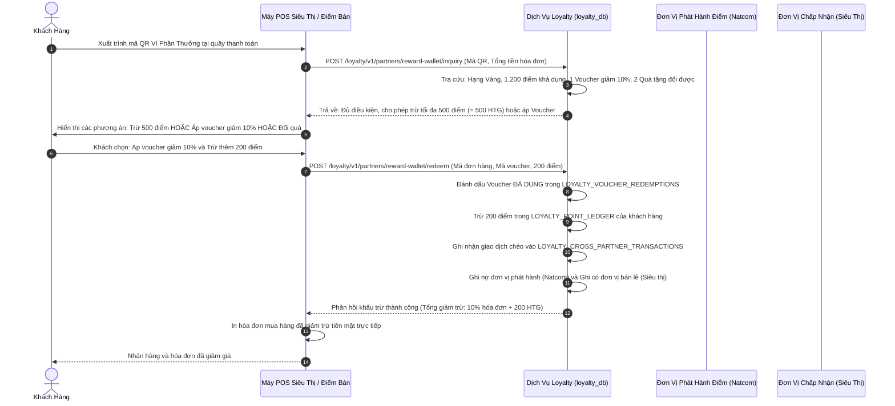

---

### 9.2. Tiến Trình Đồng Bộ Hai Chiều và Xử Lý Webhook Outbox Giữa Ví và Loyalty

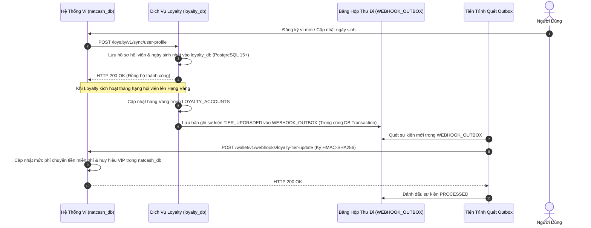

---

### 9.3. Tiến Trình Tính Toán Gợi Nhắc Nâng Hạng & Chăm Sóc Khách Hàng Tự Động

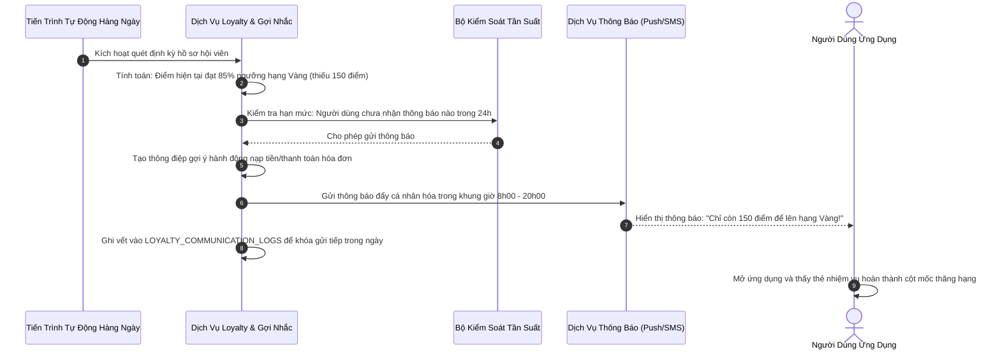

---

### 9.4. Tiến Trình Tích Điểm Tự Động Từ Giao Dịch Ví và Nâng Hạng Hội Viên

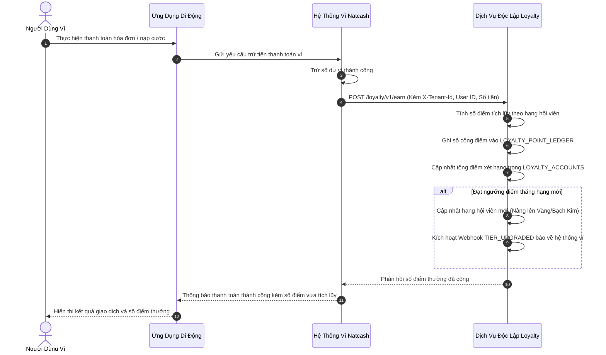

---

### 9.5. Tiến Trình Vòng Quay May Mắn

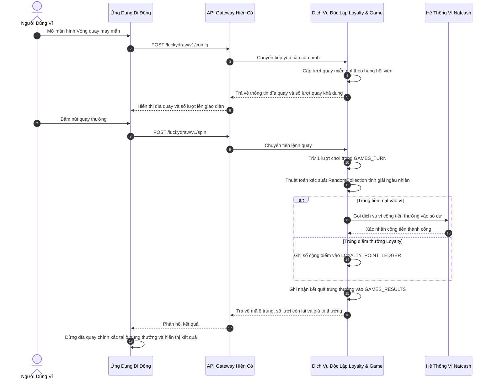

---

## 10. THIẾT KẾ MÀN HÌNH VÀ GIAO DIỆN CHỨC NĂNG

Hệ thống giao diện trên Ứng dụng di động được tổ chức thành 4 cụm màn hình chính:

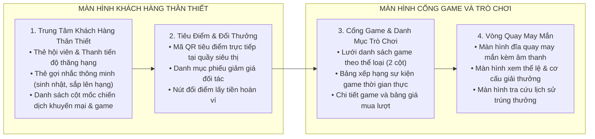

---

## 11. MA TRẬN ĐÁNH GIÁ HIỆN TRẠNG VÀ KẾ HOẠCH CHUYỂN ĐỔI

### 11.1. Bảng Đánh Giá Khả Năng Tận Dụng Mã Nguồn Hiện Có

| Phân hệ / Thành phần | Mã nguồn hiện có trong dự án | Đánh giá tận dụng | Kế hoạch hành động |
| :--- | :--- | :--- | :--- |
| **Giao diện Vòng quay (Mobile)** | `src/screens/LuckyDraw/index.tsx`, `Rule/`, `History/`, `react-native-lucky-wheel`, `lucky_rotate_sound.mp3`. | **Tận dụng 90%** | Giữ nguyên giao diện; chỉ trỏ lại các endpoint API sang Dịch vụ độc lập mới. |
| **Giao diện Cổng Game (Mobile)** | `src/screens/GameStack/Game/`, `GameSearch/`, `GameDetail/`, component `ItemGameData.tsx`. | **Tận dụng 80%** | Bổ sung thêm bảng giá lượt chơi và cửa sổ xác thực mã PIN thanh toán trong game ví. |
| **Màn hình Tiêu điểm đối tác (Mobile)** | Chưa có mã QR tiêu điểm tại quầy thu ngân. | **Làm mới 100%** | Xây dựng màn hình sinh mã QR thanh toán bằng điểm tại siêu thị. |
| **Xác thực phiên ví (API Gateway)** | `AppUser`, `AppDevice`, cơ chế trích xuất người dùng `getUserLoggedInfo()` trong `natcash-eu-api`. | **Tận dụng 100%** | Sử dụng làm cổng Reverse Proxy xác thực người dùng ví trước khi chuyển tiếp vào Dịch vụ độc lập. |
| **Thuật toán quay thưởng (Backend)** | `RandomCollection.java` (Thuật toán xác suất có trọng số). | **Tận dụng 100%** | Chuyển toàn bộ mã nguồn thuật toán sang Dịch vụ độc lập mới. |
| **Cơ sở dữ liệu trò chơi hiện có** | Bảng `games`, `prizes`, `prizes_structure`, `games_turn`, `games_results`. | **Tận dụng 70%** | Chuyển sang cơ sở dữ liệu `loyalty_db` trên PostgreSQL 15+; bổ sung trường `tenant_id`, `partner_id`, `play_price`. |
| **Cơ chế Đồng bộ Webhook Outbox** | Chưa có cơ chế Outbox đồng bộ hai chiều với ví. | **Làm mới 100%** | Xây dựng mới các bảng `webhook_outbox`, `webhook_dead_letter` (JSONB) và tiến trình quét Outbox Publisher. |
| **Cột mốc chiến dịch & Gợi nhắc** | Chưa có logic cột mốc sự kiện và động cơ gợi nhắc thông minh. | **Làm mới 100%** | Xây dựng mới các bảng `loyalty_campaign_milestones`, `loyalty_user_milestones`, `loyalty_engagement_triggers`, `loyalty_communication_logs`. |
| **Liên minh đối tác & Bù trừ điểm** | Chưa có logic quản lý đối tác và bù trừ điểm chéo. | **Làm mới 100%** | Xây dựng mới các bảng `loyalty_partners`, `loyalty_acceptance_policies`, `loyalty_cross_partner_transactions`, `loyalty_clearinghouse_settlements`. |
| **Thanh toán trong game mua lượt qua ví** | Chưa có luồng trừ tiền ví trực tiếp trong màn chơi game. | **Làm mới 100%** | Xây dựng API thanh toán trong game `in_game_transactions` tích hợp trừ tiền ví Natcash. |
| **Hệ thống Khách hàng thân thiết** | Chưa có sổ cái điểm tích lũy và cơ chế phân hạng hội viên. | **Làm mới 100%** | Xây dựng các bảng `loyalty_tiers`, `loyalty_accounts`, `loyalty_point_ledger`, `loyalty_vouchers`. |

---

### 11.2. Kế Hoạch Chuyển Đổi Kỹ Thuật 5 Giai Đoạn (9 Sprints)

1. **Giai đoạn 1 (Sprint 1 & 2): Hạ tầng kế thừa, Cơ sở dữ liệu PostgreSQL 15+ & Bảo mật B2B:**
   - Tạo dự án dịch vụ mới (Java 17 LTS, Spring Boot 2.7.14+), tích hợp 11 module thư viện lõi `ims-libraries`.
   - Thiết lập cơ sở dữ liệu độc lập `loyalty_db` trên **PostgreSQL 15+** hoàn toàn tách rời `natcash_db`, cấu hình phân tách đa thuê bao `TenantContextFilter`, bảo mật Khóa kép HMAC-SHA256, khóa phân tán Redisson RLock, Redis Streams và Transactional Outbox Engine.
2. **Giai đoạn 2 (Sprint 3 & 4): Phát triển 7 Phân hệ Nghiệp vụ, CMS & Webview Độc Lập:**
   - Sổ cái điểm thưởng kép, phân hạng 4 cấp chu kỳ 12 tháng, Động cơ liên thông Ví Phần Thưởng và Động cơ bù trừ công nợ liên minh.
   - Xây dựng **7 nhóm cấu hình Game trên CMS (`loyalty-cms`)** theo chuẩn công nghiệp phát hành game.
   - Xây dựng Trình mở Game H5 độc lập và đĩa quay Canvas 60 FPS (`loyalty-webview`).
3. **Giai đoạn 3 (Sprint 5 & 6): Tích hợp API Gateway, Ứng dụng Di Động, Webview & Phím Tắt Động:**
   - Chuyển đổi API Gateway (`natcash-eu-api`) thành Reverse Proxy Client gọi sang Dịch vụ độc lập kèm tiêu đề `X-Tenant-Id: NATCASH`.
   - Nâng cấp `natcash-eu-app`: Trung tâm Loyalty, Mã QR Ví Phần Thưởng động 60s, Cổng GameHub độc lập, Phím tắt Động chơi game tức thì 1 chạm trên trang chủ và kiểm thử luồng đầu cuối E2E.
4. **Giai đoạn 4 (Sprint 7 & 8): Kiểm thử tải lớn, An toàn thông tin & Triển khai Production:**
   - Kiểm thử tải 1.000 RPS API điểm bán POS, kiểm thử tải đồng thời Vòng quay may mắn & ngân sách Redis `DECRBY`, Pentest bảo mật, đóng gói CI/CD Docker Kubernetes và chạy thử nghiệm Pilot tại Siêu thị Delimart.
5. **Giai đoạn 5 (Sprint 9): Hệ sinh thái Giả lập, Thử nghiệm Sandbox & Chuyển giao Đối tác:**
   - Xây dựng Trình Giả Lập Điểm Bán Web POS Siêu Thị (`SIM-01`), Ứng Dụng Đối Tác Giả Lập Nhúng Webview (`SIM-02`), Mở Rộng Cổng Thử Nghiệm Sandbox & Soi Chữ Ký HMAC (`SIM-03`) và Trình Giả Lập Smartphone Live (`SIM-04`).
