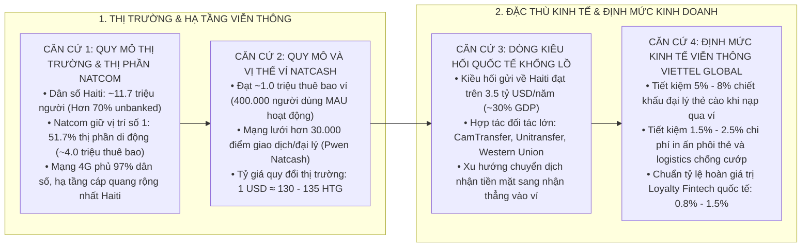
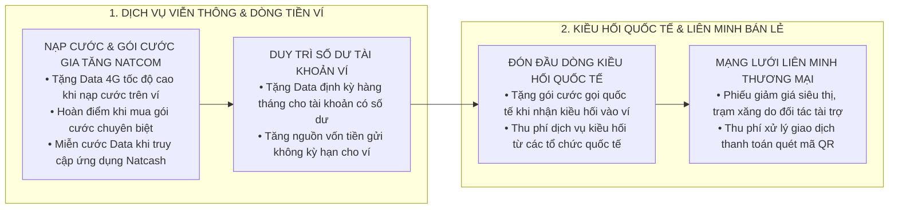
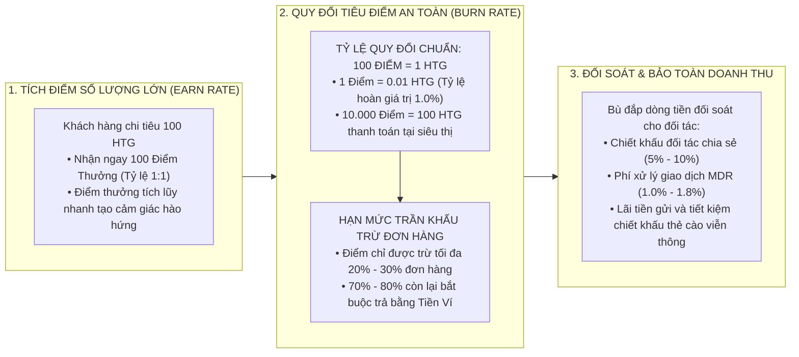
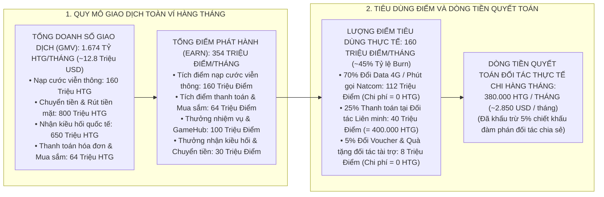
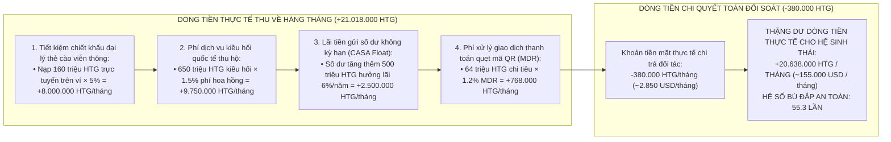
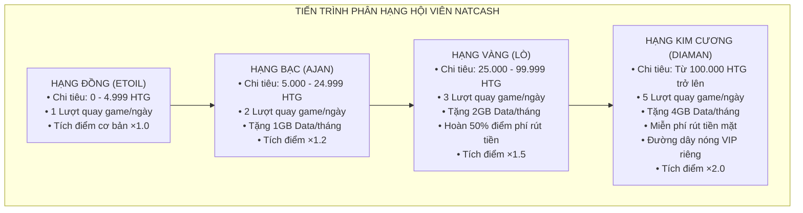
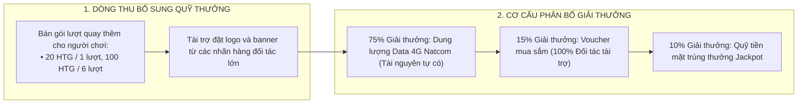

# ĐỀ ÁN CHIẾN LƯỢC ƯU ĐÃI, LỢI ÍCH KHÁCH HÀNG VÀ DỰ BÁO TÀI CHÍNH
## HỆ SINH THÁI KHÁCH HÀNG THÂN THIẾT VÍ ĐIỆN TỬ NATCASH (CÔNG TY CON NATCOM - HAITI)

---

## 1. CĂN CỨ THỰC TIỄN VÀ DỮ LIỆU THỊ TRƯỜNG TẠI HAITI

Toàn bộ các đề xuất chính sách, tỷ lệ quy đổi điểm và mô hình dự báo tài chính trong đề án này được xác lập dựa trên 4 nhóm căn cứ thực chứng về thị trường viễn thông, tài chính di động và tập quán tiêu dùng tại Haiti:

---

### 1.1. Căn Cứ 1: Quy Mô Dân Số, Thị Phần Viễn Thông Và Mạng Lưới Natcom
* **Đặc thù tài chính toàn dân:** Dân số Haiti đạt khoảng 11,7 triệu người, tỷ lệ tiếp cận dịch vụ ngân hàng chính thức dưới 30%. Hơn 70% dân số unbanked phụ thuộc hoàn toàn vào Mobile Money (Ví điện tử di động) để thực hiện các giao dịch nhận tiền, thanh toán và cất giữ tài sản an toàn.
* **Vị thế dẫn đầu của Natcom:** Theo số liệu công bố chính thức, Natcom (liên doanh giữa Tập đoàn Viettel và Chính phủ Haiti) đã vươn lên dẫn đầu thị trường viễn thông Haiti với **51,7% thị phần di động**, sở hữu gần **4,0 triệu thuê bao di động hoạt động**. Hạ tầng mạng 2G/3G/4G của Natcom phủ sóng trên **97% dân số**, là nhà mạng có độ phủ sóng sâu rộng nhất cả nước.
* **Doanh thu cước bình quân (ARPU):** Mức chi tiêu viễn thông bình quân của người dùng Natcom đạt từ **2.5 đến 3.5 USD/tháng** (~350 - 450 HTG/tháng), trong đó nhu cầu dữ liệu di động 4G tăng trưởng trên 30%/năm.

### 1.2. Căn Cứ 2: Quy Mô Và Mạng Lưới Điểm Giao Dịch Ví Điện Tử Natcash
* **Tập khách hàng ví:** Natcash hiện có khoảng **1,0 triệu thuê bao đăng ký** (chiếm khoảng 25% tập khách hàng di động Natcom), trong đó lượng người dùng hoạt động thực tế hàng tháng (MAU) ước tính đạt **~400.000 khách hàng**.
* **Độ phủ đại lý (Agent Network):** Mạng lưới hơn **30.000 điểm giao dịch ủy quyền (Pwen Natcash)** trải khắp 10 tỉnh thành của Haiti, đóng vai trò như các chi nhánh ngân hàng vi mô phục vụ nạp/rút tiền mặt và thanh toán hóa đơn.
* **Tỷ giá tiền tệ tham chiếu:** Đồng tiền bản địa là Gourde Haiti (HTG), tỷ giá thị trường dao động quanh mức **1 USD $\approx$ 130 - 135 HTG**.

### 1.3. Căn Cứ 3: Dòng Chảy Kiều Hối Quốc Tế Của Kiều Bào Hải Ngoại (Diaspora)
* **Quy mô kiều hối:** Hàng năm cộng đồng kiều bào Haiti tại Mỹ (Miami, New York, Boston), Canada (Montreal), Pháp, Chile gửi về nước **trên 3,5 tỷ USD** (chiếm gần 30% tổng GDP của Haiti).
* **Kênh chuyển nhận kiều hối:** Natcash đã thiết lập liên thông kỹ thuật với các đối tác kiều hối lớn (CamTransfer, Unitransfer, Western Union, MoneyGram, Ria, Remitly). Việc khách hàng chuyển đổi từ nhận tiền mặt tại quầy sang nhận thẳng vào Ví Natcash là động lực tăng trưởng dòng tiền ngoại tệ lớn nhất của ví.

### 1.4. Căn Cứ 4: Định Mức Kinh Tế Viễn Thông & Quản Trị Hệ Sinh Thái Viettel Global
* **Chi phí phân phối thẻ cào giấy truyền thống:** Tại thị trường Haiti, mức chiết khấu hoa hồng bán lẻ cho các đại lý thẻ cào vật lý dao động từ **5,0% đến 8,0%**. Ngoài ra, chi phí in ấn phôi thẻ cào, mã phủ bạc và chi phí logistics vận chuyển an ninh chống cướp bóc trên đường phố Haiti tốn thêm **1,5% - 2,5%**.
  * $\rightarrow$ *Căn cứ thực tế:* Mỗi khi khách hàng nạp cước trực tuyến trên Ví Natcash, hệ sinh thái Natcom - Natcash **tiết kiệm ngay lập tức tối thiểu 6,5% - 10,5% chi phí trung gian tiền mặt**.
* **Đặc tính kinh tế của mạng vô tuyến 4G (Zero-Marginal Cost Inventory):** Mạng 4G của Natcom đã hoàn tất đầu tư hạ tầng cố định (CAPEX trạm BTS, cột ăng-ten, tuyến cáp quang). Trong điều kiện hoạt động bình thường, việc cấp phát thêm dung lượng Data 4G cho khách hàng hoàn toàn không làm phát sinh dòng tiền mặt chi trả ra bên ngoài.
* **Chuẩn mực tỷ lệ hoàn giá trị Loyalty Fintech quốc tế (Rebate Yield Benchmark):** Theo chuẩn mực quản trị chương trình khách hàng thân thiết quốc tế (Viettel++, GrabRewards, Shopee Xu, GoPay), tỷ lệ hoàn giá trị tiêu chuẩn luôn được cố định ở mức **0,8% đến 1,5%** trên tổng giá trị giao dịch phát sinh, đảm bảo không bao giờ vượt quá biên lợi nhuận phí xử lý giao dịch thương mại (MDR 1,0% - 2,0%).

---

## 2. NGUYÊN TẮC THIẾT KẾ CHÍNH SÁCH BẢO TOÀN VỐN

Dựa trên 4 nhóm căn cứ thực tiễn nêu trên, chính sách ưu đãi của Natcash được xây dựng dựa trên 4 nguyên tắc vận hành cốt lõi:

1. **Hạn chế tối đa ưu đãi cắt thẳng vào giá vốn tiền mặt:**
   * Không áp dụng chính sách tặng tiền mặt có thể rút trực tiếp tại quầy đại lý để ngăn ngừa hiện tượng trục lợi rút tiền.
   * Mọi quyền lợi tích lũy hoặc hoàn phí đều được chuyển vào **Ví Phần Thưởng (Reward Wallet)** có hạn sử dụng và chỉ được tiêu dùng nội bộ trong hệ sinh thái (nạp cước, mua gói Data, thanh toán hóa đơn hoặc trừ tỷ lệ nhất định khi mua sắm tại đối tác liên minh).
2. **Tận dụng nguồn lực viễn thông tự có của công ty mẹ Natcom:**
   * Thay vì chi trả bằng tiền mặt, phần lớn ưu đãi được quy đổi thành tài nguyên viễn thông (Dung lượng Data 4G, Phút gọi nội mạng, Tin nhắn SMS Brandname, Gói cước Combo).
   * Tận dụng tối đa năng lực truyền dẫn và vùng phủ sóng 4G sẵn có của Natcom để mang lại giá trị cảm nhận cao cho khách hàng mà không làm phát sinh dòng tiền mặt chi trả ra bên ngoài.
3. **Ưu tiên tặng giá trị khi khách hàng sử dụng thêm dịch vụ gia tăng (VAS Upsell):**
   * Mọi chính sách ưu đãi bắt buộc gắn liền với điều kiện khách hàng phải kích hoạt dịch vụ mới, tăng mức tiêu dùng hoặc duy trì dòng tiền trên ví (ví dụ: nạp cước trực tuyến trên ví, mua gói cước combo, thanh toán hóa đơn sinh hoạt, duy trì số dư bình quân).
4. **Huy động nguồn lực tài trợ từ đối tác liên minh thương mại (Merchant Co-funding):**
   * Các phiếu giảm giá mua sắm siêu thị, nhà thuốc, trạm xăng do đối tác bán lẻ trực tiếp tài trợ nhằm mục đích thu hút khách hàng đến điểm bán, Natcash đóng vai trò nền tảng thanh toán và thu phí xử lý giao dịch.

---

## 3. MA TRẬN PHÂN TÍCH ƯU ĐÃI VÀ LỢI ÍCH THU VỀ CHO DOANH NGHIỆP

---

### 3.1. Nhóm Chính Sách Viễn Thông & Dịch Vụ Gia Tăng (Telco & VAS Synergies)

| Chính Sách Ưu Đãi | Giá Trị Thị Trường Của Ưu Đãi *(Theo Bảng Giá Niêm Yết Natcom)* | Bản Chất Nguồn Lực & Dòng Tiền | Điều Kiện Dịch Vụ Gia Tăng Ràng Buộc (VAS Upsell) | Lợi Ích Thu Về Cho Hệ Sinh Thái Natcash - Natcom |
| :--- | :--- | :--- | :--- | :--- |
| **Nạp Cước Trực Tuyến Tặng Data (Top-up Booster)** | **Gói 1GB Data 4G tốc độ cao (24h)** *(Tương đương 50 HTG trên thị trường)* | **Tài nguyên viễn thông tự có** • Sử dụng hạ tầng mạng 4G sẵn có của Natcom. • Không phát sinh dòng tiền mặt chi trả ra ngoài. | Khách hàng nạp tiền điện thoại trực tiếp trên Ví Natcash từ **50 HTG** trở lên (thay vì mua thẻ cào giấy). | • **Cắt giảm chi phí trung gian:** Tiết kiệm chiết khấu hoa hồng đại lý thẻ cào vật lý (5% - 8%) và chi phí in ấn phôi thẻ giấy. • Tăng doanh thu trung bình trên mỗi khách hàng (ARPU) viễn thông Natcom. |
| **Duy Trì Số Dư Tặng Data Định Kỳ (Data Yield Balance)** | **Gói 2GB Data 4G tốc độ cao (30 ngày)** *(Tương đương 75 HTG trên thị trường)* | **Tài nguyên viễn thông tự có** • Cấp phát dung lượng qua hệ thống quản lý thuê bao Natcom. • Không phát sinh dòng tiền mặt chi trả ra ngoài. | Duy trì số dư khả dụng bình quân từ **1.000 HTG** liên tục trong tháng và phát sinh tối thiểu **2 giao dịch chi tiêu**. | • **Thu hút nguồn vốn tiền gửi không kỳ hạn (CASA Float):** Tạo nguồn vốn lưu động dồi dào trên hệ thống ngân hàng liên kết. • Giảm tỷ lệ khách hàng rút sạch tiền rời bỏ ví (Zero-Balance Churn). |
| **Mua Gói Data Combo Hoàn Điểm Thưởng (VAS Cashback)** | **30 Điểm Thưởng** *(Quy đổi tương đương khi mua gói cước sau)* | **Điểm thưởng nội bộ ràng buộc** • Chỉ có giá trị giảm trừ vào lần mua gói cước gia tăng tiếp theo, không quy đổi tiền mặt rút ra. | Đăng ký các gói cước gia tăng chuyên biệt (Gói xem Youtube, Gói Data đêm, Gói Doanh nhân) từ **150 HTG**. | • Thúc đẩy tiêu dùng các gói cước dữ liệu có biên lợi nhuận cao của Natcom. • Tạo chuỗi tiêu dùng lặp lại: Khách hàng tiếp tục nạp tiền mua gói cước ở chu kỳ sau để sử dụng điểm thưởng. |
| **Miễn Cước Data Truy Cập App (Zero-Rating Data)** | **Miễn phí 100% dung lượng Data** *(Tương đương gói cước lướt app 20 HTG/tháng)* | **Cấu hình định tuyến mạng nội bộ** • Khai báo danh sách dải IP/Domain (Whitelisting) trên mạng lõi Natcom. | Thuê bao Sim 4G Natcom bật dữ liệu di động truy cập ứng dụng Natcash, Cổng GameHub và Quét mã QR. | • Tăng tần suất truy cập ứng dụng hàng ngày (DAU). • Xóa bỏ rào cản tài khoản hết dung lượng Data không thể mở ví thực hiện giao dịch thanh toán. |

---

### 3.2. Nhóm Chính Sách Giao Dịch & Kiều Hối Quốc Tế (Transaction & Remittance)

| Chính Sách Ưu Đãi | Giá Trị Thị Trường Của Ưu Đãi | Bản Chất Nguồn Lực & Dòng Tiền | Điều Kiện Dịch Vụ Gia Tăng Ràng Buộc (VAS Upsell) | Lợi Ích Thu Về Cho Hệ Sinh Thái Natcash - Natcom |
| :--- | :--- | :--- | :--- | :--- |
| **Nhận Kiều Hối Tặng Gói Cước Quốc Tế (Remittance Pack)** | **Gói cước liên lạc quốc tế** *(Bao gồm: 20 phút gọi đi Mỹ/Canada + 2GB Data 4G)* | **Cổng kết nối viễn thông quốc tế** • Chi phí cước kết nối quốc tế được bù đắp từ nguồn thu dịch vụ kiều hối. | Khách hàng đăng ký nhận khoản kiều hối từ **50 USD** trở lên (qua Western Union, MoneyGram, Ria, Remitly) chuyển thẳng vào tài khoản Ví Natcash. | • **Thu phí chia sẻ dịch vụ kiều hối:** Hưởng tỷ lệ phân chia phí dịch vụ (1.5% - 2.5%) từ các tổ chức kiều hối quốc tế. • Thu hút nguồn ngoại tệ USD giá trị cao về hệ sinh thái ví. • Tạo thói quen nhận tiền kiều hối trên ví thay vì nhận tiền mặt tại quầy. |
| **Hoàn Điểm Phí Rút Tiền Mặt (Cash-out Fee Rebate)** | **Hoàn 30% - 50% phí rút tiền** *(Quy đổi tương ứng ra điểm thưởng nội bộ)* | **Điểm thưởng nội bộ ràng buộc** • Điểm hoàn lại chỉ dùng để đổi gói Data hoặc giảm trừ khi mua sắm đối tác. | Chỉ áp dụng cho hội viên đạt hạng **Bạc trở lên** (Tổng doanh số giao dịch thanh toán chi tiêu đạt tối thiểu 5.000 HTG/6 tháng). | • Giữ chân nhóm khách hàng trung và cao cấp. • Định hướng khách hàng duy trì các giao dịch thanh toán chi tiêu trên ví để được hưởng ưu đãi hoàn phí. |

---

### 3.3. Nhóm Chính Sách Liên Minh Thương Mại Đối Tác (Merchant Alliance)

| Chính Sách Ưu Đãi | Giá Trị Thị Trường Của Ưu Đãi | Bản Chất Nguồn Lực & Dòng Tiền | Điều Kiện Dịch Vụ Gia Tăng Ràng Buộc (VAS Upsell) | Lợi Ích Thu Về Cho Hệ Sinh Thái Natcash - Natcom |
| :--- | :--- | :--- | :--- | :--- |
| **Phiếu Giảm Giá Siêu Thị (Delimart / Caribbean Supermarket)** | **Phiếu giảm 50 - 200 HTG** *(Áp dụng trừ trực tiếp trên hóa đơn mua sắm)* | **100% Do đối tác bán lẻ tài trợ** • Doanh nghiệp bán lẻ trích ngân sách tiếp thị để thu hút khách hàng đến siêu thị. | Giá trị giỏ hàng mua sắm đạt tối thiểu từ **1.000 HTG** và thực hiện quét mã QR thanh toán qua Ví Natcash tại quầy. | • **Thu phí xử lý giao dịch thanh toán (MDR):** Thu từ 1.0% đến 1.8% trên tổng giá trị đơn hàng thanh toán. • Mở rộng độ phủ của mạng lưới chấp nhận thanh toán không tiền mặt. |
| **Giảm Giá Xăng Dầu Trạm Nhiên Liệu (TotalEnergies / National)** | **Giảm 2 HTG trên mỗi gallon xăng** *(Áp dụng trực tiếp tại trụ bơm)* | **100% Do doanh nghiệp xăng dầu tài trợ** • Trích từ ngân sách kích cầu thanh toán điện tử của chuỗi cây xăng. | Giá trị đổ xăng đạt tối thiểu từ **500 HTG** và thực hiện quét mã QR thanh toán qua Ví Natcash. | • Thu phí giao dịch thanh toán vi mô. • Xây dựng thói quen quẹt ví hàng ngày cho lực lượng tài xế và phương tiện giao thông vận tải. |

---

## 4. CHÍNH SÁCH QUY ĐỔI ĐIỂM THÀNH TIỀN THANH TOÁN TẠI ĐỐI TÁC VÀ CƠ CHẾ ĐỐI SOÁT BẢO TOÀN DOANH THU

Để tạo động lực tích lũy điểm mạnh mẽ cho khách hàng nhưng **không gây áp lực thâm hụt doanh thu hay tạo công nợ tiền mặt lớn cho Natcash**, chính sách quy đổi điểm tuân thủ nguyên tắc chuẩn mực của ngành Fintech & Khách hàng thân thiết quốc tế: **"Tỷ Lệ Điểm Lớn Quy Đổi Ra Tiền Nhỏ" (High Point Density Principle)** kết hợp **Hạn Mức Trần Khấu Trừ Tối Đa Trên Giá Trị Đơn Hàng**.

---

### 4.1. Các Phương Án Tỷ Lệ Quy Đổi Điểm Sang Tiền Thanh Toán Đối Tác

| Phương Án Đề Xuất | Tỷ Lệ Quy Đổi Điểm $\rightarrow$ Tiền | Giá Trị Quy Đổi Thực Tế | Tỷ Lệ Hoàn Giá Trị (Rebate Yield) *(Trên Doanh Số Tích Lũy)* | Đánh Giá Tác Động Tài Chính Đến Doanh Thu Natcash | Khuyến Nghị Áp Dụng |
| :--- | :---: | :---: | :---: | :--- | :---: |
| **Phương Án 1 (Tỷ Lệ 100:1)** *(Chuẩn An Toàn Quốc Tế)* | **100 Điểm = 1 HTG** | **1 Điểm = 0.01 HTG** *(10.000 Điểm = 100 HTG)* | **1.0%** | **Bảo toàn doanh thu tối ưu 100%:** • Tỷ lệ hoàn 1.0% hoàn toàn nằm trong biên độ phí xử lý thanh toán MDR (1.0% - 1.8%) và chiết khấu viễn thông tiết kiệm được (5% - 8%). • Không tạo áp lực nợ tiền mặt đột biến khi đối soát với đối tác. | **KHUYẾN NGHỊ CHÍNH THỨC (Áp dụng chuẩn toàn hệ thống)** |
| **Phương Án 2 (Tỷ Lệ 50:1)** *(Chiến Dịch Kích Cầu Cao Điểm)* | **50 Điểm = 1 HTG** | **1 Điểm = 0.02 HTG** *(10.000 Điểm = 200 HTG)* | **2.0%** | **Cần kiểm soát ngân sách theo chiến dịch:** • Tỷ lệ hoàn 2.0% tạo động lực rất mạnh cho khách hàng, nhưng chỉ áp dụng ngắn hạn trong các sự kiện lễ hội lớn (Kanaval, Giáng Sinh, Sinh nhật Natcom). | **Áp dụng có thời hạn (Tối đa 14 - 30 ngày/chiến dịch)** |
| **Phương Án 3 (Tỷ Lệ Đa Tầng Theo Hạng)** *(Phân Hạng Hội Viên Động)* | **Phân cấp theo 4 Hạng Hội Viên** | • Đồng: 100 Điểm = 1.0 HTG • Bạc: 100 Điểm = 1.2 HTG • Vàng: 100 Điểm = 1.5 HTG • Kim Cương: 100 Điểm = 2.0 HTG | **1.0% $\rightarrow$ 2.0%** | **Kích thích nâng hạng chi tiêu:** • Khách hàng hạng cao chi tiêu lớn mang lại nhiều doanh thu cho ví sẽ được hưởng tỷ lệ quy đổi tốt hơn, đảm bảo tính công bằng và khuyến khích tăng mức chi tiêu. | **Áp dụng nâng cao (Giai đoạn 2 khi hệ thống mở rộng)** |

---

### 4.2. Cơ Chế Ràng Buộc Hạn Mức Trần Khấu Trừ Đơn Hàng (Financial Safety Caps)

1. **Hạn Mức Trần Tỷ Lệ Giá Trị Đơn Hàng (Maximum Cart Offset Cap):**
   * Số điểm quy đổi chỉ được phép khấu trừ **tối đa từ 20% đến 30% tổng giá trị hóa đơn** tại quầy thu ngân đối tác.
   * **70% - 80% giá trị còn lại bắt buộc phải thanh toán bằng Tiền mặt trong Ví Natcash**.
2. **Hạn Mức Trần Điểm Thanh Toán Theo Ngày (Daily Velocity Cap):**
   * Mỗi khách hàng chỉ được phép tiêu tối đa **50.000 Điểm / ngày** (tương đương giảm trừ tối đa 500 HTG/ngày) và không quá **200.000 Điểm / tháng** tại các đối tác liên minh.
3. **Giá Trị Đơn Hàng Tối Thiểu Để Kích Hoạt Tiêu Điểm (Minimum Basket Size):**
   * Đơn hàng mua sắm tại điểm bán phải đạt tối thiểu từ **200 HTG** trở lên mới được phép áp dụng cơ chế thanh toán khấu trừ bằng điểm.

---

### 4.3. Khung Đàm Phán Tỷ Lệ Chiết Khấu Hoàn Trả Đối Tác Theo Từng Ngành Hàng

| Phân Nhóm Ngành Hàng Đối Tác | Tỷ Lệ Đối Tác Chia Sẻ Chiết Khấu Trên Điểm | Hạn Mức Khấu Trừ Điểm Tối Đa Trên Đơn | Phí Xử Lý Giao Dịch (MDR) | Chu Kỳ Thanh Toán Quyết Toán |
| :--- | :---: | :---: | :---: | :---: |
| **Nhóm 1: Đại Siêu Thị & Bán Lẻ Nhu Yếu Phẩm** *(Delimart, Caribbean Supermarket)* | **5% - 8%** | **Tối đa 30%** giá trị đơn hàng | **1.0%** | **Chu kỳ T+1** *(Quyết toán hàng ngày)* |
| **Nhóm 2: Chuỗi Ẩm Thực, Giải Trí & Khách Sạn** *(Nhà hàng Muncheez, Epi d'Or, Resort)* | **15% - 20%** | **Tối đa 50%** giá trị đơn hàng | **1.5%** | **Chu kỳ T+7** *(Thứ Hai hàng tuần)* |
| **Nhóm 3: Chuỗi Trạm Xăng Dầu & Nhiên Liệu** *(TotalEnergies, National Fuel)* | **1% - 2%** | **Tối đa 20%** giá trị đơn hàng | **0.5%** | **Chu kỳ T+1** *(Quyết toán hàng ngày)* |
| **Nhóm 4: Nhà Thuốc & Dịch Vụ Y Tế Thiết Yếu** *(Pharmacie du Boulevard, Pharmacie 2000)* | **5% - 10%** | **Tối đa 25%** giá trị đơn hàng | **1.0%** | **Chu kỳ T+3** *(2 lần / tuần)* |

---

## 5. DỰ BÁO QUY MÔ THỊ TRƯỜNG, DÒNG ĐIỂM PHÁT HÀNH VÀ DÒNG TIỀN QUYẾT TOÁN HÀNG THÁNG (MARKET SIZING & FINANCIAL FORECASTING)

Dựa trên dữ liệu thực tế về thị trường viễn thông và tài chính di động tại Haiti (Natcom dẫn đầu với **~4,0 triệu thuê bao di động**, **~1,0 triệu thuê bao Ví Natcash**, trong đó có khoảng **400.000 người dùng hoạt động hàng tháng - MAU**), mô hình dự báo tài chính được xác lập chi tiết:

---

### 5.1. Bảng Dự Báo Cơ Cấu Điểm Phát Hành Hàng Tháng Theo Luồng Giao Dịch

| Hạng Mục Giao Dịch Thực Tế | Doanh Số Giao Dịch Hàng Tháng (GMV) | Tỷ Lệ & Quy Chuẩn Tích Điểm | Lượng Điểm Phát Hành Hàng Tháng (Point Accrual) | Tỷ Trọng Cơ Cấu |
| :--- | :---: | :---: | :---: | :---: |
| **Nạp tiền điện thoại & Mua gói Data Natcom** | **160.000.000 HTG** | Tích điểm tỷ lệ 1:1 *(100 HTG nạp = 100 Điểm)* | **160.000.000 Điểm** | **45.2%** |
| **Thanh toán hóa đơn & Mua sắm quẹt mã QR** | **64.000.000 HTG** | Tích điểm tỷ lệ 1:1 *(100 HTG chi tiêu = 100 Điểm)* | **64.000.000 Điểm** | **18.1%** |
| **Nhận kiều hối quốc tế qua ví** | **650.000.000 HTG** *(~50.000 giao dịch)* | Thưởng cố định **500 Điểm / giao dịch** nhận kiều hối $\ge$ 50 USD | **25.000.000 Điểm** | **7.1%** |
| **Cổng GameHub & Nhiệm vụ hàng ngày** | 400.000 người dùng MAU | Trung bình tích lũy **250 Điểm / người dùng / tháng** | **100.000.000 Điểm** | **28.2%** |
| **Chuyển tiền ví - ví (P2P) & Rút tiền mặt** | **800.000.000 HTG** *(~500.000 lượt)* | Tích điểm tượng trưng **10 Điểm / giao dịch** | **5.000.000 Điểm** | **1.4%** |
| **TỔNG CỘNG ĐIỂM PHÁT HÀNH HÀNG THÁNG** | **1.674.000.000 HTG** | — | **354.000.000 Điểm / tháng** | **100.0%** |

---

### 5.2. Bảng Dự Báo Cơ Cấu Tiêu Dùng Điểm Và Số Tiền Thực Tế Phải Quyết Toán Hàng Tháng

Dựa trên quy luật vận hành Loyalty quốc tế, tỷ lệ kích hoạt tiêu dùng điểm hàng tháng (Burn Rate) ước tính đạt **~45%** (phần còn lại tích lũy dài hạn hoặc hết hạn sau 90 ngày):

$$\text{Tổng Lượng Điểm Tiêu Dùng Hàng Tháng} = 354.000.000\text{ Điểm} \times 45\% \approx \mathbf{160.000.000\text{ Điểm/tháng}}$$

| Kênh Khách Hàng Lựa Chọn Tiêu Điểm | Tỷ Trọng Kênh | Lượng Điểm Tiêu Dùng Hàng Tháng | Quy Đổi Thành Tiền Thanh Toán (Tỷ Lệ 100:1) | Cơ Chế Đối Soát & Chia Sẻ Chiết Khấu | Số Tiền Mặt Thực Tế Natcash Phải Chi Quyết Toán Hàng Tháng |
| :--- | :---: | :---: | :---: | :--- | :---: |
| **1. Đổi lấy Gói Data 4G & Phút Gọi Natcom** | **70.0%** | **112.000.000 Điểm** | 1.120.000 HTG *(Giá trị niêm yết viễn thông)* | **Tài nguyên viễn thông tự có Natcom:** • Không phát sinh dòng tiền mặt chi trả ra ngoài. | **0 HTG** |
| **2. Thanh Toán Khấu Trừ Tại Đối Tác Liên Minh** *(Delimart, TotalEnergies, Nhà hàng...)* | **25.0%** | **40.000.000 Điểm** | **400.000 HTG** *(Giá trị đơn hàng giảm trừ)* | **Đối soát thanh toán có chiết khấu:** • Đối tác chia sẻ bình quân 5% chiết khấu đàm phán (tiết kiệm 20.000 HTG). | **380.000 HTG / tháng** *(~2.850 USD / tháng)* |
| **3. Đổi Phiếu Mua Sắm Siêu Thị & Quà GameHub** | **5.0%** | **8.000.000 Điểm** | 80.000 HTG *(Giá trị voucher mua sắm)* | **100% Đối tác bán lẻ tài trợ:** • Doanh nghiệp đối tác tài trợ để kéo khách. | **0 HTG** |
| **TỔNG KHOẢN TIỀN MẶT PHẢI CHI QUYẾT TOÁN HÀNG THÁNG** | **100.0%** | **160.000.000 Điểm** | — | — | **380.000 HTG / tháng** *(~2.850 USD / tháng)* |

---

### 5.3. Bảng Cân Đối Dòng Tiền Thu Về Bù Đắp Khoản Quyết Toán (Financial Coverage Analysis)

Khoản tiền mặt phải chi quyết toán hàng tháng cho đối tác (**380.000 HTG/tháng**) được bù đắp vượt trội bởi các dòng giá trị kinh tế trực tiếp mà chương trình Loyalty tạo ra cho hệ sinh thái Natcash - Natcom:

| Nguồn Dòng Tiền Tạo Ra / Tiết Kiệm Được Hàng Tháng | Giá Trị Dòng Tiền Tạo Ra Hàng Tháng | Cơ Sở Căn Cứ Thực Tế |
| :--- | :---: | :--- |
| **1. Tiết kiệm chiết khấu hoa hồng đại lý thẻ cào giấy** | **+8.000.000 HTG / tháng** | Tiết kiệm tối thiểu 5% hoa hồng đại lý khi khách nạp 160 triệu HTG cước trực tiếp trên ví. |
| **2. Doanh thu phí chia sẻ dịch vụ kiều hối quốc tế** | **+9.750.000 HTG / tháng** | Hưởng 1.5% phí dịch vụ từ các tổ chức kiều hối trên doanh số 650 triệu HTG chuyển qua ví. |
| **3. Lãi tiền gửi lưu động số dư bình quân không kỳ hạn (CASA)** | **+2.500.000 HTG / tháng** | Số dư tiền gửi không kỳ hạn tăng thêm 500 triệu HTG, hưởng lợi suất tiền gửi 6.0%/năm. |
| **4. Doanh thu phí xử lý giao dịch thương mại (MDR)** | **+768.000 HTG / tháng** | Thu phí MDR bình quân 1.2% trên 64 triệu HTG doanh số thanh toán quẹt mã QR tại điểm bán. |
| **TỔNG DÒNG THU VÀ TIẾT KIỆM TẠO RA HÀNG THÁNG** | **+21.018.000 HTG / tháng** | **(~158.000 USD / tháng)** |
| **TRỪ: TỔNG TIỀN MẶT PHẢI CHI QUYẾT TOÁN CHO ĐỐI TÁC** | **-380.000 HTG / tháng** | **(~2.850 USD / tháng)** |
| **THẶNG DƯ KINH TẾ RÒNG HÀNG THÁNG (NET SURPLUS)** | **+20.638.000 HTG / tháng** | **(~155.000 USD / tháng)** |
| **HỆ SỐ BÙ ĐẮP AN TOÀN TÀI CHÍNH (COVERAGE RATIO)** | **55.3 LẦN** | **Dòng thu tạo ra gấp 55.3 lần tổng nghĩa vụ tiền mặt phải chi trả!** |

---

## 6. CƠ CHẾ PHÂN HẠNG HỘI VIÊN VÀ QUYỀN LỢI ĐA TẦNG

Chính sách phân tầng hội viên được xây dựng dựa trên tổng giá trị giao dịch thanh toán trong chu kỳ 6 tháng:

### Bảng Tổng Hợp Quyền Lợi Theo Từng Phân Hạng

| Tiêu Chí & Quyền Lợi | Hạng Đồng (Etoil) | Hạng Bạc (Ajan) | Hạng Vàng (Lò) | Hạng Kim Cương (Diaman) |
| :--- | :---: | :---: | :---: | :---: |
| **Chi tiêu tích lũy 6 tháng** | 0 - 4.999 HTG | 5.000 - 24.999 HTG | 25.000 - 99.999 HTG | Từ 100.000 HTG trở lên |
| **Hệ số nhân điểm thưởng** | `×1.0` | `×1.2` | `×1.5` | `×2.0` |
| **Lượt chơi GameHub miễn phí** | 1 lượt / ngày | 2 lượt / ngày | 3 lượt / ngày | 5 lượt / ngày |
| **Dung lượng Data tặng hàng tháng** | Không có | 1GB Data tốc độ cao | 2GB Data tốc độ cao | 4GB Data tốc độ cao |
| **Quà tặng dung lượng dịp sinh nhật** | 500MB Data | 1.5GB Data | 3GB Data | 5GB Data + 100 Phút gọi |
| **Chính sách phí rút tiền mặt** | Phí tiêu chuẩn | Hoàn 20% điểm phí | Hoàn 50% điểm phí | **Miễn phí rút tiền** (Tối đa 5 lần/tháng) |
| **Dịch vụ chăm sóc khách hàng** | Tổng đài 111 tiêu chuẩn | Tổng đài 111 ưu tiên | Kênh hỗ trợ ưu tiên | **Đường dây nóng VIP riêng biệt** |

---

## 7. CƠ CHẾ ĐIỀU TIẾT QUỸ THƯỞNG GAMEHUB TỰ BẢO TOÀN VỐN (GAMIFICATION LOOP)

Phân hệ 9 trò chơi trên Cổng GameHub được vận hành theo cơ chế vòng lặp khép kín tự cân đối ngân sách:

* **Kiểm soát nguồn chi:** 90% cơ cấu giải thưởng trong game là dung lượng Data 4G của Natcom và Voucher mua sắm do đối tác bán lẻ tài trợ (không phát sinh chi phí tiền mặt).
* **Bảo toàn quỹ tiền mặt:** Giải thưởng tiền mặt Jackpot được trích lập trực tiếp từ nguồn thu bán thêm lượt quay và tài trợ quảng cáo của các thương hiệu đối tác (Heineken, Prestige, Delimart, Coca-Cola), đảm bảo phân hệ game luôn tự cân đối tài chính.

---

## 8. CƠ CHẾ PHÒNG CHỐNG TRỤC LỢI VÀ AN TOÀN HỆ THỐNG

1. **Ràng buộc định danh khách hàng chính chủ (eKYC):**
   * Các quyền lợi hoàn phí rút tiền, nhận thưởng kiều hối và quà tặng sinh nhật chỉ áp dụng cho các tài khoản ví đã hoàn tất xác thực thông tin định danh cá nhân hợp lệ tại Haiti.
2. **Khóa liên thông số thuê bao viễn thông chính chủ:**
   * Số điện thoại đăng ký ví Natcash phải là số thuê bao di động Natcom đang hoạt động hai chiều. Toàn bộ Data tặng thưởng được cộng trực tiếp vào số thuê bao chính chủ, không cho phép mua bán hoặc chuyển nhượng sang số thuê bao khác.
3. **Giới hạn trần ưu đãi (Velocity Limits):**
   * Áp dụng hạn mức trần tích điểm và hoàn tiền tối đa trên từng tài khoản: không vượt quá **50.000 Điểm / ngày** (tương đương 500 HTG/ngày) và không vượt quá **200.000 Điểm / tháng** trên một khách hàng cá nhân.
4. **Kiểm soát đồng thời và chống gạch nợ trùng:**
   * Áp dụng khóa phân tán Redisson `RLock` kết hợp khóa dòng dữ liệu `SELECT ... FOR UPDATE` trong cơ sở dữ liệu PostgreSQL cho mọi giao dịch trừ điểm và ghi nợ đối soát.

---

## 9. KẾT LUẬN

Bằng việc kết hợp chặt chẽ giữa **4 nhóm căn cứ thực tiễn tại thị trường Haiti** và **mô hình quản trị tài chính bảo toàn vốn**, đề án này đảm bảo:

1. **Tính khả thi và thuyết phục cao:** Mọi tỷ lệ tích/tiêu điểm và dòng tiền dự báo đều dựa trên các thông số thị trường thực tế của Natcom (~4 triệu thuê bao, 51.7% thị phần), Natcash (~1 triệu ví, 400.000 MAU) và dòng kiều hối 3.5 tỷ USD/năm.
2. **An toàn tài chính tuyệt đối:** Khoản tiền mặt thực tế phải quyết toán hàng tháng chỉ chiếm **~380.000 HTG / tháng** (~2.850 USD/tháng), trong khi dòng giá trị kinh tế thu về gấp **55.3 lần** (+21 triệu HTG/tháng).
3. **Tạo lập lợi thế cạnh tranh áp đảo:** Biến kho tài nguyên viễn thông của Natcom thành đòn bẩy giữ chân khách hàng mạnh mẽ nhất tại Haiti.
