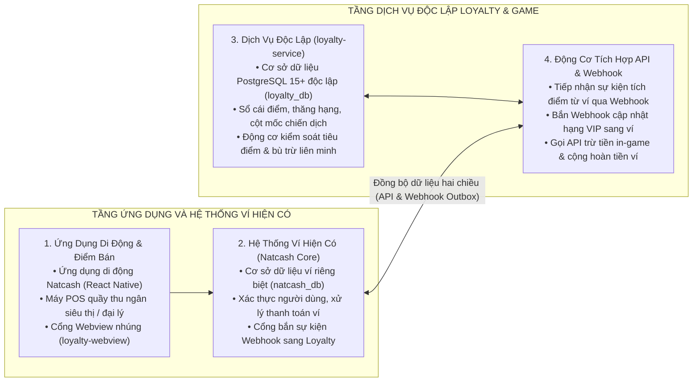
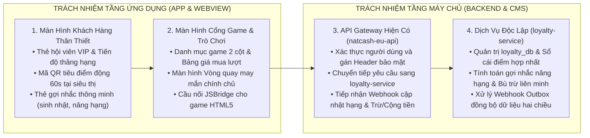
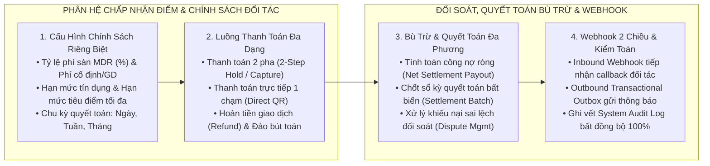
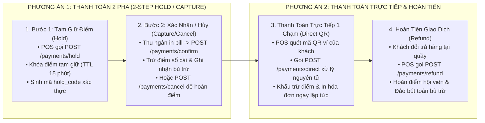
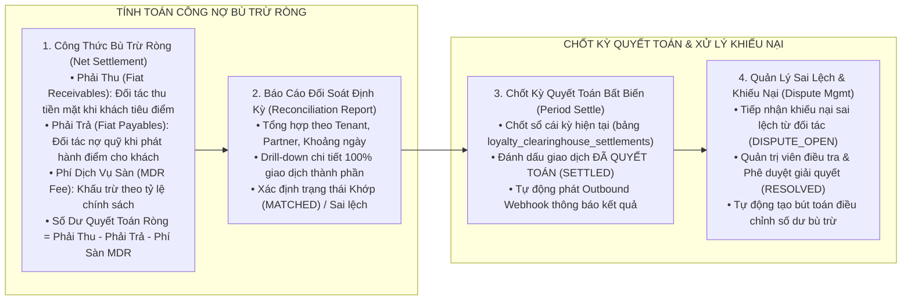
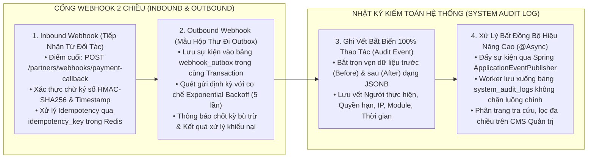
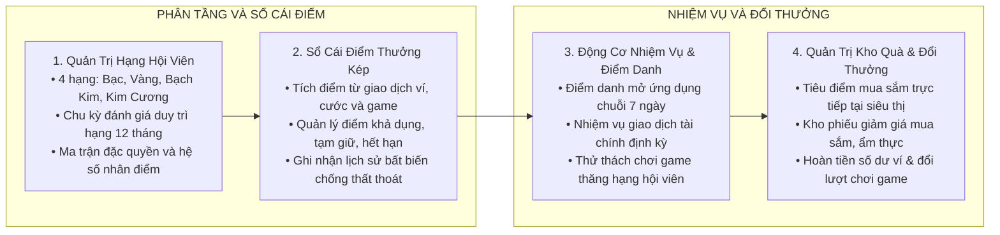
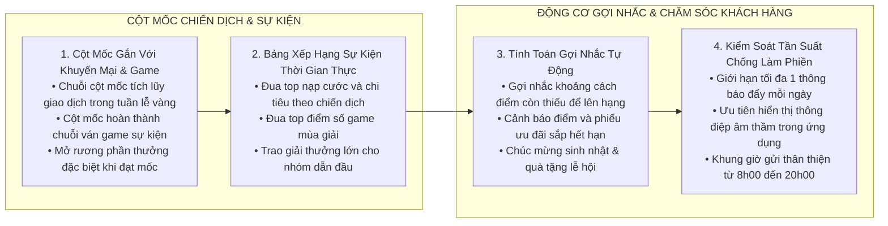
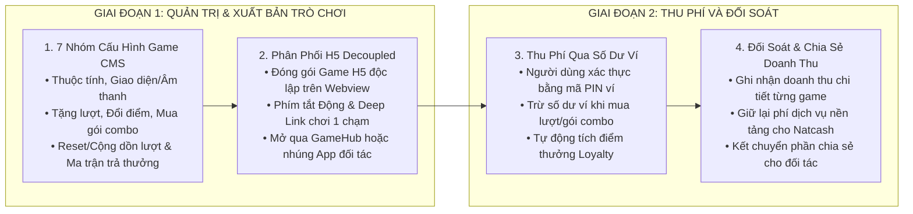

# TÀI LIỆU GIẢI PHÁP, NGHIỆP VỤ VÀ THIẾT KẾ TỔNG THỂ
## Nền Tảng Khách Hàng Thân Thiết Liên Minh và Cổng Game Đa Thuê Bao

> **Đơn vị xây dựng:** Nhóm Kiến trúc và Giải pháp Số — Natcash  
> **Loại tài liệu:** Tài liệu Giải pháp và Thiết kế Kiến trúc Tổng thể  
> **Định vị chiến lược:** Hệ thống Khách hàng thân thiết là giải pháp nền tảng liên minh đa đối tác bao trùm toàn bộ dịch vụ ví điện tử Natcash, mạng viễn thông Natcom và các đối tác liên kết thương mại. Cổng Game là phân hệ giải trí và trò chơi hóa trực thuộc, đóng vai trò gia tăng tương tác và tạo nguồn doanh thu dịch vụ mới.  
> **Phương án công nghệ chính thức:**  
> • Cơ sở dữ liệu quan hệ độc lập: **PostgreSQL 15+** (`loyalty_db` tách biệt 100% với `natcash_db`).  
> • Máy chủ nghiệp vụ độc lập: **Java 17 LTS / Spring Boot 2.7.14+** (`loyalty-service`).  
> • Khóa phân tán và Bộ nhớ đệm: **Redis 7.x Cluster** (Thư viện Redisson 3.20+).  
> • Truyền thông sự kiện và Đồng bộ: **Mẫu Hộp thư đi (Transactional Outbox Pattern)** kết hợp **Redis Streams**.  
> • Cổng Quản trị Trung tâm: **ReactJS 18+ / TypeScript / Vite / Ant Design 5.x** (`loyalty-cms` đóng gói tĩnh qua Nginx).  
> • Cổng Webview nhúng đối tác: **ReactJS 18+ / TypeScript / Vite / TailwindCSS Mobile-First** (`loyalty-webview` đóng gói tĩnh qua Nginx).  
> • Ứng dụng di động ví: **React Native** (`natcash-eu-app`).  
> • Cổng kết nối chuyển tiếp: **Java Spring Boot Reverse Proxy** (`natcash-eu-api`).

---

## 1. BỐI CẢNH, MỤC TIÊU CHIẾN LƯỢC VÀ CHỈ SỐ ĐO LƯỜNG

### 1.1. Bối Cảnh Thị Trường và Bài Toán Kinh Doanh
Trong thị trường thanh toán số và dịch vụ tiêu dùng cạnh tranh khốc liệt, các chương trình tích điểm đơn lẻ, khép kín của từng dịch vụ riêng biệt không còn đủ sức hấp dẫn người dùng. Khách hàng mong muốn một **Ví Phần Thưởng hợp nhất** có giá trị thực tế cao, có thể tích lũy từ mọi hoạt động chi tiêu hàng ngày (nạp cước điện thoại, thanh toán hóa đơn, mua sắm siêu thị, đổ xăng, chơi game) và tự do sử dụng số điểm, mã giảm giá đó để thanh toán trực tiếp hoặc đổi quà tại bất kỳ điểm chấp nhận nào trong toàn mạng lưới liên minh.

### 1.2. Mục Tiêu Chiến Lược Của Giải Pháp
1. **Liên thông Ví Phần Thưởng hợp nhất:** Tích hợp toàn diện thông tin Hạng hội viên, Điểm tích lũy, Mã giảm giá và Quà tặng thành một Ví Phần Thưởng chung duy nhất, cho phép các đối tác liên minh tra cứu và khấu trừ theo thời gian thực.
2. **Tiêu điểm và dùng quà như phương tiện thanh toán trực tiếp:** Cho phép người dùng sử dụng điểm tích lũy hoặc mã giảm giá trong Ví Phần Thưởng để trừ thẳng vào hóa đơn mua sắm hoặc đổi quà hiện vật tại quầy thu ngân của đối tác.
3. **Bộ máy kiểm soát điều kiện sử dụng linh hoạt:** Thiết lập cơ chế phân quyền, kiểm soát điều kiện chấp nhận đổi điểm theo từng đối tác, từng loại nguồn điểm, hạn mức giao dịch và hạng hội viên nhằm bảo vệ ngân sách và an toàn tài chính.
4. **Hệ thống thanh toán bù trừ tài chính tự động:** Tự động ghi nhận, đối soát và thanh toán bù trừ công nợ giữa đơn vị phát hành điểm và đơn vị chấp nhận tiêu điểm định kỳ.
5. **Động cơ cột mốc chiến dịch và gợi nhắc thông minh:** Xây dựng các chặng cột mốc nhiệm vụ gắn liền với các chiến dịch khuyến mại, sự kiện mùa vụ và giải đấu game; kết hợp cơ chế gợi nhắc tự động có kiểm soát tần suất nhằm chăm sóc khách hàng chu đáo mà không gây phiền toái.
6. **Trò chơi hóa và Cổng Game đa năng:** Đóng vai trò là phân hệ giải trí gia tăng gắn kết, tiêu thụ điểm thưởng và tạo dòng doanh thu chia sẻ với các nhà phát triển game lẻ.

### 1.3. Các Chỉ Số Đo Lường Hiệu Quả Cốt Lõi
* **Tỉ lệ giữ chân người dùng:** Tăng 30% – 40% tỉ lệ người dùng hoạt động hàng tháng và hàng ngày.
* **Tần suất chi tiêu qua mạng lưới liên minh:** Gia tăng 50% khối lượng giao dịch thanh toán chéo giữa viễn thông, ví điện tử và mạng lưới đối tác bán lẻ.
* **Tỉ lệ tương tác với thông điệp gợi nhắc:** Đạt trên 25% tỉ lệ người dùng thực hiện hành động sau khi nhận thông báo gợi nhắc nâng hạng hoặc tiêu điểm sắp hết hạn.
* **Tỉ lệ tiêu thụ điểm thưởng:** Đạt mức tối ưu 70% – 80%, khẳng định giá trị thanh khoản thực tế của điểm thưởng đối với người tiêu dùng.

---

## 2. KIẾN TRÚC GIẢI PHÁP TỔNG THỂ VÀ PHÂN TÁCH CƠ SỞ DỮ LIỆU

Hệ thống được thiết kế theo kiến trúc Microservices đa thuê bao, trong đó cơ sở dữ liệu của dịch vụ Khách hàng thân thiết (`loyalty_db` trên PostgreSQL 15+) được tách riêng biệt hoàn toàn với cơ sở dữ liệu của hệ thống ví lõi (`natcash_db`):

---

## 3. PHÂN ĐỊNH TRÁCH NHIỆM TÍCH HỢP GIỮA CÁC TẦNG HỆ THỐNG

Để tích hợp thành công giải pháp, các thành phần hệ thống cần thực hiện các trách nhiệm rõ ràng:

### 3.1. Trách Nhiệm Của Tầng Ứng Dụng Di Động (`natcash-eu-app`) và Webview Nhúng (`loyalty-webview`)
1. **Xây dựng Màn hình Trung tâm Loyalty:** Hiển thị thẻ hội viên VIP (Bạc, Vàng, Bạch Kim, Kim Cương), thanh tiến độ điểm xét hạng chu kỳ năm, danh sách nhiệm vụ điểm danh và các thẻ gợi nhắc thông minh.
2. **Tích hợp Màn hình Sinh mã QR Tiêu điểm tại quầy:** Sinh mã QR động có chữ ký bảo mật với thời hạn 60 giây để máy POS siêu thị quét tra cứu Ví Phần Thưởng và trừ điểm/dùng voucher trực tiếp trên hóa đơn.
3. **Nâng cấp Cổng Game & Trình chơi Webview tập trung:** Bổ sung bảng giá mua lượt chơi/vật phẩm, cửa sổ xác thực mã PIN ví và cầu nối JSBridge hỗ trợ game HTML5 gọi hàm thanh toán ví.
4. **Tích hợp Màn hình Vòng quay may mắn:** Nhúng component đĩa quay may mắn kèm âm thanh, kết nối API quay thưởng và hiển thị kết quả.

### 3.2. Trách Nhiệm Của Tầng API Gateway Hiện Có (`natcash-eu-api`)
1. **Đóng vai trò Cổng Chuyển tiếp Bảo mật (Reverse Proxy):** Nhận yêu cầu từ ứng dụng di động, giải mã JWT token người dùng, trích xuất `User ID` / `Phone` / `Tenant ID`, gắn các header bảo mật (`X-Tenant-Id`, `X-User-Id`, `X-Signature`) và chuyển tiếp sang `loyalty-service`.
2. **Đồng bộ hồ sơ người dùng:** Gọi `POST /loyalty/v1/sync/user-profile` khi có người dùng đăng ký ví mới hoặc cập nhật ngày sinh.
3. **Lắng nghe Webhook cập nhật Hạng hội viên:** Tiếp nhận Webhook `POST /wallet/v1/webhooks/loyalty-tier-update` để cập nhật quyền lợi miễn giảm phí giao dịch chuyển tiền và hiển thị huy hiệu VIP trên trang chủ ví.
4. **Cung cấp API Trừ tiền in-game & Hoàn tiền số dư ví:**
   * `POST /wallet/v1/debit-in-game`: Nhận yêu cầu từ Loyalty, kiểm tra số dư ví người dùng, trừ tiền ví và trả kết quả.
   * `POST /wallet/v1/credit-cashback`: Nhận yêu cầu từ Loyalty khi người dùng đổi điểm sang tiền mặt, cộng tiền vào số dư ví và lưu sổ cái tài chính.
5. **Cung cấp Kênh bắn thông báo đẩy:** Tiếp nhận thông báo từ Loyalty để đẩy tin nhắn qua Firebase Cloud Messaging / Apple APNs / SMS Brandname đến điện thoại người dùng.

### 3.3. Trách Nhiệm Của Hệ Thống Đối Tác Bán Lẻ và Nhà Phát Triển Game
* **Hệ thống POS Siêu thị / Cây xăng:** Tích hợp API liên thông Ví Phần Thưởng `POST /loyalty/v1/partners/reward-wallet/inquiry` để tra cứu hạng, điểm, mã giảm giá và gọi `POST /loyalty/v1/partners/reward-wallet/redeem` để trừ điểm, áp voucher hoặc đổi quà tại quầy.
* **Đối tác Phát triển Game:** Đóng gói game HTML5 tuân thủ chuẩn giao tiếp JSBridge để tiếp nhận mã phiên chơi (`session_id`) và gọi API thanh toán ví.

---

## 4. MÔ HÌNH CHẤP NHẬN ĐIỂM ĐỐI TÁC, LIÊN THÔNG VÍ PHẦN THƯỞNG VÀ BÙ TRỪ TÀI CHÍNH LIÊN MINH

Điểm đột phá của giải pháp là việc chuẩn hóa **Mô Hình Chấp Nhận Điểm Đối Tác (Partner Points Acceptance)** và **Ví Phần Thưởng Hợp Nhất (Reward Wallet)**, cho phép mọi đối tác trong liên minh liên thông dữ liệu, thực hiện giao dịch thanh toán trừ điểm đa phương thức, kiểm soát rủi ro tài chính và quyết toán bù trừ tự động:

### 4.1. Cấu Hình Chính Sách Chấp Nhận Điểm Riêng Biệt Cho Từng Đối Tác (Policy Engine)
Mỗi đối tác liên minh (Siêu thị Delimart, Cây xăng, Nhà thuốc, Chuỗi F&B, Cổng Game) khi tham gia mạng lưới đều được thiết lập một bộ quy tắc chính sách nghiệp vụ độc lập tại bảng `loyalty_acceptance_policies`:
1. **Tỷ lệ phí chiết khấu sàn (MDR Fee Percent):** Tỷ lệ phần trăm phí sàn mà đối tác chấp nhận chia sẻ trên giá trị điểm thanh toán (Ví dụ: Siêu thị Delimart chịu phí MDR `1.5%`).
2. **Phí xử lý cố định trên mỗi giao dịch (Fixed Fee Per Transaction):** Phí dịch vụ cố định thu trên mỗi lượt giao dịch (Ví dụ: `0.50 HTG/giao dịch`).
3. **Hạn mức công nợ tín dụng đối tác (Credit Limit Amount):** Ngưỡng hạn mức công nợ tối đa cho phép đối tác thanh toán tiêu điểm (Ví dụ: `50.000 HTG`). Hệ thống tự động từ chối giao dịch nếu vượt hạn mức để bảo vệ thanh khoản và an toàn tài chính.
4. **Hạn mức tiêu điểm tối đa trên từng giao dịch & theo ngày:** Giới hạn số điểm tối đa được phép trừ trong một đơn hàng (`max_burn_points_per_tx`) và trong một ngày (`daily_burn_limit`).
5. **Chu kỳ quyết toán bù trừ (Settlement Cycle):** Cấu hình linh hoạt theo từng đối tác: Hàng ngày (`DAILY`), Hàng tuần (`WEEKLY`) hoặc Hàng tháng (`MONTHLY`).
6. **Tỷ giá quy đổi điểm & Điều kiện hạng:** Quy định tỷ giá quy đổi (`redemption_rate`: 1 điểm = 1 HTG), danh mục nguồn điểm được phép tiêu (`allowed_point_types`) và hạng hội viên tối thiểu được áp dụng (`min_tier_level`).

---

### 4.2. Các Phương Thức Thanh Toán Điểm Chuẩn Hóa

#### 1. Thanh toán 2 pha (2-Step Hold / Capture Flow):
Phù hợp cho các hệ thống bán lẻ POS lớn, đơn hàng giao hàng tận nơi hoặc dịch vụ cần thời gian chuẩn bị đơn:
* **Bước 1 — Tạm giữ điểm (`POST /loyalty/v1/partners/payments/hold`):** Kiểm tra chính sách đối tác, kiểm tra số dư điểm và số dư tín dụng, khóa số điểm tương ứng vào trạng thái `HOLD` (bảng `loyalty_payment_holds`) với thời hạn 15 phút.
* **Bước 2 — Xác nhận thanh toán (`POST /loyalty/v1/partners/payments/confirm`):** Khi quầy POS in hóa đơn thành công, gọi lệnh Capture để chuyển trạng thái sang `CONFIRMED`, khấu trừ điểm chính thức trên sổ cái `loyalty_point_ledger`, ghi nhận giao dịch bù trừ `clearing_transactions`, tính phí MDR và giá trị quyết toán ròng.
* **Hủy tạm giữ (`POST /loyalty/v1/partners/payments/cancel`):** Nếu khách hàng hủy mua hoặc đơn hàng không thành công, giải phóng điểm bị tạm giữ về tài khoản khách hàng ngay lập tức.

#### 2. Thanh toán trực tiếp 1 chạm (1-Touch Direct Payment Flow):
Phù hợp cho quầy thanh toán nhanh tại siêu thị, cửa hàng tiện lợi và cây xăng:
* POS quét mã QR động của khách hàng và gọi `POST /loyalty/v1/partners/payments/direct`. Hệ thống thực hiện tạm giữ và xác nhận thanh toán nguyên tử trong cùng một giao dịch, trừ điểm và trả về kết quả thành công trong dưới 100ms.

#### 3. Hoàn tiền giao dịch (Refund Flow):
* Khi phát sinh đổi trả hàng hoặc hủy hóa đơn, POS gọi `POST /loyalty/v1/partners/payments/refund`. Hệ thống hoàn trả điểm thưởng vào tài khoản khách hàng và ghi nhận một bản ghi bù trừ đảo (`REFUND`) trong sổ cái đối soát.

---

### 4.3. Động Cơ Đối Soát, Quyết Toán Bù Trừ Đa Phương & Xử Lý Khiếu Nại (Clearinghouse & Disputes)

1. **Công thức tính toán bù trừ tài chính chuẩn:**
   * `Fiat Receivables (Khoản phải thu từ Quỹ Loyalty):` Tổng giá trị điểm mà đối tác đã chấp nhận cho khách hàng tiêu dùng để giảm trừ tiền mặt.
   * `Fiat Payables (Khoản phải trả về Quỹ Loyalty):` Tổng giá trị điểm mà đối tác đã phát hành/tặng cho khách hàng từ các đơn hàng.
   * `Total MDR Fee (Phí sàn dịch vụ):` Tổng phí chiết khấu sàn và phí cố định giữ lại cho đơn vị vận hành nền tảng.
   * `Net Settlement Amount (Số tiền quyết toán ròng) = Fiat Receivables - Fiat Payables - Total MDR Fee`.
     * Nếu `Net > 0`: Quỹ Loyalty chi trả (Payout) tiền mặt cho đối tác.
     * Nếu `Net < 0`: Đối tác thanh toán nộp bổ sung tiền mặt vào Quỹ Loyalty.

2. **Chốt kỳ quyết toán bất biến (Clearinghouse Period Settlement):**
   * Quản trị viên kích hoạt hoặc Cronjob định kỳ chạy `POST /loyalty/v1/clearing/settle-period`. Hệ thống chốt số liệu công nợ, lưu vào bảng `loyalty_clearinghouse_settlements`, đánh dấu `clearing_status = SETTLED` và phát Webhook thông báo cho đối tác.

3. **Quy trình xử lý khiếu nại sai lệch đối soát (Dispute Resolution Workflow):**
   * Khi phát hiện sai lệch số liệu trong kỳ đối soát, đối tác gửi yêu cầu khiếu nại qua API `POST /loyalty/v1/partners/clearing/disputes`.
   * Trạng thái khiếu nại chuyển từ `PENDING` → `UNDER_INVESTIGATION` → `RESOLVED` / `REJECTED`.
   * Khi Quản trị viên duyệt giải quyết khiếu nại (`POST /loyalty/v1/clearing/disputes/{disputeCode}/resolve`), hệ thống tự động sinh bút toán bù trừ điều chỉnh (`DISPUTE_ADJUSTMENT`), cập nhật sổ cái và phát Webhook kết quả sang đối tác.

---

### 4.4. Cổng Webhook 2 Chiều & Nhật Ký Kiểm Toán Tự Động (System Audit Log)

1. **Inbound Webhook (Tiếp nhận thông báo thanh toán/hạch toán từ đối tác):**
   * Điểm cuối `POST /loyalty/v1/partners/webhooks/payment-callback`.
   * Kiểm tra chữ ký số bảo mật `X-Loyalty-Signature` sử dụng mã bí mật `webhook_secret`.
   * Kiểm soát tính lũy kế (Idempotency) qua khóa `idempotency_key` lưu trên Redis TTL 24 giờ để đảm bảo không bị xử lý trùng lặp khi đối tác bắn lại bản tin.
   * Phản hồi `200 OK` tức thì và đẩy tiến trình hạch toán sang hàng đợi xử lý bất đồng bộ.

2. **Outbound Webhook (Bắn thông báo sang hệ thống đối tác):**
   * Sử dụng **Mẫu Hộp thư đi (Transactional Outbox Pattern)**: Ghi bản tin vào bảng `webhook_outbox` trong cùng Database Transaction với thay đổi nghiệp vụ để đảm bảo độ tin cậy tuyệt đối.
   * Tiến trình nền quét và bắn Webhook với cơ chế thử lại giãn cách lũy tiến theo cấp số nhân (1m → 5m → 30m → 2h → 6h). Sau 5 lần thất bại, sự kiện được chuyển vào `webhook_dead_letter` để giám sát trên CMS.

3. **Phân hệ Nhật Ký Kiểm Toán Tự Động (System Audit Log):**
   * Tự động ghi vết bất biến mọi thay đổi trọng yếu: Cập nhật chính sách đối tác, thay đổi tỷ lệ MDR, điều chỉnh hạn mức tín dụng, thăng/hạ hạng hội viên, chốt quyết toán bù trừ và duyệt giải quyết khiếu nại.
   * Lưu trữ trọn vẹn trạng thái trước (`before_data`) và sau (`after_data`) định dạng `JSONB` trong bảng `system_audit_logs` trên PostgreSQL 15+.
   * Thực thi bất đồng bộ 100% qua cấu hình `@Async` Thread Pool riêng (`AuditAsyncConfig`), triệt tiêu hoàn toàn độ trễ và không ảnh hưởng đến luồng giao dịch nghiệp vụ.

---

## 5. MÔ HÌNH NGHIỆP VỤ CHUYÊN SÂU KHÁCH HÀNG THÂN THIẾT

Hệ sinh thái Khách hàng thân thiết được cấu thành từ 4 trụ cột nghiệp vụ nền tảng:

### 5.1. Mô Hình Phân Tầng Hội Viên và Vòng Đời Khách Hàng
* **Cơ chế xét hạng:** Điểm xét hạng được tích lũy tự động từ các giao dịch thanh toán trên ví và nạp cước viễn thông trong chu kỳ 12 tháng liên tục.
* **Ma trận phân cấp đặc quyền:**

| Hạng hội viên | Điểm xét hạng tối thiểu | Hệ số nhân điểm | Đặc quyền nổi bật |
| :--- | :--- | :--- | :--- |
| **Bạc** | 0 điểm | × 1.0 | Tặng 1 lượt quay miễn phí/ngày khi điểm danh; đổi điểm lấy phiếu giảm giá tiêu chuẩn; thanh toán điểm tại siêu thị tối đa 30% hóa đơn. |
| **Vàng** | 1.000 điểm | × 1.2 | Miễn phí chuyển tiền ví 5 giao dịch/tháng; mở quyền quay Vòng quay Vàng; tặng quà sinh nhật; thanh toán điểm tại siêu thị tối đa 50% hóa đơn. |
| **Bạch Kim** | 5.000 điểm | × 1.5 | Hoàn tiền 1% khi thanh toán hóa đơn; mở quyền quay Vòng quay VIP; ưu tiên xử lý khiếu nại; thanh toán điểm tại siêu thị tối đa 100% hóa đơn. |
| **Kim Cương** | 15.000 điểm | × 2.0 | Hoàn tiền 2% mọi giao dịch; quản lý tài khoản riêng; quyền tham gia toàn bộ giải đấu game độc quyền; không giới hạn hạn mức tiêu điểm đối tác. |

---

### 5.2. Động Cơ Tích Điểm và Sổ Cái Điểm Thưởng Kép
* **Quy tắc tích điểm đa kênh:**
  1. *Thanh toán hóa đơn và mua sắm ví:* Tích lũy điểm dựa trên tỷ lệ cấu hình theo giá trị giao dịch ví.
  2. *Nạp cước viễn thông và dịch vụ số:* Tích điểm theo giá trị nạp tiền điện thoại và gói data.
  3. *Tương tác trò chơi:* Thắng các trò chơi trên Cổng Game để nhận điểm thưởng trực tiếp.
* **Quản trị vòng đời của điểm:** Điểm thưởng có hiệu lực 12 tháng kể từ ngày phát sinh. Hệ thống tự động phân tách điểm khả dụng, điểm tạm giữ khi giao dịch đang xử lý và tự động xử lý điểm hết hạn định kỳ.

---

### 5.3. Động Cơ Nhiệm Vụ và Thử Thách Trò Chơi Hóa
* **Chuỗi điểm danh 7 ngày:** Khuyến khích mở ứng dụng hàng ngày; thưởng tăng dần qua từng ngày (Ngày 1: 10 điểm → Ngày 7: 100 điểm + 1 lượt quay miễn phí).
* **Nhiệm vụ thanh toán định kỳ:** Khuyến khích người dùng thực hiện đủ số lượng giao dịch thanh toán trong tuần để mở rương kho báu chứa điểm thưởng lớn.

---

### 5.4. Kho Quà Tặng và Động Cơ Đổi Thưởng Đa Năng
Hệ thống cung cấp 4 hình thức đổi thưởng linh hoạt:
1. **Thanh toán trực tiếp tại siêu thị/điểm bán:** Quét mã trừ điểm tại quầy thanh toán của đối tác.
2. **Phiếu giảm giá điện tử:** Đổi điểm lấy mã ưu đãi mua sắm, ẩm thực, giải trí từ mạng lưới đối tác liên kết.
3. **Hoàn tiền số dư ví:** Chuyển đổi trực tiếp điểm thưởng thành tiền mặt cộng vào số dư ví Natcash.
4. **Lượt chơi trò chơi:** Dùng điểm thưởng để mua thêm lượt quay may mắn hoặc lượt tham gia các trò chơi thu phí trên GameHub.

---

## 6. ĐỘNG CƠ CỘT MỐC CHIẾN DỊCH VÀ HỆ THỐNG GỢI NHẮC THÔNG MINH

Để duy trì sự hiện diện liên tục trong tâm trí khách hàng mà không gây cảm giác bị làm phiền, hệ thống thiết lập bộ máy quản lý cột mốc chiến dịch và động cơ gợi nhắc theo ngữ cảnh:

### 6.1. Chuỗi Cột Mốc và Nhiệm Vụ Động Theo Sự Kiện
* **Cột mốc theo chiến dịch khuyến mại:** Người dùng tham gia các chiến dịch tuần lễ vàng (ví dụ: Nạp cước viễn thông ngày vàng, Ngày hội mua sắm không tiền mặt). Khi đạt từng mốc giao dịch (Mốc 1: 3 giao dịch → Mốc 2: 5 giao dịch → Mốc 3: 10 giao dịch), hệ thống tự động mở khóa các phần quà tăng dần (Cộng thêm điểm thưởng, tặng mã giảm giá mua hàng siêu thị, tặng lượt quay Vàng).
* **Cột mốc gắn với Cổng Game:** Tổ chức các giải đấu mùa vụ trên GameHub. Khách hàng vượt qua các màn chơi hoặc đạt chuỗi trận thắng sẽ nhận huy hiệu vinh danh và điểm thưởng thăng hạng nhanh chóng.

### 6.2. Các Kịch Bản Gợi Nhắc Ngữ Cảnh Tự Động
Hệ thống tự động tính toán dữ liệu hành vi của từng khách hàng để kích hoạt các thông điệp chăm sóc cá nhân hóa:
1. **Gợi nhắc nâng hạng hội viên:** Khi người dùng đạt từ 80% đến 95% điểm xét hạng của cấp tiếp theo, hệ thống tự động tính toán khoảng cách còn thiếu và gợi ý hành động cụ thể.
2. **Cảnh báo điểm thưởng và quà sắp hết hạn:** Tự động rà soát sổ cái điểm và kho phiếu ưu đãi, gửi cảnh báo trước 15 ngày và trước 3 ngày.
3. **Chăm sóc sinh nhật và ngày lễ hội:**
   * *Ngày sinh nhật:* Tự động gửi lời chúc mừng cá nhân hóa kèm gói quà tặng đặc quyền (Nhân đôi điểm thưởng mọi giao dịch trong tuần sinh nhật + tặng 3 lượt quay may mắn VIP).
   * *Dịp lễ quốc gia:* Gửi thông điệp chúc mừng kèm bộ nhiệm vụ lễ hội với hệ số điểm thưởng nhân dịp lễ.

### 6.3. Cơ Chế Kiểm Soát Tần Suất Chống Làm Phiền
* **Hạn mức tần suất nhận tin:** Mỗi khách hàng nhận tối đa **1 thông báo đẩy** từ hệ thống Loyalty trong vòng 24 giờ.
* **Thứ tự ưu tiên thông điệp:** Thông báo biến động giao dịch tài chính (Ưu tiên 1) > Cảnh báo điểm/quà sắp hết hạn (Ưu tiên 2) > Gợi nhắc thăng hạng (Ưu tiên 3) > Thông tin sự kiện và khuyến mại chung (Ưu tiên 4).
* **Ưu tiên hiển thị thông điệp âm thầm trong ứng dụng:** Các thông điệp gợi nhắc nâng hạng hoặc tiến độ cột mốc được hiển thị tinh tế dưới dạng thẻ thông tin nhỏ trên trang chủ Trung tâm Loyalty, không phát sinh âm thanh hoặc rung làm phiền khi người dùng chưa mở ứng dụng.
* **Khung giờ gửi thân thiện:** Tuyệt đối không gửi thông báo đẩy ngoài khung giờ từ 8h00 sáng đến 20h00 tối.

## 7. MÔ HÌNH NGHIỆP VỤ CỔNG GAME VÀ KINH TẾ TRÒ CHƠI

Cổng Game (GameHub) là phân hệ giải trí, giữ chân khách hàng và trò chơi hóa (Gamification) độc lập trực thuộc hệ sinh thái Khách hàng thân thiết:

### 7.1. Vai Trò Của GameHub Trong Hệ Sinh Thái Loyalty
* **Tiêu thụ điểm thưởng:** Cung cấp nơi cho người dùng sử dụng điểm tích lũy đổi lấy niềm vui và cơ hội trúng giải thưởng lớn.
* **Tạo động lực kiếm điểm:** Tạo môi trường cạnh tranh bảng xếp hạng, chuỗi thắng để nhận điểm thưởng thăng hạng hội viên.
* **Kênh giải phóng kho quà:** Phân phối các gói phiếu giảm giá, tiền hoàn ví từ kho quà đến tay người chơi một cách tự nhiên và hào hứng.

### 7.2. Kiến Trúc Tách Rời Webview Độc Lập & Game H5 Decoupled
* **Không làm trực tiếp vào mã nguồn ứng dụng ví Natcash:** Toàn bộ giao diện Frontend của Trung tâm Loyalty, Cổng GameHub và các trò chơi H5 được đặt trọn vẹn trong module độc lập `loyalty-webview` và các gói tĩnh H5 riêng biệt.
* **Cơ chế nhúng đa đối tác (Decoupled Embedding):** Ứng dụng ví Natcash hoặc bất kỳ ứng dụng đối tác liên minh nào (Siêu thị Delimart, Cây xăng, Ngân hàng, Viễn thông) chỉ cần tích hợp khung Webview cơ bản, truyền định danh đối tác `tenant_id`, vé phiên `session_ticket` và tương tác qua cầu nối hai chiều `LoyaltyJSBridge`.
* **Khả năng thay đổi nhận diện thương hiệu tức thì:** Khi mở Webview với tham số `theme`, toàn bộ hệ thống màu sắc, biểu tượng, đơn vị tiền tệ và danh mục voucher tự động biến đổi phù hợp với từng đối tác mà không cần biên dịch lại mã nguồn.

### 7.3. Các Phương Thức Tích Hợp Linh Hoạt Đa Kênh
Hệ thống hỗ trợ 4 phương thức tích hợp tối ưu theo từng nhu cầu trải nghiệm:
1. **Phương thức 1: Mở qua Cổng GameHub Tập Trung (GameHub Portal):** Người dùng truy cập Cổng GameHub để xem toàn bộ danh mục game theo thể loại (Vòng quay, Trí tuệ, Tương tác nhanh), kho lượt chơi cá nhân và bảng xếp hạng sự kiện.
2. **Phương thức 2: Mở Trực Tiếp Cổng GameHub Độc Lập (Không qua Loyalty):** GameHub hoạt động như một dịch vụ giải trí độc lập ngay trên màn hình trang chủ App. Người dùng không cần phải vào Trung tâm Loyalty mới thấy GameHub.
3. **Phương thức 3: Chơi Ngay Qua Phím Tắt Động / Liên Kết Sâu (Direct Game Shortcut):** Người dùng chạm vào các icon/banner/widget game động trên trang chủ ví Natcash (ví dụ liên kết sâu `natcash://game/lucky-wheel`), hệ thống mở ngay trình chơi game H5 trong tích tắc, bỏ qua mọi bước điều hướng trung gian.
4. **Phương thức 4: Nhúng Webview Cho Mọi Đối Tác B2B:** Đối tác bên thứ ba tích hợp Webview qua API cấp vé phiên và cầu nối `LoyaltyJSBridge` để cung cấp game cho khách hàng của riêng họ.

### 7.4. Tiêu Chuẩn 7 Nhóm Cấu Hình Game Chuẩn Công Nghiệp Phát Hành Trên CMS
Toàn bộ trò chơi phát hành trên hệ thống bắt buộc phải được cấu hình đầy đủ trên `loyalty-cms` theo 7 nhóm thông số chuẩn:
1. **Nhóm 1: Thuộc tính & Siêu dữ liệu cơ bản:** Mã game, tên game đa ngôn ngữ, thể loại, ảnh icon 1:1, ảnh banner 16:9, URL gói H5 bundle, định hướng màn hình (dọc/ngang), trạng thái phát hành (Nháp / Đang chạy / Tạm dừng / Bảo trì) và thời gian hiệu lực sự kiện.
2. **Nhóm 2: Cấu hình thành phần giao diện & âm thanh:** Bộ skin/theme theo mùa (Tết, Giáng sinh), số ô đĩa quay (8 ô, 12 ô), hình ảnh từng ô giải thưởng, nhạc nền BGM, âm thanh quay đĩa, âm thanh trúng giải đặc biệt, âm thanh trượt giải và hiệu ứng pháo hoa chúc mừng.
3. **Nhóm 3: Chính sách tặng lượt chơi miễn phí:** Tặng khi mở tài khoản/đăng ký mới, tặng khi điểm danh hàng ngày theo khung giờ, tặng định kỳ theo cấp bậc hội viên (Bạc, Vàng, Bạch Kim, Kim Cương), tặng khi hoàn thành nhiệm vụ cột mốc chiến dịch.
4. **Nhóm 4: Chính sách đổi điểm lấy lượt chơi:** Bật/tắt tính năng đổi điểm, tỷ lệ quy đổi (ví dụ: 10 điểm Loyalty = 1 lượt chơi), giới hạn số lượt đổi tối đa mỗi ngày / mỗi tuần trên từng tài khoản và hạn mức quỹ đổi toàn hệ thống.
5. **Nhóm 5: Chính sách mua thêm lượt chơi lẻ & Gói Combo:** Bảng giá mua lượt lẻ (ví dụ: 5 HTG / 1 lượt), danh mục gói bán combo (Gói 5 lượt, Gói 10 lượt, Gói VIP 50 lượt tặng kèm 10 lượt khuyến mại), cấu hình nhãn nổi bật ("Bán chạy nhất", "Tiết kiệm 20%").
6. **Nhóm 6: Chính sách vòng đời & hết hạn lượt chơi:** Cơ chế xử lý khi hết ngày: **Cộng dồn (Roll-over)** cho lượt mua bằng tiền/đổi điểm và **Làm mới về 0 (Daily Reset)** vào 23:59:59 cho lượt tặng miễn phí trong ngày; thứ tự ưu tiên trừ lượt (trừ lượt miễn phí trong ngày trước, trừ lượt mua/đổi điểm sau).
7. **Nhóm 7: Chính sách trả thưởng & Ma trận xác suất:** Danh mục giải thưởng (Tiền hoàn ví, Điểm loyalty, Voucher, Hiện vật, Tặng thêm lượt, Chúc may mắn), ma trận xác suất trúng thưởng (%) tổng 100%, hạn mức ngân sách tiền mặt tối đa trong ngày, hạn mức số lượng giải lớn trong ngày, lệnh nguyên tử trừ ngân sách Redis `DECRBY` và luật tự động lái xác suất khi hết hạn ngạch.

---

## 8. CHIẾN LƯỢC TÍCH HỢP VÀ LỘ TRÌNH TRIỂN KHAI

### 8.1. Phương Án Tích Hợp Hệ Thống
* **Ứng dụng di động (`natcash-eu-app`):** Nhúng Mobile SDK để hiển thị Trung tâm Khách hàng thân thiết, Cổng Game, Phím tắt Động trên trang chủ và Mã QR tiêu điểm động 60s tại quầy thu ngân.
* **Cổng Webview nhúng & Game H5 Decoupled (`loyalty-webview`):** Cung cấp giao diện trọn gói cho đối tác liên minh nhúng trực tiếp vào ứng dụng di động của họ qua vé phiên một lần (SSO) và cầu nối `LoyaltyJSBridge`.
* **Cổng Quản trị Trung tâm (`loyalty-cms`):** Cung cấp cổng điều hành cho phép quản trị viên cấu hình 7 nhóm thông số Game chuẩn phát hành, chính sách tích/tiêu điểm, tỷ giá, quản lý kho voucher và duyệt quyết toán bù trừ tài chính.
* **Hệ sinh thái Công cụ & Trình Giả lập (`loyalty-sandbox` & Simulators - Sprint 9):** Bộ công cụ Web POS Live Simulator, App Đối tác Giả lập nhúng Webview, Smartphone Live Simulator và Cổng Sandbox Portal tra cứu API / soi mã HMAC.
* **Hệ thống POS / Máy tính tiền đối tác:** Tích hợp với Cổng API Loyalty để tra cứu toàn diện Ví Phần Thưởng và thực hiện giao dịch trừ điểm/đổi quà theo thời gian thực.
* **Cổng API Gateway hiện có (`natcash-eu-api`):** Đóng vai trò là Reverse Proxy xác thực người dùng và chuyển tiếp yêu cầu sang Dịch vụ độc lập `loyalty-service` kèm định danh thuê bao `X-Tenant-Id`.
* **Dịch vụ độc lập `loyalty-service`:** Chịu trách nhiệm toàn bộ logic phân hạng, tích điểm, liên thông Ví Phần Thưởng, quản lý Cổng Game, động cơ cột mốc và đối soát bù trừ tài chính trên cơ sở dữ liệu **PostgreSQL 15+**.

### 8.2. Lộ Trình Triển Khai 5 Giai Đoạn (9 Sprints)

1. **Giai đoạn 1: Hạ Tầng Kế Thừa, Cơ Sở Dữ Liệu PostgreSQL 15+ & Bảo Mật B2B (Sprint 1 & 2):**
   - Tích hợp 11 module thư viện lõi `ims-libraries`, PostgreSQL 15+ độc lập `loyalty_db`, bộ lọc đa thuê bao `TenantContextFilter`, bảo mật Khóa kép HMAC-SHA256, khóa phân tán Redisson RLock, Redis Streams và Transactional Outbox Engine.
2. **Giai đoạn 2: Phát Triển 7 Phân Hệ Nghiệp Vụ, CMS & Webview Độc Lập (Sprint 3 & 4):**
   - Hoàn thiện Sổ cái điểm thưởng kép, phân hạng 4 cấp, liên thông Ví Phần Thưởng, động cơ cột mốc chiến dịch và động cơ bù trừ tài chính liên minh.
   - Xây dựng 7 nhóm cấu hình Game trên CMS (`loyalty-cms`), Trình mở Game H5 độc lập và đĩa quay Canvas 60 FPS (`loyalty-webview`).
3. **Giai đoạn 3: Tích Hợp API Gateway, Ứng Dụng Di Động, Webview & Phím Tắt Động (Sprint 5 & 6):**
   - Nâng cấp Reverse Proxy Gateway `natcash-eu-api`, đồng bộ hồ sơ hai chiều và Webhook thăng hạng.
   - Nâng cấp `natcash-eu-app`: Trung tâm Loyalty, Mã QR Ví Phần Thưởng động 60s, Cổng GameHub độc lập, Phím tắt Động chơi game tức thì 1 chạm và kiểm thử E2E tích hợp.
4. **Giai đoạn 4: Kiểm Thử Tải Lớn, An Ninh & Triển Khai Production (Sprint 7 & 8):**
   - Kiểm thử tải 1.000 RPS API điểm bán POS, kiểm thử tải đồng thời Vòng quay may mắn & ngân sách Redis `DECRBY`, Pentest bảo mật, đóng gói CI/CD Docker Kubernetes và chạy thử nghiệm Pilot tại Siêu thị Delimart.
5. **Giai đoạn 5: Hệ Sinh Thái Giả Lập, Thử Nghiệm Sandbox & Chuyển Giao Đối Tác (Sprint 9):**
   - Xây dựng Web POS Live Simulator cho quầy thu ngân siêu thị, App Đối tác Giả lập nhúng Webview qua SSO Ticket & JSBridge, Trình Giả lập Smartphone Live trên Webview và Cổng Developer Sandbox Portal soi chữ ký HMAC-SHA256.

