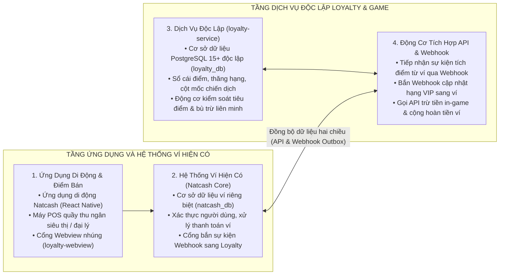
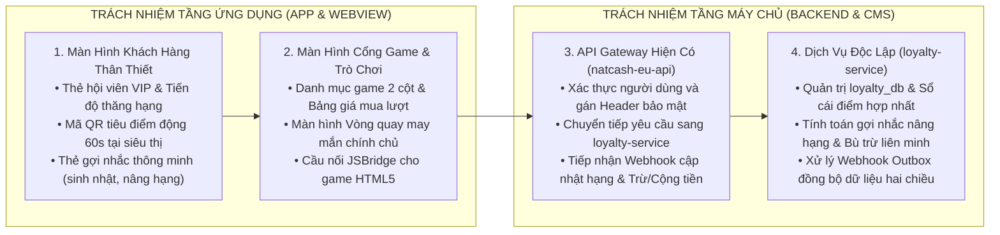
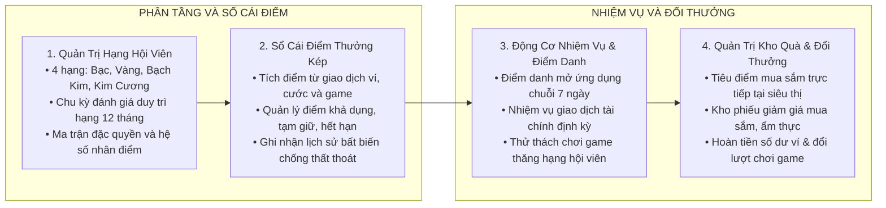
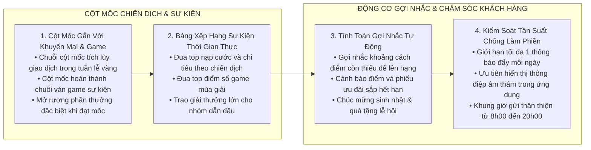
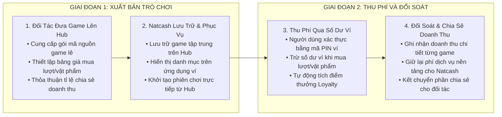

# TÀI LIỆU GIẢI PHÁP, NGHIỆP VỤ VÀ THIẾT KẾ TỔNG THỂ
## Nền Tảng Khách Hàng Thân Thiết Liên Minh và Cổng Game Đa Thuê Bao

> **Đơn vị xây dựng:** Nhóm Kiến trúc và Giải pháp Số — Natcash  
> **Loại tài liệu:** Tài liệu Giải pháp và Thiết kế Kiến trúc Tổng thể  
> **Định vị chiến lược:** Hệ thống Khách hàng thân thiết là giải pháp nền tảng liên minh đa đối tác bao trùm toàn bộ dịch vụ ví điện tử Natcash, mạng viễn thông Natcom và các đối tác liên kết thương mại. Cổng Game là phân hệ giải trí và trò chơi hóa trực thuộc, đóng vai trò gia tăng tương tác và tạo nguồn doanh thu dịch vụ mới.  
> **Phương án công nghệ chính thức:**  
> • Cơ sở dữ liệu quan hệ độc lập: **PostgreSQL 15+** (`loyalty_db` tách biệt 100% với `natcash_db`).  
> • Máy chủ nghiệp vụ độc lập: **Java 17 LTS / Spring Boot 2.7.14+** (`loyalty-service`).  
> • Khóa phân tán và Bộ nhớ đệm: **Redis 7.x Cluster** (Thư viện Redisson 3.20+).  
> • Truyền thông sự kiện và Đồng bộ: **Mẫu Hộp thư đi (Transactional Outbox Pattern)** kết hợp **Redis Streams**.  
> • Cổng Quản trị Trung tâm: **ReactJS 18+ / TypeScript / Vite / Ant Design 5.x** (`loyalty-cms` đóng gói tĩnh qua Nginx).  
> • Cổng Webview nhúng đối tác: **ReactJS 18+ / TypeScript / Vite / TailwindCSS Mobile-First** (`loyalty-webview` đóng gói tĩnh qua Nginx).  
> • Ứng dụng di động ví: **React Native** (`natcash-eu-app`).  
> • Cổng kết nối chuyển tiếp: **Java Spring Boot Reverse Proxy** (`natcash-eu-api`).

---

## 1. BỐI CẢNH, MỤC TIÊU CHIẾN LƯỢC VÀ CHỈ SỐ ĐO LƯỜNG

### 1.1. Bối Cảnh Thị Trường và Bài Toán Kinh Doanh
Trong thị trường thanh toán số và dịch vụ tiêu dùng cạnh tranh khốc liệt, các chương trình tích điểm đơn lẻ, khép kín của từng dịch vụ riêng biệt không còn đủ sức hấp dẫn người dùng. Khách hàng mong muốn một **Ví Phần Thưởng hợp nhất** có giá trị thực tế cao, có thể tích lũy từ mọi hoạt động chi tiêu hàng ngày (nạp cước điện thoại, thanh toán hóa đơn, mua sắm siêu thị, đổ xăng, chơi game) và tự do sử dụng số điểm, mã giảm giá đó để thanh toán trực tiếp hoặc đổi quà tại bất kỳ điểm chấp nhận nào trong toàn mạng lưới liên minh.

### 1.2. Mục Tiêu Chiến Lược Của Giải Pháp
1. **Liên thông Ví Phần Thưởng hợp nhất:** Tích hợp toàn diện thông tin Hạng hội viên, Điểm tích lũy, Mã giảm giá và Quà tặng thành một Ví Phần Thưởng chung duy nhất, cho phép các đối tác liên minh tra cứu và khấu trừ theo thời gian thực.
2. **Tiêu điểm và dùng quà như phương tiện thanh toán trực tiếp:** Cho phép người dùng sử dụng điểm tích lũy hoặc mã giảm giá trong Ví Phần Thưởng để trừ thẳng vào hóa đơn mua sắm hoặc đổi quà hiện vật tại quầy thu ngân của đối tác.
3. **Bộ máy kiểm soát điều kiện sử dụng linh hoạt:** Thiết lập cơ chế phân quyền, kiểm soát điều kiện chấp nhận đổi điểm theo từng đối tác, từng loại nguồn điểm, hạn mức giao dịch và hạng hội viên nhằm bảo vệ ngân sách và an toàn tài chính.
4. **Hệ thống thanh toán bù trừ tài chính tự động:** Tự động ghi nhận, đối soát và thanh toán bù trừ công nợ giữa đơn vị phát hành điểm và đơn vị chấp nhận tiêu điểm định kỳ.
5. **Động cơ cột mốc chiến dịch và gợi nhắc thông minh:** Xây dựng các chặng cột mốc nhiệm vụ gắn liền với các chiến dịch khuyến mại, sự kiện mùa vụ và giải đấu game; kết hợp cơ chế gợi nhắc tự động có kiểm soát tần suất nhằm chăm sóc khách hàng chu đáo mà không gây phiền toái.
6. **Trò chơi hóa và Cổng Game đa năng:** Đóng vai trò là phân hệ giải trí gia tăng gắn kết, tiêu thụ điểm thưởng và tạo dòng doanh thu chia sẻ với các nhà phát triển game lẻ.

### 1.3. Các Chỉ Số Đo Lường Hiệu Quả Cốt Lõi
* **Tỉ lệ giữ chân người dùng:** Tăng 30% – 40% tỉ lệ người dùng hoạt động hàng tháng và hàng ngày.
* **Tần suất chi tiêu qua mạng lưới liên minh:** Gia tăng 50% khối lượng giao dịch thanh toán chéo giữa viễn thông, ví điện tử và mạng lưới đối tác bán lẻ.
* **Tỉ lệ tương tác với thông điệp gợi nhắc:** Đạt trên 25% tỉ lệ người dùng thực hiện hành động sau khi nhận thông báo gợi nhắc nâng hạng hoặc tiêu điểm sắp hết hạn.
* **Tỉ lệ tiêu thụ điểm thưởng:** Đạt mức tối ưu 70% – 80%, khẳng định giá trị thanh khoản thực tế của điểm thưởng đối với người tiêu dùng.

---

## 2. KIẾN TRÚC GIẢI PHÁP TỔNG THỂ VÀ PHÂN TÁCH CƠ SỞ DỮ LIỆU

Hệ thống được thiết kế theo kiến trúc Microservices đa thuê bao, trong đó cơ sở dữ liệu của dịch vụ Khách hàng thân thiết (`loyalty_db` trên PostgreSQL 15+) được tách riêng biệt hoàn toàn với cơ sở dữ liệu của hệ thống ví lõi (`natcash_db`):

---

## 3. PHÂN ĐỊNH TRÁCH NHIỆM TÍCH HỢP GIỮA CÁC TẦNG HỆ THỐNG

Để tích hợp thành công giải pháp, các thành phần hệ thống cần thực hiện các trách nhiệm rõ ràng:

### 3.1. Trách Nhiệm Của Tầng Ứng Dụng Di Động (`natcash-eu-app`) và Webview Nhúng (`loyalty-webview`)
1. **Xây dựng Màn hình Trung tâm Loyalty:** Hiển thị thẻ hội viên VIP (Bạc, Vàng, Bạch Kim, Kim Cương), thanh tiến độ điểm xét hạng chu kỳ năm, danh sách nhiệm vụ điểm danh và các thẻ gợi nhắc thông minh.
2. **Tích hợp Màn hình Sinh mã QR Tiêu điểm tại quầy:** Sinh mã QR động có chữ ký bảo mật với thời hạn 60 giây để máy POS siêu thị quét tra cứu Ví Phần Thưởng và trừ điểm/dùng voucher trực tiếp trên hóa đơn.
3. **Nâng cấp Cổng Game & Trình chơi Webview tập trung:** Bổ sung bảng giá mua lượt chơi/vật phẩm, cửa sổ xác thực mã PIN ví và cầu nối JSBridge hỗ trợ game HTML5 gọi hàm thanh toán ví.
4. **Tích hợp Màn hình Vòng quay may mắn:** Nhúng component đĩa quay may mắn kèm âm thanh, kết nối API quay thưởng và hiển thị kết quả.

### 3.2. Trách Nhiệm Của Tầng API Gateway Hiện Có (`natcash-eu-api`)
1. **Đóng vai trò Cổng Chuyển tiếp Bảo mật (Reverse Proxy):** Nhận yêu cầu từ ứng dụng di động, giải mã JWT token người dùng, trích xuất `User ID` / `Phone` / `Tenant ID`, gắn các header bảo mật (`X-Tenant-Id`, `X-User-Id`, `X-Signature`) và chuyển tiếp sang `loyalty-service`.
2. **Đồng bộ hồ sơ người dùng:** Gọi `POST /loyalty/v1/sync/user-profile` khi có người dùng đăng ký ví mới hoặc cập nhật ngày sinh.
3. **Lắng nghe Webhook cập nhật Hạng hội viên:** Tiếp nhận Webhook `POST /wallet/v1/webhooks/loyalty-tier-update` để cập nhật quyền lợi miễn giảm phí giao dịch chuyển tiền và hiển thị huy hiệu VIP trên trang chủ ví.
4. **Cung cấp API Trừ tiền in-game & Hoàn tiền số dư ví:**
   * `POST /wallet/v1/debit-in-game`: Nhận yêu cầu từ Loyalty, kiểm tra số dư ví người dùng, trừ tiền ví và trả kết quả.
   * `POST /wallet/v1/credit-cashback`: Nhận yêu cầu từ Loyalty khi người dùng đổi điểm sang tiền mặt, cộng tiền vào số dư ví và lưu sổ cái tài chính.
5. **Cung cấp Kênh bắn thông báo đẩy:** Tiếp nhận thông báo từ Loyalty để đẩy tin nhắn qua Firebase Cloud Messaging / Apple APNs / SMS Brandname đến điện thoại người dùng.

### 3.3. Trách Nhiệm Của Hệ Thống Đối Tác Bán Lẻ và Nhà Phát Triển Game
* **Hệ thống POS Siêu thị / Cây xăng:** Tích hợp API liên thông Ví Phần Thưởng `POST /loyalty/v1/partners/reward-wallet/inquiry` để tra cứu hạng, điểm, mã giảm giá và gọi `POST /loyalty/v1/partners/reward-wallet/redeem` để trừ điểm, áp voucher hoặc đổi quà tại quầy.
* **Đối tác Phát triển Game:** Đóng gói game HTML5 tuân thủ chuẩn giao tiếp JSBridge để tiếp nhận mã phiên chơi (`session_id`) và gọi API thanh toán ví.

---

## 4. MÔ HÌNH LIÊN THÔNG VÍ PHẦN THƯỞNG VÀ BÙ TRỪ TÀI CHÍNH LIÊN MINH

Điểm đột phá của giải pháp là việc chuẩn hóa **Ví Phần Thưởng (Reward Wallet)**, cho phép mọi đối tác trong liên minh liên thông dữ liệu và thực hiện giao dịch khấu trừ đa phương tiện:

```mermaid
flowchart LR
    subgraph COL_REWARD_WALLET ["CẤU THÀNH VÍ PHẦN THƯỞNG (REWARD WALLET)"]
        direction TB
        RW_TIER["1. Thông Tin Hạng & Đặc Quyền<br/>• Hạng Bạc, Vàng, Bạch Kim, Kim Cương<br/>• Tỷ lệ chiết khấu theo từng đối tác"]
        RW_POINTS["2. Số Dư Điểm Thưởng Tích Lũy<br/>• Điểm khả dụng & Tỷ giá quy đổi tiền mặt<br/>• Số điểm sắp hết hạn trong kỳ"]
        RW_VOUCHERS["3. Kho Phiếu Ưu Đãi / Mã Giảm Giá<br/>• Danh sách voucher khách hàng sở hữu<br/>• Điều kiện áp dụng theo đối tác & giỏ hàng"]
        RW_GIFTS["4. Danh Mục Quà Tặng Đổi Tại Quầy<br/>• Hiện vật, voucher dịch vụ có thể đổi điểm"]
        RW_TIER --> RW_POINTS
        RW_POINTS --> RW_VOUCHERS
        RW_VOUCHERS --> RW_GIFTS
    end

    subgraph COL_PARTNER_ACTION ["QUY TRÌNH LIÊN THÔNG TẠI ĐIỂM BÁN"]
        direction TB
        PA_INQUIRY["1. Tra Cứu Ví Phần Thưởng<br/>• Quét mã QR của khách tại quầy thu ngân<br/>• Lấy toàn bộ Hạng, Điểm, Voucher, Quà"]
        PA_SELECT["2. Lựa Chọn Hình Thức Khấu Trừ<br/>• Trừ điểm giảm tiền (Pay-with-Points)<br/>• Áp dụng voucher hoặc Đổi quà hiện vật"]
        PA_REDEEM["3. Thực Thi Khấu Trừ & Bù TrỪ<br/>• Trừ điểm/Hủy voucher trong sổ cái Loyalty<br/>• Giảm trừ hóa đơn & Đối soát công nợ"]
        PA_INQUIRY --> PA_SELECT
        PA_SELECT --> PA_REDEEM
    end

    RW_GIFTS -->|"Liên thông qua API"| PA_INQUIRY
```

### 4.1. Khái Niệm Ví Phần Thưởng Hợp Nhất (Reward Wallet)
Ví Phần Thưởng là tài sản số của khách hàng bao gồm 4 thành tố giá trị:
1. **Thông tin Hạng hội viên:** Xác định cấp bậc và các đặc quyền giảm giá độc quyền tại từng đối tác.
2. **Số dư Điểm thưởng tích lũy:** Quy đổi trực tiếp thành tiền mặt để trừ vào hóa đơn mua sắm (Ví dụ: 1 điểm = 1 HTG).
3. **Kho Phiếu giảm giá điện tử:** Các voucher chiết khấu theo phần trăm hoặc theo số tiền cố định mà khách hàng đang nắm giữ.
4. **Danh mục Quà tặng tại điểm bán:** Các phần quà hiện vật đối tác chấp nhận cho khách hàng dùng điểm tích lũy để đổi trực tiếp tại quầy.

### 4.2. Quy Trình Liên Thông và Thực Thi Giao Dịch Tại Quầy Đối Tác
1. **Bước 1: Tra cứu Ví Phần Thưởng tại quầy thu ngân:**  
   Khách hàng xuất trình mã QR trên ứng dụng. Máy POS của đối tác (Siêu thị Delimart, Cây xăng Total) gọi API `POST /loyalty/v1/partners/reward-wallet/inquiry` truyền kèm mã khách hàng và tổng giá trị hóa đơn. Hệ thống Loyalty trả về toàn bộ: Hạng hội viên, số điểm tối đa được trừ, danh sách voucher hợp lệ cho hóa đơn này và danh mục quà có thể đổi.
2. **Bước 2: Lựa chọn hình thức áp dụng:**  
   Thu ngân và khách hàng thống nhất lựa chọn:
   * *Phương án A:* Dùng điểm tích lũy để trừ tiền mặt trực tiếp (ví dụ: trừ 500 điểm để giảm 500 HTG).
   * *Phương án B:* Sử dụng mã giảm giá có trong ví (ví dụ: áp voucher giảm 10%).
   * *Phương án C:* Kết hợp cả áp voucher và trừ thêm điểm, hoặc dùng điểm đổi quà hiện vật mang về.
3. **Bước 3: Khấu trừ và Ghi nhận bù trừ tài chính:**  
   Máy POS gọi API `POST /loyalty/v1/partners/reward-wallet/redeem`. Hệ thống Loyalty đồng thời trừ điểm trong sổ cái, đánh dấu voucher đã sử dụng và ghi nhận giao dịch vào sổ cái bù trừ công nợ liên minh. Máy POS in hóa đơn giảm trừ tiền mặt cho khách hàng.

### 4.3. Bộ Máy Kiểm Soát Điều Kiện Sử Dụng
Để đảm bảo quyền tự chủ của từng đối tác và an toàn tài chính cho liên minh, hệ thống cung cấp các bộ quy tắc điều kiện chấp nhận tiêu điểm chi tiết:
1. **Tỷ lệ khấu trừ tối đa trên hóa đơn:** Đối tác siêu thị có thể quy định chỉ cho phép trừ tối đa 50% hoặc 100% giá trị hóa đơn bằng điểm.
2. **Quy định tỷ giá quy đổi điểm:** Mỗi 1 điểm Loyalty tương đương với một giá trị tiền mặt quy ước (Ví dụ: 1 điểm = 1 HTG).
3. **Phân loại nguồn điểm áp dụng:** Cho phép phân biệt điểm tích lũy tiêu chuẩn (được tiêu tự do toàn mạng lưới) và điểm khuyến mại nội bộ (chỉ được tiêu cho dịch vụ viễn thông).
4. **Hạn mức giao dịch:** Thiết lập số điểm tối thiểu và tối đa được phép khấu trừ trong một lần thanh toán hoặc trong một ngày.
5. **Điều kiện hạng hội viên:** Một số đối tác cao cấp có thể yêu cầu khách hàng đạt hạng Vàng hoặc Bạch Kim mới được áp dụng chương trình thanh toán bằng điểm.

### 4.4. Động Cơ Đối Soát và Thanh Toán Bù Trừ Tài Chính
* **Ghi nhận nghĩa vụ tài chính:**
  * Khi Đơn vị A (Viễn thông) phát hành điểm cho người dùng: Đơn vị A ghi nhận một khoản công nợ quỹ điểm.
  * Khi người dùng mang số điểm đó sang Đơn vị B (Siêu thị) để mua hàng hoặc đổi quà: Đơn vị B phát sinh quyền thu tiền từ quỹ điểm.
* **Thanh toán bù trừ tự động định kỳ:** Định kỳ hàng tuần hoặc hàng tháng, hệ thống tự động tổng hợp toàn bộ các giao dịch tích/tiêu điểm chéo, xuất báo cáo thanh toán bù trừ đa phương và tạo lệnh kết chuyển tiền mặt giữa tài khoản ngân hàng của các đơn vị đối tác liên quan.

---

## 5. MÔ HÌNH NGHIỆP VỤ CHUYÊN SÂU KHÁCH HÀNG THÂN THIẾT

Hệ sinh thái Khách hàng thân thiết được cấu thành từ 4 trụ cột nghiệp vụ nền tảng:

### 5.1. Mô Hình Phân Tầng Hội Viên và Vòng Đời Khách Hàng
* **Cơ chế xét hạng:** Điểm xét hạng được tích lũy tự động từ các giao dịch thanh toán trên ví và nạp cước viễn thông trong chu kỳ 12 tháng liên tục.
* **Ma trận phân cấp đặc quyền:**

| Hạng hội viên | Điểm xét hạng tối thiểu | Hệ số nhân điểm | Đặc quyền nổi bật |
| :--- | :--- | :--- | :--- |
| **Bạc** | 0 điểm | × 1.0 | Tặng 1 lượt quay miễn phí/ngày khi điểm danh; đổi điểm lấy phiếu giảm giá tiêu chuẩn; thanh toán điểm tại siêu thị tối đa 30% hóa đơn. |
| **Vàng** | 1.000 điểm | × 1.2 | Miễn phí chuyển tiền ví 5 giao dịch/tháng; mở quyền quay Vòng quay Vàng; tặng quà sinh nhật; thanh toán điểm tại siêu thị tối đa 50% hóa đơn. |
| **Bạch Kim** | 5.000 điểm | × 1.5 | Hoàn tiền 1% khi thanh toán hóa đơn; mở quyền quay Vòng quay VIP; ưu tiên xử lý khiếu nại; thanh toán điểm tại siêu thị tối đa 100% hóa đơn. |
| **Kim Cương** | 15.000 điểm | × 2.0 | Hoàn tiền 2% mọi giao dịch; quản lý tài khoản riêng; quyền tham gia toàn bộ giải đấu game độc quyền; không giới hạn hạn mức tiêu điểm đối tác. |

---

### 5.2. Động Cơ Tích Điểm và Sổ Cái Điểm Thưởng Kép
* **Quy tắc tích điểm đa kênh:**
  1. *Thanh toán hóa đơn và mua sắm ví:* Tích lũy điểm dựa trên tỷ lệ cấu hình theo giá trị giao dịch ví.
  2. *Nạp cước viễn thông và dịch vụ số:* Tích điểm theo giá trị nạp tiền điện thoại và gói data.
  3. *Tương tác trò chơi:* Thắng các trò chơi trên Cổng Game để nhận điểm thưởng trực tiếp.
* **Quản trị vòng đời của điểm:** Điểm thưởng có hiệu lực 12 tháng kể từ ngày phát sinh. Hệ thống tự động phân tách điểm khả dụng, điểm tạm giữ khi giao dịch đang xử lý và tự động xử lý điểm hết hạn định kỳ.

---

### 5.3. Động Cơ Nhiệm Vụ và Thử Thách Trò Chơi Hóa
* **Chuỗi điểm danh 7 ngày:** Khuyến khích mở ứng dụng hàng ngày; thưởng tăng dần qua từng ngày (Ngày 1: 10 điểm → Ngày 7: 100 điểm + 1 lượt quay miễn phí).
* **Nhiệm vụ thanh toán định kỳ:** Khuyến khích người dùng thực hiện đủ số lượng giao dịch thanh toán trong tuần để mở rương kho báu chứa điểm thưởng lớn.

---

### 5.4. Kho Quà Tặng và Động Cơ Đổi Thưởng Đa Năng
Hệ thống cung cấp 4 hình thức đổi thưởng linh hoạt:
1. **Thanh toán trực tiếp tại siêu thị/điểm bán:** Quét mã trừ điểm tại quầy thanh toán của đối tác.
2. **Phiếu giảm giá điện tử:** Đổi điểm lấy mã ưu đãi mua sắm, ẩm thực, giải trí từ mạng lưới đối tác liên kết.
3. **Hoàn tiền số dư ví:** Chuyển đổi trực tiếp điểm thưởng thành tiền mặt cộng vào số dư ví Natcash.
4. **Lượt chơi trò chơi:** Dùng điểm thưởng để mua thêm lượt quay may mắn hoặc lượt tham gia các trò chơi thu phí trên GameHub.

---

## 6. ĐỘNG CƠ CỘT MỐC CHIẾN DỊCH VÀ HỆ THỐNG GỢI NHẮC THÔNG MINH

Để duy trì sự hiện diện liên tục trong tâm trí khách hàng mà không gây cảm giác bị làm phiền, hệ thống thiết lập bộ máy quản lý cột mốc chiến dịch và động cơ gợi nhắc theo ngữ cảnh:

### 6.1. Chuỗi Cột Mốc và Nhiệm Vụ Động Theo Sự Kiện
* **Cột mốc theo chiến dịch khuyến mại:** Người dùng tham gia các chiến dịch tuần lễ vàng (ví dụ: Nạp cước viễn thông ngày vàng, Ngày hội mua sắm không tiền mặt). Khi đạt từng mốc giao dịch (Mốc 1: 3 giao dịch → Mốc 2: 5 giao dịch → Mốc 3: 10 giao dịch), hệ thống tự động mở khóa các phần quà tăng dần (Cộng thêm điểm thưởng, tặng mã giảm giá mua hàng siêu thị, tặng lượt quay Vàng).
* **Cột mốc gắn với Cổng Game:** Tổ chức các giải đấu mùa vụ trên GameHub. Khách hàng vượt qua các màn chơi hoặc đạt chuỗi trận thắng sẽ nhận huy hiệu vinh danh và điểm thưởng thăng hạng nhanh chóng.

### 6.2. Các Kịch Bản Gợi Nhắc Ngữ Cảnh Tự Động
Hệ thống tự động tính toán dữ liệu hành vi của từng khách hàng để kích hoạt các thông điệp chăm sóc cá nhân hóa:
1. **Gợi nhắc nâng hạng hội viên:** Khi người dùng đạt từ 80% đến 95% điểm xét hạng của cấp tiếp theo, hệ thống tự động tính toán khoảng cách còn thiếu và gợi ý hành động cụ thể.
2. **Cảnh báo điểm thưởng và quà sắp hết hạn:** Tự động rà soát sổ cái điểm và kho phiếu ưu đãi, gửi cảnh báo trước 15 ngày và trước 3 ngày.
3. **Chăm sóc sinh nhật và ngày lễ hội:**
   * *Ngày sinh nhật:* Tự động gửi lời chúc mừng cá nhân hóa kèm gói quà tặng đặc quyền (Nhân đôi điểm thưởng mọi giao dịch trong tuần sinh nhật + tặng 3 lượt quay may mắn VIP).
   * *Dịp lễ quốc gia:* Gửi thông điệp chúc mừng kèm bộ nhiệm vụ lễ hội với hệ số điểm thưởng nhân dịp lễ.

### 6.3. Cơ Chế Kiểm Soát Tần Suất Chống Làm Phiền
* **Hạn mức tần suất nhận tin:** Mỗi khách hàng nhận tối đa **1 thông báo đẩy** từ hệ thống Loyalty trong vòng 24 giờ.
* **Thứ tự ưu tiên thông điệp:** Thông báo biến động giao dịch tài chính (Ưu tiên 1) > Cảnh báo điểm/quà sắp hết hạn (Ưu tiên 2) > Gợi nhắc thăng hạng (Ưu tiên 3) > Thông tin sự kiện và khuyến mại chung (Ưu tiên 4).
* **Ưu tiên hiển thị thông điệp âm thầm trong ứng dụng:** Các thông điệp gợi nhắc nâng hạng hoặc tiến độ cột mốc được hiển thị tinh tế dưới dạng thẻ thông tin nhỏ trên trang chủ Trung tâm Loyalty, không phát sinh âm thanh hoặc rung làm phiền khi người dùng chưa mở ứng dụng.
* **Khung giờ gửi thân thiện:** Tuyệt đối không gửi thông báo đẩy ngoài khung giờ từ 8h00 sáng đến 20h00 tối.

---

## 7. MÔ HÌNH NGHIỆP VỤ CỔNG GAME VÀ KINH TẾ TRÒ CHƠI

Cổng Game là phân hệ giải trí và trò chơi hóa trực thuộc giải pháp Khách hàng thân thiết:

### 7.1. Vai Trò Của GameHub Trong Hệ Sinh Thái Loyalty
* **Tiêu thụ điểm thưởng:** Cung cấp nơi cho người dùng sử dụng điểm tích lũy đổi lấy niềm vui và cơ hội trúng giải thưởng lớn.
* **Tạo động lực kiếm điểm:** Tạo môi trường cạnh tranh bảng xếp hạng, chuỗi thắng để nhận điểm thưởng thăng hạng hội viên.
* **Kênh giải phóng kho quà:** Phân phối các gói phiếu giảm giá, tiền hoàn ví từ kho quà đến tay người chơi một cách tự nhiên và hào hứng.

### 7.2. Mô Hình Xuất Bản Game Lẻ và Chia Sẻ Doanh Thu
* **Nền tảng mở cho đối tác:** Các studio hoặc nhà phát triển game bên thứ ba đưa các gói game lẻ lên phân phối trên GameHub Natcash.
* **Thanh toán in-game liền mạch:** Người dùng sử dụng trực tiếp số dư ví Natcash để mua lượt chơi hoặc vật phẩm trong game.
* **Tự động đối soát phân chia doanh thu:** Hệ thống tự động ghi nhận doanh thu, trừ chi phí vận hành nền tảng của Natcash và kết chuyển phần doanh thu chia sẻ cho đối tác định kỳ.

---

## 8. CHIẾN LƯỢC TÍCH HỢP VÀ LỘ TRÌNH TRIỂN KHAI

### 8.1. Phương Án Tích Hợp Hệ Thống
* **Ứng dụng di động:** Nhúng Mobile SDK để hiển thị Trung tâm Khách hàng thân thiết, Cổng Game, Bảng tiến độ cột mốc và Mã QR tiêu điểm tại quầy thu ngân.
* **Cổng Webview nhúng (`loyalty-webview`):** Cung cấp giao diện trọn gói cho đối tác liên minh nhúng trực tiếp vào ứng dụng di động của họ qua vé phiên một lần (SSO) và cầu nối JSBridge.
* **Cổng Quản trị Trung tâm (`loyalty-cms`):** Cung cấp cổng điều hành cho phép quản trị viên cấu hình chính sách tích/tiêu điểm, tỷ giá, quản lý kho voucher và duyệt quyết toán bù trừ tài chính.
* **Hệ thống POS / Máy tính tiền đối tác:** Tích hợp với Cổng API Loyalty để tra cứu toàn diện Ví Phần Thưởng và thực hiện giao dịch trừ điểm/đổi quà theo thời gian thực.
* **Cổng API Gateway hiện có:** Đóng vai trò là Reverse Proxy xác thực người dùng và chuyển tiếp yêu cầu sang Dịch vụ độc lập `loyalty-service` kèm định danh thuê bao `X-Tenant-Id`.
* **Dịch vụ độc lập `loyalty-service`:** Chịu trách nhiệm toàn bộ logic phân hạng, tích điểm, liên thông Ví Phần Thưởng, quản lý Cổng Game, động cơ cột mốc và đối soát bù trừ tài chính trên cơ sở dữ liệu **PostgreSQL 15+**.

### 8.2. Lộ Trình Triển Khai 4 Giai Đoạn

1. **Giai đoạn 1: Xây dựng nền tảng Dịch vụ độc lập SaaS và Trung tâm Bù trừ Điểm:**
   - Thiết lập kiến trúc đa thuê bao, cơ sở dữ liệu `loyalty_db` trên PostgreSQL 15+ độc lập hoàn toàn với `natcash_db`, bảo mật API Key và Webhook Outbox Engine.
   - Xây dựng các phân hệ cốt lõi của Loyalty: Sổ cái điểm hợp nhất, Động cơ liên thông Ví Phần Thưởng, Động cơ cột mốc chiến dịch và Động cơ bù trừ công nợ liên minh.
   - Xây dựng phân hệ Cổng Game: Quản lý danh mục game, Động cơ thu phí in-game qua ví và Động cơ đối soát doanh thu.
2. **Giai đoạn 2: Xây dựng Cổng Quản trị CMS, Cổng Webview và Tích hợp API Gateway:**
   - Hoàn thiện Cổng Quản trị `loyalty-cms` phục vụ cấu hình chính sách, hạn mức và đối soát.
   - Hoàn thiện Cổng Webview `loyalty-webview` nhúng đa nền tảng tích hợp cầu nối JSBridge.
   - Kết nối API liên thông Ví Phần Thưởng với hệ thống máy tính tiền / POS của các chuỗi siêu thị và cây xăng đối tác tiên phong.
   - Cài đặt Động cơ gợi nhắc thông minh và cơ chế kiểm soát tần suất gửi thông báo.
   - Định tuyến toàn bộ yêu cầu Loyalty và Game từ API Gateway sang Dịch vụ độc lập.
3. **Giai đoạn 3: Hoàn thiện Ứng dụng di động và phát hành trò chơi đầu tiên:**
   - Hoàn thiện giao diện Trung tâm Khách hàng thân thiết, màn hình quét mã QR tiêu điểm tại quầy, Bảng theo dõi cột mốc sự kiện và Cổng Game.
   - Phát hành trò chơi đầu tiên: Vòng quay may mắn (Lucky Draw) kết nối trực tiếp với điểm Loyalty và số dư ví.
4. **Giai đoạn 4: Mở rộng Liên minh Toàn quốc và Vận hành Thương mại:**
   - Mở rộng kết nối mạng lưới đối tác bán lẻ, ẩm thực và dịch vụ công trên toàn quốc.
   - Mở cổng quản trị đối tác để tiếp nhận các gói game lẻ tải lên GameHub và tự động đối soát phân chia doanh thu định kỳ.
