# BÁO CÁO NGHIÊN CỨU ĐỐI SÁNH VÀ KẾ HOẠCH TÁI SỬ DỤNG MÃ NGUỒN TỪ DỰ ÁN SMART-OTP CHO MICRO-LOYALTY

> **Mã tài liệu:** TECH-REPORT-LOYALTY-REUSE-SMART-OTP  
> **Đơn vị xây dựng:** Nhóm Kiến trúc và Giải pháp Số — Natcash  
> **Mục đích:** Đánh giá chi tiết khả năng kế thừa kiến trúc đa thuê bao, bộ thư viện nền tảng lõi (`ims-libraries`), cơ chế bảo mật khóa kép, khung giao diện quản trị CMS, hạ tầng triển khai và mô hình tích hợp đối tác từ dự án `smart-otp` sang dự án `micro-loyalty` nhằm tiết kiệm nguồn lực và tối ưu hóa thời gian phát triển.  
> **Dự án tham chiếu:** Mã nguồn `smart-otp` (`/Users/micro/Source/chapisoft/smart-otp`).

---

## 1. TỔNG QUAN VỀ SỰ TƯƠNG ĐỒNG GIỮA HAI HỆ THỐNG

Qua nghiên cứu đối soát kiến trúc và mã nguồn thực tế của dự án `smart-otp`, hai hệ thống có sự tương đồng rất lớn về mặt chiến lược công nghệ và quy trình vận hành:
1. **Mô hình kiến trúc dịch vụ đa thuê bao độc lập (Multi-tenant Standalone Platform):** Cả hai hệ thống đều thiết kế cơ sở dữ liệu quan hệ và cụm dịch vụ nghiệp vụ hoàn toàn tách biệt với hệ thống ví lõi `natcash_db`.
2. **Mô hình tích hợp đối tác B2B & Cổng kết nối (Partner Gateway):** Sử dụng chung cơ chế xác thực Khóa kép (`X-Api-Key`, `SecretKey`), ký số `HMAC-SHA256` và kiểm soát sai lệch thời gian `X-Timestamp` (±300 giây).
3. **Lộ trình triển khai thực tế (Phased Roadmap):** Đều bắt đầu thử nghiệm thực tế với ứng dụng ví **Natcash** (`natcash-eu-app` & `natcash-eu-api`), sau đó mở rộng mạng lưới liên minh sang các đối tác bên ngoài (siêu thị Delimart, chuỗi trạm xăng, ngân hàng và đối tác dịch vụ số).
4. **Mô hình mạng nội bộ linh hoạt (Private LAN / Co-location):** Hỗ trợ kết nối trực tiếp qua mạng Private Subnet nội bộ (IP `172.18.0.1:18090` hoặc Docker Network) khi máy chủ Backend của Natcash bị chặn kết nối Internet ra ngoài theo tiêu chuẩn an ninh ngân hàng PCI-DSS.

---

## 2. MA TRẬN ĐỐI SÁNH VÀ KHẢ NĂNG TÁI SỬ DỤNG MÃ NGUỒN

| Hạng mục cấu phần | Trạng thái trong dự án Smart-OTP | Khả năng tận dụng cho Micro-Loyalty | Mức độ tái sử dụng | Ước tính tiết kiệm nguồn lực |
| :--- | :--- | :--- | :---: | :---: |
| **Bộ Thư Viện Lõi (`ims-libraries`)** | Đã hoàn thiện 11 module Java chuẩn hóa: `ims-core`, `ims-redis`, `ims-rest`, `ims-security`, `ims-kafka`, `ims-i18n`, `ims-jasypt`, `ims-excel`... | Sử dụng làm bộ khung dùng chung (Common Libraries) cho toàn bộ `loyalty-service`. | **95%** | **Tiết kiệm 2 – 3 tuần** lập trình hạ tầng lõi. |
| **Xác Thực Khóa Kép & Quản Trị Đối Tác (`partner-service`)** | Đã có thực thể `PartnerEntity`, tiện ích băm `SignatureUtils`, cơ chế xác thực HMAC-SHA256 và chính sách xoay vòng khóa không gián đoạn (Zero-downtime Key Rotation). | Kế thừa nguyên vẹn logic xác thực B2B cho Cổng tích hợp máy POS siêu thị Delimart và Cổng nạp cước Natcom. | **90%** | **Tiết kiệm 1.5 – 2 tuần** phát triển tầng bảo mật B2B. |
| **Bộ Nhớ Đệm & Khóa Phân Tán (`ims-redis`)** | Đã tích hợp Redisson Cluster, cấu hình khóa phân tán, cơ chế kiểm tra tính sẵn sàng `RedisSentinelHealthChecker` và dịch vụ cache. | Tận dụng trực tiếp để triển khai khóa phân tán chống tiêu điểm kép `lock:burn:tenant_id:user_id` và đếm nguyên tử `DECRBY`. | **95%** | **Tiết kiệm 1 tuần** cấu hình cụm Redis & Khóa. |
| **Khung Giao Diện Quản Trị CMS (`cms-admin`)** | Xây dựng trên React 18 / Vite / Ant Design, cấu trúc Layout Admin, phân quyền vai trò RBAC, hệ thống i18n, quản lý bảng danh sách và biểu đồ thống kê. | Kế thừa bộ khung giao diện, hệ thống Design Tokens và trang quản trị đối tác, phân quyền người dùng cho `loyalty-cms`. | **75%** | **Tiết kiệm 2 – 2.5 tuần** lập trình giao diện CMS. |
| **Cổng Developer Sandbox & Tài Liệu (`sandbox-portal`)** | Cổng tự phục vụ dành cho nhà phát triển đối tác: Sandbox Credentials, trình xem tài liệu Markdown động, tải Postman Collections và Simulator. | Tận dụng để cung cấp Cổng Sandbox cho các nhà phát triển game lẻ đưa game lên GameHub và đối tác POS tích hợp API Ví Phần Thưởng. | **70%** | **Tiết kiệm 1.5 – 2 tuần** xây dựng Developer Portal. |
| **Hạ Tầng Triển Khai & Container Hóa (`deploy/`)** | Đã có `docker-compose.yml` 9 dịch vụ, cấu hình Nginx Virtual Hosts đa tên miền (`out`, `api`, `cms`, `sandbox`), CI/CD pipeline và scripts vận hành. | Kế thừa toàn bộ cấu trúc phân bổ mạng, quy hoạch port, Dockerfile và kịch bản deploy tự động. | **85%** | **Tiết kiệm 1 tuần** thiết lập DevOps / Hạ tầng. |
| **Mô Hình Điều Phối API Gateway (`natcash-eu-api`)** | Đã có luồng Reverse Proxy giải mã JWT, gán tiêu đề `X-Tenant-Id`, ký số HMAC và chuyển tiếp yêu cầu sang dịch vụ độc lập. | Kế thừa chính xác luồng điều phối này để chuyển tiếp các API `/loyalty/*`, `/gamehub/*`, `/luckydraw/*`. | **90%** | **Tiết kiệm 1 tuần** nâng cấp Gateway. |

---

## 3. PHÂN TÍCH CHI TIẾT CÁC THÀNH PHẦN TẬN DỤNG CỐT LÕI

### 3.1. Bộ Thư Viện Nền Tảng Dùng Chung (`ims-libraries`)
Thay vì phải xây dựng lại từ đầu các tiện ích kết nối hạ tầng cho `loyalty-service`, dự án có thể đóng gói và tái sử dụng trực tiếp bộ thư viện `ims-libraries`:
* **`ims-core`:**
  * Cung cấp sẵn cơ chế bắt lỗi tập trung `GlobalBaseExceptionHandler`, cấu trúc phản hồi chuẩn hóa `ApiResponse<T>`, `PageResponse<T>`, `ResponseError`.
  * Bộ lọc ghi vết nhật ký `LogMDCFilter`, `CustomStrategy` tích hợp Logbook đo đạc hiệu năng từng request.
  * Bộ thư viện kiểm tra an toàn dữ liệu đầu vào: chống tấn công XSS (`ValidStoredXSS`), kiểm tra định dạng tệp an toàn (`SafeFileNameConstraint`), kiểm tra tính duy nhất (`ValidUniqueField`).
* **`ims-redis`:**
  * Đã đóng gói sẵn `RedissonAutoConfiguration` và `RedisService`. Giúp `loyalty-service` kích hoạt ngay cơ chế khóa phân tán chống tiêu điểm kép đa máy POS mà không cần viết lại mã cấu hình Redisson Client.
* **`ims-rest`:**
  * Cung cấp `RestClientFactory` tích hợp sẵn bộ ngắt mạch quá tải Resilience4j Circuit Breaker, cơ chế tự động thử lại `CustomRetryStrategy` và cấu hình Connection Pool Apache HttpClient 5 tối ưu hóa cho các kết nối B2B với Cổng viễn thông Natcom và Cổng ví Natcash.
* **`ims-jasypt`:**
  * Mã hóa an toàn các thông tin cấu hình nhạy cảm (mật khẩu cơ sở dữ liệu PostgreSQL, mật khẩu Redis, Master Key) trong tệp cấu hình `application.yml`.

---

### 3.2. Kiến Trúc Xác Thực Khóa Kép & Quản Trị Đối Tác B2B
Dự án Smart-OTP đã hoàn thiện và kiểm thử thành công cơ chế xác thực giữa máy chủ đối tác và hệ thống lõi:
* **Mô hình Khóa Kép:** Mỗi đối tác (Siêu thị Delimart, Cây xăng Total, Cổng nạp Natcom) được cấp một cặp khóa gồm `X-Api-Key` (công khai) và `SecretKey` (bí mật dùng để ký số HMAC).
* **Công thức ký số chuẩn hóa:**
  * Chuỗi chuẩn hóa: `CanonicalString = HttpMethod + "\n" + RequestPath + "\n" + X-Timestamp + "\n" + SHA256(RequestBodyJson)`
  * Chữ ký số: `X-Signature = Hex(HMAC-SHA256(SecretKey, CanonicalString))`
* **Kiểm tra an toàn hằng số thời gian:** Sử dụng `MessageDigest.isEqual()` để triệt tiêu hoàn toàn nguy cơ bị tấn công phân tích thời gian thực thi (Timing Attack).
* **Chính sách xoay vòng khóa không gián đoạn:** Cho phép đối tác tạo khóa mới và duy trì khóa cũ song song trong 7 ngày chuyển tiếp.

Toàn bộ thực thể `PartnerEntity`, `PartnerRepository`, `SignatureUtils` và các bộ lọc bảo mật trong `partner-service` của Smart-OTP có thể được chuyển giao trực tiếp sang `loyalty-service`.

---

### 3.3. Cổng Quản Trị Trung Tâm CMS & Cổng Developer Sandbox
* **Cổng Quản trị `loyalty-cms`:**
  * Tái sử dụng 100% cấu trúc Layout, Sidebar điều hướng động theo vai trò, hệ thống lưu trữ phiên JWT, cơ chế đa ngôn ngữ i18n (`react-i18next`) và các component bảng dữ liệu DataTable từ `src/cms/cms-admin` của Smart-OTP.
  * Chỉ cần tập trung phát triển mới các màn hình nghiệp vụ đặc thù: Cấu hình chính sách tích/tiêu điểm, Quản trị 4 hạng hội viên, Cấu hình cột mốc chiến dịch, Kho voucher và Báo cáo quyết toán bù trừ công nợ.
* **Cổng Developer Sandbox Portal:**
  * Kế thừa module `src/sandbox` của Smart-OTP để cung cấp Cổng tự phục vụ cho các nhà phát triển game lẻ (Game Developers) và đối tác chuỗi bán lẻ.
  * Cung cấp sẵn giao diện tra cứu tài liệu API tương tác, lấy khóa thử nghiệm (Test API Keys), kiểm tra định dạng Webhook và tải bộ sưu tập Postman Collection.

---

### 3.4. Hạ Tầng Container Hóa & Kịch Bản Triển Khai (`deploy/`)
Hệ thống mạng và phân bổ cổng dịch vụ của Smart-OTP đã được quy hoạch bài bản trên môi trường máy chủ nội bộ và sẵn sàng áp dụng cho Loyalty:
* **Quy hoạch mạng nội bộ:** Phân tách rõ ràng giữa mạng Public Gateway (`out.miotp.io.vn`, `api.miotp.io.vn`) và các cổng dịch vụ nội bộ (Internal Nginx Gateway `18090`, PostgreSQL `15433`, Redis `16380`).
* **Hỗ trợ Backend Natcash trong mạng Private Subnet:** Khi máy chủ Natcash Backend bị chặn Internet ra ngoài, hệ thống cho phép kết nối trực tiếp qua IP Private LAN nội bộ (`172.18.0.1:18090` hoặc Docker Network) với độ trễ cực thấp (< 5ms), đáp ứng tuyệt đối tiêu chuẩn bảo mật PCI-DSS.
* **Tệp `docker-compose.yml` và Dockerfile:** Có thể tái sử dụng ngay mẫu đóng gói container Java Spring Boot, Nginx phục vụ ứng dụng trang đơn tĩnh và cấu hình khởi động cụm CSDL PostgreSQL 15+ / Redis 7.x.

---

## 4. CÁC PHẦN NGHIỆP VỤ ĐẶC THÙ CẦN PHÁT TRIỂN MỚI CHO LOYALTY

Mặc dù có thể tận dụng được tới **70% – 80%** hạ tầng kỹ thuật và khung bảo mật từ Smart-OTP, đội ngũ phát triển vẫn cần tập trung nguồn lực xây dựng các nghiệp vụ lõi đặc thù của hệ sinh thái Loyalty:

```mermaid
flowchart LR
    subgraph S_REUSE ["TẬN DỤNG TỪ DỰ ÁN SMART-OTP (HẠ TẦNG & KHUNG)"]
        direction TB
        R_LIB["1. Bộ Thư Viện Lõi (ims-libraries)<br/>• ims-core, ims-redis, ims-rest, ims-security<br/>• Global Exception, Logbook MDC, Jasypt"]
        R_AUTH["2. Bảo Mật & Quản Trị Đối Tác<br/>• Khóa kép X-Api-Key & SecretKey<br/>• Ký số HMAC-SHA256 & Kiểm tra ±300s<br/>• Xoay vòng khóa không gián đoạn"]
        R_PORTAL["3. Khung CMS & Cổng Sandbox<br/>• React 18 + Vite + AntD Layout + i18n<br/>• Developer Portal tra cứu API & Postman"]
        R_DEVOPS["4. Hạ Tầng & Triển Khai<br/>• Docker Compose, Nginx Gateway, CI/CD<br/>• Kết nối Private Subnet nội bộ (No Internet)"]
        R_LIB --> R_AUTH
        R_AUTH --> R_PORTAL
        R_PORTAL --> R_DEVOPS
    end

    subgraph S_NEW ["PHÁT TRIỂN MỚI ĐẶC THÙ CHO LOYALTY (NGHIỆP VỤ LÕI)"]
        direction TB
        N_LEDGER["1. Sổ Cái Điểm & Phân Hạng<br/>• 4 hạng hội viên & Chu kỳ đánh giá 12 tháng<br/>• Sổ cái ghi nhận điểm thưởng kép bất biến"]
        N_WALLET["2. Liên Thông Ví Phần Thưởng & Bù Trừ<br/>• Tra cứu & Trừ điểm trực tiếp tại POS siêu thị<br/>• Động cơ quyết toán bù trừ công nợ đa phương"]
        N_NUDGE["3. Cột Mốc Chiến Dịch & Gợi Nhắc<br/>• Chuỗi cột mốc nhiệm vụ tuần lễ vàng<br/>• Động cơ gợi nhắc thăng hạng & Hết hạn điểm<br/>• Kiểm soát tần suất tối đa 1 thông báo/ngày"]
        N_GAME["4. Cổng Game & Vòng Quay May Mắn<br/>• Trình chơi game HTML5 & Cầu nối JSBridge<br/>• Đĩa quay Canvas & Trừ ngân sách Redis DECRBY<br/>• Thu phí in-game qua số dư ví Natcash"]
        N_LEDGER --> N_WALLET
        N_WALLET --> N_NUDGE
        N_NUDGE --> N_GAME
    end

    R_DEVOPS -->|"Cung cấp nền tảng vận hành cho"| N_LEDGER
```

---

## 5. KẾT LUẬN VÀ LỢI ÍCH KINH TẾ ĐẠT ĐƯỢC

1. **Rút ngắn thời gian phát triển (Time-to-Market):**
   * Giúp tiết kiệm tổng cộng **từ 8 đến 10 tuần-người (Man-weeks)** trong giai đoạn thiết lập hạ tầng, bảo mật B2B, xây dựng khung CMS và tích hợp mạng nội bộ với Natcash Backend.
   * Toàn bộ Giai đoạn 1 (Hạ tầng lõi & Đa thuê bao) trong kế hoạch sản xuất có thể được rút ngắn **50% thời gian**, cho phép đội ngũ tập trung 100% nguồn lực vào các bài toán nghiệp vụ lõi (Sổ cái điểm, Ví Phần Thưởng tại POS, Cột mốc chiến dịch và Cổng Game).
2. **Kế thừa giải pháp an ninh mạng đã được kiểm chứng:**
   * Triệt tiêu hoàn toàn rủi ro phát sinh lỗi khi kết nối với Backend Natcash trong phân vùng mạng riêng Private Subnet nhờ kế thừa trực tiếp mô hình Private LAN Gateway của Smart-OTP.
   * Đảm bảo tính nhất quán về tiêu chuẩn mã nguồn, quy chuẩn bảo mật khóa kép và ngăn xếp công nghệ trên toàn bộ các sản phẩm của hệ sinh thái Chapisoft/Natcash.
