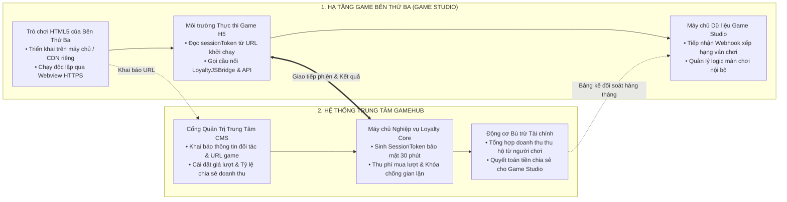
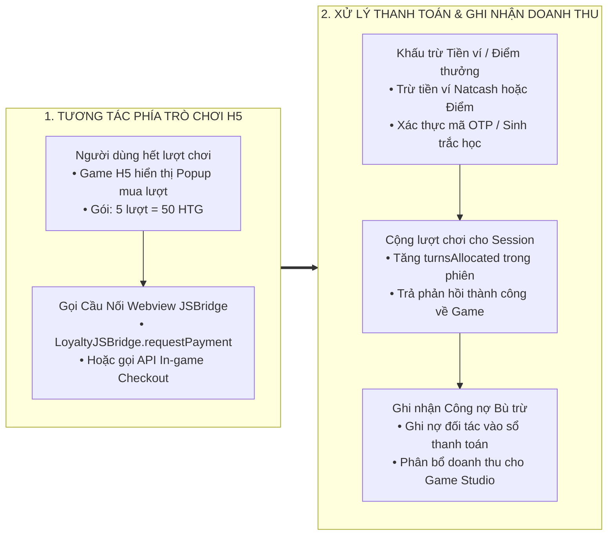

# TÀI LIỆU KỸ THUẬT: QUY TRÌNH TÍCH HỢP TRÒ CHƠI HTML5 DÀNH CHO ĐỐI TÁC BÊN THỨ BA (GAME STUDIO / NHÀ PHÁT TRIỂN GAME)

---

## 1. MỤC TIÊU VÀ ĐỊNH VỊ KIẾN TRÚC

Tài liệu này đặc tả quy trình và tiêu chuẩn kỹ thuật dành riêng cho **Đối tác Bên thứ ba sở hữu trò chơi HTML5 (Nhà phát triển game / Game Studio / Nhà cung cấp nội dung - Content Provider)** có nhu cầu đưa trò chơi của mình lên sảnh Cổng Game (GameHub) của hệ sinh thái `micro-loyalty` nhằm tiếp cận tập người dùng của các đơn vị vận hành (Ví Natcash, Siêu thị Delimart, Chuỗi bán lẻ...) và cùng chia sẻ doanh thu.

Mô hình này tách biệt hoàn toàn giữa:
* **Đơn vị Thuê bao Nền tảng (Platform Tenant):** Các doanh nghiệp sở hữu khách hàng và vận hành chương trình hội viên (Ví Natcash, Delimart...).
* **Đối tác Phát triển Trò chơi Bên thứ ba (Third-Party Game Studio / CP):** Các đơn vị sáng tạo nội dung, sở hữu bản quyền game HTML5, phát hành và kiếm doanh thu từ bán lượt chơi hoặc chia sẻ chi phí thưởng.



---

## 2. QUY TRÌNH TIẾP NHẬN & CẤU HÌNH TRÒ CHƠI BÊN THỨ BA TRÊN CMS

Khi một Đối tác Bên thứ ba muốn đưa một game mới lên hệ thống, quá trình tích hợp diễn ra hoàn toàn qua giao diện quản trị mà **không cần can thiệp hay triển khai lại mã nguồn của hệ sinh thái trung tâm**:

### 2.1. Khai báo thông tin đối tác và cấp quyền kết nối
1. Quản trị viên khởi tạo mã định danh đối tác phát triển trò chơi (`PartnerId`, `PartnerCode`).
2. Cấp khóa bí mật kết nối (`ApiKey`, `SecretKey`) phục vụ xác thực chữ ký số HMAC-SHA256 khi nhận thông báo kết quả.
3. Thiết lập tỷ lệ chia sẻ doanh thu mặc định (ví dụ: Game Studio nhận 70%, Nền tảng nhận 30%).

### 2.2. Khai báo và cài đặt tham số trò chơi (Trang Quản lý Game)
Quản trị viên mở trang [GameManagementPage.tsx](file:///Users/micro/Source/chapisoft/micro-loyalty/src/cms/src/pages/games/GameManagementPage.tsx) và cấu hình:
* **Thông tin hiển thị:** Mã game (`gameCode`), Tên trò chơi (`gameName`), Thể loại (`category`), Ảnh đại diện (`iconUrl`), Đường dẫn máy chủ của Bên thứ ba (`gameUrl`: ví dụ `https://studio-partner.com/games/candy-crush-h5`).
* **Quy chế lượt chơi và biểu phí:**
  * Số lượt chơi tặng miễn phí mỗi ngày cho hội viên (`freeTurnsDaily`).
  * Đơn giá bán thêm lượt chơi thu bằng tiền mặt ví (`pricePerTurn` đơn vị HTG, ví dụ 10 HTG/lượt).
  * Cho phép người chơi đổi điểm thưởng lấy lượt chơi (`allowPointsSpin`: Kích hoạt).
* **Khống chế an toàn ngân sách:** Hạn mức ngân sách trả thưởng tối đa trong ngày (`dailyBudgetLimit`) để khống chế rủi ro chi vượt quỹ.
* **Tham số chuyên sâu (`game_params` kiểu JSONB):** Lưu trữ các tham số đặc thù của game bên thứ ba (mức độ khó, số câu hỏi, hệ số nhân thưởng, thời gian chơi).

---

## 3. CƠ CHẾ ĐỒNG BỘ TÀI KHOẢN & QUẢN LÝ PHIÊN CHƠI KHÔNG LỘ DỮ LIỆU NHẠY CẢM

Hệ thống tuân thủ nghiêm ngặt chuẩn an ninh: **Bên thứ ba không được phép lưu trữ hoặc truy cập trực tiếp thông tin nhạy cảm của người dùng (số điện thoại, mật khẩu, số dư ví)**. Việc định danh được thực hiện qua mã phiên dùng một lần:

```
[ Người Dùng Bấm Chơi Game ]
             │
             ▼
1. Ứng dụng gửi yêu cầu: POST /gamehub/v1/session/init
   • Header: X-Tenant-Id: TENANT_NATCASH
   • Body: { "gameCode": "STUDIO_GAME_01", "externalUserId": "84988888888" }
             │
             ▼
2. GameHub Core sinh phiên bảo mật:
   • Mã phiên ngẫu nhiên: GS_9a8b7c6d... (Hết hạn sau 1.800 giây)
   • Khởi tạo số lượt khả dụng trong bảng loyalty_game_sessions
             │
             ▼
3. Mở Webview dẫn đến máy chủ Bên thứ ba:
   https://studio-partner.com/game?sessionToken=GS_9a8b7c6d&tenantId=TENANT_NATCASH&locale=vi
             │
             ▼
4. Game H5 Bên thứ ba lấy sessionToken từ URL để làm chữ ký giao dịch
```

---

## 4. CƠ CHẾ BÁN LƯỢT CHƠI & TẠO DOANH THU CHO BÊN THỨ BA

Khi người dùng chơi hết số lượt miễn phí trong ngày và muốn mua thêm lượt chơi ngay trong game H5:



### Hai phương thức thanh toán mua lượt:
1. **Mua bằng Điểm Loyalty (`POST /gamehub/v1/billing/in-game-checkout`):**
   * Hệ thống trừ điểm trên tài khoản người dùng, ghi nhận giảm nợ điểm tại Sổ cái `loyalty_point_ledger`.
   * Giá trị quy đổi điểm được chuyển hóa thành doanh thu thanh toán cho Game Studio theo tỷ lệ thỏa thuận.
2. **Mua bằng Tiền mặt Ví Điện Tử (`POST /gamehub/v1/webhooks/partner-turn-purchase`):**
   * Ứng dụng Ví khấu trừ tiền mặt trực tiếp của người dùng.
   * Gửi thông báo Webhook sang GameHub để cộng lượt tức thì và ghi nhận công nợ phải thu vào bảng `loyalty_clearing_transactions`.

---

## 5. CƠ CHẾ TIẾP NHẬN KẾT QUẢ VÁN CHƠI & PHÂN PHỐI THƯỞNG

Khi người dùng hoàn thành một ván chơi trong game của Bên thứ ba:

### 5.1. Gửi kết quả về hệ thống trung tâm
Game H5 của Bên thứ ba gửi kết quả qua điểm cuối chuẩn hóa:
* **Điểm cuối:** `POST /gamehub/v1/games/submit-result`
* **Tiêu đề:** `X-Tenant-Id: TENANT_NATCASH`
* **Dữ liệu gửi lên:**
```json
{
  "externalUserId": "USER_123456",
  "gameCode": "STUDIO_GAME_01",
  "sessionToken": "GS_9a8b7c6d...",
  "score": 1500,
  "clientTransactionRef": "STUDIO_TX_20260824_001",
  "details": "{\"level\": 10, \"combo\": 15, \"timeSpentSec\": 120}"
}
```

### 5.2. Quy trình xử lý và an toàn tài chính tại máy chủ trung tâm
1. **Khóa phân tán chống gian lận:** Chiếm giữ khóa Redisson `lock:game:{tenantId}:{gameCode}:{userId}` để ngăn chặn việc đối tác hoặc người dùng gian lận gửi nhiều kết quả đồng thời.
2. **Kiểm tra và khấu trừ lượt chơi:** Trừ 1 lượt chơi hợp lệ trong phiên `loyalty_game_sessions`.
3. **Khống chế hạn mức ngân sách:** Kiểm tra ngân sách ngày qua bộ đếm nguyên tử Redis `budget:game:{tenantId}:{gameId}:{YYYYMMDD}`.
4. **Phân phối phần thưởng:** Tự động cộng điểm vào tài khoản hội viên và ghi nhận Sổ cái điểm bất biến `loyalty_point_ledger` (`PointActionType.EARN`).
5. **Lưu vết giao dịch bất biến:** Ghi toàn bộ thông số ván chơi vào bảng `loyalty_game_play_history` với mã giao dịch duy nhất `GTRX_...`.

---

## 6. MÔ HÌNH CHIA SẺ DOANH THU & ĐỐI SOÁT THANH TOÁN VỚI BÊN THỨ BA

Cơ chế tài chính giữa Đơn vị Vận hành và Game Studio Bên thứ ba được quản lý tự động, minh bạch qua phân hệ Bù trừ Đối soát (`ClearingSettlementService`):

```
                      TỔNG DOANH THU THU HỘ TỪ BÁN LƯỢT
                                      │
            ┌─────────────────────────┴─────────────────────────┐
            ▼                                                   ▼
   70% DOANH THU GAME STUDIO                           30% DOANH THU NỀN TẢNG
 (Thanh toán cho Bên Thứ Ba)                      (Phí phát hành & Hạ tầng)
```

### 6.1. Công thức quyết toán bù trừ định kỳ
Vào cuối kỳ đối soát (Hàng ngày T+1 hoặc Ngày cuối cùng của tháng):
* **Tổng Doanh Thu Bán Lượt:**
  $$\text{Doanh Thu Thu Hộ} = \sum (\text{Giao Dịch Mua Lượt Thành Công})$$
* **Số Tiền Nền Tảng Thanh Toán Cho Game Studio:**
  $$\text{Tiền Thanh Toán Cho Game Studio} = \text{Doanh Thu Thu Hộ} \times \text{Tỷ Lệ Chia Sẻ (\%)} - \text{Thuế / Phí Kênh (nếu có)}$$

### 6.2. Bản ghi quyết toán bất biến
1. Toàn bộ giao dịch phát sinh được lưu trong bảng `loyalty_clearing_transactions` với `issuerPartnerId` (Đơn vị Thu hộ / Nền tảng) và `redeemerPartnerId` (Mã Game Studio của Bên thứ ba).
2. Tiến trình tự động gom nhóm, sinh mã quyết toán `SETTLE_{UUID}`, chuyển trạng thái sang `SETTLED`.
3. Xuất bảng kê đối soát chi tiết dạng tệp Excel/PDF phục vụ kế toán hai bên đối chiếu và thực hiện chuyển khoản thanh toán doanh thu.

---

## 7. HƯỚNG DẪN SỬ DỤNG BỘ THƯ VIỆN GAMEHUB JAVASCRIPT SDK (`gamehub-sdk.js`)

Để đơn giản hóa tối đa việc tích hợp, nền tảng cung cấp sẵn tệp thư viện JavaScript siêu nhẹ (0 phụ thuộc bên ngoài), có thể nhúng trực tiếp qua thẻ `<script>` hoặc nhập qua chuẩn ES Module:

### 7.1. Nhúng trực tiếp vào tệp HTML của Game
```html
<!-- Nhúng SDK GameHub vào đầu trang HTML -->
<script src="https://loyalty-cdn.natcash.com/sdk/gamehub-sdk.js"></script>

<script>
  // 1. Khởi tạo SDK (Tự động nhận diện sessionToken, tenantId từ URL)
  var config = GameHub.init({
    gameCode: 'STUDIO_CANDY_BURST',
    debug: true
  });

  // 2. Lắng nghe sự kiện ghi nhận kết quả và hoàn tất thanh toán
  GameHub.on('scoreSubmitted', function(result) {
    console.log('Điểm thưởng nhận được:', result.pointsAwarded);
    console.log('Mã giao dịch:', result.transactionRef);
  });

  // 3. Gửi điểm số khi kết thúc ván chơi
  function onGameOver(finalScore, levelReached) {
    GameHub.submitScore(finalScore, {
      level: levelReached,
      timeSpent: 45
    }).then(function(res) {
      alert('Bạn nhận được +' + res.pointsAwarded + ' điểm Loyalty!');
    });
  }

  // 4. Mua thêm lượt chơi bằng Điểm hoặc Ví Tiền mặt
  function onBuyTurnsClicked() {
    GameHub.buyTurns(1, 10, 'POINTS'); // hoặc 'WALLET' để mở ví
  }
</script>
```

### 7.2. Trang Demo Game mẫu thực tế
Mã nguồn trò chơi mẫu hoàn chỉnh có thể tham khảo trực tiếp tại tệp [src/webview/public/demo-game/index.html](file:///Users/micro/Source/chapisoft/micro-loyalty/src/webview/public/demo-game/index.html).

---

## 8. QUY CHUẨN OUTBOUND WEBHOOK VÀ XÁC THỰC KÝ SỐ HMAC-SHA256

Khi ván chơi hoàn tất, nếu Game Studio có đăng ký `webhookUrl` trên CMS, hệ thống sẽ tự động gửi bản tin thông báo (Server-to-Server Callback) kèm chữ ký số:

### 8.1. Cấu trúc tiêu đề (HTTP Headers)
* `Content-Type`: `application/json`
* `X-Signature`: Mã băm HMAC-SHA256 ở dạng chuỗi Hexadecimal.
* `X-Timestamp`: Dấu thời gian Unix Epoch Milliseconds.
* `X-Partner-Code`: Mã đối tác phát triển game (ví dụ `STUDIO_PHASER_VN`).

### 8.2. Dữ liệu bản tin (JSON Payload)
```json
{
  "transactionRef": "GTRX_9a8b7c6d5e4f",
  "gameCode": "STUDIO_CANDY_BURST",
  "externalUserId": "USER_84988888888",
  "score": 2500,
  "pointsAwarded": "150.00",
  "rewardType": "POINTS",
  "timestamp": 1724500000000
}
```

### 8.3. Thuật toán kiểm tra chữ ký số tại máy chủ Đối tác (Node.js / Java)
$$\text{Signature} = \text{HMAC-SHA256}(\text{JSON Payload}, \text{SecretKey})$$
Đối tác chỉ cần tính lại HMAC-SHA256 từ chuỗi JSON nhận được kết hợp với `SecretKey` đã được cấp. Nếu khớp với `X-Signature` thì bản tin là hợp lệ 100%.

---

## 9. BẢNG TỔNG HỢP CÁC ĐIỂM CUỐI TÍCH HỢP DÀNH CHO GAME STUDIO BÊN THỨ BA

| Điểm Cuối (REST Endpoint) | Phương Thức | Mục Đích Sử Dụng | Phía Gọi |
| :--- | :---: | :--- | :---: |
| `/gamehub/v1/session/init` | `POST` | Khởi tạo phiên chơi, cấp lượt và tạo URL nhúng game | App / Webview |
| `/gamehub/v1/games/submit-result` | `POST` | Gửi kết quả ván chơi, điểm số và nhận phần thưởng | Game H5 Bên Thứ Ba |
| `/gamehub/v1/billing/in-game-checkout` | `POST` | Thanh toán mua thêm lượt chơi trong game bằng Điểm | Game H5 Bên Thứ Ba |
| `/gamehub/v1/webhooks/partner-turn-purchase` | `POST` | Webhook thông báo mua lượt thành công từ Ví tiền mặt | Máy chủ Cổng Thanh toán |
| `/gamehub/v1/history/my-history` | `GET` | Tra cứu lịch sử chơi và phần thưởng của người dùng | Game H5 / Webview |
| `/loyalty/v1/luckydraw/spin` | `POST` | Thực hiện quay thưởng Vòng quay may mắn nguyên tử | Game H5 / Webview |

---

## 10. HIỆN TRẠNG TRIỂN KHAI & MỨC ĐỘ HOÀN THÀNH

Toàn bộ nền tảng hạ tầng kỹ thuật đã **hoàn thiện 100%** và sẵn sàng kết nối ngay với các Game Studio bên thứ ba:

1. **Bộ Thư Viện SDK Client:** Đã hoàn thành tệp `gamehub-sdk.js` và `gamehub-sdk.ts` độc lập, hỗ trợ tự động nhận diện token, gửi điểm và mua lượt.
2. **Cơ Chế Outbound Webhook:** Đã hoàn thành bộ phát Webhook có ký số HMAC-SHA256 trong `GameHubService.java`.
3. **Cơ Sở Dữ Liệu:** Đầy đủ bảng danh mục game, phiên chơi, lịch sử ván chơi, cấu hình tham số động JSONB và sổ cái bù trừ đối soát tài chính (`loyalty_db`).
4. **Backend API:** Sẵn sàng 100% các điểm cuối tiếp nhận kết quả, trừ lượt, thanh toán mua lượt và khóa phân tán Redisson chống gian lận.
5. **Cổng CMS:** Sẵn sàng màn hình khai báo URL nhúng game, mã đối tác, tỷ lệ chia sẻ doanh thu, Webhook URL, giá bán lượt và ngân sách ngày.
6. **Mã Nguồn Mẫu Demo:** Đã cung cấp trang demo HTML5 hoàn chỉnh tại `demo-game/index.html`.

