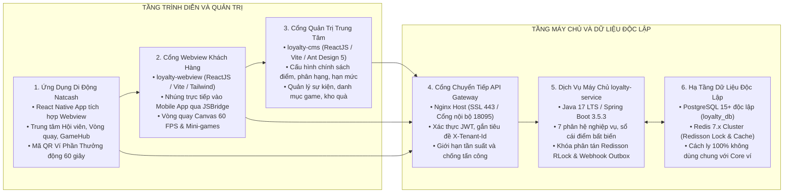
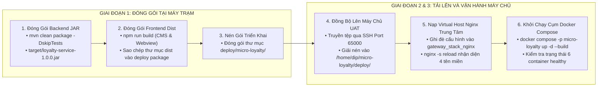

# KẾ HOẠCH PHÂN TÍCH VÀ PHƯƠNG ÁN TRIỂN KHAI CHI TIẾT HỆ THỐNG LOYALTY LÊN MÁY CHỦ
**Mã tài liệu:** `HDCD_VH_LOYALTY_v1.0`  
**Hệ thống áp dụng:** Hệ sinh thái Khách hàng thân thiết liên minh và Cổng Game đa thuê bao (`micro-loyalty`)  
**Mã nguồn tham chiếu:** `/Users/micro/Source/chapisoft/micro-loyalty`  
**Trạng thái phê duyệt:** Sẵn sàng triển khai theo yêu cầu  

---

## 1. TỔNG QUAN HỆ THỐNG VÀ BỘ SẢN PHẨM BÀN GIAO

Dự án **Hệ sinh thái Khách hàng thân thiết liên minh và Cổng Game đa thuê bao (`micro-loyalty`)** cung cấp nền tảng quản trị tích và tiêu điểm hợp nhất, phân hạng hội viên động, liên thông Ví Phần Thưởng tại điểm bán (POS) và cổng trò chơi hóa giải trí (Gamification). Hệ sinh thái được thiết kế theo kiến trúc dịch vụ vi mô độc lập, hỗ trợ đồng thời mô hình SaaS Đa Thuê Bao và mô hình On-Premise Tại Chỗ.



### 1.1. Danh Mục Bộ Sản Phẩm Bàn Giao Cốt Lõi
1. **Dịch vụ máy chủ nghiệp vụ độc lập (`loyalty-service`):**
   - Nền tảng: Java 17 LTS, Spring Boot 3.5.3, quản trị cơ sở dữ liệu quan hệ độc lập `loyalty_db` trên PostgreSQL 15+ (tách biệt 100% với cơ sở dữ liệu ví điện tử).
   - Vận hành 7 phân hệ nghiệp vụ cốt lõi: Quản trị hội viên, Quản trị chính sách điểm thưởng, Quản trị phân hạng, Đổi quà và Voucher, Cổng GameHub & Vòng quay, Đối soát bù trừ tài chính, Quản trị tham số đối tác đa thuê bao.
   - Cơ chế Transactional Outbox Webhook ký số HMAC-SHA256, kiểm soát khóa phân tán Redisson RLock chống tiêu điểm kép và bộ kiểm thử tự động 61/61 ca kiểm thử đạt kết quả tuyệt đối.
2. **Cổng thông tin quản trị trung tâm (`loyalty-cms`):**
   - Nền tảng: ReactJS 18, TypeScript, Vite, Ant Design 5.
   - Chức năng: Quản lý cấu hình tham số động JSONB, chính sách phân hạng, tỷ lệ chia sẻ doanh thu và tra cứu lịch sử giao dịch.
3. **Cổng Webview nhúng đa nền tảng (`loyalty-webview`):**
   - Nền tảng: ReactJS 18, Vite, TailwindCSS Mobile-First.
   - Chức năng: Cầu nối `LoyaltyJSBridge` hai chiều với ứng dụng gốc, vòng quay may mắn Canvas 60 FPS và sảnh minigame HTML5.
4. **Bộ thư viện SDK Tích Hợp Game HTML5 (`gamehub-sdk.js` / `gamehub-sdk.ts`):**
   - Thư viện JavaScript siêu nhẹ (0 phụ thuộc bên ngoài) dành cho Game Studio bên thứ ba tích hợp đăng nhập SSO, nhận diện token phiên và ghi nhận kết quả trả thưởng.
5. **Cổng nhà phát triển và trình giả lập (`loyalty-sandbox`):**
   - Cổng tự phục vụ dành cho nhà phát triển đối tác tra cứu tài liệu API, kiểm tra sinh chữ ký số HMAC-SHA256 và thử nghiệm bắn Webhook giả lập.

---

## 2. PHÂN TÍCH HIỆN TRẠNG VÀ SO SÁNH 2 MÔ HÌNH TRIỂN KHAI

Hệ thống Loyalty hỗ trợ 2 mô hình triển khai độc lập cho 2 môi trường hạ tầng riêng biệt:

| Tiêu chí so sánh | Môi trường 1: SaaS Đa Thuê Bao (`deploy/micro-loyalty`) | Môi trường 2: On-Premise Ví Natcash (`deploy/natcash`) |
| :--- | :--- | :--- |
| **Mục đích sử dụng** | Môi trường UAT, Multi-tenant Cloud cho đối tác liên minh | Môi trường sản xuất chuyên dụng cho ví điện tử Natcash |
| **Địa chỉ máy chủ** | `210.211.102.99` (Cổng SSH: `65000`, Tài khoản: `dip`) | `10.228.37.65` (Cổng SSH: `22`, Tài khoản: `mascom`) |
| **Hệ điều hành** | Ubuntu Linux 22.04 LTS x86_64 (Kernel 5.15.0) | CentOS Linux 7 (Core) x86_64 |
| **Kiến trúc triển khai** | Cụm 6 vùng chứa khép kín qua **Docker Compose** | Triển khai thực thi trực tiếp **Native JVM** trên máy chủ vật lý |
| **Dịch vụ Backend** | Vùng chứa `loyalty-saas-service` (cổng nội bộ `8088`) | File JAR chạy qua JDK 17 tại `/u01/mascom/build/jdk17/bin/java` (cổng `8085`) |
| **Cơ sở dữ liệu** | Vùng chứa PostgreSQL 15 riêng (cổng Host `15435`, DB `loyalty_db`) | PostgreSQL 13/15 nội bộ tại `/u01/mascom/build/postgre/` (cổng `5432`, DB `natcash_loyalty_db`) |
| **Bộ nhớ đệm & Khóa** | Vùng chứa Redis 7 riêng (cổng Host `16385`, Pass: `Loyalty_RedisPass2026!`) | Redis nội bộ cụm ví (cổng `6379`, Pass: `NatCash2022`) |
| **Điều phối Nginx** | Nginx Gateway nội bộ cổng `18095` kết hợp Nginx Host cổng `80/443` | Nginx 1.20.2 phân lập: Cổng `8443` (Internet HTTPS) và Cổng `8080` (Nội bộ VPN) |
| **Hệ thống tên miền** | `api.mid.io.vn`, `docs.mid.io.vn`, `cms.mid.io.vn`, `portal.mid.io.vn` | `loyalty.natcom.com.ht:8443`, `testeuapi.natcom.com.ht:8443` |

### 2.1. Đánh Giá Tài Nguyên Phần Cứng Trên Máy Chủ UAT (`210.211.102.99`)
- **Năng lực xử lý CPU**: 8 Cores (Intel Xeon E5450 @ 3.00GHz) – Tải trung bình thực tế dưới 25%, năng lực xử lý đáp ứng xuất sắc.
- **Bộ nhớ RAM vật lý**: Tổng 32.0 GB (Đang sử dụng: ~21.0 GB, Khả dụng: **~8.5 GB**).
  - Cụm dịch vụ Loyalty thực tế chỉ chiếm dụng **~2.2 GB RAM** (Backend 1GB, PostgreSQL 512MB, Redis 256MB, Webview + CMS + Gateway 400MB).
  - Duy trì mức dự phòng an toàn **~6.3 GB RAM** cho toàn bộ máy chủ, hoàn toàn loại bỏ nguy cơ Out of Memory (OOM).
- **Dung lượng lưu trữ**: Phân vùng gốc dung lượng 272 GB (Đã dùng: 86 GB, Khả dụng: **173 GB**, tỷ lệ sử dụng 34%).

### 2.2. Ma Trận Phân Bổ Cổng Mạng Chống Xung Đột Tài Nguyên
Trên máy chủ `210.211.102.99` hiện đang vận hành đồng thời Nền tảng DIP, Cụm Smart-OTP và Cụm Micro-CRM. Ma trận cổng mạng của Loyalty được cấp phát phân lập tuyệt đối:

| Dịch vụ và Phân hệ | Cổng mạng Host | Giao thức | Dự án sở hữu | Trạng thái xung đột |
| :--- | :---: | :---: | :--- | :---: |
| **DIP PostgreSQL & Redis** | `5432`, `6379` | TCP | Hệ thống DIP | Đang chạy, không giao thoa |
| **Micro-CRM PostgreSQL & Redis** | `15432`, `16379` | TCP | Hệ thống Micro-CRM | Đang chạy, không giao thoa |
| **Smart-OTP PostgreSQL & Redis** | `15433`, `16380` | TCP | Hệ thống Smart-OTP | Đang chạy, không giao thoa |
| **Smart-OTP Nginx Gateway** | `18090` | TCP HTTP | Hệ thống Smart-OTP | Đang chạy, không giao thoa |
| **Loyalty PostgreSQL Chuyên Dụng** | **`15435`** | TCP | Hệ sinh thái Loyalty | Cấp phát mới, độc lập hoàn toàn |
| **Loyalty Redis Chuyên Dụng** | **`16385`** | TCP | Hệ sinh thái Loyalty | Cấp phát mới, độc lập hoàn toàn |
| **Loyalty Nginx Gateway Nội Bộ** | **`18095`** | TCP HTTP | Hệ sinh thái Loyalty | Cấp phát mới, độc lập hoàn toàn |
| **Loyalty Core Service** | `8088` (Nội bộ Docker) | TCP HTTP | Hệ sinh thái Loyalty | Cách ly hoàn toàn trong mạng Docker |

---

## 3. PHƯƠNG ÁN TRIỂN KHAI CHI TIẾT MÔ HÌNH 1: SAAS CLOUD (DOCKER COMPOSE)

Áp dụng cho máy chủ UAT `210.211.102.99:65000` (User: `dip`, khóa SSH: `~/.ssh/jenkins_deploy_dev`).



### Bước 1: Đóng Gói Bản Dựng Tại Máy Trạm Cục Bộ
Thực hiện trong thư mục dự án `/Users/micro/Source/chapisoft/micro-loyalty`:

```bash
# 1. Đóng gói Backend Java Spring Boot
cd /Users/micro/Source/chapisoft/micro-loyalty/src/service
mvn clean package -DskipTests
cp target/loyalty-service-1.0.0.jar ../../deploy/micro-loyalty/backend/loyalty-service.jar

# 2. Đóng gói Cổng Quản Trị CMS
cd ../cms
npm install
npm run build
rm -rf ../../deploy/micro-loyalty/frontend/cms/dist
cp -r dist ../../deploy/micro-loyalty/frontend/cms/dist

# 3. Đóng gói Cổng Webview & GameHub
cd ../webview
npm install
npm run build
rm -rf ../../deploy/micro-loyalty/frontend/webview/dist
cp -r dist ../../deploy/micro-loyalty/frontend/webview/dist
```

### Bước 2: Đồng Bộ Gói Triển Khai Lên Máy Chủ UAT
```bash
cd /Users/micro/Source/chapisoft/micro-loyalty
tar -czf - -C deploy/micro-loyalty . | ssh -i ~/.ssh/jenkins_deploy_dev -p 65000 dip@210.211.102.99 "mkdir -p /home/dip/micro-loyalty/deploy && tar -xzf - -C /home/dip/micro-loyalty/deploy"
```

### Bước 3: Nạp Cấu Hình Nginx Host Gateway Trung Tâm
Đăng nhập SSH vào máy chủ `210.211.102.99` và nạp cấu hình Virtual Host:

```bash
ssh -i ~/.ssh/jenkins_deploy_dev -p 65000 dip@210.211.102.99 "
cat /home/dip/micro-loyalty/deploy/config/nginx/host-loyalty-vhost.conf > /home/dip/dip/deploy/gateway/config/conf.d/micro-loyalty.conf
docker exec \$(docker ps -q --filter 'name=gateway_stack_nginx') nginx -t
docker exec \$(docker ps -q --filter 'name=gateway_stack_nginx') nginx -s reload
"
```

### Bước 4: Khởi Chạy Cụm 6 Vùng Chứa Docker Compose
```bash
ssh -i ~/.ssh/jenkins_deploy_dev -p 65000 dip@210.211.102.99 "
cd /home/dip/micro-loyalty/deploy
docker compose -p micro-loyalty up -d --build
docker compose -p micro-loyalty ps
"
```

---

## 4. PHƯƠNG ÁN TRIỂN KHAI CHI TIẾT MÔ HÌNH 2: ON-PREMISE VÍ NATCASH (NATIVE JVM)

Áp dụng cho máy chủ vật lý riêng biệt `10.228.37.65:22` (User: `mascom`, CentOS 7).

### Bước 1: Khởi Tạo Cơ Sở Dữ Liệu PostgreSQL Trên Máy Chủ Natcash
Đăng nhập SSH vào máy chủ `10.228.37.65` bằng tài khoản `mascom`:

```bash
# 1. Tạo thư mục dữ liệu PostgreSQL chuyên dụng nếu chưa có
mkdir -p /u01/mascom/build/postgre/data
mkdir -p /u01/mascom/build/postgre/logs

# 2. Khởi tạo cluster dữ liệu chuẩn UTF-8 (thực hiện một lần đầu tiên)
if [ ! -f /u01/mascom/build/postgre/data/PG_VERSION ]; then
    /u01/mascom/build/postgre/bin/initdb -D /u01/mascom/build/postgre/data -E UTF8 --locale=en_US.UTF-8
fi

# 3. Khởi động dịch vụ PostgreSQL trên cổng 5432
/u01/mascom/build/postgre/bin/pg_ctl -D /u01/mascom/build/postgre/data -l /u01/mascom/build/postgre/logs/postgres.log start

# 4. Tạo User và Database độc lập cho Loyalty
/u01/mascom/build/postgre/bin/psql -h 127.0.0.1 -p 5432 -U \$(whoami) -d postgres -c "
CREATE USER natcash_loyalty WITH PASSWORD 'Natcash\$SecureDB2026!';
CREATE DATABASE natcash_loyalty_db OWNER natcash_loyalty ENCODING 'UTF8';
GRANT ALL PRIVILEGES ON DATABASE natcash_loyalty_db TO natcash_loyalty;
"
```

### Bước 2: Thiết Lập Cấu Trúc Thư Mục Triển Khai
```bash
mkdir -p /u01/mascom/ringme/loyalty-game/{app,config,scripts,logs,frontend/dist,backup}
chmod -R 755 /u01/mascom/ringme/loyalty-game
```

### Bước 3: Đóng Gói Và Đồng Bộ Mã Nguồn
```bash
# 1. Đóng gói Backend JAR
cd /Users/micro/Source/chapisoft/micro-loyalty/src/service
mvn clean package -DskipTests

# 2. Truyền file JAR sang máy chủ Natcash
scp -P 22 target/loyalty-service-1.0.0.jar mascom@10.228.37.65:/u01/mascom/ringme/loyalty-game/app/loyalty-service.jar

# 3. Truyền cấu hình và kịch bản vận hành
scp -P 22 /Users/micro/Source/chapisoft/micro-loyalty/deploy/natcash/config/backend/application-natcash.yml mascom@10.228.37.65:/u01/mascom/ringme/loyalty-game/config/application.yml
scp -P 22 /Users/micro/Source/chapisoft/micro-loyalty/deploy/natcash/scripts/start.sh mascom@10.228.37.65:/u01/mascom/ringme/loyalty-game/scripts/start.sh
scp -P 22 /Users/micro/Source/chapisoft/micro-loyalty/deploy/natcash/scripts/stop.sh mascom@10.228.37.65:/u01/mascom/ringme/loyalty-game/scripts/stop.sh

# 4. Cấp quyền thực thi kịch bản
ssh -p 22 mascom@10.228.37.65 "chmod +x /u01/mascom/ringme/loyalty-game/scripts/*.sh"
```

### Bước 4: Cấu Hình Nginx Reverse Proxy Phân Lập
Nạp cấu hình vào `/u01/mascom/build/nginx/conf/natcash/loyalty.conf`:
- **Cổng 8443 (Internet HTTPS qua SSL `*.natcom.com.ht`)**: Chuyển tiếp `/gamehub/` tới Webview và `/loyalty/api/` tới Backend `127.0.0.1:8085`.
- **Cổng 8080 (Chỉ mở trong VPN nội bộ)**: Phục vụ Cổng Quản trị CMS, nghiêm cấm mở cổng này ra Internet.

Tải lại cấu hình Nginx:
```bash
ssh -p 22 mascom@10.228.37.65 "/u01/mascom/build/nginx/sbin/nginx -s reload"
```

### Bước 5: Khởi Chạy Dịch Vụ Native JVM
```bash
ssh -p 22 mascom@10.228.37.65 "bash /u01/mascom/ringme/loyalty-game/scripts/start.sh"
```

---

## 5. KỊCH BẢN ĐO KIỂM VÀ NGHIỆM THU SAU TRIỂN KHAI (SMOKE TEST)

### 5.1. Thực Thi Kịch Bản Kiểm Tra Sức Khỏe Tự Động (`healthcheck.sh`)
Trên máy chủ UAT:
```bash
ssh -i ~/.ssh/jenkins_deploy_dev -p 65000 dip@210.211.102.99 "bash /home/dip/micro-loyalty/deploy/scripts/healthcheck.sh"
```

**Kết quả kỳ vọng:**
```text
=== [HEALTHCHECK-SAAS] KIỂM TRA SỨC KHỎE HỆ THỐNG LOYALTY (PORT 18095) ===
1. Kiểm tra Liveness Backend: OK
2. Kiểm tra Readiness Backend: OK
3. Kiểm tra Cổng Quản Trị CMS: OK
4. Kiểm tra Cổng Webview GameHub: OK
=== [HEALTHCHECK-SAAS] TOÀN BỘ CỤM DỊCH VỤ HOẠT ĐỘNG HOÀN HẢO 100% ===
```

### 5.2. Đo Kiểm Chi Tiết Từng Điểm Cuối Bằng `curl`
```bash
# 1. Kiểm tra Liveness Backend qua Domain chính thức
curl -s -o /dev/null -w "%{http_code}" -H "Host: api.mid.io.vn" http://210.211.102.99/actuator/health
# Kết quả kỳ vọng: 200

# 2. Kiểm tra tài liệu Swagger UI & OpenAPI Specification
curl -s -o /dev/null -w "%{http_code}" -H "Host: docs.mid.io.vn" http://210.211.102.99/v3/api-docs
# Kết quả kỳ vọng: 200

# 3. Kiểm tra nạp trang Cổng Quản Trị CMS
curl -s -o /dev/null -w "%{http_code}" -H "Host: cms.mid.io.vn" http://210.211.102.99/index.html
# Kết quả kỳ vọng: 200

# 4. Kiểm tra Cổng Webview & GameHub
curl -s -o /dev/null -w "%{http_code}" -H "Host: portal.mid.io.vn" http://210.211.102.99/index.html
# Kết quả kỳ vọng: 200

# 5. Kiểm tra trực tiếp qua cổng Gateway nội bộ 18095
curl -i http://210.211.102.99:18095/loyalty/actuator/health
```

---

## 6. KẾ HOẠCH SAO LƯU, KHÔI PHỤC THẢM HỌA VÀ ROLLBACK AN TOÀN

### 6.1. Quy Trình Sao Lưu Dữ Liệu Tự Động Định Kỳ
Kịch bản sao lưu tự động được cấu hình chạy hàng ngày qua Cronjob lúc 02h00 sáng:

```bash
#!/usr/bin/env bash
# Tệp: /home/dip/micro-loyalty/deploy/scripts/backup.sh
BACKUP_DIR="/home/dip/micro-loyalty/deploy/backups"
TIMESTAMP=$(date +"%Y%m%d_%H%M%S")
mkdir -p "${BACKUP_DIR}"

# 1. Sao lưu cơ sở dữ liệu PostgreSQL
docker exec loyalty-saas-postgres pg_dump -U loyalty_app -d loyalty_db | gzip > "${BACKUP_DIR}/loyalty_db_${TIMESTAMP}.sql.gz"

# 2. Xóa các bản sao lưu cũ hơn 14 ngày để giải phóng dung lượng đĩa
find "${BACKUP_DIR}" -type f -name "*.sql.gz" -mtime +14 -delete
```

### 6.2. Kịch Bản Khôi Phục Thảm Họa (Disaster Recovery)
Khi cơ sở dữ liệu gặp sự cố hỏng hóc hoặc mất dữ liệu ngoài ý muốn:
```bash
# 1. Tạm dừng dịch vụ backend để cô lập luồng ghi
docker stop loyalty-saas-service

# 2. Xả và nạp lại dữ liệu từ bản sao lưu gần nhất
gunzip -c /home/dip/micro-loyalty/deploy/backups/loyalty_db_YYYYMMDD_HHMMSS.sql.gz | docker exec -i loyalty-saas-postgres psql -U loyalty_app -d loyalty_db

# 3. Khởi động lại dịch vụ backend và kiểm tra nhật ký
docker start loyalty-saas-service
docker logs -f --tail 100 loyalty-saas-service
```

### 6.3. Kịch Bản Rollback Bản Phát Hành Khi Gặp Sự Cố
Nếu phiên bản mới phát sinh lỗi nghiêm trọng sau khi triển khai:
1. **Đối với Môi trường SaaS:**
   ```bash
   cd /home/dip/micro-loyalty/deploy
   # Khôi phục file JAR bản dựng trước đó
   cp backend/loyalty-service.jar.bak backend/loyalty-service.jar
   # Tái khởi động container backend
   docker compose restart loyalty-service
   ```
2. **Đối với Môi trường On-Premise Natcash:**
   ```bash
   ssh -p 22 mascom@10.228.37.65 "
   bash /u01/mascom/ringme/loyalty-game/scripts/stop.sh
   cp /u01/mascom/ringme/loyalty-game/backup/loyalty-service-previous.jar /u01/mascom/ringme/loyalty-game/app/loyalty-service.jar
   bash /u01/mascom/ringme/loyalty-game/scripts/start.sh
   "
   ```

---

## 7. BẢNG MÃ LỖI HỆ THỐNG VÀ PLAYBOOK XỬ LÝ SỰ CỐ KHẨN CẤP

### 7.1. Bảng Mã Lỗi Hệ Thống Chuẩn 9 Cột

| STT | Phân loại | Tên module | Mã lỗi | Ý nghĩa mã lỗi | Mức độ | Nguyên nhân gốc rễ | Biện pháp khắc phục chi tiết | SLA MTTR |
| :---: | :--- | :--- | :--- | :--- | :---: | :--- | :--- | :---: |
| 1 | Cơ sở dữ liệu | Database Pool | `ERR_DB_POOL_EXHAUSTED` | Cạn kiệt Connection Pool HikariCP | Critical | Tải truy vấn tăng đột biến hoặc có truy vấn chạy ngầm giữ kết nối quá lâu | Tăng `maximum-pool-size: 50`, kiểm tra và ngắt các truy vấn treo trong PostgreSQL | ≤ 15 phút |
| 2 | Khóa phân tán | Redisson Engine | `ERR_REDIS_LOCK_TIMEOUT` | Tranh chấp khóa tiêu điểm Redisson quá hạn | Major | Nhiều yêu cầu trừ điểm đồng thời trên cùng tài khoản hội viên vượt quá 3.000ms | Kiểm tra độ trễ mạng Redis, tối ưu thời gian giao dịch ghi sổ cái điểm | ≤ 10 phút |
| 3 | Tích hợp ngoại vi | Webhook Outbox | `ERR_WEBHOOK_DELIVERY_FAILED` | Không gửi được Webhook biến động điểm sang Core ví | Major | Cổng API đối tác ví bị treo hoặc đường truyền mạng chập chờn | Bộ đệm Outbox tự động thử lại 5 lần; kiểm tra trạng thái bảng dead-letter | ≤ 30 phút |
| 4 | Cổng Gateway | Nginx Host | `ERR_NGINX_502_BAD_GATEWAY` | Cổng Nginx không kết nối được dịch vụ Backend | Critical | Tiến trình `loyalty-service` bị tràn bộ nhớ (OOM) hoặc chưa khởi động xong | Khởi động lại container backend, kiểm tra nhật ký `OutOfMemoryError` để tăng heap JVM | ≤ 10 phút |
| 5 | Bảo mật API | Security Filter | `ERR_HMAC_SIGNATURE_INVALID` | Chữ ký số HMAC-SHA256 không hợp lệ | Major | Sai lệch `SecretKey` hoặc tham số request bị thay đổi trên đường truyền | Kiểm tra cấu hình SecretKey của đối tác và kiểm tra độ lệch thời gian `X-Timestamp` | ≤ 20 phút |

### 7.2. Playbook Xử Lý Sự Cố 3 Tầng Khẩn Cấp

```text
+-------------------------------------------------------------------------------------------------------------------+
| TẦNG 1: SỰ CỐ DỊCH VỤ ỨNG DỤNG (APPLICATION LAYER)                                                               |
+-------------------------------------------------------------------------------------------------------------------+
| Hiện tượng: Người dùng báo lỗi 502 Bad Gateway hoặc không mở được Cổng Game Webview.                              |
| 1. Kiểm tra trạng thái container: docker ps -a | grep loyalty                                                     |
| 2. Xem 100 dòng log gần nhất:    docker logs --tail 100 loyalty-saas-service                                      |
| 3. Khởi động lại dịch vụ:        docker restart loyalty-saas-service                                              |
| 4. Kiểm tra sức khỏe phục hồi:   curl -I http://127.0.0.1:18095/loyalty/actuator/health                           |
+-------------------------------------------------------------------------------------------------------------------+

+-------------------------------------------------------------------------------------------------------------------+
| TẦNG 2: SỰ CỐ MÁY CHỦ VÀ BỘ NHỚ ĐỆM (SERVER & REDIS LAYER)                                                        |
+-------------------------------------------------------------------------------------------------------------------+
| Hiện tượng: Khóa phân tán Redisson báo lỗi Timeout, giao dịch trừ điểm bị gián đoạn.                             |
| 1. Kiểm tra kết nối Redis:       docker exec loyalty-saas-redis redis-cli -a Loyalty_RedisPass2026! ping          |
| 2. Kiểm tra bộ nhớ Redis:        docker exec loyalty-saas-redis redis-cli -a Loyalty_RedisPass2026! info memory   |
| 3. Giải phóng bộ đệm nếu quá tải:docker restart loyalty-saas-redis                                                |
+-------------------------------------------------------------------------------------------------------------------+

+-------------------------------------------------------------------------------------------------------------------+
| TẦNG 3: SỰ CỐ CƠ SỞ DỮ LIỆU (DATABASE LAYER)                                                                      |
+-------------------------------------------------------------------------------------------------------------------+
| Hiện tượng: HikariCP báo connection timeout, giao dịch ghi sổ cái điểm bị nghẽn.                                  |
| 1. Kiểm tra các kết nối đang hoạt động:                                                                           |
|    docker exec loyalty-saas-postgres psql -U loyalty_app -d loyalty_db -c                                         |
|    "SELECT pid, state, query, age(clock_timestamp(), query_start) FROM pg_stat_activity WHERE state != 'idle';"  |
| 2. Ngắt các truy vấn treo lâu hơn 30 giây:                                                                        |
|    docker exec loyalty-saas-postgres psql -U loyalty_app -d loyalty_db -c                                         |
|    "SELECT pg_terminate_backend(pid) FROM pg_stat_activity WHERE age(clock_timestamp(), query_start) > '30s';"   |
+-------------------------------------------------------------------------------------------------------------------+
```

---

## 8. ĐIỀU KIỆN SẴN SÀNG THỰC THI (ACTION READINESS)

Toàn bộ gói triển khai mẫu và kịch bản vận hành đã sẵn sàng trong thư mục `deploy/`. Tuân thủ nguyên tắc an toàn vận hành: **Tuyệt đối không tự ý thực thi kết nối máy chủ từ xa khi chưa có yêu cầu cụ thể từ người dùng**. Khi có chỉ đạo kích hoạt triển khai lên môi trường nào (SaaS UAT `210.211.102.99` hay On-Premise Natcash `10.228.37.65`), kỹ thuật viên vận hành sẽ tiến hành thực thi theo đúng từng bước của tài liệu này.
