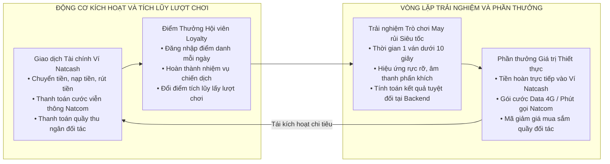
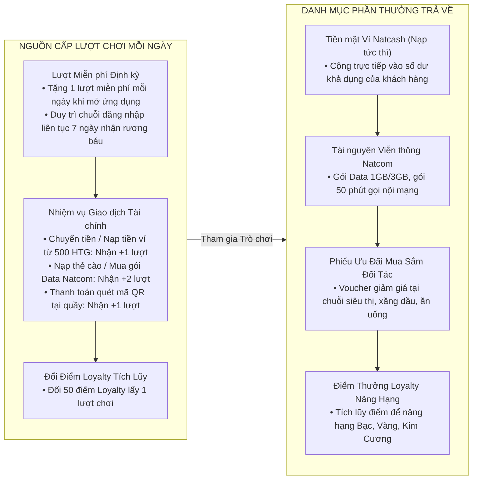

# DANH MỤC TRÒ CHƠI CỔNG GAME VÀ CHIẾN LƯỢC PHÁT TRIỂN HỆ SINH THÁI LOYALTY

Tài liệu đặc tả danh mục các trò chơi HTML5 mang tính may rủi vui nhộn, hấp dẫn, dễ tiếp cận và được tối ưu hóa chuyên biệt cho người dùng ví điện tử Natcash cùng thị trường Haiti.

---

## 1. TỔNG QUAN CHIẾN LƯỢC DANH MỤC TRÒ CHƠI

Cổng Game (GameHub) trong hệ sinh thái `micro-loyalty` không chỉ đóng vai trò là một tiện ích giải trí đơn thuần, mà là một động cơ giữ chân khách hàng (Retention Engine) và kích hoạt giao dịch (Transaction Activation Engine) cốt lõi.

### Phân Định Danh Mục Sản Phẩm:
1. **Phân hệ Vòng Quay May Mắn Nền Tảng (LuckyDraw Engine):** Đã tích hợp sẵn trong hệ thống, hỗ trợ động cơ nạp đa giao diện chủ đề linh hoạt (Dynamic Themes) theo từng mùa lễ hội hoặc chiến dịch thương hiệu.
2. **Bộ Sưu Tập 7 Trò Chơi May Rủi Mới Độc Lập:** Bộ trò chơi tương tác tức thì, tập trung vào trải nghiệm may rủi kịch tính, đồ họa bắt mắt và cơ chế phần thưởng hấp dẫn.

---

## 2. NÂNG CẤP ĐA GIAO DIỆN CHỦ ĐỀ CHO VÒNG QUAY NỀN TẢNG (LUCKYDRAW THEMES)

Vòng quay may mắn (LuckyDraw) là tính năng cốt lõi đã có sẵn. Thay vì xây dựng lại từ đầu, hệ thống bổ sung **Cơ chế Đổi Giao Diện Chủ Đề (Dynamic Theme Switcher)** được cấu hình trực tiếp từ Cổng quản trị Loyalty CMS:

* **Giao diện 1 — Tiêu Chuẩn Ví Natcash (Default Brand Theme):** Tông màu đỏ cam và trắng hiện đại, ánh kim sang trọng của thương hiệu Natcash.
* **Giao diện 2 — Lễ Hội Đường Phố Lửa Rực Rỡ (Kanaval Festive Theme):** Sắc màu nhiệt đới rực rỡ, vòng quay trang trí lông vũ, mặt nạ hóa trang và hiệu ứng lửa ấm áp cùng âm nhạc lễ hội Haiti.
* **Giao diện 3 — Đêm Biển Đảo Caribe (Caribbean Summer Night Theme):** Nền biển đêm xanh ngọc, rạn san hô phát sáng và ngọc trai lấp lánh.
* **Giao diện 4 — Năm Mới & Giáng Sinh Rộn Ràng (Holiday & New Year Theme):** Hộp quà thắt nơ, pháo hoa nổ rực rỡ đón chào năm mới.

---

## 3. BỘ SƯU TẬP 7 TRÒ CHƠI MAY RỦI MỚI ĐỘC LẬP

---

### 3.1. Vé Cào Trúng Thưởng Siêu Tốc (Instant Scratch Card)

* **Bối cảnh & Phong cách:** Mô phỏng chiếc vé cào may mắn trúng liền, một nét văn hóa giải trí rất quen thuộc trong đời sống hàng ngày tại Haiti.
* **Cơ chế tương tác:** Màn hình hiển thị tấm vé với ma trận 3×3 ô phủ lớp mạ bạc. Người chơi dùng ngón tay vuốt trực tiếp lên màn hình để bóc mở từng ô hoặc bấm nút "Cào tất cả" để mở nhanh.
* **Yếu tố may rủi & Cảm xúc:**
  * Tìm đủ 3 biểu tượng trùng khớp (3 túi tiền vàng, 3 quả dừa nhiệt đới, 3 vương miện) để nhận giải thưởng tương ứng.
  * Việc cào mở từng góc tạo cảm giác tự tay khám phá vận may vô cùng kích thích.
* **Thời gian 1 ván:** 5 đến 8 giây.

---

### 3.2. Sút Phạt Đền Cuồng Nhiệt (Penalty Football Shootout)

* **Bối cảnh & Phong cách:** Bóng đá là môn thể thao được yêu thích cuồng nhiệt số một tại Haiti. Sân vận động chật kín khán giả reo hò dưới ánh đèn rực rỡ.
* **Cơ chế tương tác:** Người chơi đặt bóng tại chấm phạt đền 11m, vuốt tay trên màn hình để chọn góc sút và lực sút (Góc cao trái/phải, Góc thấp trái/phải, hoặc Sút chính diện) đối đầu với thủ môn máy tính.
* **Yếu tố may rủi & Cảm xúc:**
  * Máy chủ tính toán xác suất thủ môn bay người cản phá hoặc bắt hụt.
  * Bóng tung lưới: Khán giả reo hò cuồng nhiệt, pháo sáng rực rỡ và nhận thưởng lớn.
  * Bóng trúng cột dọc/xà ngang: Nhận phần thưởng an ủi và điểm kinh nghiệm.
* **Thời gian 1 ván:** 3 đến 5 giây.

---

### 3.3. Mở Rương Báu Vùng Biển Caribe (Pirate Treasure Chests)

* **Bối cảnh & Phong cách:** Hang động bí mật dưới đáy biển Caribe với những chiếc rương kho báu cổ mạ vàng, bản đồ da dê và đá quý lấp lánh.
* **Cơ chế tương tác:** Màn hình xuất hiện 3 hoặc 5 chiếc rương cổ đang khóa chặt đung đưa. Người chơi chạm tay chọn duy nhất 1 chiếc rương để mở khóa.
* **Yếu tố may rủi & Cảm xúc:**
  * Mỗi rương ẩn chứa một bất ngờ: Rương chứa tiền vàng ngập tràn, Rương ngọc bích nhân ba điểm thưởng, hoặc Rương Nổ Hũ (Jackpot) tích lũy của tuần.
  * Hiệu ứng mở nắp rương phát ra luồng ánh sáng chói lọi cùng âm thanh mở khóa kim loại chân thực.
* **Thời gian 1 ván:** 3 đến 4 giây.

---

### 3.4. Tháp Kho Báu May Mắn (Treasure Tower Climb)

* **Bối cảnh & Phong cách:** Ngọn tháp kho báu 5 tầng với các bậc đá cổ kính chứa đầy phần thưởng tăng dần theo độ cao.
* **Cơ chế tương tác:** Mỗi tầng tháp có 3 ô cửa đá. Người chơi chạm mở 1 ô để bước lên tầng tiếp theo:
  * **Ô May Mắn:** Mở ra ngọc quý, nhân đôi hệ số phần thưởng (Tầng 1: ×1, Tầng 2: ×2, Tầng 3: ×5, Tầng 4: ×10, Đỉnh tháp: ×50). Người chơi có quyền chọn **Dừng lại bảo toàn nhận thưởng ngay** hoặc **Bước tiếp lên tầng cao hơn**.
  * **Ô Bẫy Đá Sập:** Ván chơi kết thúc, người chơi nhận phần thưởng an ủi cố định.
* **Yếu tố may rủi & Cảm xúc:** Sự giằng xé kịch tính giữa việc dừng lại an toàn hay mạo hiểm leo tiếp để ăn giải thưởng khổng lồ.
* **Thời gian 1 ván:** 4 đến 8 giây.

---

### 3.5. Thả Bi Ziczac May Mắn (Plinko Ball Drop)

* **Bối cảnh & Phong cách:** Trò chơi bàn đinh kinh điển với thiết kế dạng thác nước nhiệt đới neon hiện đại.
* **Cơ chế tương tác:** Người chơi nhấn nút thả bóng tròn từ đỉnh bàn đinh ziczac. Quả bóng nảy ngẫu nhiên qua các chốt đinh và rơi xuống các ô hệ số nhân phần thưởng ở đáy bàn.
* **Yếu tố may rủi & Cảm xúc:**
  * Quỹ đạo rơi của bóng biến đổi liên tục sau mỗi lần va chạm đinh ghim, tạo cảm giác nín thở theo dõi từng cú nảy.
  * Các ô ở đáy có hệ số thưởng đối xứng: Ở giữa là hệ số an toàn (×1, ×1.5), hai mép ngoài cùng là hệ số siêu khủng (×10, ×50, ×100).
* **Thời gian 1 ván:** 6 đến 10 giây.

---

### 3.6. Đập Trứng Vàng May Mắn (Golden Egg Smash)

* **Bối cảnh & Phong cách:** Nông trại nhiệt đới vui nhộn với 3 đến 5 quả trứng vàng khổng lồ đung đưa trên tổ rơm.
* **Cơ chế tương tác:** Người chơi điều khiển chiếc búa thần kỳ gõ mạnh vào một quả trứng vàng bất kỳ để đập vỡ vỏ trứng.
* **Yếu tố may rủi & Cảm xúc:**
  * Vỏ trứng nứt ra kèm theo tiếng nổ pháo hoa, gà con nhảy múa mang theo các phong bao lì xì tiền mặt hoặc phiếu giảm giá.
  * Thao tác 1 chạm siêu nhanh, phù hợp cho mọi đối tượng khách hàng ở mọi lứa tuổi.
* **Thời gian 1 ván:** 3 đến 4 giây.

---

### 3.7. Lắc Cốc Xúc Xắc Tài Lộc (Lucky Dice Roll)

* **Bối cảnh & Phong cách:** Trò chơi lắc xúc xắc dân gian quen thuộc trên nền bàn gỗ cổ điển.
* **Cơ chế tương tác:** Người chơi nhấn nút lắc chiếc cốc da chứa 2 hoặc 3 viên xúc xắc 3D. Cốc mở ra và các viên xúc xắc đổ ra bàn.
* **Yếu tố may rủi & Cảm xúc:**
  * Tính điểm theo các bộ số may mắn: Đạt cặp số giống nhau (như đôi 6), tổng điểm nút trên 10, hoặc số tiến (4-5-6) để nhận giải thưởng lớn.
  * Có thể mở rộng sang cơ chế đường đua thám hiểm: Số điểm nút lắc được là số bước nhân vật di chuyển trên bản đồ nhận quà.
* **Thời gian 1 ván:** 4 đến 5 giây.

---

## 4. MA TRẬN SO SÁNH VÀ ĐÁNH GIÁ CHỈ SỐ VẬN HÀNH

| Phân Loại & Tên Trò Chơi | Thời Lượng | Mức Độ Kịch Tính | Độ Hợp Thị Trường Haiti | Tải Trọng Đồ Họa | Độ Phức Tạp Lập Trình |
| :--- | :---: | :---: | :---: | :---: | :---: |
| **Vòng Quay LuckyDraw (Đổi Theme)** | 4 – 6 giây | Cao | Tuyệt đối | Có sẵn | Đã hoàn thành |
| **1. Vé Cào Trúng Thưởng** | 5 – 8 giây | Rất cao | Rất cao | Siêu nhẹ (~250KB) | Thấp |
| **2. Sút Phạt Đền Cuồng Nhiệt** | 3 – 5 giây | Cực cao | Tuyệt đối | Nhẹ (~400KB) | Trung bình |
| **3. Mở Rương Báu Caribe** | 3 – 4 giây | Cao | Rất cao | Siêu nhẹ (~220KB) | Thấp |
| **4. Tháp Kho Báu May Mắn** | 4 – 8 giây | Cực cao | Rất cao | Siêu nhẹ (~250KB) | Trung bình |
| **5. Thả Bi Ziczac (Plinko)** | 6 – 10 giây | Cực cao | Cao | Nhẹ (~350KB) | Trung bình |
| **6. Đập Trứng Vàng** | 3 – 4 giây | Trung bình | Cao | Siêu nhẹ (~200KB) | Thấp |
| **7. Lắc Cốc Xúc Xắc** | 4 – 5 giây | Cao | Cao | Siêu nhẹ (~250KB) | Thấp |

---

## 5. CƠ CHẾ TRÒ CHƠI HÓA VÀ GẮN KẾT VÍ NATCASH

Để các trò chơi phát huy tối đa hiệu quả kinh doanh, toàn bộ luồng cấp phát lượt chơi và trả thưởng được liên kết chặt chẽ với các hành vi trên ứng dụng ví Natcash:

---

## 6. KIẾN TRÚC KỸ THUẬT VÀ BẢO MẬT PHÍA MÁY CHỦ

1. **Thuật toán sinh kết quả ngẫu nhiên bảo mật (Backend RNG):**
   * Phía giao diện Frontend Webview **tuyệt đối không nắm giữ logic tính toán thắng thua**.
   * Khi người chơi bấm nút chơi, ứng dụng gửi yêu cầu `POST /api/v1/games/play` lên máy chủ `loyalty-service`.
   * Backend kiểm tra lượt chơi hợp lệ, chiếm giữ khóa phân tán `lock:spin:tenant_id:game_id:user_id` qua Redisson, thực thi thuật toán quay số có trọng số cấu hình từ CMS kết hợp hạn mức ngân sách ngày, rồi trả về mã giải thưởng cùng góc quay/vị trí hiển thị.
   * Giao diện chỉ thực thi hoạt họa (Animation) khớp với kết quả máy chủ đã chỉ định.
2. **Khóa chống gian lận và chống bẫy đồng thời:**
   * Ngăn chặn người chơi can thiệp sửa đổi gói tin, chặn đứng việc mở nhiều luồng bắn request cùng một thời điểm để trục lợi lượt chơi.
3. **Cơ chế ghi sổ bất biến và đối soát:**
   * Mọi lượt chơi đều được ghi nhận vào bảng `loyalty_game_turns` và `loyalty_point_ledger` với đầy đủ mã giao dịch duy nhất, thời gian và giá trị phần thưởng.

---

## 7. LỘ TRÌNH TRIỂN KHAI THEO TỪNG GIAI ĐOẠN

* **Giai đoạn 1 (Ra mắt Cốt lõi & Đổi Theme Vòng Quay):**
  * Tích hợp bộ **Theme Lễ hội Kanaval** cho Vòng quay LuckyDraw sẵn có.
  * Phát hành trò chơi mới: **Vé Cào Trúng Thưởng Siêu Tốc**.
  * Tích hợp nhiệm vụ nhận lượt chơi từ giao dịch nạp tiền ví Natcash và cước Natcom.
* **Giai đoạn 2 (Mở rộng Tương tác Thể thao & Thử Thách Mạo Hiểm):**
  * Ra mắt **Sút Phạt Đền Cuồng Nhiệt** và **Tháp Kho Báu May Mắn**.
  * Ra mắt **Mở Rương Báu Vùng Biển Caribe** kết hợp sự kiện nổ hũ Jackpot cuối tuần.
* **Giai đoạn 3 (Đa dạng hóa Trải nghiệm):**
  * Bổ sung **Thả Bi Ziczac (Plinko)**, **Đập Trứng Vàng** và **Lắc Cốc Xúc Xắc**.
  * Mở rộng cổng cấu hình tùy biến tỷ lệ trúng thưởng linh hoạt cho quản trị viên đối tác trên Loyalty CMS.
