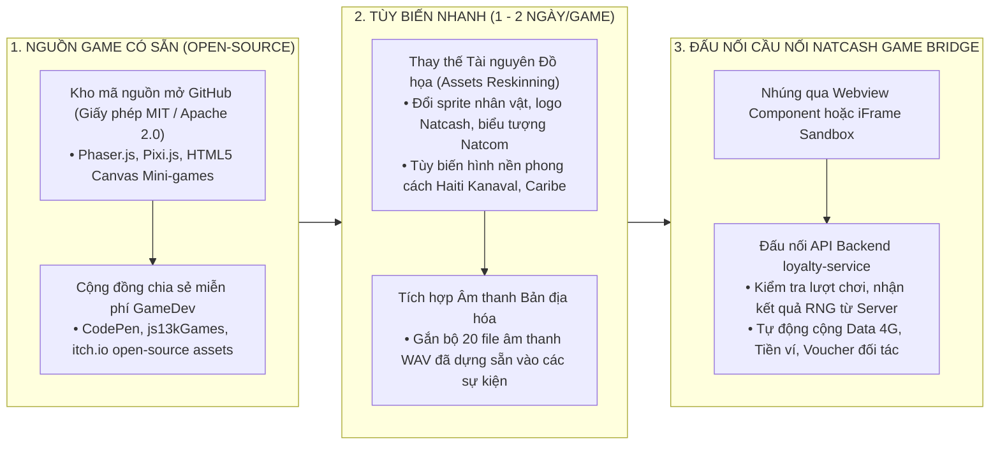
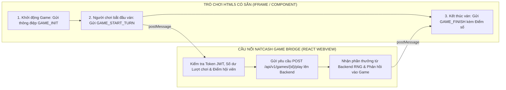
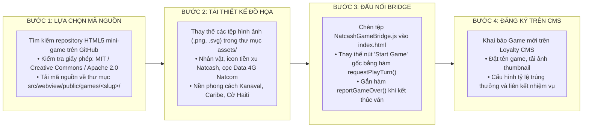

# DANH MỤC TRÒ CHƠI CỔNG GAME VÀ CHIẾN LƯỢC TẬN DỤNG MÃ NGUỒN MỞ (OPEN-SOURCE HTML5 INTEGRATION)

Tài liệu đặc tả giải pháp tận dụng các trò chơi HTML5 có sẵn từ các kênh chia sẻ miễn phí và cộng đồng mã nguồn mở, kết hợp quy trình tùy biến nhanh (Reskinning & Branding) và đấu nối cầu nối API chuẩn hóa với hệ sinh thái Loyalty Ví Natcash.

---

## 1. CHIẾN LƯỢC TẬN DỤNG GAME CÓ SẴN (FAST RESKINNING & TIME-TO-MARKET)

Thay vì phải thiết kế đồ họa vật lý, lập trình bộ máy chuyển động (Physics Engine) và viết mã logic từ đầu cho từng trò chơi (tốn 2-4 tuần/game), hệ thống áp dụng **Chiến Lược Tái Bản Hóa Nhanh (Fast Reskinning Strategy)**:



### Ưu Điểm Đột Phá Của Giải Pháp:
1. **Rút ngắn 85% thời gian phát triển:** Từ 3-4 tuần/game xuống chỉ còn **1 - 2 ngày làm việc** cho 1 game hoàn chỉnh (chỉ cần thay đổi ảnh, màu sắc và gắn hàm gọi API).
2. **Gameplay đã được kiểm chứng (Proven Fun & Stability):** Các tựa game mã nguồn mở kinh điển (như Flappy, 2048, Lật thẻ, Bắn bóng) đã có hàng triệu người chơi trên toàn cầu, logic hoạt họa cực kỳ mượt mà và không lo phát sinh lỗi chuyển động vật lý.
3. **Chi phí gần như bằng 0:** Khai thác 100% tài nguyên miễn phí với giấy phép mở thương mại (MIT / Creative Commons / Apache 2.0).

---

## 2. DANH MỤC 10 TRÒ CHƠI HTML5 CÓ SẴN PHÙ HỢP NHẤT CHO THỊ TRƯỜNG HAITI

| STT | Tên Trò Chơi Gốc & Nguồn Mở | Tên Bản Địa Hóa Natcash | Bối Cảnh Tùy Biến Cho Haiti | Cách Chơi & Thời Gian 1 Ván | Mức Độ Hấp Dẫn |
| :---: | :--- | :--- | :--- | :--- | :---: |
| **1** | **Flappy Bird Clone** *(HTML5 Canvas / MIT)* | **Flappy Natcom (Bay Vượt Trạm Sóng)** | Điều khiển chú chim Natcom bay qua các khe hở giữa các cột thu phát sóng viễn thông 4G Natcom. | Chạm màn hình giữ độ cao. Vượt 10 trạm nhận quà.<br/>*(Thời gian: 10 - 20 giây)* | Cực kỳ cuốn hút |
| **2** | **2048 Game Engine** *(Gabriele Cirulli / MIT)* | **2048 Natcash Edition** | Ghép các đồng tiền Gourde (HTG) và logo Natcom/Natcash từ 2 $\rightarrow$ 4 $\rightarrow$ 8 $\rightarrow$ ... $\rightarrow$ 2048. | Vuốt 4 hướng để gộp ô. Đạt mốc 512, 1024, 2048 nhận Data 4G.<br/>*(Thời gian: 1 - 2 phút)* | Trí tuệ cao |
| **3** | **Memory Match Card** *(HTML5 JS / MIT)* | **Lật Thẻ Tìm Cặp Nhận Quà** | Bộ thẻ bài in logo các đối tác lớn tại Haiti: Siêu thị Delimart, Cây xăng TotalEnergies, Natcom, Ví Natcash. | Lật mở từng cặp thẻ giống nhau trong 30 giây.<br/>*(Thời gian: 15 - 30 giây)* | Dễ chơi, hợp mọi lứa tuổi |
| **4** | **Bubble Shooter 2D** *(Phaser.js / MIT)* | **Bắn Bóng Nổ Hũ Kanaval** | Súng thần công bắn các quả bóng màu rực rỡ lễ hội Kanaval Haiti (Đỏ, Vàng, Xanh, Tím). | Bắn trúng cụm 3 bóng cùng màu để ăn điểm thưởng.<br/>*(Thời gian: 30 - 45 giây)* | Rất thư giãn |
| **5** | **Fruit Ninja / Fruit Slice Clone** *(Canvas / MIT)* | **Chém Hoa Quả Vùng Vịnh Caribe** | Chém các loại trái cây nhiệt đới đặc trưng của Haiti: Dừa, Xoài Francisque, Dứa, Đu đủ. | Vuốt tay chém hoa quả bay lên, tránh chém trúng bom.<br/>*(Thời gian: 20 - 30 giây)* | Kịch tính cao |
| **6** | **Knife Hit Clone** *(Phaser / Canvas / MIT)* | **Phi Dao Vòng Gỗ Thần Tài** | Bàn gỗ xoay tròn đính các phong bao lì xì và gói Data. Người chơi căn nhịp phi dao găm vào thớt gỗ. | Chạm để phi dao, không được phi đè lên dao đã cắm.<br/>*(Thời gian: 10 - 15 giây)* | Thử thách phản xạ |
| **7** | **Block Puzzle / Tetris Classic** *(HTML5 Canvas / MIT)* | **Xếp Gạch Kim Cương Natcash** | Xếp các khối gạch màu sắc lấp đầy hàng ngang hoặc cột dọc để phát nổ tiền vàng. | Kéo thả khối gạch vào bàn cờ 8×8 hoặc 10×10.<br/>*(Thời gian: 1 - 2 phút)* | Giữ chân cực lâu |
| **8** | **Endless Runner 2D** *(Canvas / MIT)* | **Đường Đua Siêu Tốc Port-au-Prince** | Nhân vật chạy vượt chướng ngại vật trên đường phố Haiti, nhặt các đồng tiền vàng Natcash. | Nhảy và trượt để né xe buýt Tap-Tap và chướng ngại vật.<br/>*(Thời gian: 20 - 40 giây)* | Phấn khích |
| **9** | **Match-3 Jewel / Candy Engine** *(HTML5 / MIT)* | **Ghép 3 Kim Cương Caribe** | Ghép các viên đá quý, ngọc bích và rương báu biển Caribe để mở khóa các mốc điểm. | Đổi vị trí 2 ô liền kề tạo hàng 3 viên cùng loại.<br/>*(Thời gian: 30 - 60 giây)* | Gây nghiện cao |
| **10** | **Wordle Clone Multi-language** *(React / MIT)* | **Đoán Chữ May Mắn (Creole / Pháp)** | Đoán từ vựng bí ẩn có 5 chữ cái bằng tiếng Creole hoặc tiếng Pháp trong 6 lần thử. | Nhập chữ đoán, ô đổi màu Xanh/Vàng/Xám.<br/>*(Thời gian: 1 - 2 phút)* | Văn hóa bản địa |

---

## 3. KIẾN TRÚC TÍCH HỢP VÀ CẦU NỐI KỸ THUẬT (NATCASH GAME BRIDGE SDK)

Để nhúng bất kỳ trò chơi HTML5 có sẵn nào vào ứng dụng Webview Natcash mà không cần sửa đổi sâu mã nguồn gốc của game, hệ thống sử dụng cơ chế **Cầu Nối Thông Điệp (Window PostMessage Bridge)** chuẩn hóa:



### 3.1. Mã Nguồn Cầu Nối Chuẩn Hóa (`NatcashGameBridge.js`)

Tệp script siêu nhẹ này được nhúng trực tiếp vào tệp `index.html` của bất kỳ trò chơi mã nguồn mở nào:

```javascript
// public/games/common/NatcashGameBridge.js
window.NatcashGameBridge = {
  // 1. Gửi yêu cầu bắt đầu chơi và trừ lượt lên Webview cha
  requestPlayTurn: function(gameCode, callback) {
    window.parent.postMessage({
      type: 'NATCASH_GAME_PLAY_REQUEST',
      gameCode: gameCode,
      timestamp: Date.now()
    }, '*');

    // Lắng nghe kết quả phần thưởng trả về từ Backend
    window.addEventListener('message', function onResult(event) {
      if (event.data && event.data.type === 'NATCASH_GAME_RESULT') {
        window.removeEventListener('message', onResult);
        callback(event.data.payload);
      }
    });
  },

  // 2. Báo cáo kết thúc ván chơi và gửi điểm số để ghi nhận BXH
  reportGameOver: function(gameCode, score, stats) {
    window.parent.postMessage({
      type: 'NATCASH_GAME_OVER',
      gameCode: gameCode,
      score: score,
      stats: stats
    }, '*');
  },

  // 3. Phát âm thanh đồng bộ qua hệ thống âm thanh Webview
  playSound: function(soundName) {
    window.parent.postMessage({
      type: 'NATCASH_PLAY_SOUND',
      sound: soundName
    }, '*');
  }
};
```

---

## 4. QUY TRÌNH 4 BƯỚC CHUYỂN ĐỔI GAME CÓ SẴN THÀNH GAME NATCASH (SOP)



* **Thời gian thực hiện toàn bộ quy trình:** Chỉ mất **từ 4 đến 8 giờ làm việc** cho 1 lập trình viên Frontend để đưa một tựa game mới tinh lên sóng!

---

## 5. KẾT LUẬN VÀ KẾ HOẠCH HÀNH ĐỘNG

Chiến lược tận dụng các game có sẵn giúp Natcash:

1. **Sở hữu ngay Cổng Game đồ sộ với 10+ trò chơi hấp dẫn** chỉ trong vòng 1-2 tuần mà không cần đội ngũ Game Studio chuyên trách.
2. **Đảm bảo gameplay mượt mà, ổn định 100%** trên mọi dòng máy điện thoại thông minh từ cấu hình thấp đến cao tại Haiti.
3. **Linh hoạt thay đổi chủ đề theo từng sự kiện:** Khi đến mùa bóng đá World Cup, giải vô địch Haiti (Ligue Haïtienne) hay Lễ hội Kanaval, chỉ cần thay đổi bộ ảnh nền trong 1 giờ là có ngay một phiên bản game mới phục vụ chiến dịch tiếp thị.
