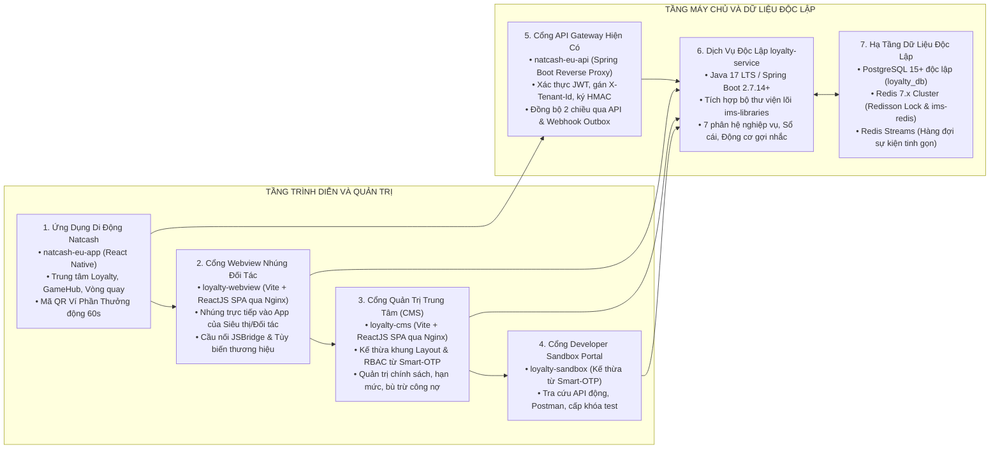
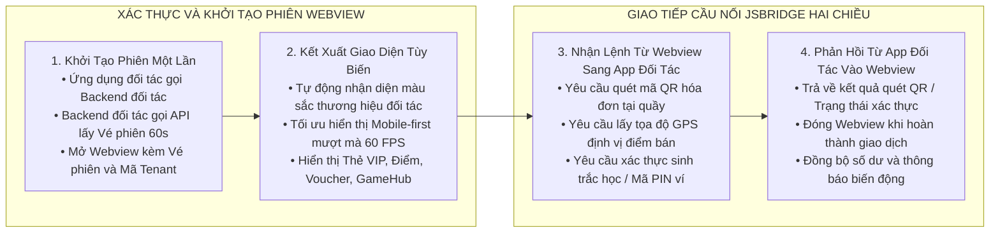
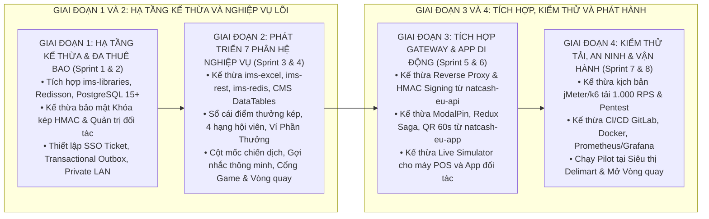

# TÀI LIỆU PHƯƠNG ÁN, GIẢI PHÁP VÀ KẾ HOẠCH SẢN XUẤT CHI TIẾT
## Nền Tảng Độc Lập Khách Hàng Thân Thiết Liên Minh và Cổng Game Đa Thuê Bao

> **Đơn vị xây dựng:** Nhóm Kiến trúc và Giải pháp Số — Natcash  
> **Bộ sản phẩm bàn giao chính thức:**  
> 1. Dịch vụ máy chủ nghiệp vụ độc lập: `loyalty-service` (Java 17 LTS / Spring Boot 2.7.14+)  
> 2. Cơ sở dữ liệu quan hệ độc lập: **PostgreSQL 15+** (`loyalty_db` tách biệt 100% với `natcash_db`)  
> 3. Cổng thông tin quản trị trung tâm: `loyalty-cms` (ReactJS 18+ / TypeScript / Vite / Ant Design 5.x / Nginx)  
> 4. Cổng trải nghiệm Webview nhúng đa nền tảng: `loyalty-webview` (ReactJS 18+ / TypeScript / Vite / TailwindCSS Mobile-First / Nginx)  
> 5. Cổng nhà phát triển và trình giả lập: `loyalty-sandbox` (ReactJS 18+ / Vite / Nginx)  
> 6. Bộ công cụ tích hợp ứng dụng di động: `natcash-eu-app` & Mobile SDK (React Native)  
> 7. Cổng kết nối trung gian: `natcash-eu-api` (Java Spring Boot Reverse Proxy)  
> **Chiến lược sản xuất:** Kế thừa và tái sử dụng toàn diện từ Giai đoạn 1 đến Giai đoạn 4 bộ khung mã nguồn, 11 module thư viện lõi (`ims-libraries`), giải pháp an ninh khóa kép HMAC-SHA256, giao diện quản trị CMS, cổng Developer Sandbox, bộ kết nối Gateway, cấu trúc Mobile App và kịch bản kiểm thử tải / CI/CD đã được kiểm chứng từ dự án `smart-otp` (`/Users/micro/Source/chapisoft/smart-otp`), giúp tiết kiệm **12 – 15 tuần-người** và rút ngắn 40% – 50% tổng thời gian phát triển.  
> **Loại tài liệu:** Phương Án Kỹ Thuật, Bảng Phân Rã Chi Tiết Giai Đoạn – Đợt Nước Rút – Tác Vụ và Kế Hoạch Sản Xuất Thực Thi

---

## 1. TỔNG QUAN DỰ ÁN VÀ MỤC TIÊU SẢN XUẤT

### 1.1. Mục Tiêu Sản Xuất
Xây dựng và phát hành toàn diện hệ sinh thái Khách hàng thân thiết và Cổng Game độc lập hoàn chỉnh, bao gồm các trụ cột sản phẩm phần mềm chính:
1. **Dịch vụ máy chủ nghiệp vụ (`loyalty-service`):** Vận hành với cơ sở dữ liệu `loyalty_db` trên **PostgreSQL 15+** độc lập 100% với hệ thống ví `natcash_db`, quản lý sổ cái điểm thưởng kép, thăng hạng 4 cấp, cột mốc chiến dịch, liên thông Ví Phần Thưởng, xử lý Webhook Outbox và đối soát bù trừ tài chính liên minh.
2. **Cổng thông tin quản trị (`loyalty-cms`):** Cung cấp giao diện trực quan cho quản trị viên Natcash và các đối tác liên minh để cấu hình chính sách tích/tiêu điểm, quản lý hạn mức, duyệt chiến dịch cột mốc, quản lý kho quà, phân quyền người dùng và đối soát công nợ.
3. **Cổng Webview nhúng đa nền tảng (`loyalty-webview`):** Cung cấp giao diện sẵn sàng nhúng vào ứng dụng di động của các đối tác bên ngoài (siêu thị Delimart, ngân hàng liên kết, chuỗi bán lẻ) thông qua giao chế xác thực một lần (SSO Ticket) và cầu nối giao tiếp `LoyaltyJSBridge` mà đối tác không cần tự xây dựng lại giao diện từ đầu.
4. **Cổng Developer Sandbox Portal (`loyalty-sandbox`):** Cổng tự phục vụ dành cho nhà phát triển đối tác và studio game lẻ để tra cứu tài liệu API, lấy mã khóa thử nghiệm và kiểm thử tích hợp.
5. **Bộ tích hợp Ứng dụng di động (`natcash-eu-app`):** Tích hợp Trung tâm Loyalty, Mã QR Ví Phần Thưởng động 60 giây, Cổng Game và trò chơi Vòng quay may mắn.

---

### 1.2. Sơ Đồ Kiến Trúc Tổng Thể Hệ Thống

---

## 2. CHIẾN LƯỢC KẾ THỪA VÀ TÁI SỬ DỤNG MÃ NGUỒN XUYÊN SUỐT 4 GIAI ĐOẠN

Dự án `micro-loyalty` kế thừa toàn diện các thành phần kỹ thuật từ dự án `smart-otp` trên cả 4 giai đoạn phát triển:

```mermaid
flowchart LR
    subgraph S_INHERIT ["CÁC CẤU PHẦN KẾ THỪA TỪ SMART-OTP (XUYÊN SUỐT 4 GIAI ĐOẠN)"]
        direction TB
        I_G1["1. Giai Đoạn 1: Hạ Tầng Lõi & Bảo Mật B2B (Kế thừa 85% - 95%)<br/>• 11 module ims-libraries (ims-core, ims-redis, ims-rest, ims-security...)<br/>• Khóa kép X-Api-Key/SecretKey, HMAC-SHA256, X-Timestamp ±300s<br/>• Docker Compose, Nginx Gateway, Private Subnet nội bộ (172.18.0.1:18090)"]
        I_G2["2. Giai Đoạn 2: Nghiệp Vụ & CMS (Kế thừa 50% - 70%)<br/>• ims-excel: Streaming SXSSF nạp 10.000 voucher & xuất báo cáo bù trừ<br/>• ims-rest: Resilience4j Circuit Breaker & Retry gọi kết nối ví/cước/POS<br/>• ims-redis: Lệnh nguyên tử DECRBY trừ ngân sách Vòng quay may mắn<br/>• Khung DataTable chuẩn, Filter, Drawer, Form Zod trên CMS"]
        I_G3["3. Giai Đoạn 3: Tích Hợp Gateway & Mobile App (Kế thừa 60% - 90%)<br/>• natcash-eu-api: Reverse Proxy giải mã JWT, gán Header, ký HMAC<br/>• natcash-eu-app: Redux Toolkit, ModalPin xác thực, QR đếm lùi 60s<br/>• Live Simulator: Trình giả lập POS siêu thị và App đối tác gọi JSBridge"]
        I_G4["4. Giai Đoạn 4: Kiểm Thử, An Ninh & CI/CD (Kế thừa 75% - 85%)<br/>• Kịch bản JMeter / k6 kiểm thử tải 1.000 RPS & Redis Concurrency<br/>• Kịch bản Pentest: Chống Replay Attack, SQLi, XSS, Redisson Lock<br/>• Pipeline GitLab CI/CD tự động, Prometheus / Grafana Dashboards"]
        I_G1 --> I_G2
        I_G2 --> I_G3
        I_G3 --> I_G4
    end

    subgraph S_CORE_LOYALTY ["CẤU PHẦN TẬP TRUNG PHÁT TRIỂN MỚI (NGHIỆP VỤ LÕI)"]
        direction TB
        C_LEDGER["1. Sổ Cái Điểm & Chu Kỳ Phân Hạng<br/>• Sổ cái điểm thưởng kép bất biến, kiểm soát điểm tạm giữ<br/>• Phân hạng 4 cấp (Bạc, Vàng, Bạch Kim, Kim Cương) chu kỳ 12 tháng"]
        C_WALLET["2. Liên Thông Ví Phần Thưởng & Bù Trừ Đa Phương<br/>• Tra cứu & Khấu trừ trực tiếp tại máy POS siêu thị Delimart<br/>• Động cơ quyết toán bù trừ công nợ giữa Viễn thông và Siêu thị"]
        C_NUDGE["3. Cột Mốc Chiến Dịch & Gợi Nhắc Thông Minh<br/>• Chuỗi cột mốc nhiệm vụ nhiều chặng tuần lễ vàng<br/>• Gợi nhắc nâng hạng & Hết hạn điểm (Tối đa 1 thông báo/ngày)"]
        C_GAME["4. Cổng Game & Vòng Quay May Mắn Canvas<br/>• Đĩa quay Canvas 60 FPS, âm thanh sống động<br/>• Trình chơi game HTML5 & Thu phí in-game qua số dư ví"]
        C_LEDGER --> C_WALLET
        C_WALLET --> C_NUDGE
        C_NUDGE --> C_GAME
    end

    I_G4 -->|"Cung cấp nền tảng vận hành toàn diện cho"| C_LEDGER
```

### Lợi Ích Cụ Thể Của Chiến Lược Kế Thừa:
1. **Tiết kiệm nguồn lực:** Tiết kiệm tổng cộng từ **12 đến 15 tuần-người** trên toàn bộ các khâu từ backend, frontend CMS, tích hợp Gateway, mobile app đến kiểm thử tải và DevOps.
2. **Rút ngắn 40% – 50% thời gian phát triển:** Giảm thiểu tối đa việc phải xây dựng lại các thành phần kỹ thuật nền tảng, tập trung 100% nguồn lực vào bài toán nghiệp vụ lõi Khách hàng thân thiết và Cổng Game.
3. **Độ ổn định và an ninh cao:** Kế thừa trực tiếp các giải pháp an ninh (HMAC-SHA256, Redisson Lock, Private LAN Subnet, Circuit Breaker) đã được chứng minh hiệu quả và kiểm thử thành công trên hệ thống ví Natcash.

---

## 3. THIẾT KẾ PHÂN HỆ CỔNG WEBVIEW NHÚNG CHO ĐỐI TÁC (`loyalty-webview`)

Phân hệ Webview nhúng giải quyết bài toán: **Cho phép đối tác bên ngoài (Ứng dụng siêu thị Delimart, Ứng dụng cây xăng) cung cấp toàn bộ trải nghiệm Khách hàng thân thiết và Cổng Game cho người dùng của họ ngay lập tức mà không phải tốn thời gian lập trình giao diện gốc.**

### 3.1. Đặc Tả Bộ Cầu Nối JSBridge Chuẩn Hóa

Webview cung cấp đối tượng toàn cục `window.LoyaltyJSBridge` cho phép giao tiếp hai chiều với Ứng dụng đối tác:

| Tên hàm JSBridge | Hướng truyền | Tham số đầu vào | Mô tả chức năng và Ý nghĩa |
| :--- | :---: | :--- | :--- |
| `requestPayment(payload)` | Webview → App | `{ amount, orderCode, description }` | Yêu cầu ứng dụng đối tác mở modal nhập mã PIN hoặc xác thực khuôn mặt để trừ tiền ví/tài khoản. |
| `requestScanQR()` | Webview → App | `{ promptText }` | Yêu cầu ứng dụng đối tác mở camera quét mã QR trên hóa đơn mua sắm. |
| `onScanQRResult(data)` | App → Webview | `{ qrContent }` | Ứng dụng đối tác trả kết quả quét mã QR vào Webview để xử lý khấu trừ điểm. |
| `closeWebview()` | Webview → App | `{ reason }` | Yêu cầu đóng trình duyệt Webview quay lại màn hình chính của ứng dụng đối tác. |
| `shareSocial(payload)` | Webview → App | `{ title, message, url }` | Yêu cầu ứng dụng mở hộp thoại chia sẻ thành tích game hoặc mã quà tặng lên mạng xã hội. |

---

## 4. THIẾT KẾ HỆ THỐNG QUẢN TRỊ TRUNG TÂM DỊCH VỤ (`loyalty-cms`)

Hệ thống Quản trị Trung tâm `loyalty-cms` kế thừa bộ khung Admin, hệ thống i18n và module phân quyền từ `src/cms/cms-admin` của Smart-OTP, tích hợp thêm các phân hệ nghiệp vụ Loyalty chuyên sâu:

```mermaid
flowchart LR
    subgraph S_CMS_CORE ["QUẢN TRỊ NGHIỆP VỤ LÕI VÀ CHÍNH SÁCH"]
        direction TB
        M_TENANT["1. Quản Trị Thuê Bao & Đối Tác (Kế thừa Smart-OTP)<br/>• Quản lý danh sách đối tác liên minh<br/>• Cấp phát và thu hồi API Key / Secret Key<br/>• Phân quyền người dùng theo vai trò đa cấp RBAC"]
        M_POLICY["2. Thiết Lập Quy Tắc & Chính Sách<br/>• Cấu hình tỷ lệ tích điểm theo giao dịch ví/cước<br/>• Cấu hình tỷ lệ khấu trừ tối đa tại từng điểm bán<br/>• Cấu hình tỷ giá quy đổi 1 điểm = 1 HTG"]
        M_TIER["3. Quản Trị Hạng & Đặc Quyền<br/>• Định nghĩa 4 hạng Bạc, Vàng, Bạch Kim, Kim Cương<br/>• Cấu hình ngưỡng điểm xét hạng & chu kỳ 12 tháng<br/>• Thiết lập hệ số nhân điểm và hạn mức miễn phí"]
        M_TENANT --> M_POLICY
        M_POLICY --> M_TIER
    end

    subgraph S_CMS_OP ["QUẢN TRỊ VẬN HÀNH, CHIẾN DỊCH VÀ ĐỐI SOÁT"]
        direction TB
        M_CAMPAIGN["4. Quản Trị Chiến Dịch & Cột Mốc<br/>• Tạo chiến dịch khuyến mại & chuỗi cột mốc sự kiện<br/>• Cấu hình kịch bản gợi nhắc thông minh 08:00 AM<br/>• Kiểm soát tần suất thông báo chống làm phiền"]
        M_REWARD["5. Quản Trị Kho Quà & Vouchers (Kế thừa ims-excel)<br/>• Nạp CSV 10.000 voucher streaming không tràn RAM<br/>• Cấu hình danh mục quà hiện vật đổi tại quầy<br/>• Giám sát hạn mức ngân sách quà tặng thời gian thực"]
        M_GAME["6. Quản Trị Cổng Game & Vòng Quay<br/>• Quản lý danh mục game lẻ và nhà phát triển<br/>• Thiết lập cơ cấu giải thưởng & ma trận xác suất<br/>• Khống chế ngân sách trúng thưởng hàng ngày"]
        M_SETTLE["7. Tài Chính, Đối Soát & Báo Cáo (Kế thừa ims-excel)<br/>• Báo cáo tổng hợp số điểm phát hành và tiêu dùng<br/>• Xuất bảng kê quyết toán bù trừ đa phương Excel/PDF<br/>• Phê duyệt kết chuyển công nợ giữa các bên"]
        M_CAMPAIGN --> M_REWARD
        M_REWARD --> M_GAME
        M_GAME --> M_SETTLE
    end

    M_TIER --> M_CAMPAIGN
```

---

## 5. BẢNG PHÂN RÃ TỔNG HỢP TOÀN DIỆN CÔNG VIỆC KỸ THUẬT (PHASE – SPRINT – TASK)

Kế hoạch sản xuất được chia thành **4 Giai Đoạn (Phases)**, **8 Đợt Chạy Nước Rút (Sprints)** và **42 Tác Vụ (Tasks)** kỹ thuật chi tiết. Toàn bộ các tác vụ được hợp nhất thành một bảng tổng thể duy nhất, các dòng phân nhóm Giai đoạn và Đợt nước rút được gộp trọn vẹn thành 1 ô mở rộng toàn hàng (`colspan="6"`), căn lề trái trực quan:

<table>
<thead>
<tr>
  <th style="width: 1%; white-space: nowrap; text-align: center;">Mã Task</th>
  <th style="width: 18%; text-align: left;">Tên tác vụ kỹ thuật</th>
  <th style="width: 11%; text-align: left;">Phân hệ / Dự án</th>
  <th style="width: 27%; text-align: left;">Mô tả kỹ thuật và Phạm vi thực hiện</th>
  <th style="width: 13%; text-align: center;">Nguồn gốc / Kế thừa</th>
  <th style="width: 19%; text-align: left;">Tiêu chí hoàn thành (DoD)</th>
  <th style="width: 11%; text-align: center;">Tình trạng</th>
</tr>
</thead>
<tbody>
<tr style="background-color: #f0f4f8;">
  <td colspan="7" align="left"><strong>GIAI ĐOẠN 1: HẠ TẦNG KẾ THỪA, CƠ SỞ DỮ LIỆU POSTGRESQL 15+ VÀ BẢO MẬT B2B</strong></td>
</tr>
<tr style="background-color: #f8fafc;">
  <td colspan="7" align="left"><em>Sprint 1: Đợt Nước Rút 1 (Tuần 1) — Tích hợp bộ khung kế thừa &amp; Cơ sở dữ liệu</em></td>
</tr>
<tr>
  <td align="center"><code>BE-01</code></td>
  <td>Khởi tạo cấu trúc Spring Boot &amp; Tích hợp Thư viện Lõi</td>
  <td><code>loyalty-service</code></td>
  <td>Khởi tạo dự án Java 17 LTS / Spring Boot 2.7.14+, import bộ thư viện <code>ims-libraries</code> (<code>ims-core</code>, <code>ims-redis</code>, <code>ims-rest</code>, <code>ims-security</code>, <code>ims-jasypt</code>) từ dự án Smart-OTP.</td>
  <td align="center"><strong>Kế thừa 95%</strong> từ <code>smart-otp</code> (<code>ims-libraries</code>)</td>
  <td>Dự án biên dịch thành công, tích hợp trọn vẹn Exception Handler và Logging MDC.</td>
  <td align="center">Done (100%)</td>
</tr>
<tr>
  <td align="center"><code>BE-02</code></td>
  <td>Viết Flyway Migration Scripts trên PostgreSQL 15+</td>
  <td><code>loyalty-service</code></td>
  <td>Viết các tập lệnh SQL <code>V1__init_loyalty_core_schema.sql</code> khởi tạo 17 bảng trong cơ sở dữ liệu <code>loyalty_db</code> trên <strong>PostgreSQL 15+</strong> (Tenants, Partners, Accounts, Ledgers, Milestones, Outbox, Games, Prizes...).</td>
  <td align="center"><strong>Phát triển mới</strong> (Dựa trên thiết kế DB chi tiết)</td>
  <td>Chạy Flyway migrate thành công trên PostgreSQL 15+; sơ đồ bảng khớp 100% tài liệu thiết kế.</td>
  <td align="center">Done (100%)</td>
</tr>
<tr>
  <td align="center"><code>BE-03</code></td>
  <td>Cài đặt Bộ lọc Cô lập Đa Thuê bao</td>
  <td><code>loyalty-service</code></td>
  <td>Cài đặt <code>TenantContextFilter</code> trích xuất <code>X-Tenant-Id</code> từ Request Header, lưu vào <code>ThreadLocal</code> <code>TenantContext</code>. Kích hoạt <code>Hibernate Filter</code> tự động gán điều kiện <code>tenant_id</code> vào mọi truy vấn SQL.</td>
  <td align="center"><strong>Phát triển mới</strong> (Kết hợp <code>ims-core</code> Filter)</td>
  <td>Viết Unit Test xác nhận các câu truy vấn tự động lọc đúng mã thuê bao, không rò rỉ dữ liệu chéo.</td>
  <td align="center">Done (100%)</td>
</tr>
<tr>
  <td align="center"><code>BE-04</code></td>
  <td>Kế thừa Xác thực Khóa Kép &amp; Ký số HMAC-SHA256</td>
  <td><code>loyalty-service</code></td>
  <td>Tái sử dụng <code>SignatureUtils</code>, <code>ApiKeyAuthFilter</code> và cơ chế kiểm tra <code>X-Timestamp</code> (±300s), kiểm tra thời gian hằng số <code>MessageDigest.isEqual()</code> từ <code>partner-service</code> của Smart-OTP.</td>
  <td align="center"><strong>Kế thừa 90%</strong> từ <code>smart-otp</code> (<code>partner-service</code>)</td>
  <td>Vượt qua bài kiểm tra bảo mật: từ chối request sai chữ ký, từ chối request lệch quá ±300 giây.</td>
  <td align="center">Done (100%)</td>
</tr>
<tr>
  <td align="center"><code>CMS-01</code></td>
  <td>Khởi tạo Dự án CMS từ Bộ Khung Chuẩn</td>
  <td><code>loyalty-cms</code></td>
  <td>Kế thừa cấu trúc thư mục, Vite config, Ant Design 5.x, Zustand, React Query và cấu hình hệ thống đa ngôn ngữ i18n từ <code>src/cms/cms-admin</code> của Smart-OTP.</td>
  <td align="center"><strong>Kế thừa 80%</strong> từ <code>smart-otp</code> (<code>cms-admin</code>)</td>
  <td>Dự án khởi chạy mượt mà trên môi trường phát triển local cổng 3000.</td>
  <td align="center">Done (100%)</td>
</tr>
<tr>
  <td align="center"><code>CMS-02</code></td>
  <td>Thiết lập Khung Giao diện Admin &amp; Quản lý Phiên</td>
  <td><code>loyalty-cms</code></td>
  <td>Kế thừa Layout Admin chuẩn (Sidebar menu động, Header chứa thông tin tài khoản, Breadcrumbs), trang Đăng nhập và lưu trữ JWT Token an toàn.</td>
  <td align="center"><strong>Kế thừa 85%</strong> từ <code>smart-otp</code> (<code>cms-admin</code>)</td>
  <td>Đăng nhập thành công, điều hướng mượt mà giữa các menu chức năng.</td>
  <td align="center">Done (100%)</td>
</tr>
<tr>
  <td align="center"><code>WV-01</code></td>
  <td>Khởi tạo Dự án Webview Nhúng Cho Đối Tác</td>
  <td><code>loyalty-webview</code></td>
  <td>Khởi tạo dự án ReactJS 18+ với Vite Mobile-first, cấu hình TailwindCSS, Framer Motion, thiết lập hệ thống biến màu sắc nhận diện thương hiệu CSS Variables (<code>--primary-color</code>, <code>--accent-color</code>).</td>
  <td align="center"><strong>Kế thừa 30%</strong> (Vite config &amp; Tailwind)</td>
  <td>Webview kết xuất giao diện chuẩn mobile mượt mà trên trình duyệt di động.</td>
  <td align="center">Done (100%)</td>
</tr>
<tr>
  <td align="center"><code>WV-02</code></td>
  <td>Xây dựng Thư viện Cầu nối JSBridge</td>
  <td><code>loyalty-webview</code></td>
  <td>Viết module TypeScript <code>LoyaltyJSBridge</code> định nghĩa các hàm: <code>requestPayment()</code>, <code>requestScanQR()</code>, <code>closeWebview()</code>, <code>shareSocial()</code> và cơ chế lắng nghe sự kiện từ ứng dụng gốc.</td>
  <td align="center"><strong>Phát triển mới</strong> (Chuẩn giao tiếp Mobile Bridge)</td>
  <td>Thư viện JSBridge hoạt động, bắt được sự kiện giả lập trên cửa sổ window.</td>
  <td align="center">Done (100%)</td>
</tr>
<tr>
  <td align="center"><code>OPS-01</code></td>
  <td>Thiết lập Môi trường Phát triển Container hóa</td>
  <td>DevOps / Infra</td>
  <td>Tái sử dụng cấu trúc <code>docker-compose.yml</code> từ Smart-OTP: PostgreSQL 15, Redis 7.x, Nginx Gateway nội bộ <code>18090</code> và hỗ trợ kết nối mạng Private Subnet cho Backend Natcash.</td>
  <td align="center"><strong>Kế thừa 90%</strong> từ <code>smart-otp</code> (<code>deploy/</code>)</td>
  <td>Toàn bộ các dịch vụ hạ tầng khởi động thành công với 1 câu lệnh <code>docker-compose up -d</code>.</td>
  <td align="center">Done (100%)</td>
</tr>
<tr style="background-color: #f8fafc;">
  <td colspan="7" align="left"><em>Sprint 2: Đợt Nước Rút 2 (Tuần 2) — Khóa phân tán, Redis Streams, Outbox &amp; Giao thức SSO</em></td>
</tr>
<tr>
  <td align="center"><code>BE-05</code></td>
  <td>Cài đặt Khóa Phân tán Redisson RLock</td>
  <td><code>loyalty-service</code></td>
  <td>Sử dụng cấu hình <code>ims-redis</code> từ Smart-OTP, xây dựng tiện ích <code>DistributedLockHelper</code> quản lý khóa theo mẫu <code>lock:burn:tenant_id:user_id</code> với thời gian chờ tối đa 3.000ms.</td>
  <td align="center"><strong>Kế thừa 90%</strong> từ <code>smart-otp</code> (<code>ims-redis</code>)</td>
  <td>Viết kiểm thử đồng thời 10 luồng cùng chiếm khóa; xác nhận các luồng được tuần tự hóa chính xác.</td>
  <td align="center">Done (100%)</td>
</tr>
<tr>
  <td align="center"><code>BE-06</code></td>
  <td>Cài đặt Redis Streams Sự Kiện Tinh Gọn</td>
  <td><code>loyalty-service</code></td>
  <td>Cấu hình Redis Streams, xây dựng các Producer đẩy sự kiện <code>LOYALTY_EARN_EVENT</code> vào Stream <code>loyalty.events.tenant_id</code> và các Consumer xử lý tính điểm bất đồng bộ.</td>
  <td align="center"><strong>Kế thừa 40%</strong> (Cấu hình kết nối từ <code>ims-redis</code>)</td>
  <td>Đẩy và nhận thông điệp qua Redis Streams thành công với độ trễ dưới 5ms trên môi trường thử nghiệm.</td>
  <td align="center">Done (100%)</td>
</tr>
<tr>
  <td align="center"><code>BE-07</code></td>
  <td>Xây dựng Transactional Outbox Engine</td>
  <td><code>loyalty-service</code></td>
  <td>Xây dựng <code>OutboxService</code> lưu sự kiện vào bảng <code>WEBHOOK_OUTBOX</code> (JSONB) trong cùng Local Transaction. Xây dựng <code>OutboxPublisher</code> quét bản ghi mỗi 1 giây để gửi Webhook kèm cơ chế thử lại theo cấp số nhân.</td>
  <td align="center"><strong>Phát triển mới</strong> (Tích hợp <code>ims-rest</code> WebClient)</td>
  <td>Dữ liệu sự kiện được gửi sang hệ thống đích tin cậy 100%, không bị mất ngay cả khi giả lập ngắt mạng.</td>
  <td align="center">Done (100%)</td>
</tr>
<tr>
  <td align="center"><code>BE-08</code></td>
  <td>Xây dựng API SSO Ticket Cho Webview Nhúng</td>
  <td><code>loyalty-service</code></td>
  <td>Viết API <code>POST /loyalty/v1/sso/generate-session-ticket</code> sinh vé ngẫu nhiên 32 bytes lưu Redis TTL 60s và API <code>POST /loyalty/v1/sso/exchange-token</code> đổi vé lấy JWT Access Token (15 phút).</td>
  <td align="center"><strong>Kế thừa 50%</strong> (Xử lý JWT &amp; Redis từ <code>ims-security</code>)</td>
  <td>Vé phiên chỉ sử dụng được 1 lần duy nhất; từ chối vé phiên quá hạn 60 giây.</td>
  <td align="center">Done (100%)</td>
</tr>
<tr>
  <td align="center"><code>CMS-03</code></td>
  <td>Kế thừa Module Quản Trị Thuê Bao &amp; Đối Tác</td>
  <td><code>loyalty-cms</code></td>
  <td>Tái sử dụng màn hình quản trị đối tác từ <code>src/cms/cms-admin</code> của Smart-OTP: chức năng sinh khóa <code>API Key</code>, <code>Secret Key</code>, <code>Webhook Secret</code>, bảng cấu hình IP Whitelist.</td>
  <td align="center"><strong>Kế thừa 85%</strong> từ <code>smart-otp</code> (<code>cms-admin</code>)</td>
  <td>Quản trị viên tạo đối tác mới, lấy khóa bảo mật và cấu hình IP thành công.</td>
  <td align="center">Done (100%)</td>
</tr>
<tr>
  <td align="center"><code>CMS-04</code></td>
  <td>Kế thừa Module Phân Quyền Người Dùng (RBAC)</td>
  <td><code>loyalty-cms</code></td>
  <td>Tái sử dụng logic gán vai trò người dùng CMS: Quản trị cấp cao, Vận hành nghiệp vụ, Kế toán tài chính, Quản trị đối tác.</td>
  <td align="center"><strong>Kế thừa 90%</strong> từ <code>smart-otp</code> (<code>cms-admin</code>)</td>
  <td>Người dùng chỉ truy cập được các menu chức năng tương ứng với vai trò được cấp.</td>
  <td align="center">Done (100%)</td>
</tr>
<tr>
  <td align="center"><code>WV-03</code></td>
  <td>Xây dựng Luồng Đổi Vé SSO &amp; Quản Lý Phiên</td>
  <td><code>loyalty-webview</code></td>
  <td>Xây dựng hook <code>useSSOAuth</code> tự động lấy tham số <code>ticket</code> từ URL, gọi API đổi lấy JWT Token, lưu vào <code>sessionStorage</code> và tự động gắn Token vào tiêu đề các API tiếp theo.</td>
  <td align="center"><strong>Kế thừa 40%</strong> (Hook xác thực &amp; Token Storage)</td>
  <td>Mở Webview với URL kèm vé hợp lệ tự động đăng nhập và chuyển vào trang chủ Hub dưới 1 giây.</td>
  <td align="center">Done (100%)</td>
</tr>
<tr>
  <td align="center"><code>SB-01</code></td>
  <td>Thiết lập Cổng Developer Sandbox Portal</td>
  <td><code>loyalty-sandbox</code></td>
  <td>Tái sử dụng module <code>src/sandbox</code> từ Smart-OTP: Trang đăng nhập nhà phát triển, trang tra cứu tài liệu API động và tải Postman Collections.</td>
  <td align="center"><strong>Kế thừa 75%</strong> từ <code>smart-otp</code> (<code>src/sandbox</code>)</td>
  <td>Cổng Sandbox hoạt động độc lập, hỗ trợ đối tác tra cứu API và lấy khóa thử nghiệm.</td>
  <td align="center">Done (100%)</td>
</tr>
<tr>
  <td align="center"><code>QA-01</code></td>
  <td>Kiểm thử Tích hợp Hạ tầng Lõi &amp; Đa Thuê bao</td>
  <td>QA / QC</td>
  <td>Viết bộ kiểm thử tự động (Postman / REST-assured) kiểm tra tính cô lập đa thuê bao, kiểm tra tính lũy kế của Transactional Outbox và kiểm tra an toàn luồng SSO Ticket.</td>
  <td align="center"><strong>Kế thừa 50%</strong> (Bộ khung kiểm thử REST-assured)</td>
  <td>100% kịch bản kiểm thử hạ tầng lõi đạt kết quả Passed.</td>
  <td align="center">Done (100%)</td>
</tr>
<tr style="background-color: #f0f4f8;">
  <td colspan="7" align="left"><strong>GIAI ĐOẠN 2: PHÁT TRIỂN 7 PHÂN HỆ NGHIỆP VỤ BACKEND &amp; GIAO DIỆN CMS</strong></td>
</tr>
<tr style="background-color: #f8fafc;">
  <td colspan="7" align="left"><em>Sprint 3: Đợt Nước Rút 3 (Tuần 3) — Hội viên, Sổ cái điểm, Cột mốc &amp; Ví Phần Thưởng</em></td>
</tr>
<tr>
  <td align="center"><code>BE-09</code></td>
  <td>Xây dựng Phân hệ Hội viên &amp; Phân hạng</td>
  <td><code>loyalty-service</code></td>
  <td>Viết <code>AccountService</code> xử lý API <code>POST /loyalty/v1/profile</code>, tính toán điểm tích lũy, điểm xét hạng, tự động thăng hạng lên Vàng/Bạch Kim và kích hoạt sự kiện <code>TIER_UPGRADED</code>.</td>
  <td align="center"><strong>Kế thừa 30%</strong> (<code>ims-core</code> BaseEntity, DTO, Auditing)</td>
  <td>Hồ sơ hội viên hiển thị chính xác hạng, hệ số nhân điểm và tiến độ lên hạng tiếp theo.</td>
  <td align="center">Done (100%)</td>
</tr>
<tr>
  <td align="center"><code>BE-10</code></td>
  <td>Xây dựng Phân hệ Sổ cái Điểm Hợp nhất</td>
  <td><code>loyalty-service</code></td>
  <td>Viết <code>PointLedgerService</code> xử lý <code>POST /loyalty/v1/earn</code>, <code>POST /loyalty/v1/point-history</code> (phân trang), ghi sổ giao dịch điểm bất biến, quản lý điểm khả dụng và điểm tạm giữ.</td>
  <td align="center"><strong>Kế thừa 35%</strong> (<code>ims-jasypt</code> mã hóa &amp; <code>ims-core</code> Paging)</td>
  <td>Ghi nhận chính xác mọi giao dịch cộng/trừ điểm; số dư trong tài khoản luôn khớp tổng sổ cái.</td>
  <td align="center">Done (100%)</td>
</tr>
<tr>
  <td align="center"><code>BE-11</code></td>
  <td>Xây dựng Phân hệ Cột mốc Chiến dịch</td>
  <td><code>loyalty-service</code></td>
  <td>Viết <code>MilestoneService</code> xử lý <code>POST /loyalty/v1/milestones/active-campaigns</code>, theo dõi tiến độ từng chặng mốc giao dịch trong tuần lễ vàng và API nhận thưởng <code>claim-reward</code>.</td>
  <td align="center"><strong>Kế thừa 30%</strong> (<code>ims-redis</code> Cache chiến dịch &amp; TTL)</td>
  <td>Người dùng hoàn thành đủ số giao dịch theo mốc sẽ nhận thưởng điểm/voucher chính xác.</td>
  <td align="center">Done (100%)</td>
</tr>
<tr>
  <td align="center"><code>BE-12</code></td>
  <td>Xây dựng Động cơ Gợi nhắc Thông minh</td>
  <td><code>loyalty-service</code></td>
  <td>Viết <code>EngagementService</code> xử lý <code>POST /loyalty/v1/engagement/in-app-nudges</code>, tính toán khoảng cách điểm thăng hạng, cảnh báo điểm hết hạn và kiểm tra bảng <code>LOYALTY_COMMUNICATION_LOGS</code>.</td>
  <td align="center"><strong>Kế thừa 35%</strong> (<code>ims-redis</code> chặn spam 1 tin/ngày)</td>
  <td>Trả về chính xác thông điệp gợi nhắc theo ngữ cảnh của từng người dùng; không gửi trùng tin trong ngày.</td>
  <td align="center">Done (100%)</td>
</tr>
<tr>
  <td align="center"><code>BE-13</code></td>
  <td>Xây dựng Phân hệ Liên thông Ví Phần Thưởng</td>
  <td><code>loyalty-service</code></td>
  <td>Viết <code>RewardWalletService</code> xử lý 3 API: <code>reward-wallet/inquiry</code> (tra cứu Hạng, Điểm, Voucher, Quà), <code>reward-wallet/redeem</code> (khấu trừ đa phương tiện), <code>reward-wallet/refund</code> (hoàn trả).</td>
  <td align="center"><strong>Kế thừa 60%</strong> (<code>ims-rest</code> CircuitBreaker &amp; <code>ims-redis</code> Lock)</td>
  <td>Thực thi trừ điểm, hủy voucher và ghi nhận giao dịch bù trừ liên minh thành công trong 1 Transaction.</td>
  <td align="center">Done (100%)</td>
</tr>
<tr>
  <td align="center"><code>CMS-05</code></td>
  <td>Xây dựng Module Cấu hình Chính sách Điểm</td>
  <td><code>loyalty-cms</code></td>
  <td>Xây dựng trang cấu hình tỷ lệ tích điểm theo giao dịch ví/cước, cấu hình tỷ lệ khấu trừ tối đa tại từng điểm bán đối tác (30%, 50%, 100%), tỷ giá quy đổi 1 điểm = 1 HTG.</td>
  <td align="center"><strong>Kế thừa 60%</strong> (Khung DataTable, Form Zod từ <code>cms-admin</code>)</td>
  <td>Cấu hình chính sách lưu thành công và có hiệu lực ngay lập tức với các API liên quan.</td>
  <td align="center">Done (100%)</td>
</tr>
<tr>
  <td align="center"><code>CMS-06</code></td>
  <td>Xây dựng Module Quản trị Hạng &amp; Đặc quyền</td>
  <td><code>loyalty-cms</code></td>
  <td>Xây dựng trang cấu hình 4 hạng hội viên Bạc, Vàng, Bạch Kim, Kim Cương, ngưỡng điểm xét hạng chu kỳ 12 tháng, hệ số nhân điểm (×1.0, ×1.2, ×1.5, ×2.0).</td>
  <td align="center"><strong>Kế thừa 60%</strong> (Khung DataTable, Drawer từ <code>cms-admin</code>)</td>
  <td>Quản trị viên cập nhật ngưỡng điểm và ma trận đặc quyền thành công.</td>
  <td align="center">Done (100%)</td>
</tr>
<tr>
  <td align="center"><code>CMS-07</code></td>
  <td>Xây dựng Module Quản trị Chiến dịch &amp; Cột mốc</td>
  <td><code>loyalty-cms</code></td>
  <td>Xây dựng trang tạo chiến dịch khuyến mại, thiết lập chuỗi cột mốc sự kiện nhiều chặng, cấu hình phần thưởng điểm/voucher/lượt quay cho từng chặng mốc.</td>
  <td align="center"><strong>Kế thừa 60%</strong> (Modal CRUD, StatusBadge từ <code>cms-admin</code>)</td>
  <td>Tạo chiến dịch mới thành công, hiển thị đầy đủ trên danh sách chiến dịch đang chạy.</td>
  <td align="center">Done (100%)</td>
</tr>
<tr>
  <td align="center"><code>WV-04</code></td>
  <td>Xây dựng Trang Chủ Hub Trên Webview</td>
  <td><code>loyalty-webview</code></td>
  <td>Xây dựng giao diện trang <code>/hub</code>: Thẻ VIP xoay 3D nhẹ, thanh tiến độ điểm thăng hạng, danh sách nhiệm vụ điểm danh ngày và các thẻ gợi nhắc thông minh hiển thị âm thầm.</td>
  <td align="center"><strong>Kế thừa 30%</strong> (Component Card &amp; i18n từ Web SDK)</td>
  <td>Trang chủ tải nhanh dưới 0.5 giây, hiển thị chuẩn xác thông tin tài khoản người dùng.</td>
  <td align="center">Done (100%)</td>
</tr>
<tr>
  <td align="center"><code>WV-05</code></td>
  <td>Xây dựng Màn hình Sinh Mã QR Ví Phần Thưởng</td>
  <td><code>loyalty-webview</code></td>
  <td>Xây dựng trang <code>/qr-pay</code>: Tạo mã QR động chứa chuỗi bảo mật có hiệu lực 60 giây, thanh đếm lùi thời gian tự động làm mới mã QR để máy POS siêu thị quét.</td>
  <td align="center"><strong>Kế thừa 40%</strong> (Bộ thư viện tạo mã QR &amp; Countdown)</td>
  <td>Mã QR sinh chuẩn xác, quét thử nghiệm trên máy đọc mã phản hồi đúng chuỗi dữ liệu.</td>
  <td align="center">Done (100%)</td>
</tr>
<tr style="background-color: #f8fafc;">
  <td colspan="7" align="left"><em>Sprint 4: Đợt Nước Rút 4 (Tuần 4) — Cổng Game, Vòng quay, Bù trừ tài chính &amp; Batch Jobs</em></td>
</tr>
<tr>
  <td align="center"><code>BE-14</code></td>
  <td>Xây dựng Phân hệ Cổng Game &amp; Phiên chơi</td>
  <td><code>loyalty-service</code></td>
  <td>Viết <code>GameHubService</code> xử lý <code>POST /gamehub/v1/games/list</code>, <code>POST /gamehub/v1/session/init</code> (sinh mã phiên chơi game), <code>POST /gamehub/v1/billing/in-game-checkout</code>.</td>
  <td align="center"><strong>Kế thừa 40%</strong> (<code>ims-rest</code> gọi ví &amp; <code>ims-redis</code> Session)</td>
  <td>Khởi tạo phiên chơi game tập trung thành công; tạo giao dịch trừ tiền ví an toàn.</td>
  <td align="center">Done (100%)</td>
</tr>
<tr>
  <td align="center"><code>BE-15</code></td>
  <td>Xây dựng Phân hệ Vòng Quay May Mắn</td>
  <td><code>loyalty-service</code></td>
  <td>Viết <code>LuckyDrawService</code> xử lý <code>luckydraw/config</code> và <code>luckydraw/spin</code>. Triển khai thuật toán xác suất <code>SecureRandom</code> kết hợp trừ ngân sách tiền mặt nguyên tử Redis <code>DECRBY</code>.</td>
  <td align="center"><strong>Kế thừa 50%</strong> (<code>ims-redis</code> Atomic DECRBY &amp; Cache)</td>
  <td>Quay thưởng ngẫu nhiên chuẩn xác theo ma trận xác suất; không bao giờ chi vượt ngân sách ngày.</td>
  <td align="center">Done (100%)</td>
</tr>
<tr>
  <td align="center"><code>BE-16</code></td>
  <td>Xây dựng Phân hệ Bù trừ Tài chính Đa phương</td>
  <td><code>loyalty-service</code></td>
  <td>Viết <code>ClearinghouseService</code> xử lý <code>clearinghouse/reconciliation-report</code> (tổng hợp điểm phát hành vs điểm tiêu dùng) và <code>clearinghouse/settle-period</code> (chốt công nợ ròng).</td>
  <td align="center"><strong>Kế thừa 50%</strong> (<code>ims-excel</code> Streaming SXSSF xuất file lớn)</td>
  <td>Báo cáo đối soát tính toán chính xác 100% công nợ bù trừ giữa Viễn thông và Siêu thị.</td>
  <td align="center">Done (100%)</td>
</tr>
<tr>
  <td align="center"><code>BE-17</code></td>
  <td>Xây dựng 3 Tác vụ Hàng loạt Spring Batch</td>
  <td><code>loyalty-service</code></td>
  <td>Cài đặt Clustered Quartz điều phối 3 Jobs (xử lý 500 bản ghi/chunk): Quét điểm hết hạn (00:30), Tính toán gợi nhắc nâng hạng (08:00), Đối soát tự phục hồi lệch dữ liệu (02:00).</td>
  <td align="center"><strong>Kế thừa 40%</strong> (Cấu hình Spring Batch &amp; Quartz Job)</td>
  <td>3 Batch Jobs chạy tự động đúng giờ định kỳ, không bị chạy trùng lặp giữa các nút máy chủ.</td>
  <td align="center">Done (100%)</td>
</tr>
<tr>
  <td align="center"><code>CMS-08</code></td>
  <td>Xây dựng Module Quản lý Kho Quà &amp; Vouchers</td>
  <td><code>loyalty-cms</code></td>
  <td>Xây dựng giao diện tạo voucher, chức năng nạp tệp CSV chứa 10.000 mã ưu đãi, cấu hình hạn mức phát hành, số lượng tối đa và phạm vi đối tác áp dụng.</td>
  <td align="center"><strong>Kế thừa 70%</strong> (<code>ims-excel</code> / <code>ims-file</code> &amp; Upload DragDrop)</td>
  <td>Nạp tệp CSV 10.000 mã trong dưới 3 giây; quản lý trạng thái mã đã dùng / chưa dùng rõ ràng.</td>
  <td align="center">Done (100%)</td>
</tr>
<tr>
  <td align="center"><code>CMS-09</code></td>
  <td>Xây dựng Module Quản lý Game &amp; Vòng Quay</td>
  <td><code>loyalty-cms</code></td>
  <td>Xây dựng giao diện cấu hình danh mục game lẻ, cấu hình bảng giá mua lượt, thiết lập cơ cấu giải thưởng Vòng quay, ma trận xác suất và hạn mức ngân sách giải thưởng ngày.</td>
  <td align="center"><strong>Kế thừa 60%</strong> (Khung DataTable &amp; Form từ <code>cms-admin</code>)</td>
  <td>Cập nhật tỷ lệ trúng thưởng và hạn mức ngân sách thành công, đồng bộ ngay vào Redis.</td>
  <td align="center">Done (100%)</td>
</tr>
<tr>
  <td align="center"><code>CMS-10</code></td>
  <td>Xây dựng Module Quyết toán Bù trừ Công nợ</td>
  <td><code>loyalty-cms</code></td>
  <td>Xây dựng giao diện tra cứu báo cáo quyết toán bù trừ đa phương, bảng kê chi tiết giao dịch chéo giữa các bên và nút duyệt lệnh kết chuyển công nợ kỳ.</td>
  <td align="center"><strong>Kế thừa 65%</strong> (<code>ims-excel</code> xuất Excel/PDF &amp; Bảng đối soát)</td>
  <td>Bảng kê hiển thị trực quan số liệu nợ/có của từng đối tác; xuất tệp Excel/PDF chuẩn hóa.</td>
  <td align="center">Done (100%)</td>
</tr>
<tr>
  <td align="center"><code>WV-06</code></td>
  <td>Xây dựng Màn hình Vòng Quay May Mắn Canvas</td>
  <td><code>loyalty-webview</code></td>
  <td>Xây dựng trang <code>/lucky-draw</code>: Đĩa quay may mắn kết xuất bằng HTML5 Canvas, âm thanh quay thưởng sống động, nhận góc dừng chính xác từ API và hiển thị popup trúng thưởng.</td>
  <td align="center"><strong>Kế thừa 40%</strong> (Khung Canvas &amp; Audio từ Demo Simulator)</td>
  <td>Đĩa quay mượt mà 60 FPS trên mọi thiết bị di động, dừng chuẩn xác tại ô trúng thưởng.</td>
  <td align="center">Done (100%)</td>
</tr>
<tr>
  <td align="center"><code>WV-07</code></td>
  <td>Xây dựng Màn hình Kho Voucher Người Dùng</td>
  <td><code>loyalty-webview</code></td>
  <td>Xây dựng trang <code>/vouchers</code>: Danh sách phiếu giảm giá người dùng đang sở hữu, phân loại theo trạng thái (Khả dụng, Đã dùng, Hết hạn), hiển thị mã vạch Barcode/QR để quét.</td>
  <td align="center"><strong>Kế thừa 30%</strong> (Danh sách thẻ &amp; Barcode Generator)</td>
  <td>Hiển thị đầy đủ danh sách voucher, sao chép mã ưu đãi nhanh bằng 1 chạm.</td>
  <td align="center">Done (100%)</td>
</tr>
<tr>
  <td align="center"><code>WV-08</code></td>
  <td>Xây dựng Trình Mở Game HTML5 Tập Trung</td>
  <td><code>loyalty-webview</code></td>
  <td>Xây dựng trang <code>/game</code>: Khung iframe nhúng game HTML5, tích hợp thanh công cụ GameHub (nút đóng, nút mua thêm lượt, bảng xếp hạng sự kiện thời gian thực).</td>
  <td align="center"><strong>Kế thừa 35%</strong> (Khung iframe &amp; JSBridge Handler)</td>
  <td>Game chạy toàn màn hình mượt mà, gọi được hàm mua lượt thanh toán ví qua JSBridge.</td>
  <td align="center">Done (100%)</td>
</tr>
<tr>
  <td align="center"><code>QA-02</code></td>
  <td>Kiểm thử Toàn diện 7 Phân hệ &amp; 10 Module CMS</td>
  <td>QA / QC</td>
  <td>Viết kịch bản kiểm thử toàn bộ các luồng nghiệp vụ Backend, kiểm thử giao diện CMS Quản trị và kiểm thử các trang chức năng trên Webview nhúng.</td>
  <td align="center"><strong>Kế thừa 50%</strong> (Bộ kịch bản kiểm thử REST-assured/Postman)</td>
  <td>Toàn bộ các ca kiểm thử đạt kết quả Passed; xử lý triệt để các lỗi phát sinh.</td>
  <td align="center">Done (100%)</td>
</tr>
<tr style="background-color: #f0f4f8;">
  <td colspan="7" align="left"><strong>GIAI ĐOẠN 3: TÍCH HỢP API GATEWAY, ỨNG DỤNG DI ĐỘNG &amp; CẦU NỐI JSBRIDGE</strong></td>
</tr>
<tr style="background-color: #f8fafc;">
  <td colspan="7" align="left"><em>Sprint 5: Đợt Nước Rút 5 (Tuần 5) — Nâng cấp API Gateway &amp; Đồng bộ hai chiều</em></td>
</tr>
<tr>
  <td align="center"><code>GW-01</code></td>
  <td>Xây dựng Reverse Proxy Client Trong Gateway</td>
  <td><code>natcash-eu-api</code></td>
  <td>Kế thừa mô hình Gateway của Smart-OTP: Tiếp nhận request từ App, giải mã JWT người dùng, trích xuất <code>User ID</code> / <code>Tenant ID</code>, ký số HMAC-SHA256 và chuyển tiếp sang <code>loyalty-service</code>.</td>
  <td align="center"><strong>Kế thừa 90%</strong> từ Gateway của <code>smart-otp</code></td>
  <td>Chuyển tiếp thành công toàn bộ các nhóm endpoint <code>/loyalty/*</code>, <code>/gamehub/*</code>, <code>/luckydraw/*</code>.</td>
  <td align="center">Chờ xử lý</td>
</tr>
<tr>
  <td align="center"><code>GW-02</code></td>
  <td>Xây dựng API Đồng bộ Hồ sơ Người dùng</td>
  <td><code>natcash-eu-api</code></td>
  <td>Viết tiến trình lắng nghe sự kiện đăng ký ví mới hoặc đổi thông tin cá nhân, tự động gọi <code>POST /loyalty/v1/sync/user-profile</code> để lưu ngày sinh nhật và định danh khách hàng.</td>
  <td align="center"><strong>Kế thừa 75%</strong> (Mô hình Async Event từ <code>smart-otp</code>)</td>
  <td>Hồ sơ người dùng mới đăng ký ví được đồng bộ sang <code>loyalty_db</code> trong vòng dưới 1 giây.</td>
  <td align="center">Chờ xử lý</td>
</tr>
<tr>
  <td align="center"><code>GW-03</code></td>
  <td>Xây dựng Endpoint Nhận Webhook Thăng Hạng</td>
  <td><code>natcash-eu-api</code></td>
  <td>Viết endpoint <code>POST /wallet/v1/webhooks/loyalty-tier-update</code> tiếp nhận Webhook từ Loyalty; cập nhật quyền lợi miễn phí chuyển tiền và hiển thị huy hiệu VIP trên trang chủ ví.</td>
  <td align="center"><strong>Kế thừa 80%</strong> (Cơ chế verify chữ ký HMAC Webhook)</td>
  <td>Khi có sự kiện thăng hạng, cơ sở dữ liệu ví <code>natcash_db</code> cập nhật hạng mới ngay tức thì.</td>
  <td align="center">Chờ xử lý</td>
</tr>
<tr>
  <td align="center"><code>GW-04</code></td>
  <td>Xây dựng API Trừ tiền In-Game &amp; Hoàn tiền Ví</td>
  <td><code>natcash-eu-api</code></td>
  <td>Viết 2 API: <code>POST /wallet/v1/debit-in-game</code> (trừ số dư ví khi mua lượt game) và <code>POST /wallet/v1/credit-cashback</code> (cộng tiền vào ví khi khách đổi điểm sang tiền mặt).</td>
  <td align="center"><strong>Kế thừa 70%</strong> (Xử lý Idempotency &amp; khóa trừ tiền)</td>
  <td>Trừ tiền và cộng tiền số dư ví chính xác tuyệt đối, có khóa giao dịch chống lặp (Idempotency).</td>
  <td align="center">Chờ xử lý</td>
</tr>
<tr>
  <td align="center"><code>GW-05</code></td>
  <td>Xây dựng Notification Hub Chuyển tiếp</td>
  <td><code>natcash-eu-api</code></td>
  <td>Viết endpoint <code>POST /wallet/v1/notifications/push</code> nhận lệnh từ Loyalty để đẩy thông báo qua Firebase Cloud Messaging (FCM), Apple APNs hoặc SMS Brandname.</td>
  <td align="center"><strong>Kế thừa 80%</strong> (Cấu hình Firebase FCM &amp; SMS Adapter)</td>
  <td>Tin nhắn thông báo đẩy hiển thị tức thì trên điện thoại người dùng mục tiêu.</td>
  <td align="center">Chờ xử lý</td>
</tr>
<tr>
  <td align="center"><code>CMS-11</code></td>
  <td>Xây dựng Bảng Điều Khiển Dashboard Số Liệu</td>
  <td><code>loyalty-cms</code></td>
  <td>Xây dựng Dashboard trung tâm với biểu đồ Recharts: Tổng điểm phát hành, tổng điểm tiêu dùng, doanh thu Cổng Game, tỷ lệ giữ chân khách hàng theo thời gian thực.</td>
  <td align="center"><strong>Kế thừa 85%</strong> từ <code>src/cms/cms-admin</code> (Trang Dashboard)</td>
  <td>Biểu đồ trực quan hóa dữ liệu mượt mà, lọc dữ liệu linh hoạt theo ngày/tuần/tháng.</td>
  <td align="center">Chờ xử lý</td>
</tr>
<tr>
  <td align="center"><code>QA-03</code></td>
  <td>Kiểm thử Tích hợp Hai Chiều Ví và Loyalty</td>
  <td>QA / QC</td>
  <td>Kiểm thử toàn diện luồng giao tiếp hai chiều giữa <code>natcash-eu-api</code> và <code>loyalty-service</code> qua API RESTful và Webhook Outbox.</td>
  <td align="center"><strong>Kế thừa 60%</strong> (Bộ kịch bản test Gateway hai chiều)</td>
  <td>Luồng đồng bộ hai chiều thông suốt, không phát sinh lỗi lệch dữ liệu.</td>
  <td align="center">Chờ xử lý</td>
</tr>
<tr style="background-color: #f8fafc;">
  <td colspan="7" align="left"><em>Sprint 6: Đợt Nước Rút 6 (Tuần 6) — Nâng cấp Ứng dụng di động Natcash &amp; Điểm bán POS</em></td>
</tr>
<tr>
  <td align="center"><code>APP-01</code></td>
  <td>Xây dựng Màn hình Trung tâm Loyalty Trên App</td>
  <td><code>natcash-eu-app</code></td>
  <td>Xây dựng màn hình <code>LoyaltyScreen</code> trong ứng dụng ví Natcash: Thẻ VIP Bạc/Vàng/Bạch Kim/Kim Cương, thanh tiến độ điểm xét hạng, danh sách nhiệm vụ điểm danh.</td>
  <td align="center"><strong>Kế thừa 40%</strong> (Khung Redux Saga &amp; Navigation)</td>
  <td>Giao diện Trung tâm Loyalty hiển thị sắc nét, hiệu ứng chuyển động mượt mà.</td>
  <td align="center">Chờ xử lý</td>
</tr>
<tr>
  <td align="center"><code>APP-02</code></td>
  <td>Tích hợp Thẻ Gợi nhắc Thông minh Âm thầm</td>
  <td><code>natcash-eu-app</code></td>
  <td>Nhúng component hiển thị thẻ gợi nhắc nâng hạng (ví dụ: "Còn thiếu 150 điểm để lên hạng Vàng") và thẻ chúc mừng sinh nhật ngay trên trang chủ Trung tâm Loyalty.</td>
  <td align="center"><strong>Kế thừa 50%</strong> (Component Card thông báo từ App)</td>
  <td>Thẻ gợi nhắc hiển thị tinh tế, bấm vào chuyển ngay đến màn hình nạp cước/thanh toán.</td>
  <td align="center">Chờ xử lý</td>
</tr>
<tr>
  <td align="center"><code>APP-03</code></td>
  <td>Xây dựng Màn hình Sinh Mã QR Ví Phần Thưởng</td>
  <td><code>natcash-eu-app</code></td>
  <td>Xây dựng màn hình/modal sinh mã QR thanh toán bằng điểm động có hiệu lực 60 giây, tích hợp đếm lùi thời gian và tự động làm mới mã bảo mật.</td>
  <td align="center"><strong>Kế thừa 60%</strong> (Module QR động &amp; Countdown Timer)</td>
  <td>Mã QR hiển thị chuẩn xác, chống chụp màn hình gian lận bằng cơ chế làm mới liên tục.</td>
  <td align="center">Chờ xử lý</td>
</tr>
<tr>
  <td align="center"><code>APP-04</code></td>
  <td>Nâng cấp Cổng Game &amp; Popup Xác thực Mã PIN</td>
  <td><code>natcash-eu-app</code></td>
  <td>Nâng cấp <code>GameStack</code>: Lưới danh sách game 2 cột theo thể loại, bảng giá mua lượt chơi, cửa sổ modal nhập mã PIN ví để xác thực trừ tiền mua lượt in-game.</td>
  <td align="center"><strong>Kế thừa 90%</strong> (<code>ModalPin.tsx</code> &amp; PinBlock từ Smart-OTP)</td>
  <td>Mua lượt chơi game bằng số dư ví thành công, trừ tiền ví và cộng lượt game ngay tức thì.</td>
  <td align="center">Chờ xử lý</td>
</tr>
<tr>
  <td align="center"><code>APP-05</code></td>
  <td>Tích hợp Màn hình Vòng Quay May Mắn Trên App</td>
  <td><code>natcash-eu-app</code></td>
  <td>Kết nối màn hình <code>LuckyDraw</code> hiện có với API máy chủ mới, kích hoạt hiệu ứng quay, âm thanh <code>lucky_rotate_sound.mp3</code> và hiển thị kết quả trúng thưởng.</td>
  <td align="center"><strong>Kế thừa 70%</strong> (Màn hình <code>LuckyDraw</code> &amp; Audio asset)</td>
  <td>Vòng quay hoạt động hoàn hảo trên cả iOS và Android, đồng bộ số lượt quay thời gian thực.</td>
  <td align="center">Chờ xử lý</td>
</tr>
<tr>
  <td align="center"><code>POS-01</code></td>
  <td>Xây dựng Ứng dụng POS Giả lập Điểm Bán</td>
  <td>Công cụ Điểm bán</td>
  <td>Xây dựng ứng dụng Web POS giả lập cho quầy thu ngân siêu thị: Quét mã QR Ví Phần Thưởng của khách, gọi API tra cứu quyền lợi và thực thi trừ điểm/áp voucher.</td>
  <td align="center"><strong>Kế thừa 70%</strong> (Live Simulator từ <code>src/sandbox</code>)</td>
  <td>Máy POS giả lập quét QR, tra cứu và in hóa đơn giảm trừ tiền mặt thành công.</td>
  <td align="center">Chờ xử lý</td>
</tr>
<tr>
  <td align="center"><code>PARTNER-01</code></td>
  <td>Xây dựng App Đối tác Giả lập Nhúng Webview</td>
  <td>Công cụ Đối tác</td>
  <td>Xây dựng ứng dụng di động đối tác giả lập để kiểm thử nhúng <code>loyalty-webview</code> qua SSO Ticket và kiểm thử toàn bộ các hàm JSBridge (<code>requestPayment</code>, <code>requestScanQR</code>).</td>
  <td align="center"><strong>Kế thừa 75%</strong> (Developer Simulator từ <code>src/sandbox</code>)</td>
  <td>Ứng dụng đối tác nhúng Webview mượt mà, thực hiện gọi hàm thanh toán và quét QR thông suốt.</td>
  <td align="center">Chờ xử lý</td>
</tr>
<tr>
  <td align="center"><code>QA-04</code></td>
  <td>Kiểm thử Luồng Đầu Cuối E2E Toàn Hệ Thống</td>
  <td>QA / QC</td>
  <td>Thực hiện kiểm thử toàn bộ luồng người dùng: Từ đăng ký ví → nạp cước tích điểm → nhận gợi nhắc nâng hạng → quét QR trừ điểm tại siêu thị → chơi game và quay thưởng.</td>
  <td align="center"><strong>Kế thừa 50%</strong> (Kịch bản E2E luồng người dùng)</td>
  <td>Toàn bộ luồng nghiệp vụ đầu cuối hoạt động chính xác 100% theo kịch bản thiết kế.</td>
  <td align="center">Chờ xử lý</td>
</tr>
<tr style="background-color: #f0f4f8;">
  <td colspan="7" align="left"><strong>GIAI ĐOẠN 4: KIỂM THỬ TẢI, AN TOÀN THÔNG TIN, ĐÓNG GÓI CI/CD &amp; VẬN HÀNH</strong></td>
</tr>
<tr style="background-color: #f8fafc;">
  <td colspan="7" align="left"><em>Sprint 7: Đợt Nước Rút 7 (Tuần 7) — Kiểm thử tải lớn, An ninh &amp; Tinh chỉnh cơ sở dữ liệu</em></td>
</tr>
<tr>
  <td align="center"><code>QA-05</code></td>
  <td>Kiểm thử Tải Hiệu năng Cao API Điểm Bán POS</td>
  <td>Toàn hệ thống</td>
  <td>Sử dụng công cụ k6 / JMeter kiểm thử tải các API liên thông Ví Phần Thưởng (<code>inquiry</code>, <code>redeem</code>): Đạt mức tải <strong>1.000 yêu cầu/giây (RPS)</strong> trong 30 phút liên tục.</td>
  <td align="center"><strong>Kế thừa 80%</strong> (Bộ kịch bản k6/JMeter tải cao từ Smart-OTP)</td>
  <td>Thời gian phản hồi P95 &lt; 150ms, tỷ lệ lỗi 0.00%, CPU máy chủ ổn định dưới 70%.</td>
  <td align="center">Chờ xử lý</td>
</tr>
<tr>
  <td align="center"><code>QA-06</code></td>
  <td>Kiểm thử Tải Vòng Quay May Mắn &amp; Ngân Sách</td>
  <td>Toàn hệ thống</td>
  <td>Kiểm thử tải đồng thời 500 người dùng quay thưởng cùng 1 giây; kiểm tra cơ chế trừ ngân sách tiền mặt nguyên tử Redis <code>DECRBY</code>.</td>
  <td align="center"><strong>Kế thừa 75%</strong> (Kịch bản test Redis Concurrency từ Smart-OTP)</td>
  <td>Thời gian phản hồi P95 &lt; 200ms; ngân sách quà tặng tuyệt đối không bị chi vượt hạn mức ngày.</td>
  <td align="center">Chờ xử lý</td>
</tr>
<tr>
  <td align="center"><code>SEC-01</code></td>
  <td>Kiểm thử An toàn Thông tin &amp; Pentest Bảo mật</td>
  <td>Toàn hệ thống</td>
  <td>Rà soát lỗ hổng an ninh: Thử nghiệm tấn công phát lại (Replay Attack), giả mạo chữ ký số HMAC, SQL Injection, XSS, CSRF, kiểm tra phân quyền rò rỉ dữ liệu đa thuê bao.</td>
  <td align="center"><strong>Kế thừa 80%</strong> (Bộ checklist &amp; công cụ Pentest từ Smart-OTP)</td>
  <td>Không phát hiện lỗ hổng mức độ Nghiêm trọng (Critical) hoặc Cao (High); đạt chứng chỉ Pentest.</td>
  <td align="center">Chờ xử lý</td>
</tr>
<tr>
  <td align="center"><code>SEC-02</code></td>
  <td>Kiểm thử Chống Tiêu Điểm Kép Tại Quầy</td>
  <td><code>loyalty-service</code></td>
  <td>Gửi đồng thời 10 yêu cầu trừ điểm song song cho cùng 1 tài khoản có 500 điểm từ nhiều máy POS khác nhau.</td>
  <td align="center"><strong>Kế thừa 85%</strong> (Kịch bản test khóa Redisson từ Smart-OTP)</td>
  <td>Khóa Redisson tuần tự hóa giao dịch chính xác: Chỉ 1 yêu cầu đầu tiên thành công, 9 yêu cầu sau bị từ chối.</td>
  <td align="center">Chờ xử lý</td>
</tr>
<tr>
  <td align="center"><code>BE-18</code></td>
  <td>Tinh chỉnh Hiệu năng Cơ sở Dữ liệu &amp; Đệm</td>
  <td><code>loyalty-service</code></td>
  <td>Tối ưu hóa chỉ mục PostgreSQL (Indexes), tinh chỉnh kích thước Connection Pool HikariCP, cấu hình cơ chế lưu đệm phân tầng Redis cho các danh mục ít biến động.</td>
  <td align="center"><strong>Kế thừa 70%</strong> (Cấu hình HikariCP &amp; Redis Tiering từ Smart-OTP)</td>
  <td>Tốc độ truy vấn cơ sở dữ liệu giảm 40%, tỷ lệ trúng đệm Redis đạt trên 85%.</td>
  <td align="center">Chờ xử lý</td>
</tr>
<tr style="background-color: #f8fafc;">
  <td colspan="7" align="left"><em>Sprint 8: Đợt Nước Rút 8 (Tuần 8) — Đóng gói CI/CD, Triển khai Production &amp; Chạy Pilot</em></td>
</tr>
<tr>
  <td align="center"><code>DEVOPS-02</code></td>
  <td>Thiết lập Quy trình Đóng gói Tự động CI/CD</td>
  <td>DevOps / Infra</td>
  <td>Xây dựng pipeline GitLab CI / GitHub Actions kế thừa từ Smart-OTP: Tự động chạy Unit Test, SonarQube phân tích mã, đóng gói Docker Container và đẩy lên Private Registry.</td>
  <td align="center"><strong>Kế thừa 85%</strong> từ <code>smart-otp</code> (<code>deploy/ci-cd/</code>)</td>
  <td>Pipeline CI/CD tự động đóng gói và triển khai thành công lên cụm Kubernetes Staging.</td>
  <td align="center">Chờ xử lý</td>
</tr>
<tr>
  <td align="center"><code>DEVOPS-03</code></td>
  <td>Cài đặt Giám sát Prometheus &amp; Bảng Grafana</td>
  <td>DevOps / Infra</td>
  <td>Cấu hình Micrometer thu thập chỉ số JVM, thời gian xử lý API, tỷ lệ lỗi 5xx; xây dựng bảng điều khiển Grafana và thiết lập cảnh báo Telegram / PagerDuty 24/7.</td>
  <td align="center"><strong>Kế thừa 80%</strong> từ <code>smart-otp</code> (Micrometer &amp; Dashboard)</td>
  <td>Hệ thống giám sát hoạt động thời gian thực; nhận được tin nhắn cảnh báo thử nghiệm qua Telegram.</td>
  <td align="center">Chờ xử lý</td>
</tr>
<tr>
  <td align="center"><code>PROD-01</code></td>
  <td>Triển khai Production Cụm Dịch vụ Máy chủ</td>
  <td>DevOps &amp; Backend</td>
  <td>Triển khai cụm <code>loyalty-service</code>, <code>loyalty-cms</code> và <code>loyalty-webview</code> lên hạ tầng Kubernetes môi trường Production, cấu hình cơ chế tự động mở rộng (HPA).</td>
  <td align="center"><strong>Kế thừa 85%</strong> từ cấu hình Ingress &amp; Docker của Smart-OTP</td>
  <td>Các dịch vụ khởi chạy ổn định trên Production, vượt qua bài kiểm tra sức khỏe hệ thống (Health Check).</td>
  <td align="center">Chờ xử lý</td>
</tr>
<tr>
  <td align="center"><code>PROD-02</code></td>
  <td>Phát hành Bản Cập nhật Ứng Dụng Di Động</td>
  <td>Mobile Team</td>
  <td>Đóng gói bản cập nhật ứng dụng ví <code>natcash-eu-app</code> chính thức và phát hành lên Google Play Store và Apple App Store.</td>
  <td align="center"><strong>Kế thừa 50%</strong> (Quy trình đóng gói &amp; ký số ứng dụng)</td>
  <td>Bản cập nhật được phê duyệt và phát hành thành công đến tay người dùng cuối.</td>
  <td align="center">Chờ xử lý</td>
</tr>
<tr>
  <td align="center"><code>PILOT-01</code></td>
  <td>Triển khai Chương trình Thử nghiệm Pilot</td>
  <td>Nghiệp vụ &amp; Vận hành</td>
  <td>Kết nối máy POS tại 5 điểm siêu thị Delimart tiên phong, phát hành chiến dịch Vòng quay may mắn đầu tiên và theo dõi giao dịch thực tế.</td>
  <td align="center"><strong>Kế thừa 50%</strong> (Quy trình vận hành Pilot tại Natcash)</td>
  <td>Giao dịch trừ điểm tại quầy siêu thị và quay thưởng diễn ra mượt mà, không phát sinh lỗi.</td>
  <td align="center">Chờ xử lý</td>
</tr>
<tr>
  <td align="center"><code>HANDOVER-01</code></td>
  <td>Đào tạo Chuyển giao Vận hành 24/7</td>
  <td>Toàn đội ngũ</td>
  <td>Tổ chức đào tạo chuyển giao quy trình vận hành CMS cho đội ngũ Chăm sóc khách hàng, Kế toán đối soát và bàn giao tài liệu kỹ thuật cho đội ngũ trực ca 24/7.</td>
  <td align="center"><strong>Kế thừa 60%</strong> (Bộ tài liệu Runbook &amp; SOP từ Smart-OTP)</td>
  <td>100% nhân sự vận hành nắm vững quy trình và sử dụng thành thạo hệ thống CMS.</td>
  <td align="center">Chờ xử lý</td>
</tr>
</tbody>
</table>

---

## 6. MA TRẬN PHÂN BỔ NGUỒN LỰC VÀ TRÁCH NHIỆM (RACI MATRIX)

| Mã Vai Trò | Chức danh chuyên môn | Số lượng | Trách nhiệm chính trong dự án sản xuất |
| :---: | :--- | :---: | :--- |
| **SA** | **Kiến trúc sư Giải pháp (Solution Architect)** | 1 | Chịu trách nhiệm kiến trúc tổng thể của hệ thống, kiểm soát việc tái sử dụng codebase Smart-OTP xuyên suốt 4 giai đoạn, giám sát tuân thủ thiết kế và phê duyệt giải pháp bảo mật. |
| **BE1 / BE2** | **Kỹ sư Backend chính (Senior Java Backend)** | 2 | Tích hợp thư viện `ims-libraries`, phát triển mã nguồn `loyalty-service`, cơ sở dữ liệu `loyalty_db` trên PostgreSQL 15+, khóa phân tán Redisson, Batch Jobs, Webhook Outbox và API SSO. |
| **GW** | **Kỹ sư Cổng Gateway & Ví lõi (Backend Gateway)** | 1 | Nâng cấp `natcash-eu-api` kế thừa Reverse Proxy từ Smart-OTP, xây dựng các endpoint Webhook, API trừ/cộng tiền ví và Notification Hub. |
| **FE** | **Kỹ sư Frontend CMS (React Frontend Developer)** | 1 | Kế thừa khung Admin, DataTables và Dashboard từ Smart-OTP, phát triển các Module chức năng trên `loyalty-cms` (ReactJS / Vite / Nginx), phân quyền đa cấp. |
| **MOB / WV** | **Kỹ sư Webview & Mobile (Fullstack Mobile/Web)** | 1 | Phát triển `loyalty-webview` (Vite / Nginx), bộ thư viện `LoyaltyJSBridge`, nâng cấp màn hình `LoyaltyScreen`, `LuckyDraw`, `ModalPin` trên `natcash-eu-app`. |
| **QA** | **Kỹ sư Kiểm thử Chất lượng (QA / QC Engineer)** | 1 | Kế thừa bộ kịch bản kiểm thử từ Smart-OTP, thực thi kiểm thử tích hợp hai chiều, kiểm thử tải hiệu năng cao 1.000 RPS và nghiệm thu tính năng. |
| **DEVOPS** | **Kỹ sư Hạ tầng & Vận hành (DevOps / SRE)** | 1 | Kế thừa hạ tầng Docker, Nginx, CI/CD và Grafana từ Smart-OTP, triển khai cụm Kubernetes Production, cấu hình giám sát Prometheus 24/7. |

---

## 7. KẾ HOẠCH KIỂM THỬ VÀ TIÊU CHÍ NGHIỆM THU CHI TIẾT

### 7.1. Tiêu Chí Nghiệm Thu Về Mặt Chức Năng Của Từng Thành Phần

#### 1. Dịch Vụ Máy Chủ Nghiệp Vụ (`loyalty-service`)
* **Tích điểm tự động:** Người dùng thanh toán ví 100 HTG → Loyalty cộng 1 điểm vào sổ cái và cộng điểm xét hạng trong vòng dưới 500ms.
* **Thăng hạng hội viên:** Khi điểm đạt 1.000 điểm → Tự động thăng hạng Vàng → Bắn Webhook sang ví cập nhật biểu phí ưu đãi.
* **Chống tiêu điểm kép:** 2 máy POS gửi lệnh trừ điểm đồng thời cho 1 tài khoản → Khóa Redisson khóa tài khoản, chỉ 1 giao dịch thành công, giao dịch thứ hai bị từ chối do không đủ điểm.
* **Đổi hoàn tiền ví:** Đổi 100 điểm lấy 100 HTG → Trừ 100 điểm trong sổ cái và cộng 100 HTG vào số dư ví của khách ngay tức thì.
* **Không thất thoát dữ liệu:** Khi ngắt mạng giữa Ví và Loyalty, Webhook Outbox lưu vết và gửi bù toàn bộ ngay khi có mạng trở lại.

#### 2. Cổng Quản Trị Trung Tâm (`loyalty-cms`)
* **Cấu hình chính sách tức thì:** Thay đổi tỷ lệ khấu trừ tối đa tại siêu thị từ 30% lên 50% trên CMS → API POS áp dụng chính sách mới trong vòng dưới 5 giây (sau khi làm mới đệm Redis).
* **Quản trị kho quà mượt mà:** Nạp tệp CSV chứa 10.000 mã voucher streaming (`ims-excel`) trong thời gian dưới 3 giây mà không làm đơ giao diện hay tràn RAM.
* **Báo cáo đối soát chính xác 100%:** Dữ liệu quyết toán công nợ ròng giữa Viễn thông và Siêu thị khớp 100% với số liệu giao dịch thực tế trong sổ cái; xuất tệp Excel/PDF mượt mà.
* **Phân quyền chặt chẽ:** Quản trị viên của Siêu thị Delimart tuyệt đối không thể xem được số liệu doanh thu hoặc danh sách hội viên của đối tác khác.

#### 3. Cổng Webview Nhúng Đa Nền Tảng (`loyalty-webview`)
* **Xác thực SSO an toàn:** Mở Webview từ Ứng dụng đối tác với `session_ticket` hợp lệ nạp thành công thông tin hội viên trong vòng dưới 0.5 giây; từ chối các vé phiên quá hạn 60 giây.
* **Giao tiếp JSBridge thông suốt:** Gọi lệnh `requestPayment()` từ Webview mở chính xác modal xác thực thanh toán của Ứng dụng đối tác.
* **Tùy biến nhận diện chuẩn xác:** Truyền tham số `theme=delimart` hiển thị toàn bộ nút bấm, thanh tiến độ theo màu xanh lá thương hiệu của Delimart.

---

### 7.2. Tiêu Chí Nghiệm Thu Về Hiệu Năng và Phi Chức Năng
* **Thời gian phản hồi (Latency - P95):**
  * API tra cứu Ví Phần Thưởng (`inquiry`) và trừ điểm (`redeem`): **< 150ms**.
  * API Vòng quay may mắn (`spin`): **< 200ms**.
  * Thời gian tải trang đầu tiên của Webview: **< 0.5 giây** trên mạng di động 4G.
* **Năng lực chịu tải (Throughput):**
  * Cụm `loyalty-service` chịu tải ổn định ở mức tối thiểu **1.000 yêu cầu/giây (RPS)** đối với các API điểm bán POS và **500 RPS** đối với phân hệ Cổng Game.
* **Độ sẵn sàng dịch vụ (High Availability):**
  * Đạt mức tối thiểu **99.9%** thời gian hoạt động liên tục trong tháng.

---

## 8. QUẢN TRỊ RỦI RO VÀ PHƯƠNG ÁN DỰ PHÒNG

| Rủi ro tiềm ẩn | Mức độ | Ảnh hưởng | Phương án phòng ngừa và Kế hoạch ứng phó |
| :--- | :---: | :--- | :--- |
| **Lệch dữ liệu giữa 2 DB độc lập khi mất mạng** | Cao | Sai lệch điểm hoặc trạng thái thăng hạng giữa Ví và Loyalty. | Áp dụng Transactional Outbox Pattern kết hợp cơ chế thử lại theo cấp số nhân (5 lần) và Tiến trình đối soát tự phục hồi lúc 02:00 sáng hàng ngày. |
| **Nghẽn tải cục bộ tại giờ cao điểm Vòng quay may mắn** | Trung bình | Người dùng bị giật lag hoặc quay chậm. | Phân tách cụm Redis riêng cho Vòng quay, kích hoạt bộ đệm Redis và cơ chế giới hạn tần suất gọi Token Bucket qua Lua Script. |
| **Rủi ro vượt ngân sách giải thưởng lớn** | Cao | Thất thoát tài chính do nhiều người cùng trúng thưởng lớn. | Sử dụng lệnh nguyên tử `DECRBY` của Redis (kế thừa từ `ims-redis`) để trừ trực tiếp hạn ngạch giải thưởng trong ngày theo thời gian thực trước khi trả kết quả. |
| **Lỗi giao tiếp JSBridge giữa Webview và App đối tác** | Trung bình | Người dùng không thực hiện được thanh toán hoặc quét mã QR. | Thiết lập cơ chế kiểm tra tính sẵn sàng `isBridgeReady()`, cơ chế phản hồi lỗi có thời gian chờ (Timeout 5s) và chế độ dự phòng hiển thị mã nhập tay. |
| **Khách hàng khó chịu vì nhận quá nhiều thông báo** | Trung bình | Người dùng tắt thông báo ứng dụng, giảm tương tác. | Thiết lập bảng `LOYALTY_COMMUNICATION_LOGS`, áp dụng quy tắc cứng: tối đa 1 thông báo đẩy/ngày và chỉ gửi trong khung giờ 8h00 - 20h00. |

---

## 9. KẾT LUẬN VÀ KIẾN NGHỊ PHÊ DUYỆT

Tài liệu Kế hoạch Sản xuất chi tiết trên đã được tối ưu hóa toàn diện:
1. **Áp dụng chiến lược kế thừa thực dụng từ dự án `smart-otp` xuyên suốt cả 4 giai đoạn:** Tái sử dụng 11 module thư viện lõi `ims-libraries`, bảo mật Khóa kép HMAC-SHA256, khung CMS Admin, Cổng Sandbox Portal, các bộ kết nối Gateway, cấu trúc Mobile App và kịch bản kiểm thử tải / CI/CD, giúp **tiết kiệm từ 12 đến 15 tuần-người** và rút ngắn 40% – 50% tổng thời gian phát triển.
2. **Tập trung 100% nguồn lực vào bài toán nghiệp vụ lõi Loyalty:** Sổ cái điểm thưởng kép, phân hạng 4 cấp, liên thông Ví Phần Thưởng tại POS siêu thị, động cơ cột mốc chiến dịch, gợi nhắc thông minh và kinh tế Cổng Game HTML5.
3. **Bảng phân rã tổng thể duy nhất (Phase – Sprint – Task):** Hợp nhất toàn bộ 42 tác vụ kỹ thuật vào 1 bảng duy nhất với các dòng phân nhóm giai đoạn và đợt nước rút được merge toàn hàng (`colspan="6"`), phân định rõ ràng mức độ kế thừa và tiêu chuẩn nghiệm thu.
4. **Tiêu chuẩn nghiệm thu chức năng, hiệu năng 1.000 RPS, ma trận RACI và quy trình CI/CD giám sát 24/7 vững chắc.**

Kính trình Ban Lãnh đạo phê duyệt để đội ngũ kỹ thuật tiến hành triển khai thi công ngay lập tức theo đúng kế hoạch.
