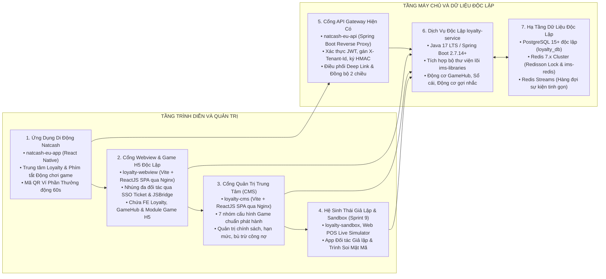
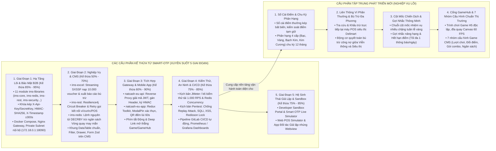
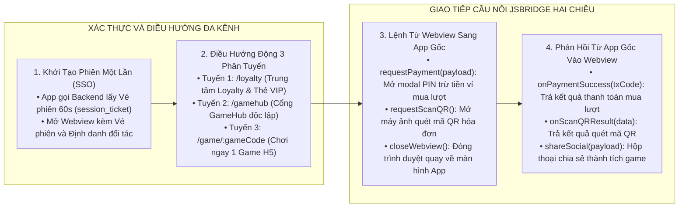
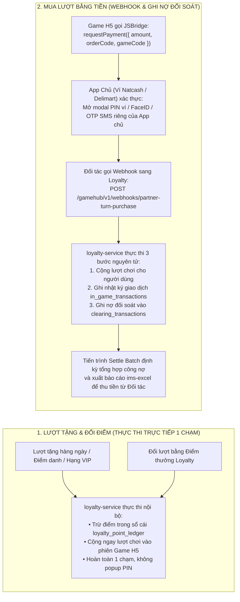
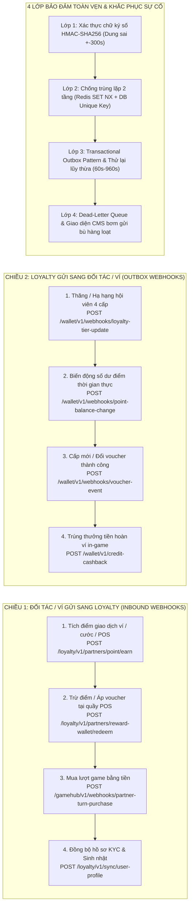
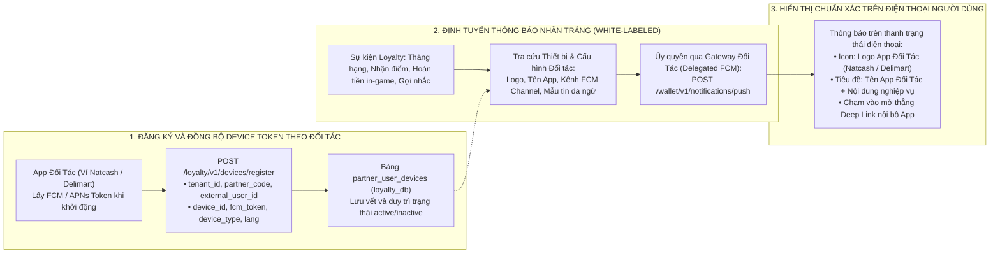
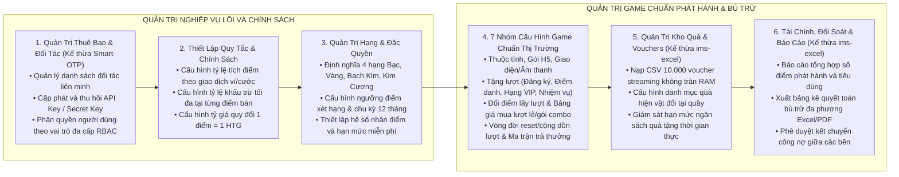
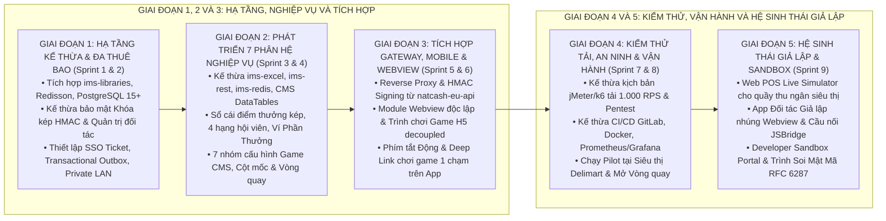

# TÀI LIỆU PHƯƠNG ÁN, GIẢI PHÁP VÀ KẾ HOẠCH SẢN XUẤT CHI TIẾT
## Nền Tảng Độc Lập Khách Hàng Thân Thiết Liên Minh và Cổng Game Đa Thuê Bao

> **Đơn vị xây dựng:** Nhóm Kiến trúc và Giải pháp Số — Natcash  
> **Bộ sản phẩm bàn giao chính thức:**  
> 1. Dịch vụ máy chủ nghiệp vụ độc lập: `loyalty-service` (Java 17 LTS / Spring Boot 2.7.14+)  
> 2. Cơ sở dữ liệu quan hệ độc lập: **PostgreSQL 15+** (`loyalty_db` tách biệt 100% với `natcash_db`)  
> 3. Cổng thông tin quản trị trung tâm: `loyalty-cms` (ReactJS 18+ / TypeScript / Vite / Ant Design 5.x / Nginx)  
> 4. Cổng trải nghiệm Webview nhúng đa nền tảng & Trình mở Game H5: `loyalty-webview` (ReactJS 18+ / TypeScript / Vite / TailwindCSS Mobile-First / Nginx)  
> 5. Cổng nhà phát triển và trình giả lập: `loyalty-sandbox` (ReactJS 18+ / Vite / Nginx)  
> 6. Bộ công cụ tích hợp ứng dụng di động: `natcash-eu-app` & Mobile SDK (React Native) với cơ chế Phím tắt Động (Dynamic Shortcuts) & Liên kết sâu (Deep Links)  
> 7. Cổng kết nối trung gian: `natcash-eu-api` (Java Spring Boot Reverse Proxy)  
> **Chiến lược sản xuất:** Kế thừa và tái sử dụng toàn diện từ Giai đoạn 1 đến Giai đoạn 5 bộ khung mã nguồn, 11 module thư viện lõi (`ims-libraries`), giải pháp an ninh khóa kép HMAC-SHA256, giao diện quản trị CMS, cổng Developer Sandbox, bộ kết nối Gateway, cấu trúc Mobile App và kịch bản kiểm thử tải / CI/CD đã được kiểm chứng từ dự án `smart-otp` (`/Users/micro/Source/chapisoft/smart-otp`), giúp tiết kiệm **12 – 15 tuần-người** và rút ngắn 40% – 50% tổng thời gian phát triển.  
> **Loại tài liệu:** Phương Án Kỹ Thuật, Bảng Phân Rã Chi Tiết Giai Đoạn – Đợt Nước Rút – Tác Vụ và Kế Hoạch Sản Xuất Thực Thi

---

## 1. TỔNG QUAN DỰ ÁN VÀ MỤC TIÊU SẢN XUẤT

### 1.1. Mục Tiêu Sản Xuất
Xây dựng và phát hành toàn diện hệ sinh thái Khách hàng thân thiết và Cổng Game độc lập hoàn chỉnh, bao gồm các trụ cột sản phẩm phần mềm chính:
1. **Dịch vụ máy chủ nghiệp vụ (`loyalty-service`):** Vận hành với cơ sở dữ liệu `loyalty_db` trên **PostgreSQL 15+** độc lập 100% với hệ thống ví `natcash_db`, quản lý sổ cái điểm thưởng kép, thăng hạng 4 cấp, cột mốc chiến dịch, liên thông Ví Phần Thưởng, xử lý Webhook Outbox, động cơ Cổng Game và đối soát bù trừ tài chính liên minh.
2. **Cổng thông tin quản trị (`loyalty-cms`):** Cung cấp giao diện trực quan cho quản trị viên Natcash và các đối tác liên minh để cấu hình chính sách tích/tiêu điểm, quản lý hạn mức, duyệt chiến dịch cột mốc, quản lý kho quà, phân quyền người dùng, đối soát công nợ và đặc biệt là bộ **7 nhóm cấu hình Game theo đúng chuẩn công nghiệp phát hành game** (thuộc tính, thành phần, tặng lượt, đổi điểm, mua gói lẻ/combo, vòng đời reset/cộng dồn và ma trận trả thưởng).
3. **Cổng Webview nhúng đa nền tảng & Game H5 Decoupled (`loyalty-webview`):** Cung cấp giao diện độc lập chứa toàn bộ Frontend của Loyalty, Cổng GameHub và các Game H5 module hóa. Sẵn sàng nhúng vào ứng dụng của các đối tác bên ngoài (siêu thị Delimart, ngân hàng liên kết, chuỗi bán lẻ) hoặc ứng dụng ví Natcash thông qua vé phiên một lần (`session_ticket`) và cầu nối `LoyaltyJSBridge` mà không làm trực tiếp vào mã nguồn App gốc.
4. **Bộ tích hợp Ứng dụng di động linh hoạt (`natcash-eu-app`):** Hỗ trợ đa dạng phương thức kết nối: Mở qua Cổng GameHub tập trung, Mở trực tiếp GameHub không qua Loyalty, hoặc Chơi ngay qua **Phím tắt Động (Dynamic Shortcut)** và **Liên kết sâu (Deep Link)** 1 chạm ngay từ trang chủ ứng dụng.
5. **Hệ sinh thái Công cụ & Trình Giả lập Thử nghiệm (`loyalty-sandbox` & Simulators - Sprint 9):** Tách riêng biệt thành phân hệ phục vụ đối tác và kiểm thử toàn diện: Trình Giả lập Điểm bán Web POS, Trình Giả lập App Đối tác nhúng Webview, Trình Giả lập Smartphone Live và Cổng Developer Sandbox tra cứu API / soi mã HMAC.

---

### 1.2. Sơ Đồ Kiến Trúc Tổng Thể Hệ Thống



---

## 2. CHIẾN LƯỢC KẾ THỪA VÀ TÁI SỬ DỤNG MÃ NGUỒN XUYÊN SUỐT 5 GIAI ĐOẠN

Dự án `micro-loyalty` kế thừa toàn diện các thành phần kỹ thuật từ dự án `smart-otp` trên cả 5 giai đoạn phát triển:



### Lợi Ích Cụ Thể Của Chiến Lược Kế Thừa:
1. **Tiết kiệm nguồn lực:** Tiết kiệm tổng cộng từ **12 đến 15 tuần-người** trên toàn bộ các khâu từ backend, frontend CMS, tích hợp Gateway, mobile app đến kiểm thử tải và DevOps.
2. **Rút ngắn 40% – 50% thời gian phát triển:** Giảm thiểu tối đa việc phải xây dựng lại các thành phần kỹ thuật nền tảng, tập trung 100% nguồn lực vào bài toán nghiệp vụ lõi Khách hàng thân thiết và Cổng Game.
3. **Độ ổn định và an ninh cao:** Kế thừa trực tiếp các giải pháp an ninh (HMAC-SHA256, Redisson Lock, Private LAN Subnet, Circuit Breaker) đã được chứng minh hiệu quả và kiểm thử thành công trên hệ thống ví Natcash.

---

## 3. THIẾT KẾ PHÂN HỆ CỔNG WEBVIEW NHÚNG & GAME H5 ĐỘC LẬP (`loyalty-webview`)

Phân hệ Webview nhúng giải quyết bài toán: **Tách biệt hoàn toàn giao diện Frontend của Loyalty, Cổng GameHub và các Game H5 thành module độc lập, cho phép tích hợp cực kỳ linh hoạt vào Ứng dụng ví Natcash cũng như ứng dụng của mọi đối tác liên minh mà không cần làm trực tiếp vào mã nguồn ứng dụng gốc.**



### 3.1. Các Phương Thức Tích Hợp Linh Hoạt Đa Kênh

1. **Phương thức 1: Mở qua Cổng GameHub Tập Trung (GameHub Portal)**
   - Người dùng truy cập Cổng GameHub từ menu ứng dụng: `https://loyalty.natcash.com/webview/gamehub?ticket={ssoTicket}&theme={partnerTheme}`.
   - Hiển thị danh mục trò chơi theo thể loại, kho lượt chơi cá nhân, bảng xếp hạng và cửa hàng mua gói lượt chơi.
2. **Phương thức 2: Mở Trực Tiếp Cổng GameHub Độc Lập (Không qua Loyalty)**
   - GameHub hoạt động như một dịch vụ giải trí độc lập trên thanh điều hướng ứng dụng hoặc màn hình dịch vụ đối tác. Người dùng không cần phải vào Trung tâm Loyalty mới thấy GameHub.
3. **Phương thức 3: Chơi Ngay Qua Phím Tắt Động / Liên Kết Sâu (Direct Game Shortcut)**
   - App Natcash (hoặc App đối tác) cấu hình các biểu tượng / banner / widget trên trang chủ:
     - Liên kết sâu: `natcash://game/lucky-wheel` hoặc `natcash://game/trivia`
     - Webview URL: `https://loyalty.natcash.com/webview/game/lucky-wheel?ticket={ssoTicket}&theme=natcash&source=home_shortcut`
     - Người dùng chạm 1 lần là mở trình chơi game ngay lập tức, bỏ qua hoàn toàn các bước điều hướng trung gian.
4. **Phương thức 4: Nhúng Webview Đa Đối Tác Liên Minh (Multi-Tenant Embedding)**
   - Đối tác liên minh (Siêu thị Delimart, Cây xăng, Ngân hàng) chỉ cần gọi API cấp `session_ticket` và nhúng Webview với tham số `theme` riêng. Toàn bộ nhận diện thương hiệu (màu sắc, logo, luật chơi, kho voucher) tự động hiển thị theo đúng chuẩn đối tác.

### 3.2. Đặc Tả Bộ Cầu Nối JSBridge Chuẩn Hóa

Webview cung cấp đối tượng toàn cục `window.LoyaltyJSBridge` cho phép giao tiếp hai chiều với Ứng dụng gốc:

| Tên hàm JSBridge | Hướng truyền | Tham số đầu vào | Mô tả chức năng và Ý nghĩa |
| :--- | :---: | :--- | :--- |
| `requestPayment(payload)` | Webview → App | `{ amount, orderCode, description }` | Yêu cầu ứng dụng đối tác mở modal nhập mã PIN hoặc xác thực sinh trắc học để trừ tiền ví/tài khoản mua lượt chơi. |
| `requestScanQR()` | Webview → App | `{ promptText }` | Yêu cầu ứng dụng đối tác mở camera quét mã QR trên hóa đơn mua sắm. |
| `onScanQRResult(data)` | App → Webview | `{ qrContent }` | Ứng dụng đối tác trả kết quả quét mã QR vào Webview để xử lý khấu trừ điểm. |
| `closeWebview()` | Webview → App | `{ reason }` | Yêu cầu đóng trình duyệt Webview quay lại màn hình chính của ứng dụng đối tác. |
| `shareSocial(payload)` | Webview → App | `{ title, message, url }` | Yêu cầu ứng dụng mở hộp thoại chia sẻ thành tích game hoặc mã quà tặng lên mạng xã hội. |
| `hapticFeedback(type)` | Webview → App | `{ style: 'light' | 'medium' | 'heavy' }` | Kích hoạt hiệu ứng rung vật lý trên thiết bị khi quay đĩa hoặc trúng thưởng. |

### 3.3. Cơ Chế Quản Lý Lượt Chơi & Bù Trừ Đối Soát Mua Lượt Game B2B

Hệ thống phân định rạch ròi 2 cơ chế vận hành lượt chơi game để đảm bảo tính độc lập, bảo mật tài chính và khả năng mở rộng đa đối tác:



1. **Luồng Lượt Tặng & Đổi Điểm Loyalty (Thực thi trực tiếp 1 chạm):**
   - Áp dụng cho các lượt chơi miễn phí hàng ngày, quà tặng đăng ký mới, đặc quyền phân hạng hội viên hoặc người dùng dùng điểm Loyalty để đổi lượt chơi.
   - Hệ thống `loyalty-service` thực thi trực tiếp, trừ điểm trong sổ cái bất biến `loyalty_point_ledger` và cộng lượt chơi ngay lập tức vào phiên chơi, **hoàn toàn 1 chạm và không cần popup PIN hay trung gian**.

2. **Luồng Mua Lượt Chơi Bằng Tiền (Xử lý qua Webhook B2B & Ghi nợ đối soát):**
   - Áp dụng khi người dùng mua thêm lượt lẻ hoặc mua gói combo bằng tiền mặt qua ứng dụng chủ (Ví Natcash, Siêu thị Delimart, Cổng thanh toán đối tác).
   - **Game H5 tuyệt đối không chứa ô nhập PIN hay trực tiếp trừ tiền.** Game H5 chỉ bắn sự kiện `window.LoyaltyJSBridge.requestPayment`.
   - **Ứng dụng chủ (Host App)** tự chịu trách nhiệm mở phương thức xác thực của họ (Mã PIN ví Natcash, FaceID hoặc OTP SMS).
   - Sau khi đối tác trừ tiền người dùng thành công, Gateway của đối tác gọi Webhook `POST /gamehub/v1/webhooks/partner-turn-purchase` sang `loyalty-service`.
   - `loyalty-service` tiếp nhận Webhook và thực hiện **3 hành động nguyên tử trong 1 Transaction**:
     1. **Cộng lượt chơi** cho người dùng trong phiên chơi / tài khoản game.
     2. **Ghi lịch sử giao dịch** liên kết với mã tham chiếu gốc của đối tác.
     3. **Ghi nhận công nợ đối soát (Accounts Receivable - Ghi nợ đối tác)** vào bảng `clearing_transactions` (`clearing_type = 'GAME_TURN_PURCHASE'`, `status = 'PENDING'`).
   - Định kỳ (hàng ngày/hàng tuần), tiến trình `ClearingSettlementService` sẽ tổng hợp toàn bộ công nợ mua lượt game của từng đối tác và xuất bảng kê quyết toán bằng thư viện `ims-excel` Streaming để yêu cầu đối tác thanh toán chuyển tiền về tài khoản Nhà phát hành Game.

### 3.4. Ma Trận Đồng Bộ Dữ Liệu Hai Chiều & Xử Lý Sự Kiện Webhook An Toàn Tuyệt Đối

Hệ thống thiết lập cơ chế đồng bộ dữ liệu thời gian thực và tự động khắc phục sai lệch (Self-healing & Reconciliation) giữa Nền tảng Loyalty, Gateway `natcash-eu-api` và các Đối tác liên minh:



| Loại sự kiện Webhook | Chiều giao tiếp | Tải trọng dữ liệu (Payload) | Cơ chế bảo đảm toàn vẹn | Hành vi xử lý khi nhận sự kiện |
| :--- | :---: | :--- | :---: | :--- |
| **`POINT_BALANCE_CHANGED`** | Loyalty → Gateway | `{ tenantId, userId, oldBalance, newBalance, pointChange, actionType, txCode, timestamp }` | Transactional Outbox + HMAC | Cập nhật User Cache trên Gateway và đẩy Push Notification biến động số dư về Mobile App. |
| **`TIER_STATUS_UPDATED`** | Loyalty → Gateway | `{ tenantId, userId, previousTier, currentTier, effectiveDate, multiplier, txCode }` | Transactional Outbox + HMAC | Cập nhật trạng thái hạng hội viên trên `natcash_db`, mở quyền lợi miễn phí cước và đổi huy hiệu VIP trên App. |
| **`VOUCHER_LIFECYCLE_EVENT`** | Loyalty → Gateway | `{ tenantId, userId, voucherCode, campaignId, discountType, discountValue, status }` | Transactional Outbox + HMAC | Đồng bộ Kho Voucher điện tử trên Mobile App, hiển thị banner chúc mừng nhận quà. |
| **`IN_GAME_CASHBACK_AWARDED`** | Loyalty → Gateway | `{ tenantId, userId, amount, currency, gameCode, prizeName, transactionCode }` | Transactional Outbox + Idempotency | Gọi hàm cộng tiền vào số dư ví Natcash an toàn, ghi nhận log nạp tiền và gửi SMS/Push chúc mừng. |
| **`PARTNER_TURN_PURCHASE`** | Gateway → Loyalty | `{ partnerCode, userId, sessionToken, gameCode, turnsPurchased, paymentAmount, partnerTxCode }` | HMAC-SHA256 + DB Unique Key | Cộng lượt chơi tức thì, ghi nhật ký giao dịch và ghi nợ đối soát `clearing_transactions` để thu tiền kỳ. |
| **`POINT_REDEEM_POS`** | POS/Đối tác → Loyalty | `{ tenantId, partnerCode, userId, billAmount, pointsToRedeem, voucherCode, txCode }` | Redisson Lock + Pessimistic Lock | Khóa chống tiêu kép, trừ điểm sổ cái bất biến, áp voucher giảm trừ bill và ghi nhận công nợ đối soát. |

### 3.5. Đồng Bộ Định Danh Thiết Bị (Device Registry) & Đẩy Thông Báo Nhãn Trắng (White-Labeled Push Notification Hub)

Hệ thống cung cấp giải pháp **Đăng Ký Thiết Bị Đa Thuê Bao (Multi-tenant Device Registry)** và **Định Tuyến Thông Báo Nhãn Trắng (White-labeled Delegated Push Routing)** nhằm đảm bảo thông báo gửi đến điện thoại người dùng luôn mang đậm nhận diện thương hiệu của Đối Tác (Logo, Tên ứng dụng, Âm thanh, Nội dung cá nhân hóa) và loại bỏ hoàn toàn sự hiểu nhầm về hệ thống:



#### A. Cấu Trúc Bảng Dữ Liệu Thiết Bị Đối Tác (`partner_user_devices` trên `loyalty_db`):
- `id`: `BIGINT GENERATED ALWAYS AS IDENTITY PRIMARY KEY`
- `tenant_id`: `VARCHAR(50)` (Mã định danh đơn vị thuê bao)
- `partner_code`: `VARCHAR(50)` (Mã đối tác: `NATCASH_WALLET`, `DELIMART_POS`, `NATCOM_TELCO`)
- `external_user_id`: `VARCHAR(100)` (Số điện thoại / Mã khách hàng)
- `device_id`: `VARCHAR(150)` (Định danh duy nhất của thiết bị vật lý)
- `fcm_token`: `TEXT` (Mã token đẩy tin của Google FCM / Apple APNs)
- `device_type`: `VARCHAR(20)` (`IOS`, `ANDROID`, `H5_WEB`)
- `app_version`: `VARCHAR(30)` (Phiên bản ứng dụng cài đặt)
- `language`: `VARCHAR(10)` (`vi`, `en`, `fr`, `ht` — dùng để chọn đúng mẫu tin ngữ cảnh)
- `is_active`: `BOOLEAN` (Trạng thái hiệu lực của thiết bị)
- `updated_at`: `TIMESTAMPTZ` (Thời điểm làm mới token)
- Ràng buộc duy nhất: `UNIQUE (tenant_id, partner_code, external_user_id, device_id)`

#### B. Quy Chuẩn Thông Điệp Nhãn Trắng (Branded Notification Payload):
Mọi thông báo đẩy đi từ hệ thống đều được bọc trong cấu trúc nhãn trắng chuẩn hóa:
```json
{
  "partnerCode": "NATCASH_WALLET",
  "externalUserId": "0987654321",
  "deviceIds": ["DEV_IPHONE_16_PRO"],
  "notification": {
    "title": "Natcash Rewards: Chúc mừng bạn đã thăng hạng Hội viên Kim Cương!",
    "body": "Đặc quyền miễn phí chuyển tiền ví trọn đời và voucher nạp cước 100 HTG đã sẵn sàng.",
    "iconUrl": "https://cdn.natcash.com/brand/natcash-notif-icon.png",
    "channelId": "natcash_loyalty_channel",
    "sound": "natcash_reward_bell.mp3",
    "deepLink": "natcash://loyalty/tier-benefits",
    "data": {
      "partnerCode": "NATCASH_WALLET",
      "eventType": "TIER_UPGRADE",
      "currentTier": "DIAMOND",
      "actionUrl": "natcash://loyalty"
    }
  }
}
```

#### C. Lợi Ích Cốt Lõi:
1. **Trải nghiệm nhất quán (Zero Confusion):** Người dùng ví Natcash sẽ thấy thông báo gửi từ **Ví Natcash**, người dùng Siêu thị Delimart sẽ thấy gửi từ **Siêu thị Delimart**, tuyệt đối không xuất hiện tên hệ thống lạ.
2. **Đúng tài khoản & Đúng thiết bị:** Khi người dùng đổi điện thoại hoặc đăng nhập tài khoản khác, token được cập nhật tức thì, không gửi nhầm thông báo sang thiết bị cũ.
3. **Mở đúng ngữ cảnh 1 chạm:** Tích hợp sẵn Deep Link nội bộ của từng App để khi người dùng chạm vào thông báo là mở ngay màn hình liên quan (Thẻ VIP, Kho Voucher, Vòng quay) mà không bị lạc hướng.

---

## 4. THIẾT KẾ HỆ THỐNG QUẢN TRỊ TRUNG TÂM DỊCH VỤ (`loyalty-cms`)

Hệ thống Quản trị Trung tâm `loyalty-cms` kế thừa bộ khung Admin, hệ thống đa ngôn ngữ i18n và module phân quyền từ `src/cms/cms-admin` của Smart-OTP, đồng thời cung cấp đầy đủ **7 nhóm cấu hình Game chuyên sâu theo chuẩn công nghiệp phát hành game**:



### 4.1. Chi Tiết 7 Nhóm Cấu Hình Game Chuẩn Công Nghiệp Phát Hành Trên CMS

1. **Nhóm 1: Thuộc tính & Siêu dữ liệu cơ bản:** Mã game (`game_code`), tên game đa ngôn ngữ, thể loại (Vòng quay, Câu đố, Tương tác nhanh), ảnh biểu tượng icon 1:1, ảnh bìa banner 16:9, URL gói H5 bundle, phiên bản semantic, định hướng màn hình (dọc/ngang), trạng thái phát hành (Nháp / Hoạt động / Tạm dừng / Bảo trì) và khung thời gian sự kiện.
2. **Nhóm 2: Cấu hình thành phần giao diện & âm thanh:** Bộ skin/theme mùa lễ hội, số ô đĩa quay (8 ô, 12 ô), hình ảnh từng ô giải thưởng, nhạc nền BGM, âm thanh quay vòng, âm thanh trúng giải đặc biệt, âm thanh trượt giải và hiệu ứng pháo hoa chúc mừng.
3. **Nhóm 3: Chính sách tặng lượt chơi miễn phí:** Tặng khi mở tài khoản/đăng ký mới, tặng khi điểm danh hàng ngày theo khung giờ, tặng theo cấp bậc hội viên (Bạc tặng X lượt, Vàng tặng Y lượt, Bạch Kim tặng Z lượt, Kim Cương tặng W lượt), tặng khi hoàn thành nhiệm vụ cột mốc chiến dịch.
4. **Nhóm 4: Chính sách đổi điểm lấy lượt chơi:** Bật/tắt tính năng đổi điểm, tỷ lệ quy đổi (ví dụ: 10 điểm Loyalty = 1 lượt chơi), giới hạn số lượt đổi tối đa mỗi ngày / mỗi tuần trên từng tài khoản và hạn mức quỹ đổi toàn hệ thống.
5. **Nhóm 5: Chính sách mua thêm lượt chơi lẻ & Gói Combo:** Bảng giá mua lượt lẻ (ví dụ: 5 HTG / 1 lượt), danh mục gói bán combo (Gói 5 lượt, Gói 10 lượt, Gói VIP 50 lượt tặng thêm 10 lượt khuyến mại), cấu hình nhãn nổi bật ("Bán chạy nhất", "Tiết kiệm 20%").
6. **Nhóm 6: Chính sách vòng đời & hết hạn lượt chơi:** Cơ chế xử lý khi hết ngày: **Cộng dồn (Roll-over)** cho lượt mua bằng tiền/đổi điểm và **Làm mới về 0 (Daily Reset)** vào 23:59:59 cho lượt tặng miễn phí trong ngày; thứ tự ưu tiên trừ lượt (trừ lượt miễn phí trong ngày trước, trừ lượt mua/đổi điểm sau).
7. **Nhóm 7: Chính sách trả thưởng & Ma trận xác suất:** Danh mục giải thưởng (Tiền hoàn ví, Điểm loyalty, Voucher, Hiện vật, Tặng thêm lượt, Chúc may mắn), ma trận xác suất trúng thưởng (%) tổng 100%, hạn mức ngân sách tiền mặt tối đa trong ngày, hạn mức số lượng giải lớn trong ngày, lệnh nguyên tử trừ ngân sách Redis `DECRBY` và luật tự động lái xác suất khi hết hạn ngạch.

---

## 5. BẢNG PHÂN RÃ TỔNG HỢP TOÀN DIỆN CÔNG VIỆC KỸ THUẬT (PHASE – SPRINT – TASK)

Kế hoạch sản xuất được chia thành **5 Giai Đoạn (Phases)**, **9 Đợt Chạy Nước Rút (Sprints)** và **46 Tác Vụ (Tasks)** kỹ thuật chi tiết. Toàn bộ các tác vụ được hợp nhất thành một bảng tổng thể duy nhất, các dòng phân nhóm Giai đoạn và Đợt nước rút được gộp trọn vẹn thành 1 ô mở rộng toàn hàng (`colspan="7"`), căn lề trái trực quan:



<table>
<thead>
<tr>
  <th style="width: 1%; white-space: nowrap; text-align: center;">Mã Task</th>
  <th style="width: 18%; text-align: left;">Tên tác vụ kỹ thuật</th>
  <th style="width: 11%; text-align: left;">Phân hệ / Dự án</th>
  <th style="width: 27%; text-align: left;">Mô tả kỹ thuật và Phạm vi thực hiện</th>
  <th style="width: 13%; text-align: center;">Nguồn gốc / Kế thừa</th>
  <th style="width: 19%; text-align: left;">Tiêu chí hoàn thành (DoD)</th>
  <th style="width: 11%; text-align: center;">Tình trạng</th>
</tr>
</thead>
<tbody>
<tr style="background-color: #f0f4f8;">
  <td colspan="7" align="left"><strong>GIAI ĐOẠN 1: HẠ TẦNG KẾ THỪA, CƠ SỞ DỮ LIỆU POSTGRESQL 15+ VÀ BẢO MẬT B2B</strong></td>
</tr>
<tr style="background-color: #f8fafc;">
  <td colspan="7" align="left"><em>Sprint 1: Đợt Nước Rút 1 (Tuần 1) — Tích hợp bộ khung kế thừa &amp; Cơ sở dữ liệu</em></td>
</tr>
<tr>
  <td align="center"><code>BE-01</code></td>
  <td>Khởi tạo cấu trúc Spring Boot &amp; Tích hợp Thư viện Lõi</td>
  <td><code>loyalty-service</code></td>
  <td>Khởi tạo dự án Java 17 LTS / Spring Boot 2.7.14+, import bộ thư viện <code>ims-libraries</code> (<code>ims-core</code>, <code>ims-redis</code>, <code>ims-rest</code>, <code>ims-security</code>, <code>ims-jasypt</code>) từ dự án Smart-OTP.</td>
  <td align="center"><strong>Kế thừa 95%</strong> từ <code>smart-otp</code> (<code>ims-libraries</code>)</td>
  <td>Dự án biên dịch thành công, tích hợp trọn vẹn Exception Handler và Logging MDC.</td>
  <td align="center"><span style="color:#1a7f37;font-weight:bold;">Done (100%)</span></td>
</tr>
<tr>
  <td align="center"><code>BE-02</code></td>
  <td>Viết Flyway Migration Scripts trên PostgreSQL 15+</td>
  <td><code>loyalty-service</code></td>
  <td>Viết các tập lệnh SQL <code>V1__init_loyalty_core_schema.sql</code> khởi tạo 17 bảng trong cơ sở dữ liệu <code>loyalty_db</code> trên <strong>PostgreSQL 15+</strong> (Tenants, Partners, Accounts, Ledgers, Milestones, Outbox, Games, Prizes...).</td>
  <td align="center"><strong>Phát triển mới</strong> (Dựa trên thiết kế DB chi tiết)</td>
  <td>Chạy Flyway migrate thành công trên PostgreSQL 15+; sơ đồ bảng khớp 100% tài liệu thiết kế.</td>
  <td align="center"><span style="color:#1a7f37;font-weight:bold;">Done (100%)</span></td>
</tr>
<tr>
  <td align="center"><code>BE-03</code></td>
  <td>Cài đặt Bộ lọc Cô lập Đa Thuê bao</td>
  <td><code>loyalty-service</code></td>
  <td>Cài đặt <code>TenantContextFilter</code> trích xuất <code>X-Tenant-Id</code> từ Request Header, lưu vào <code>ThreadLocal</code> <code>TenantContext</code>. Kích hoạt <code>Hibernate Filter</code> tự động gán điều kiện <code>tenant_id</code> vào mọi truy vấn SQL.</td>
  <td align="center"><strong>Phát triển mới</strong> (Kết hợp <code>ims-core</code> Filter)</td>
  <td>Viết Unit Test xác nhận các câu truy vấn tự động lọc đúng mã thuê bao, không rò rỉ dữ liệu chéo.</td>
  <td align="center"><span style="color:#1a7f37;font-weight:bold;">Done (100%)</span></td>
</tr>
<tr>
  <td align="center"><code>BE-04</code></td>
  <td>Kế thừa Xác thực Khóa Kép &amp; Ký số HMAC-SHA256</td>
  <td><code>loyalty-service</code></td>
  <td>Tái sử dụng <code>SignatureUtils</code>, <code>ApiKeyAuthFilter</code> và cơ chế kiểm tra <code>X-Timestamp</code> (±300s), kiểm tra thời gian hằng số <code>MessageDigest.isEqual()</code> từ <code>partner-service</code> của Smart-OTP.</td>
  <td align="center"><strong>Kế thừa 90%</strong> từ <code>smart-otp</code> (<code>partner-service</code>)</td>
  <td>Vượt qua bài kiểm tra bảo mật: từ chối request sai chữ ký, từ chối request lệch quá ±300 giây.</td>
  <td align="center"><span style="color:#1a7f37;font-weight:bold;">Done (100%)</span></td>
</tr>
<tr>
  <td align="center"><code>CMS-01</code></td>
  <td>Khởi tạo Dự án CMS từ Bộ Khung Chuẩn</td>
  <td><code>loyalty-cms</code></td>
  <td>Kế thừa cấu trúc thư mục, Vite config, Ant Design 5.x, Zustand, React Query và cấu hình hệ thống đa ngôn ngữ i18n từ <code>src/cms/cms-admin</code> của Smart-OTP.</td>
  <td align="center"><strong>Kế thừa 80%</strong> từ <code>smart-otp</code> (<code>cms-admin</code>)</td>
  <td>Dự án khởi chạy mượt mà trên môi trường phát triển local cổng 3000.</td>
  <td align="center"><span style="color:#1a7f37;font-weight:bold;">Done (100%)</span></td>
</tr>
<tr>
  <td align="center"><code>CMS-02</code></td>
  <td>Thiết lập Khung Giao diện Admin &amp; Quản lý Phiên</td>
  <td><code>loyalty-cms</code></td>
  <td>Kế thừa Layout Admin chuẩn (Sidebar menu động, Header chứa thông tin tài khoản, Breadcrumbs), trang Đăng nhập và lưu trữ JWT Token an toàn.</td>
  <td align="center"><strong>Kế thừa 85%</strong> từ <code>smart-otp</code> (<code>cms-admin</code>)</td>
  <td>Đăng nhập thành công, điều hướng mượt mà giữa các menu chức năng.</td>
  <td align="center"><span style="color:#1a7f37;font-weight:bold;">Done (100%)</span></td>
</tr>
<tr>
  <td align="center"><code>WV-01</code></td>
  <td>Khởi tạo Dự án Webview Nhúng Cho Đối Tác</td>
  <td><code>loyalty-webview</code></td>
  <td>Khởi tạo dự án ReactJS 18+ với Vite Mobile-first, cấu hình TailwindCSS, Framer Motion, thiết lập hệ thống biến màu sắc nhận diện thương hiệu CSS Variables (<code>--primary-color</code>, <code>--accent-color</code>).</td>
  <td align="center"><strong>Kế thừa 30%</strong> (Vite config &amp; Tailwind)</td>
  <td>Webview kết xuất giao diện chuẩn mobile mượt mà trên trình duyệt di động.</td>
  <td align="center"><span style="color:#1a7f37;font-weight:bold;">Done (100%)</span></td>
</tr>
<tr>
  <td align="center"><code>WV-02</code></td>
  <td>Xây dựng Thư viện Cầu nối JSBridge</td>
  <td><code>loyalty-webview</code></td>
  <td>Viết module TypeScript <code>LoyaltyJSBridge</code> định nghĩa các hàm: <code>requestPayment()</code>, <code>requestScanQR()</code>, <code>closeWebview()</code>, <code>shareSocial()</code> và cơ chế lắng nghe sự kiện từ ứng dụng gốc.</td>
  <td align="center"><strong>Phát triển mới</strong> (Chuẩn giao tiếp Mobile Bridge)</td>
  <td>Thư viện JSBridge hoạt động, bắt được sự kiện giả lập trên cửa sổ window.</td>
  <td align="center"><span style="color:#1a7f37;font-weight:bold;">Done (100%)</span></td>
</tr>
<tr>
  <td align="center"><code>OPS-01</code></td>
  <td>Thiết lập Môi trường Phát triển Container hóa</td>
  <td>DevOps / Infra</td>
  <td>Tái sử dụng cấu trúc <code>docker-compose.yml</code> từ Smart-OTP: PostgreSQL 15, Redis 7.x, Nginx Gateway nội bộ <code>18090</code> và hỗ trợ kết nối mạng Private Subnet cho Backend Natcash.</td>
  <td align="center"><strong>Kế thừa 90%</strong> từ <code>smart-otp</code> (<code>deploy/</code>)</td>
  <td>Toàn bộ các dịch vụ hạ tầng khởi động thành công với 1 câu lệnh <code>docker-compose up -d</code>.</td>
  <td align="center"><span style="color:#1a7f37;font-weight:bold;">Done (100%)</span></td>
</tr>
<tr style="background-color: #f8fafc;">
  <td colspan="7" align="left"><em>Sprint 2: Đợt Nước Rút 2 (Tuần 2) — Khóa phân tán, Redis Streams, Outbox &amp; Giao thức SSO</em></td>
</tr>
<tr>
  <td align="center"><code>BE-05</code></td>
  <td>Cài đặt Khóa Phân tán Redisson RLock</td>
  <td><code>loyalty-service</code></td>
  <td>Sử dụng cấu hình <code>ims-redis</code> từ Smart-OTP, xây dựng tiện ích <code>DistributedLockHelper</code> quản lý khóa theo mẫu <code>lock:burn:tenant_id:user_id</code> với thời gian chờ tối đa 3.000ms.</td>
  <td align="center"><strong>Kế thừa 90%</strong> từ <code>smart-otp</code> (<code>ims-redis</code>)</td>
  <td>Viết kiểm thử đồng thời 10 luồng cùng chiếm khóa; xác nhận các luồng được tuần tự hóa chính xác.</td>
  <td align="center"><span style="color:#1a7f37;font-weight:bold;">Done (100%)</span></td>
</tr>
<tr>
  <td align="center"><code>BE-06</code></td>
  <td>Cài đặt Redis Streams Sự Kiện Tinh Gọn</td>
  <td><code>loyalty-service</code></td>
  <td>Cấu hình Redis Streams, xây dựng các Producer đẩy sự kiện <code>LOYALTY_EARN_EVENT</code> vào Stream <code>loyalty.events.tenant_id</code> và các Consumer xử lý tính điểm bất đồng bộ.</td>
  <td align="center"><strong>Kế thừa 40%</strong> (Cấu hình kết nối từ <code>ims-redis</code>)</td>
  <td>Đẩy và nhận thông điệp qua Redis Streams thành công với độ trễ dưới 5ms trên môi trường thử nghiệm.</td>
  <td align="center"><span style="color:#1a7f37;font-weight:bold;">Done (100%)</span></td>
</tr>
<tr>
  <td align="center"><code>BE-07</code></td>
  <td>Xây dựng Transactional Outbox Engine</td>
  <td><code>loyalty-service</code></td>
  <td>Xây dựng <code>OutboxService</code> lưu sự kiện vào bảng <code>WEBHOOK_OUTBOX</code> (JSONB) trong cùng Local Transaction. Xây dựng <code>OutboxPublisher</code> quét bản ghi mỗi 1 giây để gửi Webhook kèm cơ chế thử lại theo cấp số nhân.</td>
  <td align="center"><strong>Phát triển mới</strong> (Tích hợp <code>ims-rest</code> WebClient)</td>
  <td>Dữ liệu sự kiện được gửi sang hệ thống đích tin cậy 100%, không bị mất ngay cả khi giả lập ngắt mạng.</td>
  <td align="center"><span style="color:#1a7f37;font-weight:bold;">Done (100%)</span></td>
</tr>
<tr>
  <td align="center"><code>BE-08</code></td>
  <td>Xây dựng API SSO Ticket Cho Webview Nhúng</td>
  <td><code>loyalty-service</code></td>
  <td>Viết API <code>POST /loyalty/v1/sso/generate-session-ticket</code> sinh vé ngẫu nhiên 32 bytes lưu Redis TTL 60s và API <code>POST /loyalty/v1/sso/exchange-token</code> đổi vé lấy JWT Access Token (15 phút).</td>
  <td align="center"><strong>Kế thừa 50%</strong> (Xử lý JWT &amp; Redis từ <code>ims-security</code>)</td>
  <td>Vé phiên chỉ sử dụng được 1 lần duy nhất; từ chối vé phiên quá hạn 60 giây.</td>
  <td align="center"><span style="color:#1a7f37;font-weight:bold;">Done (100%)</span></td>
</tr>
<tr>
  <td align="center"><code>CMS-03</code></td>
  <td>Kế thừa Module Quản Trị Thuê Bao &amp; Đối Tác</td>
  <td><code>loyalty-cms</code></td>
  <td>Tái sử dụng màn hình quản trị đối tác từ <code>src/cms/cms-admin</code> của Smart-OTP: chức năng sinh khóa <code>API Key</code>, <code>Secret Key</code>, <code>Webhook Secret</code>, bảng cấu hình IP Whitelist.</td>
  <td align="center"><strong>Kế thừa 85%</strong> từ <code>smart-otp</code> (<code>cms-admin</code>)</td>
  <td>Quản trị viên tạo đối tác mới, lấy khóa bảo mật và cấu hình IP thành công.</td>
  <td align="center"><span style="color:#1a7f37;font-weight:bold;">Done (100%)</span></td>
</tr>
<tr>
  <td align="center"><code>CMS-04</code></td>
  <td>Kế thừa Module Phân Quyền Người Dùng (RBAC)</td>
  <td><code>loyalty-cms</code></td>
  <td>Tái sử dụng logic gán vai trò người dùng CMS: Quản trị cấp cao, Vận hành nghiệp vụ, Kế toán tài chính, Quản trị đối tác.</td>
  <td align="center"><strong>Kế thừa 90%</strong> từ <code>smart-otp</code> (<code>cms-admin</code>)</td>
  <td>Người dùng chỉ truy cập được các menu chức năng tương ứng với vai trò được cấp.</td>
  <td align="center"><span style="color:#1a7f37;font-weight:bold;">Done (100%)</span></td>
</tr>
<tr>
  <td align="center"><code>WV-03</code></td>
  <td>Xây dựng Luồng Đổi Vé SSO &amp; Quản Lý Phiên</td>
  <td><code>loyalty-webview</code></td>
  <td>Xây dựng hook <code>useSSOAuth</code> tự động lấy tham số <code>ticket</code> từ URL, gọi API đổi lấy JWT Token, lưu vào <code>sessionStorage</code> và tự động gắn Token vào tiêu đề các API tiếp theo.</td>
  <td align="center"><strong>Kế thừa 40%</strong> (Hook xác thực &amp; Token Storage)</td>
  <td>Mở Webview với URL kèm vé hợp lệ tự động đăng nhập và chuyển vào trang chủ Hub dưới 1 giây.</td>
  <td align="center"><span style="color:#1a7f37;font-weight:bold;">Done (100%)</span></td>
</tr>
<tr>
  <td align="center"><code>SB-01</code></td>
  <td>Thiết lập Cổng Developer Sandbox Portal</td>
  <td><code>loyalty-sandbox</code></td>
  <td>Tái sử dụng module <code>src/sandbox</code> từ Smart-OTP: Trang đăng nhập nhà phát triển, trang tra cứu tài liệu API động và tải Postman Collections.</td>
  <td align="center"><strong>Kế thừa 75%</strong> từ <code>smart-otp</code> (<code>src/sandbox</code>)</td>
  <td>Cổng Sandbox hoạt động độc lập, hỗ trợ đối tác tra cứu API và lấy khóa thử nghiệm.</td>
  <td align="center"><span style="color:#1a7f37;font-weight:bold;">Done (100%)</span></td>
</tr>
<tr>
  <td align="center"><code>QA-01</code></td>
  <td>Kiểm thử Tích hợp Hạ tầng Lõi &amp; Đa Thuê bao</td>
  <td>QA / QC</td>
  <td>Viết bộ kiểm thử tự động (Postman / REST-assured) kiểm tra tính cô lập đa thuê bao, kiểm tra tính lũy kế của Transactional Outbox và kiểm tra an toàn luồng SSO Ticket.</td>
  <td align="center"><strong>Kế thừa 50%</strong> (Bộ khung kiểm thử REST-assured)</td>
  <td>100% kịch bản kiểm thử hạ tầng lõi đạt kết quả Passed.</td>
  <td align="center"><span style="color:#1a7f37;font-weight:bold;">Done (100%)</span></td>
</tr>
<tr style="background-color: #f0f4f8;">
  <td colspan="7" align="left"><strong>GIAI ĐOẠN 2: PHÁT TRIỂN 7 PHÂN HỆ NGHIỆP VỤ BACKEND &amp; GIAO DIỆN CMS</strong></td>
</tr>
<tr style="background-color: #f8fafc;">
  <td colspan="7" align="left"><em>Sprint 3: Đợt Nước Rút 3 (Tuần 3) — Hội viên, Sổ cái điểm, Cột mốc &amp; Ví Phần Thưởng</em></td>
</tr>
<tr>
  <td align="center"><code>BE-09</code></td>
  <td>Xây dựng Phân hệ Hội viên &amp; Phân hạng</td>
  <td><code>loyalty-service</code></td>
  <td>Viết <code>AccountService</code> xử lý API <code>POST /loyalty/v1/profile</code>, tính toán điểm tích lũy, điểm xét hạng, tự động thăng hạng lên Vàng/Bạch Kim và kích hoạt sự kiện <code>TIER_UPGRADED</code>.</td>
  <td align="center"><strong>Kế thừa 30%</strong> (<code>ims-core</code> BaseEntity, DTO, Auditing)</td>
  <td>Hồ sơ hội viên hiển thị chính xác hạng, hệ số nhân điểm và tiến độ lên hạng tiếp theo.</td>
  <td align="center"><span style="color:#1a7f37;font-weight:bold;">Done (100%)</span></td>
</tr>
<tr>
  <td align="center"><code>BE-10</code></td>
  <td>Xây dựng Phân hệ Sổ cái Điểm Hợp nhất</td>
  <td><code>loyalty-service</code></td>
  <td>Viết <code>PointLedgerService</code> xử lý <code>POST /loyalty/v1/earn</code>, <code>POST /loyalty/v1/point-history</code> (phân trang), ghi sổ giao dịch điểm bất biến, quản lý điểm khả dụng và điểm tạm giữ.</td>
  <td align="center"><strong>Kế thừa 35%</strong> (<code>ims-jasypt</code> mã hóa &amp; <code>ims-core</code> Paging)</td>
  <td>Ghi nhận chính xác mọi giao dịch cộng/trừ điểm; số dư trong tài khoản luôn khớp tổng sổ cái.</td>
  <td align="center"><span style="color:#1a7f37;font-weight:bold;">Done (100%)</span></td>
</tr>
<tr>
  <td align="center"><code>BE-11</code></td>
  <td>Xây dựng Phân hệ Cột mốc Chiến dịch</td>
  <td><code>loyalty-service</code></td>
  <td>Viết <code>MilestoneService</code> xử lý <code>POST /loyalty/v1/milestones/active-campaigns</code>, theo dõi tiến độ từng chặng mốc giao dịch trong tuần lễ vàng và API nhận thưởng <code>claim-reward</code>.</td>
  <td align="center"><strong>Kế thừa 30%</strong> (<code>ims-redis</code> Cache chiến dịch &amp; TTL)</td>
  <td>Người dùng hoàn thành đủ số giao dịch theo mốc sẽ nhận thưởng điểm/voucher chính xác.</td>
  <td align="center"><span style="color:#1a7f37;font-weight:bold;">Done (100%)</span></td>
</tr>
<tr>
  <td align="center"><code>BE-12</code></td>
  <td>Xây dựng Động cơ Gợi nhắc Thông minh</td>
  <td><code>loyalty-service</code></td>
  <td>Viết <code>EngagementService</code> xử lý <code>POST /loyalty/v1/engagement/in-app-nudges</code>, tính toán khoảng cách điểm thăng hạng, cảnh báo điểm hết hạn và kiểm tra bảng <code>LOYALTY_COMMUNICATION_LOGS</code>.</td>
  <td align="center"><strong>Kế thừa 35%</strong> (<code>ims-redis</code> chặn spam 1 tin/ngày)</td>
  <td>Trả về chính xác thông điệp gợi nhắc theo ngữ cảnh của từng người dùng; không gửi trùng tin trong ngày.</td>
  <td align="center"><span style="color:#1a7f37;font-weight:bold;">Done (100%)</span></td>
</tr>
<tr>
  <td align="center"><code>BE-13</code></td>
  <td>Xây dựng Phân hệ Liên thông Ví Phần Thưởng</td>
  <td><code>loyalty-service</code></td>
  <td>Viết <code>RewardWalletService</code> xử lý 3 API: <code>reward-wallet/inquiry</code> (tra cứu Hạng, Điểm, Voucher, Quà), <code>reward-wallet/redeem</code> (khấu trừ đa phương tiện), <code>reward-wallet/refund</code> (hoàn trả).</td>
  <td align="center"><strong>Kế thừa 60%</strong> (<code>ims-rest</code> CircuitBreaker &amp; <code>ims-redis</code> Lock)</td>
  <td>Thực thi trừ điểm, hủy voucher và ghi nhận giao dịch bù trừ liên minh thành công trong 1 Transaction.</td>
  <td align="center"><span style="color:#1a7f37;font-weight:bold;">Done (100%)</span></td>
</tr>
<tr>
  <td align="center"><code>CMS-05</code></td>
  <td>Xây dựng Module Cấu hình Chính sách Điểm</td>
  <td><code>loyalty-cms</code></td>
  <td>Xây dựng trang cấu hình tỷ lệ tích điểm theo giao dịch ví/cước, cấu hình tỷ lệ khấu trừ tối đa tại từng điểm bán đối tác (30%, 50%, 100%), tỷ giá quy đổi 1 điểm = 1 HTG.</td>
  <td align="center"><strong>Kế thừa 60%</strong> (Khung DataTable, Form Zod từ <code>cms-admin</code>)</td>
  <td>Cấu hình chính sách lưu thành công và có hiệu lực ngay lập tức với các API liên quan.</td>
  <td align="center"><span style="color:#1a7f37;font-weight:bold;">Done (100%)</span></td>
</tr>
<tr>
  <td align="center"><code>CMS-06</code></td>
  <td>Xây dựng Module Quản trị Hạng &amp; Đặc quyền</td>
  <td><code>loyalty-cms</code></td>
  <td>Xây dựng trang cấu hình 4 hạng hội viên Bạc, Vàng, Bạch Kim, Kim Cương, ngưỡng điểm xét hạng chu kỳ 12 tháng, hệ số nhân điểm (×1.0, ×1.2, ×1.5, ×2.0).</td>
  <td align="center"><strong>Kế thừa 60%</strong> (Khung DataTable, Drawer từ <code>cms-admin</code>)</td>
  <td>Quản trị viên cập nhật ngưỡng điểm và ma trận đặc quyền thành công.</td>
  <td align="center"><span style="color:#1a7f37;font-weight:bold;">Done (100%)</span></td>
</tr>
<tr>
  <td align="center"><code>CMS-07</code></td>
  <td>Xây dựng Module Quản trị Chiến dịch &amp; Cột mốc</td>
  <td><code>loyalty-cms</code></td>
  <td>Xây dựng trang tạo chiến dịch khuyến mại, thiết lập chuỗi cột mốc sự kiện nhiều chặng, cấu hình phần thưởng điểm/voucher/lượt quay cho từng chặng mốc.</td>
  <td align="center"><strong>Kế thừa 60%</strong> (Modal CRUD, StatusBadge từ <code>cms-admin</code>)</td>
  <td>Tạo chiến dịch mới thành công, hiển thị đầy đủ trên danh sách chiến dịch đang chạy.</td>
  <td align="center"><span style="color:#1a7f37;font-weight:bold;">Done (100%)</span></td>
</tr>
<tr>
  <td align="center"><code>WV-04</code></td>
  <td>Xây dựng Trang Chủ Hub Trên Webview</td>
  <td><code>loyalty-webview</code></td>
  <td>Xây dựng giao diện trang <code>/hub</code>: Thẻ VIP xoay 3D nhẹ, thanh tiến độ điểm thăng hạng, danh sách nhiệm vụ điểm danh ngày và các thẻ gợi nhắc thông minh hiển thị âm thầm.</td>
  <td align="center"><strong>Kế thừa 30%</strong> (Component Card &amp; i18n từ Web SDK)</td>
  <td>Trang chủ tải nhanh dưới 0.5 giây, hiển thị chuẩn xác thông tin tài khoản người dùng.</td>
  <td align="center"><span style="color:#1a7f37;font-weight:bold;">Done (100%)</span></td>
</tr>
<tr>
  <td align="center"><code>WV-05</code></td>
  <td>Xây dựng Màn hình Sinh Mã QR Ví Phần Thưởng</td>
  <td><code>loyalty-webview</code></td>
  <td>Xây dựng trang <code>/qr-pay</code>: Tạo mã QR động chứa chuỗi bảo mật có hiệu lực 60 giây, thanh đếm lùi thời gian tự động làm mới mã QR để máy POS siêu thị quét.</td>
  <td align="center"><strong>Kế thừa 40%</strong> (Bộ thư viện tạo mã QR &amp; Countdown)</td>
  <td>Mã QR sinh chuẩn xác, quét thử nghiệm trên máy đọc mã phản hồi đúng chuỗi dữ liệu.</td>
  <td align="center"><span style="color:#1a7f37;font-weight:bold;">Done (100%)</span></td>
</tr>
<tr style="background-color: #f8fafc;">
  <td colspan="7" align="left"><em>Sprint 4: Đợt Nước Rút 4 (Tuần 4) — Cổng Game, Vòng quay, Bù trừ tài chính &amp; Batch Jobs</em></td>
</tr>
<tr>
  <td align="center"><code>BE-14</code></td>
  <td>Xây dựng Phân hệ Cổng Game &amp; Phiên chơi</td>
  <td><code>loyalty-service</code></td>
  <td>Viết <code>GameHubService</code> xử lý <code>POST /gamehub/v1/games/list</code>, <code>POST /gamehub/v1/session/init</code> (sinh mã phiên chơi game), <code>POST /gamehub/v1/billing/in-game-checkout</code>.</td>
  <td align="center"><strong>Kế thừa 40%</strong> (<code>ims-rest</code> gọi ví &amp; <code>ims-redis</code> Session)</td>
  <td>Khởi tạo phiên chơi game tập trung thành công; tạo giao dịch trừ tiền ví an toàn.</td>
  <td align="center"><span style="color:#1a7f37;font-weight:bold;">Done (100%)</span></td>
</tr>
<tr>
  <td align="center"><code>BE-15</code></td>
  <td>Xây dựng Phân hệ Vòng Quay May Mắn</td>
  <td><code>loyalty-service</code></td>
  <td>Viết <code>LuckyDrawService</code> xử lý <code>luckydraw/config</code> và <code>luckydraw/spin</code>. Triển khai thuật toán xác suất <code>SecureRandom</code> kết hợp trừ ngân sách tiền mặt nguyên tử Redis <code>DECRBY</code>.</td>
  <td align="center"><strong>Kế thừa 50%</strong> (<code>ims-redis</code> Atomic DECRBY &amp; Cache)</td>
  <td>Quay thưởng ngẫu nhiên chuẩn xác theo ma trận xác suất; không bao giờ chi vượt ngân sách ngày.</td>
  <td align="center"><span style="color:#1a7f37;font-weight:bold;">Done (100%)</span></td>
</tr>
<tr>
  <td align="center"><code>BE-16</code></td>
  <td>Xây dựng Phân hệ Bù trừ Tài chính Đa phương</td>
  <td><code>loyalty-service</code></td>
  <td>Viết <code>ClearinghouseService</code> xử lý <code>clearinghouse/reconciliation-report</code> (tổng hợp điểm phát hành vs điểm tiêu dùng) và <code>clearinghouse/settle-period</code> (chốt công nợ ròng).</td>
  <td align="center"><strong>Kế thừa 50%</strong> (<code>ims-excel</code> Streaming SXSSF xuất file lớn)</td>
  <td>Báo cáo đối soát tính toán chính xác 100% công nợ bù trừ giữa Viễn thông và Siêu thị.</td>
  <td align="center"><span style="color:#1a7f37;font-weight:bold;">Done (100%)</span></td>
</tr>
<tr>
  <td align="center"><code>BE-17</code></td>
  <td>Xây dựng 3 Tác vụ Hàng loạt Spring Batch</td>
  <td><code>loyalty-service</code></td>
  <td>Cài đặt Clustered Quartz điều phối 3 Jobs (xử lý 500 bản ghi/chunk): Quét điểm hết hạn (00:30), Tính toán gợi nhắc nâng hạng (08:00), Đối soát tự phục hồi lệch dữ liệu (02:00).</td>
  <td align="center"><strong>Kế thừa 40%</strong> (Cấu hình Spring Batch &amp; Quartz Job)</td>
  <td>3 Batch Jobs chạy tự động đúng giờ định kỳ, không bị chạy trùng lặp giữa các nút máy chủ.</td>
  <td align="center"><span style="color:#1a7f37;font-weight:bold;">Done (100%)</span></td>
</tr>
<tr>
  <td align="center"><code>CMS-08</code></td>
  <td>Xây dựng Module Quản lý Kho Quà &amp; Vouchers</td>
  <td><code>loyalty-cms</code></td>
  <td>Xây dựng giao diện tạo voucher, chức năng nạp tệp CSV chứa 10.000 mã ưu đãi, cấu hình hạn mức phát hành, số lượng tối đa và phạm vi đối tác áp dụng.</td>
  <td align="center"><strong>Kế thừa 70%</strong> (<code>ims-excel</code> / <code>ims-file</code> &amp; Upload DragDrop)</td>
  <td>Nạp tệp CSV 10.000 mã trong dưới 3 giây; quản lý trạng thái mã đã dùng / chưa dùng rõ ràng.</td>
  <td align="center"><span style="color:#1a7f37;font-weight:bold;">Done (100%)</span></td>
</tr>
<tr>
  <td align="center"><code>CMS-09</code></td>
  <td>Xây dựng Module Quản lý Game &amp; Vòng Quay Chuẩn Phát Hành</td>
  <td><code>loyalty-cms</code></td>
  <td>Xây dựng giao diện cấu hình toàn diện <strong>7 nhóm thông số game chuẩn thị trường</strong>: (1) Thuộc tính &amp; Gói H5 URL, (2) Theme/Giao diện/Âm thanh, (3) Chính sách tặng lượt (đăng ký, điểm danh, hạng VIP, nhiệm vụ), (4) Chính sách đổi điểm lấy lượt, (5) Bảng giá mua lượt lẻ &amp; danh mục gói combo ưu đãi, (6) Cơ chế vòng đời reset về 0 lúc 23:59 hoặc cộng dồn lượt, (7) Ma trận xác suất trả thưởng &amp; hạn mức ngân sách giải thưởng ngày.</td>
  <td align="center"><strong>Kế thừa 60%</strong> (Khung DataTable &amp; Form từ <code>cms-admin</code>)</td>
  <td>Cập nhật 7 nhóm cấu hình thành công, đồng bộ tức thì vào bộ đệm Redis và cơ sở dữ liệu PostgreSQL 15+.</td>
  <td align="center"><span style="color:#1a7f37;font-weight:bold;">Done (100%)</span></td>
</tr>
<tr>
  <td align="center"><code>CMS-10</code></td>
  <td>Xây dựng Module Quyết toán Bù trừ Công nợ</td>
  <td><code>loyalty-cms</code></td>
  <td>Xây dựng giao diện tra cứu báo cáo quyết toán bù trừ đa phương, bảng kê chi tiết giao dịch chéo giữa các bên và nút duyệt lệnh kết chuyển công nợ kỳ.</td>
  <td align="center"><strong>Kế thừa 65%</strong> (<code>ims-excel</code> xuất Excel/PDF &amp; Bảng đối soát)</td>
  <td>Bảng kê hiển thị trực quan số liệu nợ/có của từng đối tác; xuất tệp Excel/PDF chuẩn hóa.</td>
  <td align="center"><span style="color:#1a7f37;font-weight:bold;">Done (100%)</span></td>
</tr>
<tr>
  <td align="center"><code>WV-06</code></td>
  <td>Xây dựng Màn hình Vòng Quay May Mắn Canvas</td>
  <td><code>loyalty-webview</code></td>
  <td>Xây dựng trang <code>/lucky-draw</code>: Đĩa quay may mắn kết xuất bằng HTML5 Canvas, âm thanh quay thưởng sống động, nhận góc dừng chính xác từ API và hiển thị popup trúng thưởng.</td>
  <td align="center"><strong>Kế thừa 40%</strong> (Khung Canvas &amp; Audio từ Demo Simulator)</td>
  <td>Đĩa quay mượt mà 60 FPS trên mọi thiết bị di động, dừng chuẩn xác tại ô trúng thưởng.</td>
  <td align="center"><span style="color:#1a7f37;font-weight:bold;">Done (100%)</span></td>
</tr>
<tr>
  <td align="center"><code>WV-07</code></td>
  <td>Xây dựng Màn hình Kho Voucher Người Dùng</td>
  <td><code>loyalty-webview</code></td>
  <td>Xây dựng trang <code>/vouchers</code>: Danh sách phiếu giảm giá người dùng đang sở hữu, phân loại theo trạng thái (Khả dụng, Đã dùng, Hết hạn), hiển thị mã vạch Barcode/QR để quét.</td>
  <td align="center"><strong>Kế thừa 30%</strong> (Danh sách thẻ &amp; Barcode Generator)</td>
  <td>Hiển thị đầy đủ danh sách voucher, sao chép mã ưu đãi nhanh bằng 1 chạm.</td>
  <td align="center"><span style="color:#1a7f37;font-weight:bold;">Done (100%)</span></td>
</tr>
<tr>
  <td align="center"><code>WV-08</code></td>
  <td>Xây dựng Trình Mở Game HTML5 Tập Trung &amp; Cổng GameHub</td>
  <td><code>loyalty-webview</code></td>
  <td>Xây dựng trang <code>/gamehub</code> (Cổng Game danh mục) và <code>/game/:gameCode</code> (Trình chạy Game H5 độc lập): Khung iframe / canvas nhúng game HTML5, tích hợp thanh công cụ GameHub (nút đóng, nút mua thêm lượt, bảng xếp hạng sự kiện thời gian thực).</td>
  <td align="center"><strong>Kế thừa 35%</strong> (Khung iframe &amp; JSBridge Handler)</td>
  <td>Game chạy toàn màn hình mượt mà, gọi được hàm mua lượt thanh toán ví qua JSBridge.</td>
  <td align="center"><span style="color:#1a7f37;font-weight:bold;">Done (100%)</span></td>
</tr>
<tr>
  <td align="center"><code>QA-02</code></td>
  <td>Kiểm thử Toàn diện 7 Phân hệ &amp; 10 Module CMS</td>
  <td>QA / QC</td>
  <td>Viết kịch bản kiểm thử toàn bộ các luồng nghiệp vụ Backend, kiểm thử giao diện CMS Quản trị và kiểm thử các trang chức năng trên Webview nhúng.</td>
  <td align="center"><strong>Kế thừa 50%</strong> (Bộ kịch bản kiểm thử REST-assured/Postman)</td>
  <td>Toàn bộ các ca kiểm thử đạt kết quả Passed; xử lý triệt để các lỗi phát sinh.</td>
  <td align="center"><span style="color:#1a7f37;font-weight:bold;">Done (100%)</span></td>
</tr>
<tr style="background-color: #f0f4f8;">
  <td colspan="7" align="left"><strong>GIAI ĐOẠN 3: TÍCH HỢP API GATEWAY, ỨNG DỤNG DI ĐỘNG, WEBVIEW ĐỘC LẬP &amp; PHÍM TẮT ĐỘNG</strong></td>
</tr>
<tr style="background-color: #f8fafc;">
  <td colspan="7" align="left"><em>Sprint 5: Đợt Nước Rút 5 (Tuần 5) — Nâng cấp API Gateway &amp; Đồng bộ hai chiều</em></td>
</tr>
<tr>
  <td align="center"><code>GW-01</code></td>
  <td>Xây dựng Reverse Proxy Client Trong Gateway</td>
  <td><code>natcash-eu-api</code></td>
  <td>Kế thừa mô hình Gateway của Smart-OTP: Tiếp nhận request từ App, giải mã JWT người dùng, trích xuất <code>User ID</code> / <code>Tenant ID</code>, ký số HMAC-SHA256 và chuyển tiếp sang <code>loyalty-service</code>.</td>
  <td align="center"><strong>Kế thừa 90%</strong> từ Gateway của <code>smart-otp</code></td>
  <td>Chuyển tiếp thành công toàn bộ các nhóm endpoint <code>/loyalty/*</code>, <code>/gamehub/*</code>, <code>/luckydraw/*</code>.</td>
  <td align="center"><span style="color:#1a7f37;font-weight:bold;">Done (100%)</span></td>
</tr>
<tr>
  <td align="center"><code>GW-02</code></td>
  <td>Xây dựng API Đồng bộ Hồ sơ Người dùng</td>
  <td><code>natcash-eu-api</code></td>
  <td>Viết tiến trình lắng nghe sự kiện đăng ký ví mới hoặc đổi thông tin cá nhân, tự động gọi <code>POST /loyalty/v1/sync/user-profile</code> để lưu ngày sinh nhật và định danh khách hàng.</td>
  <td align="center"><strong>Kế thừa 75%</strong> (Mô hình Async Event từ <code>smart-otp</code>)</td>
  <td>Hồ sơ người dùng mới đăng ký ví được đồng bộ sang <code>loyalty_db</code> trong vòng dưới 1 giây.</td>
  <td align="center"><span style="color:#1a7f37;font-weight:bold;">Done (100%)</span></td>
</tr>
<tr>
  <td align="center"><code>GW-03</code></td>
  <td>Xây dựng Endpoint Nhận Webhook Thăng Hạng</td>
  <td><code>natcash-eu-api</code></td>
  <td>Viết endpoint <code>POST /wallet/v1/webhooks/loyalty-tier-update</code> tiếp nhận Webhook từ Loyalty; cập nhật quyền lợi miễn phí chuyển tiền và hiển thị huy hiệu VIP trên trang chủ ví.</td>
  <td align="center"><strong>Kế thừa 80%</strong> (Cơ chế verify chữ ký HMAC Webhook)</td>
  <td>Khi có sự kiện thăng hạng, cơ sở dữ liệu ví <code>natcash_db</code> cập nhật hạng mới ngay tức thì.</td>
  <td align="center"><span style="color:#1a7f37;font-weight:bold;">Done (100%)</span></td>
</tr>
<tr>
  <td align="center"><code>GW-04</code></td>
  <td>Xây dựng API Trừ tiền In-Game &amp; Hoàn tiền Ví</td>
  <td><code>natcash-eu-api</code></td>
  <td>Viết 2 API: <code>POST /wallet/v1/debit-in-game</code> (trừ số dư ví khi mua lượt game) và <code>POST /wallet/v1/credit-cashback</code> (cộng tiền vào ví khi khách đổi điểm sang tiền mặt).</td>
  <td align="center"><strong>Kế thừa 70%</strong> (Xử lý Idempotency &amp; khóa trừ tiền)</td>
  <td>Trừ tiền và cộng tiền số dư ví chính xác tuyệt đối, có khóa giao dịch chống lặp (Idempotency).</td>
  <td align="center"><span style="color:#1a7f37;font-weight:bold;">Done (100%)</span></td>
</tr>
<tr>
  <td align="center"><code>GW-05</code></td>
  <td>Xây dựng Notification Hub Chuyển tiếp</td>
  <td><code>natcash-eu-api</code></td>
  <td>Viết endpoint <code>POST /wallet/v1/notifications/push</code> nhận lệnh từ Loyalty để đẩy thông báo qua Firebase Cloud Messaging (FCM), Apple APNs hoặc SMS Brandname.</td>
  <td align="center"><strong>Kế thừa 80%</strong> (Cấu hình Firebase FCM &amp; SMS Adapter)</td>
  <td>Tin nhắn thông báo đẩy hiển thị tức thì trên điện thoại người dùng mục tiêu.</td>
  <td align="center"><span style="color:#1a7f37;font-weight:bold;">Done (100%)</span></td>
</tr>
<tr>
  <td align="center"><code>CMS-11</code></td>
  <td>Xây dựng Bảng Điều Khiển Dashboard Số Liệu</td>
  <td><code>loyalty-cms</code></td>
  <td>Xây dựng Dashboard trung tâm với biểu đồ Recharts: Tổng điểm phát hành, tổng điểm tiêu dùng, doanh thu Cổng Game, tỷ lệ giữ chân khách hàng theo thời gian thực.</td>
  <td align="center"><strong>Kế thừa 85%</strong> từ <code>src/cms/cms-admin</code> (Trang Dashboard)</td>
  <td>Biểu đồ trực quan hóa dữ liệu mượt mà, lọc dữ liệu linh hoạt theo ngày/tuần/tháng.</td>
  <td align="center"><span style="color:#1a7f37;font-weight:bold;">Done (100%)</span></td>
</tr>
<tr>
  <td align="center"><code>QA-03</code></td>
  <td>Kiểm thử Tích hợp Hai Chiều Ví và Loyalty</td>
  <td>QA / QC</td>
  <td>Kiểm thử toàn diện luồng giao tiếp hai chiều giữa <code>natcash-eu-api</code> và <code>loyalty-service</code> qua API RESTful và Webhook Outbox.</td>
  <td align="center"><strong>Kế thừa 60%</strong> (Bộ kịch bản test Gateway hai chiều)</td>
  <td>Luồng đồng bộ hai chiều thông suốt, không phát sinh lỗi lệch dữ liệu.</td>
  <td align="center"><span style="color:#1a7f37;font-weight:bold;">Done (100%)</span></td>
</tr>
<tr style="background-color: #f8fafc;">
  <td colspan="7" align="left"><em>Sprint 6: Đợt Nước Rút 6 (Tuần 6) — Nâng cấp Ứng dụng di động Natcash, Trình Mở Webview Decoupled Cho Toàn Bộ Game H5 &amp; Phím Tắt Động</em></td>
</tr>
<tr>
  <td align="center"><code>APP-01</code></td>
  <td>Xây dựng Màn hình Trung tâm Loyalty Trên App</td>
  <td><code>natcash-eu-app</code></td>
  <td>Xây dựng màn hình <code>LoyaltyScreen</code> trong ứng dụng ví Natcash: Thẻ VIP Bạc/Vàng/Bạch Kim/Kim Cương, thanh tiến độ điểm xét hạng 12 tháng, danh sách nhiệm vụ điểm danh nhận điểm.</td>
  <td align="center"><strong>Kế thừa 40%</strong> (Khung Redux Saga &amp; Navigation)</td>
  <td>Giao diện Trung tâm Loyalty hiển thị sắc nét, hiệu ứng chuyển động mượt mà.</td>
  <td align="center"><span style="color:#1a7f37;font-weight:bold;">Done (100%)</span></td>
</tr>
<tr>
  <td align="center"><code>APP-02</code></td>
  <td>Tích hợp Thẻ Gợi nhắc Nâng hạng Ngữ cảnh</td>
  <td><code>natcash-eu-app</code></td>
  <td>Nhúng component hiển thị thẻ thông minh gợi nhắc nâng hạng (ví dụ: "Còn thiếu 150 điểm để lên hạng Vàng") và thẻ chúc mừng sinh nhật ngay trên trang chủ Trung tâm Loyalty.</td>
  <td align="center"><strong>Kế thừa 50%</strong> (Component Card thông báo từ App)</td>
  <td>Thẻ gợi nhắc hiển thị tinh tế, bấm vào chuyển ngay đến dịch vụ nạp cước/thanh toán.</td>
  <td align="center"><span style="color:#1a7f37;font-weight:bold;">Done (100%)</span></td>
</tr>
<tr>
  <td align="center"><code>APP-03</code></td>
  <td>Xây dựng Màn hình Sinh Mã QR Ví Phần Thưởng Cho Quầy POS Siêu Thị</td>
  <td><code>natcash-eu-app</code></td>
  <td>Xây dựng modal/màn hình sinh mã QR thanh toán bằng điểm động có hiệu lực 60 giây (tích hợp đếm lùi thời gian) dành riêng cho thu ngân siêu thị Delimart quét tại quầy POS để trừ điểm/áp voucher vào hóa đơn mua sắm.</td>
  <td align="center"><strong>Kế thừa 60%</strong> (Module QR động &amp; Countdown Timer)</td>
  <td>Mã QR hiển thị chuẩn xác, chống chụp màn hình gian lận bằng cơ chế làm mới liên tục 60s.</td>
  <td align="center"><span style="color:#1a7f37;font-weight:bold;">Done (100%)</span></td>
</tr>
<tr>
  <td align="center"><code>APP-04</code></td>
  <td>Tích hợp Bộ Tiếp Nhận Ủy Quyền Thanh Toán &amp; Webhook Mua Lượt Game</td>
  <td><code>natcash-eu-app</code> / <code>loyalty-service</code></td>
  <td>Cài đặt luồng thanh toán mua lượt game chuẩn B2B: (1) Game H5 bắn sự kiện JSBridge <code>requestPayment</code> sang App chủ; (2) App Ví Natcash mở màn hình xác thực thanh toán ví chuẩn của Natcash (xác thực mã PIN ví hoặc FaceID, ký số SHA256); (3) Sau khi trừ tiền ví thành công, Gateway Natcash gọi Webhook <code>POST /gamehub/v1/webhooks/partner-turn-purchase</code> sang <code>loyalty-service</code>; (4) Hệ thống Loyalty thực hiện 3 hành động nguyên tử: Cộng lượt chơi, Ghi nhật ký giao dịch in-game, và Ghi nợ đối soát tài chính vào bảng <code>clearing_transactions</code> để định kỳ đối soát thu tiền từ đối tác; (5) Bắn callback JSBridge về Game H5 cập nhật lượt tức thì.</td>
  <td align="center"><strong>Kế thừa 85%</strong> (Luồng thanh toán <code>ConfirmDetail</code> &amp; Webhook Gateway)</td>
  <td>Game H5 không cần nhúng logic PIN; đổi lượt bằng điểm/tặng lượt chạy trực tiếp 1 chạm; mua lượt bằng tiền được xử lý qua Webhook, cộng lượt và ghi nợ đối soát thu tiền đối tác chuẩn xác 100%.</td>
  <td align="center"><span style="color:#1a7f37;font-weight:bold;">Done (100%)</span></td>
</tr>
<tr>
  <td align="center"><code>APP-05</code></td>
  <td>Tích hợp Trình Mở Webview Chạy Toàn Bộ Game H5 &amp; LuckyDraw Decoupled</td>
  <td><code>natcash-eu-app</code></td>
  <td>Tích hợp Webview Container mở 100% các trò chơi (bao gồm Vòng Quay May Mắn LuckyDraw Canvas, GameHub và các Game H5 lẻ) từ gói <code>loyalty-webview</code> độc lập: Nhúng cầu nối <code>LoyaltyJSBridge</code> hai chiều, truyền token phiên tự động, hỗ trợ tải trước (Preload) và đóng mở toàn màn hình mượt mà. Tuyệt đối không lập trình game native trong App để đảm bảo tính độc lập đa nền tảng.</td>
  <td align="center"><strong>Kế thừa 80%</strong> (<code>ModalWebview.tsx</code> &amp; Preload Context từ Natcash App)</td>
  <td>Mở Game H5 và LuckyDraw chạy mượt mà 60 FPS, âm thanh sống động, đồng bộ số lượt chơi thời gian thực.</td>
  <td align="center"><span style="color:#1a7f37;font-weight:bold;">Done (100%)</span></td>
</tr>
<tr>
  <td align="center"><code>APP-06</code></td>
  <td>Tích hợp Phím Tắt Động (Dynamic Shortcuts) &amp; Deep Link Chơi Game Tức Thì</td>
  <td><code>natcash-eu-app</code></td>
  <td>Cài đặt cơ chế Dynamic Shortcuts và Deep Link Scheme (<code>natcash://game/:gameCode</code>, <code>natcash://game/luckydraw</code>, <code>natcash://gamehub</code>): Cho phép cấu hình các icon/banner game động trên trang chủ ví Natcash, người dùng bấm 1 chạm là mở ngay Webview game tương ứng (bỏ qua luồng trung gian) trong dưới 0.5 giây.</td>
  <td align="center"><strong>Kế thừa 70%</strong> (Deep Linking Module từ <code>natcash-eu-app</code>)</td>
  <td>Bấm shortcut trên trang chủ mở ngay game tương ứng trong dưới 0.5s, nhận diện đúng token phiên và số lượt chơi.</td>
  <td align="center"><span style="color:#1a7f37;font-weight:bold;">Done (100%)</span></td>
</tr>
<tr>
  <td align="center"><code>WV-09</code></td>
  <td>Tối Ưu Hóa Trình Chạy Game H5, LuckyDraw Canvas 60 FPS &amp; GameHub Decoupled</td>
  <td><code>loyalty-webview</code></td>
  <td>Hoàn thiện module <code>loyalty-webview</code> chứa FE Loyalty, Cổng GameHub, Vòng Quay Canvas và các Game H5 decoupled: Tối ưu tải nhanh tài nguyên H5, hỗ trợ định hướng màn hình dọc/ngang, giao tiếp hai chiều với App gốc qua <code>LoyaltyJSBridge</code> (rung haptic, âm thanh, ủy quyền thanh toán, đóng màn hình); chạy độc lập 100% trên cả App Ví, App Đối Tác B2B và Trình duyệt Web.</td>
  <td align="center"><strong>Kế thừa 65%</strong> (Cầu nối <code>LoyaltyJSBridge</code> &amp; Webview Shell)</td>
  <td>Webview nhúng độc lập chạy mượt mà 60 FPS trên mọi đối tác, hỗ trợ trọn vẹn cả 3 phân tuyến: Loyalty, GameHub và Game lẻ.</td>
  <td align="center"><span style="color:#1a7f37;font-weight:bold;">Done (100%)</span></td>
</tr>
<tr>
  <td align="center"><code>GW-06</code></td>
  <td>Xây dựng Bộ Tiếp Nhận Webhook Biến Động Số Dư Điểm &amp; Kho Voucher</td>
  <td><code>natcash-eu-api</code></td>
  <td>Viết endpoint <code>POST /wallet/v1/webhooks/point-balance-change</code> và <code>POST /wallet/v1/webhooks/voucher-event</code> tiếp nhận sự kiện từ Loyalty: Xác thực HMAC-SHA256, kiểm tra Idempotency, cập nhật Redis Cache số dư người dùng và kích hoạt gửi Push Notification biến động số dư qua <code>NotificationHubController</code>.</td>
  <td align="center"><strong>Kế thừa 80%</strong> (Bộ lọc xác thực HMAC &amp; Notification Hub)</td>
  <td>Số dư điểm và danh sách voucher được đồng bộ về Gateway tức thì, đẩy thông báo về máy người dùng trong dưới 1 giây.</td>
  <td align="center"><span style="color:#1a7f37;font-weight:bold;">Done (100%)</span></td>
</tr>
<tr>
  <td align="center"><code>GW-07</code></td>
  <td>Xử Lý Webhook Hoàn Tiền In-Game Cashback Tự Động</td>
  <td><code>natcash-eu-api</code></td>
  <td>Viết logic tiếp nhận Webhook <code>IN_GAME_CASHBACK_AWARDED</code> từ Loyalty khi người dùng trúng giải thưởng tiền mặt trong Vòng Quay / Game H5: Tự động gọi hàm nạp tiền an toàn vào ví Natcash với Idempotency 2 lớp, ghi log giao dịch ví và gửi thông báo chúc mừng.</td>
  <td align="center"><strong>Kế thừa 85%</strong> (Module nạp tiền ví từ <code>natcash-eu-api</code>)</td>
  <td>Tiền thưởng in-game được cộng chính xác vào số dư ví Natcash, không phát sinh lỗi lệch tiền hay cộng trùng bản ghi.</td>
  <td align="center"><span style="color:#1a7f37;font-weight:bold;">Done (100%)</span></td>
</tr>
<tr>
  <td align="center"><code>APP-07</code></td>
  <td>Lắng Nghe Sự Kiện Webhook &amp; Tự Động Làm Mới Giao Diện Thời Gian Thực</td>
  <td><code>natcash-eu-app</code></td>
  <td>Tích hợp bộ lắng nghe sự kiện Push Notification / WebSocket trên Mobile App: Khi nhận tín hiệu biến động điểm, thăng hạng hoặc nhận voucher từ Webhook, App tự động reload dữ liệu hiển thị (Thẻ VIP, số dư điểm, kho voucher) mà không bắt người dùng phải kéo vuốt tải lại thủ công.</td>
  <td align="center"><strong>Kế thừa 70%</strong> (Redux State Dispatcher &amp; Event Emitter)</td>
  <td>Giao diện người dùng tự động phản chiếu số dư điểm và voucher mới nhất ngay khi sự kiện phát sinh.</td>
  <td align="center"><span style="color:#1a7f37;font-weight:bold;">Done (100%)</span></td>
</tr>
<tr>
  <td align="center"><code>BE-15</code></td>
  <td>Cơ Chế Rà Soát Đối Soát &amp; Tự Động Bơm Gửi Bù Dead-Letter Webhook</td>
  <td><code>loyalty-service</code> / <code>loyalty-cms</code></td>
  <td>Xây dựng API và màn hình CMS quản trị: Cho phép tra cứu danh sách <code>webhook_dead_letter</code> (các sự kiện biến động điểm, thăng hạng, giao dịch bị lỗi mạng sau 5 lần thử lại), xem chi tiết payload JSONB, và cung cấp nút "Gửi bù hàng loạt" (Batch Re-trigger) an toàn khi đối tác phục hồi kết nối.</td>
  <td align="center"><strong>Kế thừa 90%</strong> (Mô hình Outbox Dead-letter &amp; CMS UI)</td>
  <td>Không bao giờ thất thoát sự kiện Webhook; quản trị viên có thể theo dõi và tái phát sự kiện bù chỉ với 1 click chuột.</td>
  <td align="center"><span style="color:#1a7f37;font-weight:bold;">Done (100%)</span></td>
</tr>
<tr>
  <td align="center"><code>BE-16</code></td>
  <td>Thiết Kế Bảng Dữ Liệu <code>partner_user_devices</code> &amp; API Đăng Ký Thiết Bị Đa Thuê Bao</td>
  <td><code>loyalty-service</code></td>
  <td>Viết Flyway Migration <code>V2__add_partner_user_devices.sql</code> khởi tạo bảng lưu thiết bị (<code>tenant_id</code>, <code>partner_code</code>, <code>external_user_id</code>, <code>device_id</code>, <code>fcm_token</code>, <code>device_type</code>, <code>language</code>, <code>is_active</code>); xây dựng API <code>POST /loyalty/v1/devices/register</code> và module tra cứu token thiết bị active kèm cấu hình thương hiệu đối tác khi bắn thông báo.</td>
  <td align="center"><strong>Kế thừa 85%</strong> (Device Token Management từ <code>smart-otp</code>)</td>
  <td>Đăng ký và duy trì trạng thái thiết bị đa thuê bao chuẩn xác; tự động vô hiệu hóa token cũ khi người dùng đổi máy hoặc đăng xuất.</td>
  <td align="center"><span style="color:#1a7f37;font-weight:bold;">Done (100%)</span></td>
</tr>
<tr>
  <td align="center"><code>GW-08</code></td>
  <td>Đồng Bộ Device Token &amp; Đẩy Push Notification Nhãn Trắng (Branded FCM)</td>
  <td><code>natcash-eu-api</code></td>
  <td>Viết endpoint tiếp nhận đăng ký token từ App Ví Natcash chuyển sang Loyalty; nâng cấp <code>NotificationHubController</code> để khi nhận lệnh từ Loyalty sẽ nạp đúng chứng chỉ FCM/APNs của App Ví Natcash, cấu hình đúng Channel ID, Logo, Sound và gửi Push Notification hiển thị 100% thương hiệu Ví Natcash.</td>
  <td align="center"><strong>Kế thừa 80%</strong> (FCM Push Service từ <code>natcash-eu-api</code>)</td>
  <td>Thông báo hiển thị đúng Logo Natcash, tên Ví Natcash, không gây hiểu nhầm sang hệ thống khác; gửi đến đúng thiết bị active trong dưới 1 giây.</td>
  <td align="center"><span style="color:#1a7f37;font-weight:bold;">Done (100%)</span></td>
</tr>
<tr>
  <td align="center"><code>APP-08</code></td>
  <td>Tự Động Đăng Ký FCM Token &amp; Xử Lý Deep Link Khi Chạm Vào Notification Trên App</td>
  <td><code>natcash-eu-app</code></td>
  <td>Khởi tạo bộ lắng nghe FCM/APNs Token khi khởi động App Natcash, tự động gọi API đồng bộ <code>deviceId</code> và <code>fcmToken</code> kèm mã ngôn ngữ; bắt sự kiện người dùng chạm vào thông báo trên thanh trạng thái, giải mã trường <code>deepLink</code> (ví dụ <code>natcash://loyalty/tier-benefits</code>, <code>natcash://game/luckydraw</code>) để điều hướng mở ngay màn hình tương ứng.</td>
  <td align="center"><strong>Kế thừa 75%</strong> (Push Notification Handler từ <code>natcash-eu-app</code>)</td>
  <td>Tự động làm mới token ngầm không làm phiền người dùng; chạm vào thông báo mở ngay đúng màn hình mong muốn 1 chạm.</td>
  <td align="center"><span style="color:#1a7f37;font-weight:bold;">Done (100%)</span></td>
</tr>
<tr>
  <td align="center"><code>QA-04</code></td>
  <td>Kiểm thử Luồng Đầu Cuối E2E Toàn Hệ Thống, Đồng Bộ Webhook &amp; Push Nhãn Trắng</td>
  <td>QA / QC</td>
  <td>Thực hiện kiểm thử toàn bộ luồng người dùng: Đăng ký ví → nạp cước tích điểm → nhận Push Notification thăng hạng hiển thị đúng Logo/Tên Natcash → chạm vào mở ngay Trung tâm Loyalty → quét QR trừ điểm tại siêu thị → chơi game H5 qua GameHub hoặc Shortcut động, mua lượt qua Webhook, nhận hoàn tiền ví in-game, và kiểm tra cơ chế thử lại/bơm bù Outbox khi giả lập rớt mạng.</td>
  <td align="center"><strong>Kế thừa 50%</strong> (Kịch bản E2E luồng người dùng &amp; Webhook Fault Injection)</td>
  <td>Toàn bộ luồng nghiệp vụ đầu cuối, cơ chế đồng bộ dữ liệu hai chiều và hiển thị Push Notification nhãn trắng hoạt động chính xác 100% theo kịch bản thiết kế.</td>
  <td align="center"><span style="color:#1a7f37;font-weight:bold;">Done (100%)</span></td>
</tr>
<tr style="background-color: #f0f4f8;">
  <td colspan="7" align="left"><strong>GIAI ĐOẠN 4: KIỂM THỬ TẢI, AN TOÀN THÔNG TIN, ĐÓNG GÓI CI/CD &amp; VẬN HÀNH</strong></td>
</tr>
<tr style="background-color: #f8fafc;">
  <td colspan="7" align="left"><em>Sprint 7: Đợt Nước Rút 7 (Tuần 7) — Kiểm thử tải lớn, An ninh &amp; Tinh chỉnh cơ sở dữ liệu</em></td>
</tr>
<tr>
  <td align="center"><code>QA-05</code></td>
  <td>Kiểm thử Tải Hiệu năng Cao API Điểm Bán POS</td>
  <td>Toàn hệ thống</td>
  <td>Sử dụng công cụ k6 / JMeter kiểm thử tải các API liên thông Ví Phần Thưởng (<code>inquiry</code>, <code>redeem</code>): Đạt mức tải <strong>1.000 yêu cầu/giây (RPS)</strong> trong 30 phút liên tục.</td>
  <td align="center"><strong>Kế thừa 80%</strong> (Bộ kịch bản k6/JMeter tải cao từ Smart-OTP)</td>
  <td>Thời gian phản hồi P95 &lt; 150ms, tỷ lệ lỗi 0.00%, CPU máy chủ ổn định dưới 70%.</td>
  <td align="center"><span style="color:#64748b;font-weight:normal;">Chờ xử lý</span></td>
</tr>
<tr>
  <td align="center"><code>QA-06</code></td>
  <td>Kiểm thử Tải Vòng Quay May Mắn &amp; Ngân Sách</td>
  <td>Toàn hệ thống</td>
  <td>Kiểm thử tải đồng thời 500 người dùng quay thưởng cùng 1 giây; kiểm tra cơ chế trừ ngân sách tiền mặt nguyên tử Redis <code>DECRBY</code>.</td>
  <td align="center"><strong>Kế thừa 75%</strong> (Kịch bản test Redis Concurrency từ Smart-OTP)</td>
  <td>Thời gian phản hồi P95 &lt; 200ms; ngân sách quà tặng tuyệt đối không bị chi vượt hạn mức ngày.</td>
  <td align="center"><span style="color:#64748b;font-weight:normal;">Chờ xử lý</span></td>
</tr>
<tr>
  <td align="center"><code>SEC-01</code></td>
  <td>Kiểm thử An toàn Thông tin &amp; Pentest Bảo mật</td>
  <td>Toàn hệ thống</td>
  <td>Rà soát lỗ hổng an ninh: Thử nghiệm tấn công phát lại (Replay Attack), giả mạo chữ ký số HMAC, SQL Injection, XSS, CSRF, kiểm tra phân quyền rò rỉ dữ liệu đa thuê bao.</td>
  <td align="center"><strong>Kế thừa 80%</strong> (Bộ checklist &amp; công cụ Pentest từ Smart-OTP)</td>
  <td>Không phát hiện lỗ hổng mức độ Nghiêm trọng (Critical) hoặc Cao (High); đạt chứng chỉ Pentest.</td>
  <td align="center"><span style="color:#64748b;font-weight:normal;">Chờ xử lý</span></td>
</tr>
<tr>
  <td align="center"><code>SEC-02</code></td>
  <td>Kiểm thử Chống Tiêu Điểm Kép Tại Quầy</td>
  <td><code>loyalty-service</code></td>
  <td>Gửi đồng thời 10 yêu cầu trừ điểm song song cho cùng 1 tài khoản có 500 điểm từ nhiều máy POS khác nhau.</td>
  <td align="center"><strong>Kế thừa 85%</strong> (Kịch bản test khóa Redisson từ Smart-OTP)</td>
  <td>Khóa Redisson tuần tự hóa giao dịch chính xác: Chỉ 1 yêu cầu đầu tiên thành công, 9 yêu cầu sau bị từ chối.</td>
  <td align="center"><span style="color:#64748b;font-weight:normal;">Chờ xử lý</span></td>
</tr>
<tr>
  <td align="center"><code>BE-18</code></td>
  <td>Tinh chỉnh Hiệu năng Cơ sở Dữ liệu &amp; Đệm</td>
  <td><code>loyalty-service</code></td>
  <td>Tối ưu hóa chỉ mục PostgreSQL (Indexes), tinh chỉnh kích thước Connection Pool HikariCP, cấu hình cơ chế lưu đệm phân tầng Redis cho các danh mục ít biến động.</td>
  <td align="center"><strong>Kế thừa 70%</strong> (Cấu hình HikariCP &amp; Redis Tiering từ Smart-OTP)</td>
  <td>Tốc độ truy vấn cơ sở dữ liệu giảm 40%, tỷ lệ trúng đệm Redis đạt trên 85%.</td>
  <td align="center"><span style="color:#64748b;font-weight:normal;">Chờ xử lý</span></td>
</tr>
<tr style="background-color: #f8fafc;">
  <td colspan="7" align="left"><em>Sprint 8: Đợt Nước Rút 8 (Tuần 8) — Đóng gói CI/CD, Triển khai Production &amp; Chạy Pilot</em></td>
</tr>
<tr>
  <td align="center"><code>DEVOPS-02</code></td>
  <td>Thiết lập Quy trình Đóng gói Tự động CI/CD</td>
  <td>DevOps / Infra</td>
  <td>Xây dựng pipeline GitLab CI / GitHub Actions kế thừa từ Smart-OTP: Tự động chạy Unit Test, SonarQube phân tích mã, đóng gói Docker Container và đẩy lên Private Registry.</td>
  <td align="center"><strong>Kế thừa 85%</strong> từ <code>smart-otp</code> (<code>deploy/ci-cd/</code>)</td>
  <td>Pipeline CI/CD tự động đóng gói và triển khai thành công lên cụm Kubernetes Staging.</td>
  <td align="center"><span style="color:#64748b;font-weight:normal;">Chờ xử lý</span></td>
</tr>
<tr>
  <td align="center"><code>DEVOPS-03</code></td>
  <td>Cài đặt Giám sát Prometheus &amp; Bảng Grafana</td>
  <td>DevOps / Infra</td>
  <td>Cấu hình Micrometer thu thập chỉ số JVM, thời gian xử lý API, tỷ lệ lỗi 5xx; xây dựng bảng điều khiển Grafana và thiết lập cảnh báo Telegram / PagerDuty 24/7.</td>
  <td align="center"><strong>Kế thừa 80%</strong> từ <code>smart-otp</code> (Micrometer &amp; Dashboard)</td>
  <td>Hệ thống giám sát hoạt động thời gian thực; nhận được tin nhắn cảnh báo thử nghiệm qua Telegram.</td>
  <td align="center"><span style="color:#64748b;font-weight:normal;">Chờ xử lý</span></td>
</tr>
<tr>
  <td align="center"><code>PROD-01</code></td>
  <td>Triển khai Production Cụm Dịch vụ Máy chủ</td>
  <td>DevOps &amp; Backend</td>
  <td>Triển khai cụm <code>loyalty-service</code>, <code>loyalty-cms</code> và <code>loyalty-webview</code> lên hạ tầng Kubernetes môi trường Production, cấu hình cơ chế tự động mở rộng (HPA).</td>
  <td align="center"><strong>Kế thừa 85%</strong> từ cấu hình Ingress &amp; Docker của Smart-OTP</td>
  <td>Các dịch vụ khởi chạy ổn định trên Production, vượt qua bài kiểm tra sức khỏe hệ thống (Health Check).</td>
  <td align="center"><span style="color:#64748b;font-weight:normal;">Chờ xử lý</span></td>
</tr>
<tr>
  <td align="center"><code>PROD-02</code></td>
  <td>Phát hành Bản Cập nhật Ứng Dụng Di Động</td>
  <td>Mobile Team</td>
  <td>Đóng gói bản cập nhật ứng dụng ví <code>natcash-eu-app</code> chính thức và phát hành lên Google Play Store và Apple App Store.</td>
  <td align="center"><strong>Kế thừa 50%</strong> (Quy trình đóng gói &amp; ký số ứng dụng)</td>
  <td>Bản cập nhật được phê duyệt và phát hành thành công đến tay người dùng cuối.</td>
  <td align="center"><span style="color:#64748b;font-weight:normal;">Chờ xử lý</span></td>
</tr>
<tr>
  <td align="center"><code>PILOT-01</code></td>
  <td>Triển khai Chương trình Thử nghiệm Pilot</td>
  <td>Nghiệp vụ &amp; Vận hành</td>
  <td>Kết nối máy POS tại 5 điểm siêu thị Delimart tiên phong, phát hành chiến dịch Vòng quay may mắn đầu tiên và theo dõi giao dịch thực tế.</td>
  <td align="center"><strong>Kế thừa 50%</strong> (Quy trình vận hành Pilot tại Natcash)</td>
  <td>Giao dịch trừ điểm tại quầy siêu thị và quay thưởng diễn ra mượt mà, không phát sinh lỗi.</td>
  <td align="center"><span style="color:#64748b;font-weight:normal;">Chờ xử lý</span></td>
</tr>
<tr>
  <td align="center"><code>HANDOVER-01</code></td>
  <td>Đào tạo Chuyển giao Vận hành 24/7</td>
  <td>Toàn đội ngũ</td>
  <td>Tổ chức đào tạo chuyển giao quy trình vận hành CMS cho đội ngũ Chăm sóc khách hàng, Kế toán đối soát và bàn giao tài liệu kỹ thuật cho đội ngũ trực ca 24/7.</td>
  <td align="center"><strong>Kế thừa 60%</strong> (Bộ tài liệu Runbook &amp; SOP từ Smart-OTP)</td>
  <td>100% nhân sự vận hành nắm vững quy trình và sử dụng thành thạo hệ thống CMS.</td>
  <td align="center"><span style="color:#64748b;font-weight:normal;">Chờ xử lý</span></td>
</tr>
<tr style="background-color: #f0f4f8;">
  <td colspan="7" align="left"><strong>GIAI ĐOẠN 5: HỆ SINH THÁI GIẢ LẬP, THỬ NGHIỆM SANDBOX &amp; BỘ SOI MẬT MÃ</strong></td>
</tr>
<tr style="background-color: #f8fafc;">
  <td colspan="7" align="left"><em>Sprint 9: Đợt Nước Rút 9 (Tuần 9) — Xây dựng Bộ Công cụ &amp; Ứng dụng Giả lập Toàn diện (Comprehensive Simulators &amp; Sandbox Ecosystem)</em></td>
</tr>
<tr>
  <td align="center"><code>SIM-01</code></td>
  <td>Xây dựng Trình Giả Lập Điểm Bán Web POS Siêu Thị</td>
  <td>Công cụ Điểm bán</td>
  <td>Xây dựng ứng dụng Web POS giả lập cho quầy thu ngân siêu thị / điểm bán liên minh: Quét mã QR Ví Phần Thưởng của khách, gọi API tra cứu quyền lợi (<code>inquiry</code>) và thực thi trừ điểm / áp voucher giảm trừ tiền mặt trực tiếp.</td>
  <td align="center"><strong>Kế thừa 70%</strong> (Live Simulator từ <code>src/sandbox</code>)</td>
  <td>Máy POS giả lập quét QR, tra cứu và in hóa đơn giảm trừ tiền mặt thành công 100%.</td>
  <td align="center"><span style="color:#64748b;font-weight:normal;">Chờ xử lý</span></td>
</tr>
<tr>
  <td align="center"><code>SIM-02</code></td>
  <td>Xây dựng Ứng Dụng Đối Tác Giả Lập Nhúng Webview</td>
  <td>Công cụ Đối tác</td>
  <td>Xây dựng ứng dụng di động đối tác giả lập để kiểm thử nhúng <code>loyalty-webview</code> qua SSO Ticket và kiểm thử toàn bộ các hàm JSBridge (<code>requestPayment</code>, <code>requestScanQR</code>, <code>closeWebview</code>, <code>hapticFeedback</code>).</td>
  <td align="center"><strong>Kế thừa 75%</strong> (Developer Simulator từ <code>src/sandbox</code>)</td>
  <td>Ứng dụng đối tác nhúng Webview mượt mà, thực hiện gọi hàm thanh toán và quét QR thông suốt.</td>
  <td align="center"><span style="color:#64748b;font-weight:normal;">Chờ xử lý</span></td>
</tr>
<tr>
  <td align="center"><code>SIM-03</code></td>
  <td>Mở Rộng Cổng Thử Nghiệm Sandbox &amp; Soi Chữ Ký HMAC</td>
  <td><code>loyalty-sandbox</code></td>
  <td>Mở rộng cổng `loyalty-sandbox` (ReactJS / Vite): Cung cấp bộ công cụ tự động tính toán chữ ký HMAC-SHA256, trình giả lập bắn Webhook Outbox hai chiều, trình phát sinh chuỗi chuẩn hóa Canonical String và bộ Postman Collection mẫu.</td>
  <td align="center"><strong>Kế thừa 85%</strong> từ <code>src/sandbox/loyalty-sandbox</code></td>
  <td>Nhà phát triển đối tác tự thử nghiệm API thành công trong dưới 10 phút mà không cần hỗ trợ kỹ thuật trực tiếp.</td>
  <td align="center"><span style="color:#64748b;font-weight:normal;">Chờ xử lý</span></td>
</tr>
<tr>
  <td align="center"><code>SIM-04</code></td>
  <td>Trình Giả Lập Smartphone Trực Quan (Live Simulator)</td>
  <td><code>loyalty-sandbox</code></td>
  <td>Xây dựng khung mô phỏng Smartphone Live (chuẩn màn hình iPhone 16 Pro Max 6.9" OLED) nhúng trực tiếp Webview: Cho phép đối tác chọn vai trò người dùng, hạng VIP, test toàn bộ chu trình Loyalty và GameHub ngay trên trình duyệt máy tính.</td>
  <td align="center"><strong>Kế thừa 80%</strong> (Live Device Frame từ Smart-OTP)</td>
  <td>Giao diện giả lập điện thoại chân thực, thao tác cảm ứng mượt mà và hiển thị mã log trực quan.</td>
  <td align="center"><span style="color:#64748b;font-weight:normal;">Chờ xử lý</span></td>
</tr>
<tr>
  <td align="center"><code>QA-07</code></td>
  <td>Kiểm Thử Toàn Diện Bộ Công Cụ Giả Lập &amp; Sandbox</td>
  <td>QA / QC</td>
  <td>Kiểm thử toàn bộ các kịch bản tích hợp trên Web POS Simulator, App Đối tác Giả lập và Cổng Sandbox Portal; đảm bảo dữ liệu thử nghiệm cách ly hoàn toàn và phản ánh đúng 100% môi trường thật.</td>
  <td align="center"><strong>Kế thừa 60%</strong> (Bộ kịch bản test Sandbox từ Smart-OTP)</td>
  <td>100% kịch bản kiểm thử giả lập đạt kết quả Passed, đối tác tích hợp thử nghiệm không gặp trở ngại.</td>
  <td align="center"><span style="color:#64748b;font-weight:normal;">Chờ xử lý</span></td>
</tr>
</tbody>
</table>

---

## 6. MA TRẬN PHÂN BỔ NGUỒN LỰC VÀ TRÁCH NHIỆM (RACI MATRIX)

| Mã Vai Trò | Chức danh chuyên môn | Số lượng | Trách nhiệm chính trong dự án sản xuất |
| :---: | :--- | :---: | :--- |
| **SA** | **Kiến trúc sư Giải pháp (Solution Architect)** | 1 | Chịu trách nhiệm kiến trúc tổng thể của hệ thống, kiểm soát việc tái sử dụng codebase Smart-OTP xuyên suốt 5 giai đoạn, giám sát tuân thủ thiết kế và phê duyệt giải pháp bảo mật. |
| **BE1 / BE2** | **Kỹ sư Backend chính (Senior Java Backend)** | 2 | Tích hợp thư viện `ims-libraries`, phát triển mã nguồn `loyalty-service`, cơ sở dữ liệu `loyalty_db` trên PostgreSQL 15+, khóa phân tán Redisson, Batch Jobs, Webhook Outbox, 7 nhóm cấu hình Game và API SSO. |
| **GW** | **Kỹ sư Cổng Gateway & Ví lõi (Backend Gateway)** | 1 | Nâng cấp `natcash-eu-api` kế thừa Reverse Proxy từ Smart-OTP, xây dựng các endpoint Webhook, API trừ/cộng tiền ví, hỗ trợ Deep Link và Notification Hub. |
| **FE** | **Kỹ sư Frontend CMS (React Frontend Developer)** | 1 | Kế thừa khung Admin, DataTables và Dashboard từ Smart-OTP, phát triển các Module chức năng trên `loyalty-cms` (ReactJS / Vite / Nginx), 7 nhóm cấu hình Game CMS và phân quyền đa cấp. |
| **MOB / WV** | **Kỹ sư Webview & Mobile (Fullstack Mobile/Web)** | 1 | Phát triển `loyalty-webview` (Vite / Nginx) chứa FE Loyalty, GameHub và Game H5 decoupled; bộ thư viện `LoyaltyJSBridge`; nâng cấp màn hình `LoyaltyScreen`, `LuckyDraw`, `ModalPin` và Phím tắt Động trên `natcash-eu-app`. |
| **SIM / DEV** | **Kỹ sư Công cụ & Giả lập (Simulator & Tooling)** | 1 | Xây dựng bộ công cụ giả lập Sprint 9 (`loyalty-sandbox`, Web POS Live Simulator, App Đối tác Giả lập nhúng Webview, Trình Soi Mật Mã). |
| **QA** | **Kỹ sư Kiểm thử Chất lượng (QA / QC Engineer)** | 1 | Kế thừa bộ kịch bản kiểm thử từ Smart-OTP, thực thi kiểm thử tích hợp hai chiều, kiểm thử tải hiệu năng cao 1.000 RPS, kiểm thử Sandbox và nghiệm thu tính năng. |
| **DEVOPS** | **Kỹ sư Hạ tầng & Vận hành (DevOps / SRE)** | 1 | Kế thừa hạ tầng Docker, Nginx, CI/CD và Grafana từ Smart-OTP, triển khai cụm Kubernetes Production, cấu hình giám sát Prometheus 24/7. |

---

## 7. KẾ HOẠCH KIỂM THỬ VÀ TIÊU CHÍ NGHIỆM THU CHI TIẾT

### 7.1. Tiêu Chí Nghiệm Thu Về Mặt Chức Năng Của Từng Thành Phần

#### 1. Dịch Vụ Máy Chủ Nghiệp Vụ (`loyalty-service`)
* **Tích điểm tự động:** Người dùng thanh toán ví 100 HTG → Loyalty cộng 1 điểm vào sổ cái và cộng điểm xét hạng trong vòng dưới 500ms.
* **Thăng hạng hội viên:** Khi điểm đạt 1.000 điểm → Tự động thăng hạng Vàng → Bắn Webhook sang ví cập nhật biểu phí ưu đãi.
* **Chống tiêu điểm kép:** 2 máy POS gửi lệnh trừ điểm đồng thời cho 1 tài khoản → Khóa Redisson khóa tài khoản, chỉ 1 giao dịch thành công, giao dịch thứ hai bị từ chối do không đủ điểm.
* **Đổi hoàn tiền ví:** Đổi 100 điểm lấy 100 HTG → Trừ 100 điểm trong sổ cái và cộng 100 HTG vào số dư ví của khách ngay tức thì.
* **Không thất thoát dữ liệu:** Khi ngắt mạng giữa Ví và Loyalty, Webhook Outbox lưu vết và gửi bù toàn bộ ngay khi có mạng trở lại.
* **Quản trị GameHub:** Cung cấp đầy đủ các API cấu hình game, khởi tạo phiên chơi, mua lượt lẻ, mua gói combo, nhận lượt miễn phí và trừ ngân sách nguyên tử `DECRBY`.

#### 2. Cổng Quản Trị Trung Tâm (`loyalty-cms`)
* **Cấu hình 7 nhóm thông số game hoàn chỉnh:** Cấu hình thuộc tính, thành phần giao diện/âm thanh, chính sách tặng lượt (đăng ký, điểm danh, hạng hội viên, nhiệm vụ), chính sách đổi điểm, bảng giá mua lượt lẻ & gói combo, vòng đời reset/cộng dồn lượt và ma trận trả thưởng trúng thưởng.
* **Cấu hình chính sách tức thì:** Thay đổi tỷ lệ khấu trừ tối đa tại siêu thị từ 30% lên 50% trên CMS → API POS áp dụng chính sách mới trong vòng dưới 5 giây (sau khi làm mới đệm Redis).
* **Quản trị kho quà mượt mà:** Nạp tệp CSV chứa 10.000 mã voucher streaming (`ims-excel`) trong thời gian dưới 3 giây mà không làm đơ giao diện hay tràn RAM.
* **Báo cáo đối soát chính xác 100%:** Dữ liệu quyết toán công nợ ròng giữa Viễn thông và Siêu thị khớp 100% với số liệu giao dịch thực tế trong sổ cái; xuất tệp Excel/PDF mượt mà.
* **Phân quyền chặt chẽ:** Quản trị viên của Siêu thị Delimart tuyệt đối không thể xem được số liệu doanh thu hoặc danh sách hội viên của đối tác khác.

#### 3. Cổng Webview Nhúng & Game H5 Decoupled (`loyalty-webview`)
* **Xác thực SSO an toàn:** Mở Webview từ Ứng dụng đối tác với `session_ticket` hợp lệ nạp thành công thông tin hội viên trong vòng dưới 0.5 giây; từ chối các vé phiên quá hạn 60 giây.
* **Giao tiếp JSBridge thông suốt:** Gọi lệnh `requestPayment()` từ Webview mở chính xác modal xác thực thanh toán của Ứng dụng đối tác.
* **Tùy biến nhận diện chuẩn xác:** Truyền tham số `theme=delimart` hiển thị toàn bộ nút bấm, thanh tiến độ theo màu xanh lá thương hiệu của Delimart.
* **Tương thích Phím tắt Động & Deep Link:** Mở trực tiếp các game H5 qua URL tuyến `game/:gameCode` mượt mà 60 FPS, không bị lỗi gãy phiên hay giật lag.

#### 4. Hệ Sinh Thái Giả Lập & Thử Nghiệm Sandbox (Sprint 9)
* **Web POS Simulator:** Quét mã QR Ví Phần Thưởng, tra cứu quyền lợi và thực thi trừ điểm / áp voucher giảm trừ tiền mặt thành công.
* **App Đối tác Giả lập:** Nhúng Webview, gọi đầy đủ các hàm JSBridge xác thực thanh toán và quét mã QR thông suốt.
* **Cổng Sandbox Portal:** Tra cứu tài liệu API, tính toán chữ ký HMAC-SHA256 chuẩn xác và thử nghiệm bắn Webhook hai chiều độc lập.

---

### 7.2. Tiêu Chí Nghiệm Thu Về Hiệu Năng và Phi Chức Năng
* **Thời gian phản hồi (Latency - P95):**
  * API tra cứu Ví Phần Thưởng (`inquiry`) và trừ điểm (`redeem`): **< 150ms**.
  * API Vòng quay may mắn (`spin`): **< 200ms**.
  * Thời gian tải trang đầu tiên của Webview & Game H5: **< 0.5 giây** trên mạng di động 4G.
* **Năng lực chịu tải (Throughput):**
  * Cụm `loyalty-service` chịu tải ổn định ở mức tối thiểu **1.000 yêu cầu/giây (RPS)** đối với các API điểm bán POS và **500 RPS** đối với phân hệ Cổng Game.
* **Độ sẵn sàng dịch vụ (High Availability):**
  * Đạt mức tối thiểu **99.9%** thời gian hoạt động liên tục trong tháng.

---

## 8. QUẢN TRỊ RỦI RO VÀ PHƯƠNG ÁN DỰ PHÒNG

| Rủi ro tiềm ẩn | Mức độ | Ảnh hưởng | Phương án phòng ngừa và Kế hoạch ứng phó |
| :--- | :---: | :--- | :--- |
| **Lệch dữ liệu giữa 2 DB độc lập khi mất mạng** | Cao | Sai lệch điểm hoặc trạng thái thăng hạng giữa Ví và Loyalty. | Áp dụng Transactional Outbox Pattern kết hợp cơ chế thử lại theo cấp số nhân (5 lần) và Tiến trình đối soát tự phục hồi lúc 02:00 sáng hàng ngày. |
| **Nghẽn tải cục bộ tại giờ cao điểm Vòng quay may mắn** | Trung bình | Người dùng bị giật lag hoặc quay chậm. | Phân tách cụm Redis riêng cho Vòng quay, kích hoạt bộ đệm Redis và cơ chế giới hạn tần suất gọi Token Bucket qua Lua Script. |
| **Rủi ro vượt ngân sách giải thưởng lớn** | Cao | Thất thoát tài chính do nhiều người cùng trúng thưởng lớn. | Sử dụng lệnh nguyên tử `DECRBY` của Redis (kế thừa từ `ims-redis`) để trừ trực tiếp hạn ngạch giải thưởng trong ngày theo thời gian thực trước khi trả kết quả. |
| **Lỗi giao tiếp JSBridge giữa Webview và App đối tác** | Trung bình | Người dùng không thực hiện được thanh toán hoặc quét mã QR. | Thiết lập cơ chế kiểm tra tính sẵn sàng `isBridgeReady()`, cơ chế phản hồi lỗi có thời gian chờ (Timeout 5s) và chế độ dự phòng hiển thị mã nhập tay. |
| **Khách hàng khó chịu vì nhận quá nhiều thông báo** | Trung bình | Người dùng tắt thông báo ứng dụng, giảm tương tác. | Thiết lập bảng `LOYALTY_COMMUNICATION_LOGS`, áp dụng quy tắc cứng: tối đa 1 thông báo đẩy/ngày và chỉ gửi trong khung giờ 8h00 - 20h00. |

---

## 9. KẾT LUẬN VÀ KIẾN NGHỊ PHÊ DUYỆT

Tài liệu Kế hoạch Sản xuất chi tiết trên đã được tối ưu hóa toàn diện:
1. **Áp dụng chiến lược kế thừa thực dụng từ dự án `smart-otp` xuyên suốt cả 5 giai đoạn:** Tái sử dụng 11 module thư viện lõi `ims-libraries`, bảo mật Khóa kép HMAC-SHA256, khung CMS Admin, Cổng Sandbox Portal, các bộ kết nối Gateway, cấu trúc Mobile App và kịch bản kiểm thử tải / CI/CD, giúp **tiết kiệm từ 12 đến 15 tuần-người** và rút ngắn 40% – 50% tổng thời gian phát triển.
2. **Tập trung 100% nguồn lực vào bài toán nghiệp vụ lõi Loyalty & Cổng Game linh hoạt:** Sổ cái điểm thưởng kép, phân hạng 4 cấp, liên thông Ví Phần Thưởng tại POS siêu thị, động cơ cột mốc chiến dịch, gợi nhắc thông minh, Module Webview độc lập, Phím tắt Động chơi game 1 chạm và 7 nhóm cấu hình Game CMS chuẩn phát hành thị trường.
3. **Tách riêng Hệ sinh thái Giả lập sang Sprint 9:** Xây dựng đầy đủ Web POS Live Simulator, App Đối tác Giả lập nhúng Webview và Sandbox Portal phục vụ kiểm thử toàn diện và hỗ trợ đối tác B2B.
4. **Bảng phân rã tổng thể duy nhất (Phase – Sprint – Task):** Hợp nhất toàn bộ 46 tác vụ kỹ thuật vào 1 bảng duy nhất với các dòng phân nhóm giai đoạn và đợt nước rút được merge toàn hàng (`colspan="7"`), phân định rõ ràng mức độ kế thừa và tiêu chuẩn nghiệm thu.
5. **Tiêu chuẩn nghiệm thu chức năng, hiệu năng 1.000 RPS, ma trận RACI và quy trình CI/CD giám sát 24/7 vững chắc.**

Kính trình Ban Lãnh đạo phê duyệt để đội ngũ kỹ thuật tiến hành triển khai thi công ngay lập tức theo đúng kế hoạch.

