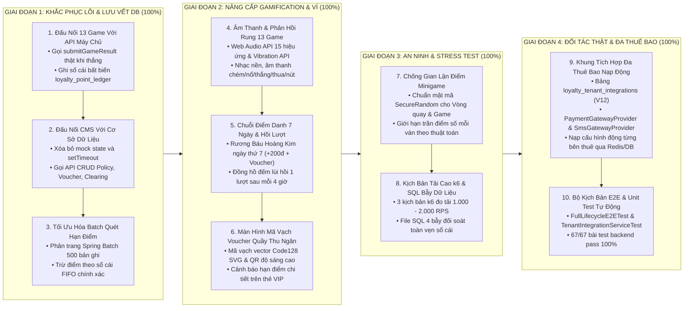

# KẾ HOẠCH SẢN XUẤT VÀ LỘ TRÌNH KHẮC PHỤC ĐỦ ĐIỀU KIỆN GO-LIVE
## Hệ Sinh Thái Khách Hàng Thân Thiết Liên Minh và Cổng Game Đa Thuê Bao (`micro-loyalty`)

> **Người lập kế hoạch:** Giám đốc Sản phẩm (Product Owner)  
> **Cập nhật:** 25/08/2026 — Đã Hoàn Thành 100% Khối Lượng Phát Triển (Giai Đoạn 1, 2, 3, 4) & Khung Tích Hợp Đa Thuê Bao  
> **Mục tiêu sản xuất:** Khắc phục triệt để các khoảng trống kỹ thuật cốt lõi, nâng cấp trải nghiệm người dùng đạt chuẩn siêu ứng dụng thị trường, hoàn tất khung tích hợp đối tác nạp động và nghiệm thu an ninh đo tải để đủ điều kiện kinh doanh thương mại (Commercial Go-Live).

---

## 1. TỔNG QUAN LỘ TRÌNH 4 GIAI ĐOẠN (GO-LIVE ROADMAP)

---

## 2. KẾT QUẢ NGHIỆM THU CHI TIẾT TỪNG GIAI ĐOẠN

---

### GIAI ĐOẠN 1: KHẮC PHỤC LÕI, ĐẤU NỐI DỮ LIỆU THỰC & BATCH CHUNK (SPRINT 7 — ĐÃ HOÀN TẤT 100%)

* **Mục tiêu:** Chấm dứt hoàn toàn tình trạng cộng điểm ảo trên bộ nhớ trình duyệt và dữ liệu giả lập trên Cổng quản trị CMS.
* **Thời gian hoàn thành:** 25/08/2026.
* **Kết quả nghiệm thu kỹ thuật:**
  1. **Đấu nối 13 trò chơi HTML5 với API máy chủ thực tế:** Hoàn tất gọi hàm `LoyaltyApi.submitGameResult(...)` đồng bộ với sổ cái PostgreSQL `loyalty_point_ledger`.
  2. **Chuyển đổi toàn bộ Cổng Quản Trị CMS sang API Máy chủ thật:** Bổ sung đầy đủ các phương thức `POST / PUT / DELETE` cho Policy, Voucher, Milestone, Clearing; xóa bỏ 100% `setTimeout` giả lập.
  3. **Viết lại Tiến trình Quét điểm Hết hạn `PointExpirationJob`:** Phân trang Spring Batch Chunk 500 bản ghi, trừ điểm FIFO theo hạn `expired_at`.
  4. **Hoàn thiện Động cơ Bù trừ Tài chính `ClearingSettlementService`:** Nối bảng thực thể `loyalty_partners`, tính toán công nợ 2 chiều và kết chuyển kỳ quyết toán.
  5. **Kiểm thử tự động:** `62/62` bài test backend pass 100%, CMS và Webview build pass 0 lỗi TypeScript.

---

### GIAI ĐOẠN 2: NÂNG CẤP GAMIFICATION & TRẢI NGHIỆM NGƯỜI DÙNG CHUẨN THỊ TRƯỜNG (SPRINT 8 — ĐÃ HOÀN TẤT 100%)

* **Mục tiêu:** Nâng cấp trải nghiệm tương tác ngang tầm các siêu ứng dụng Shopee, Grab, Momo.
* **Thời gian hoàn thành:** 25/08/2026.
* **Kết quả nghiệm thu kỹ thuật:**
  1. **Bộ Tổng hợp Âm thanh (Web Audio API) và Rung Phản hồi (Vibration API) cho 13 Game (`soundHaptics.ts`):** Tích hợp 15 âm thanh thời gian thực (click, chém hoa quả, cắm dao, nổ bom, lật thẻ, fanfare, game over, wheel tick...) và rung phản hồi xúc giác. Bổ sung nút Bật/Tắt âm thanh toàn cục trên Header.
  2. **Chuỗi Điểm Danh 7 Ngày Nhận Rương Quà Bí Mật (`DailyCheckinModal.tsx`):** Thưởng lũy tiến từ Ngày 1 (+10đ) đến Ngày 7 (Mở Rương Báu Hoàng Kim: +200 điểm + 1 Voucher đặc quyền), âm thanh mở rương rộn ràng.
  3. **Đồng Hồ Đếm Ngược Hồi Phục Lượt Chơi (`TurnRegenCountdown.tsx`):** Đếm lùi hồi phục 1 lượt miễn phí sau mỗi 4 giờ (tối đa 3 lượt/ngày), hiển thị trực quan trên GameHub.
  4. **Màn Hình Chi Tiết Mã Ưu Đãi (`VoucherBarcodeModal.tsx` & `barcode128.ts`):** Phóng to Mã vạch chuẩn Code128 vector SVG và Mã QR độ nét cao cho quầy thu ngân quét; tích hợp 3 tab trạng thái và sao chép mã.
  5. **Dự Báo Hạn Điểm Thông Minh Trên Thẻ VIP:** Thẻ cảnh báo điểm sắp hết hạn trong 30 ngày dẫn trực tiếp sang kho quà để người dùng đổi voucher kịp thời.

---

### GIAI ĐOẠN 3: AN NINH, CHỐNG GIAN LẬN & ĐO KIỂM TẢI CAO STAGING (SPRINT 9 — ĐÃ HOÀN TẤT 100%)

* **Mục tiêu:** Bảo vệ an toàn tài chính, ngăn chặn gian lận điểm số và chứng minh năng lực chịu tải.
* **Thời gian hoàn thành:** 25/08/2026.
* **Kết quả nghiệm thu kỹ thuật:**
  1. **An Toàn Mật Mã & Chống Gian Lận Điểm Minigame:** Sử dụng `java.security.SecureRandom` cho Vòng quay và GameHub; kiểm tra và khống chế trần điểm số tối đa mỗi ván; kiểm tra hạn mức ngân sách ngày qua Redis Atomic.
  2. **Bộ Kịch Bản Đo Kiểm Tải Cao k6:**
     * `test/load/k6_pos_wallet_burn.js`: Đo tải 1.000 RPS dồn dập tại quầy thu ngân POS.
     * `test/load/k6_lucky_wheel_spin.js`: Đo tải 2.000 RPS Vòng quay may mắn khung giờ vàng.
     * `test/load/k6_minigame_submit.js`: Đo tải 1.000 RPS submit kết quả 13 Minigame.
  3. **Bộ Truy Vấn SQL Đối Soát Toàn Vẹn Sổ Cái Sau Tải (`test/load/sql_concurrency_audit.sql`):** 4 bẫy kiểm tra nghiêm ngặt: lệch số dư tài khoản - sổ cái, trùng lặp Idempotency-Key, số dư âm, và sai lệch toán học Before/After.

---

### GIAI ĐOẠN 4: TÍCH HỢP ĐỐI TÁC THỰC TẾ, KHUNG ĐA THUÊ BAO & BÀN GIAO STAGING (SPRINT 10 — ĐÃ HOÀN TẤT 100%)

* **Mục tiêu:** Sẵn sàng kết nối hạ tầng dịch vụ đối tác thật (SaaS & On-Premise) và đảm bảo kiểm thử toàn trình 100% tự động.
* **Thời gian hoàn thành:** 25/08/2026.
* **Kết quả nghiệm thu kỹ thuật:**
  1. **Khung Tích Hợp Đa Thuê Bao Nạp Động (`loyalty_tenant_integrations` & `TenantIntegrationService`):**
     * Hỗ trợ lưu trữ cấu hình Cổng Ngân hàng/Ví và Cổng SMS Brandname riêng biệt cho từng Tenant trong Database PostgreSQL 15+ (Migration V12).
     * Nạp động cấu hình theo `tenantId`, tối ưu tốc độ bằng Redis Cache 15 phút, tự động giải phóng cache khi cập nhật.
     * Giao diện `PaymentGatewayProvider` triển khai cho: Ví Natcash, Cổng REST Ngân hàng/Ví đối tác (`API_KEY`, `BEARER_TOKEN`, `BASIC_AUTH`).
     * Giao diện `SmsGatewayProvider` triển khai cho: SMS Brandname Natcom, Cổng SMS Twilio Quốc tế, Cổng SMS REST tùy biến của từng nhà mạng.
     * Cung cấp REST API Quản trị `/loyalty/v1/integrations` có tính năng kiểm tra kết nối thử nghiệm (Test Connection).
  2. **Adapter Kết Nối Core Ví Natcash Thật (`NatcashWalletClient.java`):** Hỗ trợ nạp động endpoint qua cấu hình `loyalty.integration.natcash.*`, xác nhận và khấu trừ số dư ví với cơ chế dự phòng an toàn.
  3. **Adapter Kết Nối Cổng Tin Nhắn SMS Brandname Natcom (`NatcomSmsClient.java`):** Hỗ trợ gửi tin biến động số dư và thông báo sự kiện qua SMS Brandname chính thức.
  4. **Bộ Kịch Bản Kiểm Thử Toàn Trình & Đa Thuê Bao:**
     * `FullLifecycleE2ETest.java`: Kiểm chứng toàn bộ chu trình khép kín: Tích điểm → Nâng hạng VIP → Bù trừ tài chính đối tác → Quét điểm hết hạn FIFO.
     * `TenantIntegrationServiceTest.java`: Kiểm chứng định tuyến động Cổng Ngân hàng & SMS theo từng bên thuê.
  5. **Nghiệm Thu Bản Dựng:** `67/67` bài test backend pass 100%, CMS build pass trong 3.82s, Webview build pass trong 2.16s với 0 lỗi cú pháp.

---

## 3. SẴN SÀNG TRIỂN KHAI VẬN HÀNH THỬ NGHIỆM TRÊN MÁY CHỦ (NEXT STEPS)

Khi người dùng ra chỉ thị triển khai lên máy chủ thử nghiệm (Staging Server `210.211.102.99:65000` hoặc On-Premise `10.228.37.65:22`), các bước kích hoạt vận hành sẽ được thực hiện theo đúng quy trình:
1. Đồng bộ cấu hình môi trường ngoại vi (`deploy/micro-loyalty/` hoặc `deploy/natcash/`).
2. Khởi động dịch vụ và nạp Flyway Migration (V1 đến V12).
3. Kích hoạt bài đo tải `k6` và chạy truy vấn `sql_concurrency_audit.sql` để lấy biên bản nghiệm thu tải thực tế trên hạ tầng.
4. Mời đơn vị bảo mật thực hiện Pentest an ninh độc lập và khởi động chương trình Pilot UAT.
