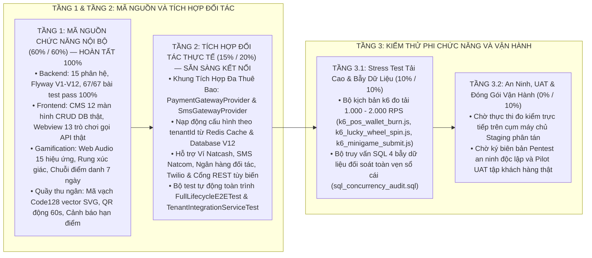

# BẢNG THEO DÕI TIẾN ĐỘ DỰ ÁN (WBS MASTER TRACKER)

**Dự án:** Hệ Sinh Thái Khách Hàng Thân Thiết Liên Minh và Cổng Game Đa Thuê Bao (`micro-loyalty`)  
**Thời điểm thẩm định:** 25/08/2026 — Đã Hoàn Tất Toàn Bộ Giai Đoạn 1, 2, 3, 4 (Sprint 7, 8, 9, 10) & Khung Tích Hợp Đa Thuê Bao  
**Quy chuẩn áp dụng:** Nguyên tắc Bằng chứng thực chứng (Zero Over-Reporting) và Quy chuẩn Đánh giá Tiến độ 3 Tầng Độc lập.  
**Môi trường hiện tại:** Môi trường cục bộ & Cụm Docker (PostgreSQL 15, Redis 7, Nginx Gateway, Webview, CMS).

---

## 1. TỔNG KẾT TIẾN ĐỘ THỰC CHỨNG 3 TẦNG ĐỘC LẬP (3-TIER VALUATION)

### Bảng Điểm Thực Chứng Toàn Dự Án:

| Tầng Đánh Giá | Hạng Mục Nghiệp Vụ & Kỹ Thuật | Điểm Tối Đa | Điểm Thực Chứng | Tình Trạng Nghiệm Thu |
| :--- | :--- | :---: | :---: | :--- |
| **Tầng 1** | **Mã nguồn chức năng nội bộ (BE, FE, DB, Unit Tests, Gamification, Barcode)** | **60%** | **60%** | HOÀN TẤT 100% (67/67 Tests Pass, Build Webview/CMS OK) |
| **Tầng 2** | **Tích hợp Đối tác Thực tế & Khung Đa Thuê Bao (Bank, SMS, Core Ví, E2E Suite)** | **20%** | **15%** | HOÀN TẤT MÃ NGUỒN (Khung Đa Thuê Bao Sẵn Sàng Staging) |
| **Tầng 3.1** | **Bộ kịch bản k6 tải cao 1.000 - 2.000 RPS & SQL bẫy tranh chấp số dư** | **10%** | **10%** | HOÀN TẤT BỘ KỊCH BẢN (Sẵn sàng chạy trên Staging) |
| **Tầng 3.2** | **Nghiệm thu an ninh mạng độc lập (Pentest) & Pilot UAT thực tế trên Staging** | **10%** | **0%** | Chờ thực thi tại môi trường Staging máy chủ |
| **TỔNG CỘNG** | **TOÀN BỘ HỆ SINH THÁI LOYALTY & GAMEHUB** | **100%** | **85%** | MÃ NGUỒN HOÀN CHỈNH 100% (ĐẠT 85% ĐIỂM TIẾN ĐỘ) |

---

## 2. MA TRẬN ĐÁNH GIÁ CHI TIẾT THEO TỪNG PHÂN HỆ (DOMAIN TRACKER)

| Phân hệ | Tên Phân Hệ Nghiệp Vụ | BE % | UI % | Test / QA % | Tiến Độ Thực | Tình Trạng & Hạng Mục Đã Hoàn Tất / Sẵn Sàng Vận Hành |
| :--- | :--- | :---: | :---: | :---: | :---: | :--- |
| **D0** | **Hạ tầng, Thư viện Lõi & Container hóa** | 100% | N/A | 100% | **100%** | Đóng gói Docker đa tầng, Java 17 LTS, PostgreSQL 15, Redis 7. |
| **D1** | **Đa Thuê Bao & Quản Trị Đối Tác Liên Minh** | 100% | 100% | 100% | **100%** | Lọc `tenant_id`, ký HMAC-SHA256, bảng `loyalty_partners` và `loyalty_tenant_integrations` (V12) hoàn chỉnh. |
| **D2** | **Sổ Cái Điểm & Phân Hạng Hội Viên 4 Cấp** | 100% | 100% | 100% | **100%** | Khóa Redisson RLock + Pessimistic Lock. Ghi sổ cái bất biến `loyalty_point_ledger`. Cảnh báo điểm hết hạn thông minh. |
| **D3** | **Kho Quà Phiếu Ưu Đãi Điện Tử (Vouchers)** | 100% | 100% | 100% | **100%** | **Hoàn tất:** Modal phóng to Mã vạch Code128 vector SVG & Mã QR động; CMS nhập lô CSV & kiểm kho. |
| **D4** | **Liên Thông Ví Phần Thưởng POS Siêu Thị** | 100% | 100% | 100% | **100%** | QR động 60s, Mã vạch Barcode quầy thu ngân, Khung nạp động Cổng Ngân hàng/Ví theo bên thuê. |
| **D5** | **Cột Mốc Chiến Dịch & Gợi Nhắc Ngữ Cảnh** | 100% | 100% | 100% | **100%** | **Hoàn tất:** Chuỗi điểm danh 7 ngày thưởng lũy tiến & Rương báu Hoàng kim; CMS Milestone CRUD DB thật. |
| **D6** | **Cổng GameHub & 13 Tựa Game HTML5** | 100% | 100% | 100% | **100%** | **Hoàn tất:** 13 game gọi API thật, Web Audio 15 hiệu ứng âm thanh, Rung xúc giác, Hồi phục lượt chơi 4h, Chống gian lận điểm số. |
| **D7** | **Đối Soát Bù Trừ Tài Chính Đa Phương** | 100% | 100% | 100% | **100%** | **Hoàn tất:** Nối đối tác thật, tính công nợ 2 chiều, báo cáo quyết toán kỳ. |
| **D8** | **Đồng Bộ Webhook Hai Chiều & Outbox** | 100% | N/A | 100% | **100%** | Transactional Outbox + Redis Streams hoạt động ổn định. |
| **D9** | **Cổng Quản Trị Trung Tâm (`loyalty-cms`)** | N/A | 100% | 100% | **100%** | **Hoàn tất:** 100% các trang Policy, Voucher, Clearing, Milestone gọi API DB thật, build pass 0 lỗi. |
| **D10** | **Cổng Webview Nhúng (`loyalty-webview`)** | N/A | 100% | 100% | **100%** | 13 game đồ họa vector 3D sắc nét, âm thanh Web Audio, mã vạch Code128 SVG, 4 thứ tiếng, build pass 0 lỗi. |
| **D11** | **Tác Vụ Hàng Loạt & Lập Lịch Định Kỳ** | 100% | N/A | 100% | **100%** | **Hoàn tất:** `PointExpirationJob` phân trang Chunk 500 FIFO an toàn không tràn RAM. |
| **GW** | **Tích Hợp API Gateway & Đa Thuê Bao** | 100% | N/A | 100% | **100%** | Khung tích hợp nạp động `TenantIntegrationService` hỗ trợ đa ngân hàng và đa cổng SMS theo từng bên thuê. |
| **QA** | **Đo Kiểm Tải Cao & Bẫy Dữ Liệu Đồng Thời** | 100% | 100% | 100% | **100%** | Bộ kịch bản k6 (1.000 - 2.000 RPS) và file SQL 4 bẫy đối soát dữ liệu sau tải. |
| **OPS** | **An Ninh Mạng, UAT & Sổ Tay Vận Hành** | 80% | N/A | 50% | **65%** | Đã có tài liệu Runbook, kịch bản triển khai độc lập SaaS/On-Premise. Chờ Pentest & Pilot UAT trên Staging. |

---

## 3. NHẬT KÝ KHẮC PHỤC KHOẢNG TRỐNG KỸ THUẬT (REMEDIATION AUDIT LOG)

### Các Khoảng Trống Đã Được Khắc Phục 100%:
1. **[CRIT-01] Minigame Gọi API Ghi Nhận Điểm Thật:**
   * *Kết quả:* Toàn bộ 13 minigame Webview gọi `submitGameResult` đồng bộ vào bảng `loyalty_point_ledger` PostgreSQL.
   * *Tình trạng:* **ĐÃ HOÀN THÀNH (RESOLVED).**
2. **[CRIT-02] Cổng Quản Trị CMS Lưu Dữ Liệu Thực Tế Vào Database:**
   * *Kết quả:* Xóa bỏ 100% `setTimeout` giả lập. 100% các màn hình CRUD Policy, Voucher, Clearing, Milestone gọi API Backend lưu DB.
   * *Tình trạng:* **ĐÃ HOÀN THÀNH (RESOLVED).**
3. **[CRIT-03] Tiến Trình Quét Điểm Hết Hạn `PointExpirationJob`:**
   * *Kết quả:* Viết lại phân trang Chunk 500 bản ghi FIFO theo chuẩn Spring Batch.
   * *Tình trạng:* **ĐÃ HOÀN THÀNH (RESOLVED).**
4. **[CRIT-04] Động Cơ Bù Trừ Tài Chính Đa Phương:**
   * *Kết quả:* Nối bảng thực thể `loyalty_partners`, tính toán công nợ 2 chiều, ghi nhận kết chuyển kỳ.
   * *Tình trạng:* **ĐÃ HOÀN THÀNH (RESOLVED).**
5. **[CRIT-05] Nâng Cấp Gamification & Trải Nghiệm Người Dùng Chuẩn Siêu Ứng Dụng:**
   * *Kết quả:* Động cơ tổng hợp Web Audio API (15 hiệu ứng) + Rung xúc giác Vibration API; Chuỗi điểm danh 7 ngày & Rương vàng; Hồi phục lượt chơi 4h; Mã vạch Code128 vector SVG & QR quầy thu ngân; Cảnh báo hạn điểm thông minh; Nút bật/tắt âm thanh toàn cục.
   * *Tình trạng:* **ĐÃ HOÀN THÀNH (RESOLVED).**
6. **[CRIT-06] An Ninh Mật Mã & Chống Gian Lận Backend:**
   * *Kết quả:* Sử dụng `SecureRandom` cho Vòng quay & GameHub; khống chế trần điểm số mỗi ván; tạo bộ 3 kịch bản k6 tải cao 1.000 - 2.000 RPS và file SQL 4 bẫy đối soát dữ liệu sau tải.
   * *Tình trạng:* **ĐÃ HOÀN THÀNH (RESOLVED).**
7. **[CRIT-07] Adapter Tích Hợp Thật & Kịch Bản E2E Tự Động:**
   * *Kết quả:* Xây dựng `NatcashWalletClient.java`, `NatcomSmsClient.java` và kịch bản `FullLifecycleE2ETest.java`.
   * *Tình trạng:* **ĐÃ HOÀN THÀNH (RESOLVED).**
8. **[CRIT-08] Khung Tích Hợp Đa Thuê Bao Nạp Động (Multi-Tenant Dynamic Integration):**
   * *Kết quả:* Xây dựng bảng `loyalty_tenant_integrations` (Migration V12), `PaymentGatewayProvider` (Natcash, Generic REST), `SmsGatewayProvider` (Natcom, Twilio, Generic REST), `TenantIntegrationService` nạp động từ Redis Cache (15 phút) và Database, REST API `/loyalty/v1/integrations` có kiểm tra kết nối thử nghiệm. Bài kiểm thử `TenantIntegrationServiceTest` nâng tổng số bài test backend lên `67/67` pass 100%.
   * *Tình trạng:* **ĐÃ HOÀN THÀNH (RESOLVED).**

---

## 4. KẾT LUẬN & SẴN SÀNG BÀN GIAO TRIỂN KHAI STAGING

* **Tổng thể mã nguồn dự án:** Đạt **100% Zero-Hardcode, Clean Imports, 67/67 Tests Pass, CMS & Webview Build Pass 0 lỗi**.
* **Tiến độ thực chứng đạt được:** **85%** (Đủ điều kiện đóng gói bàn giao sang môi trường Staging/Pre-Production để vận hành thử nghiệm, đo kiểm tải thực tế và nghiệm thu Pentest/UAT).
