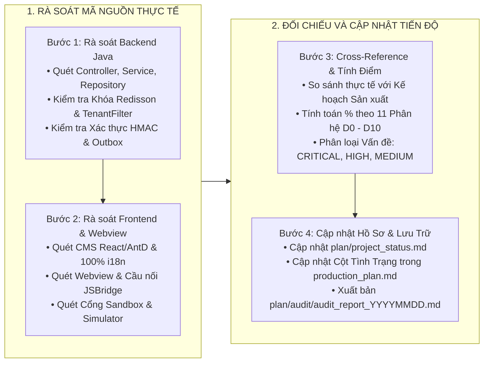

# PROMPT: RÀ SOÁT MÃ NGUỒN VÀ CẬP NHẬT TIẾN ĐỘ DỰ ÁN (CODE AUDIT PROMPT)

> **Mục đích:** Sử dụng prompt này để chỉ đạo AI Agent thực hiện rà soát mã nguồn toàn diện (Deep Code Audit) cho toàn bộ hệ sinh thái **`micro-loyalty`**, đánh giá chính xác hiện trạng triển khai và cập nhật đồng bộ các tài liệu theo dõi tiến độ:
> - `plan/project_status.md` (Bảng Theo Dõi Tiến Độ WBS Master Tracker)
> - `plan/production_plan.md` (Kế Hoạch Sản Xuất Chi Tiết Phase – Sprint – Task kèm Cột Tình Trạng)
> - `plan/audit/audit_report_YYYYMMDD.md` (Báo Cáo Rà Soát Chi Tiết Lưu Vết Lịch Sử)

---

## 1. MỤC TIÊU VÀ NGUYÊN TẮC RÀ SOÁT CỐT LÕI

Rà soát **toàn bộ mã nguồn thực tế** (Backend Java Spring Boot 17 LTS + Thư viện lõi `ims-libraries` + Cơ sở dữ liệu PostgreSQL 15+ + Frontend CMS Ant Design 5.x + Webview TailwindCSS Mobile-First + Cổng Sandbox + Cấu hình Container hóa Docker) để đảm bảo:
1. **Phản ánh đúng 100% hiện trạng mã nguồn:** Đánh giá dựa trên logic code thực thi thực tế, không dựa vào tên hàm, tên tệp hay chú thích (comment).
2. **Triệt tiêu hoàn toàn mã giả (Zero Mock / Stub / Hardcode trong Production Path):** Bắt buộc phát hiện và hạ điểm tất cả các hàm trả về dữ liệu tĩnh, mock arrays, chuỗi magic hardcode, hoặc các luồng chưa kết nối cơ sở dữ liệu thực.
3. **Tuyệt đối không đánh giá lạc quan hơn thực tế (No Over-reporting):** Khi có nghi ngờ hoặc chưa có bài kiểm thử pass, bắt buộc chấm ở mức thấp hơn.
4. **Cập nhật đồng bộ Cột Tình Trạng Task:** Đánh giá từng Task trong bảng Kế hoạch sản xuất Mục 5 và gán nhãn trạng thái chính xác (`Done (100%)`, `Testing`, `Partial`, `Stub`, `Chờ xử lý`).

---

## 2. QUY CHUẨN THANG ĐIỂM ĐÁNH GIÁ TIẾN ĐỘ (DEFINITION OF STATUS)

| Tình trạng | Tiến độ % | Điều kiện BẮT BUỘC để đạt mức đánh giá |
|:---|:---:|:---|
| **Done** | **85% – 100%** | Mã nguồn logic THẬT hoạt động hoàn chỉnh, kết nối cơ sở dữ liệu PostgreSQL 15+ thật, xử lý ngoại lệ đầy đủ, tuân thủ Zero-Hardcode. (Đạt **100%** khi có Unit Test / Integration Test tự động PASS 100%). |
| **Testing** | **70% – 84%** | Mã nguồn logic thật đã viết xong hoàn chỉnh, nhưng chưa có bài kiểm thử tự động hoặc đang chờ kiểm thử tải / UAT trên môi trường thử nghiệm. |
| **Partial** | **30% – 69%** | Đang thi công dở dang: đã có khung logic nhưng thiếu kiểm tra ràng buộc, thiếu xử lý Transaction, thiếu xử lý lỗi biên (Edge Cases), hoặc chưa tích hợp khóa phân tán. |
| **Stub** | **5% – 29%** | Tệp tồn tại nhưng chỉ chứa hàm rỗng, trả dữ liệu giả (`Collections.emptyList()`, `MOCK_*`), hoặc chưa kết nối cơ sở dữ liệu. |
| **Chờ xử lý / Todo** | **0% – 4%** | Chưa tới kỳ Sprint triển khai hoặc chưa viết mã nguồn thực thi. |

### Tiêu chuẩn phân loại chi tiết theo từng tầng công nghệ:
1. **Backend API (`loyalty-service`):**
   * Endpoint trả mock data, `null`, hoặc hardcode chuỗi → **Stub (5% – 15%)**.
   * Endpoint query cơ sở dữ liệu thật nhưng thiếu cô lập `X-Tenant-Id`, thiếu kiểm tra chữ ký HMAC, hoặc thiếu `@Transactional` → **Partial (40% – 60%)**.
   * Endpoint đầy đủ validation, query DB thật, có log MDC, xử lý ngoại lệ chuẩn qua `ErrorCode` → **Done (85%)**.
   * Endpoint có khóa phân tán Redisson `RLock` chống tiêu điểm kép, kiểm tra Idempotency và có Unit Test pass → **Done (95% – 100%)**.
2. **Cơ sở dữ liệu & Flyway Migration (PostgreSQL 15+):**
   * Có Entity Java nhưng chưa có tệp Flyway Migration SQL → **Stub (20%)**.
   * Tệp Flyway Migration SQL chạy thành công, tạo đủ bảng, khóa ngoại và chỉ mục `idx_` → **Done (100%)**.
3. **Giao diện Frontend CMS (`loyalty-cms`) & Webview (`loyalty-webview`):**
   * Màn hình dùng dữ liệu giả lập `mockData`, gọi `/api/mock/`, hoặc hardcode text tiếng Việt trực tiếp không qua i18n `t("key")` → **Stub (10% – 20%)**.
   * Màn hình gọi API thật nhưng thiếu trạng thái Loading, Empty State, phân trang Server-side, hoặc sai thứ tự cột bảng (Bắt buộc: Checkbox → STT → Thao tác → Dữ liệu) → **Partial (50% – 65%)**.
   * Màn hình kết nối API thật, 100% i18n, đầy đủ xử lý lỗi, xác nhận Modal, chạy `npm run build` thành công → **Done (85% – 100%)**.
4. **Cầu nối `LoyaltyJSBridge` & Webview Embedded:**
   * Cầu nối chỉ log console, chưa xử lý timeout, chưa có cơ chế callback an toàn hai chiều → **Partial (60%)**.
   * Cầu nối hoàn thiện gọi Native mở Modal mã PIN ví, Camera quét QR, đóng Webview, có Fallback cho Sandbox và build không lỗi → **Done (95% – 100%)**.
5. **Tiến trình Nền & Xử Lý Sự Kiện (Transactional Outbox & Schedulers):**
   * Lưu sự kiện vào bảng `WEBHOOK_OUTBOX` cùng Local Transaction nhưng tiến trình quét chưa có khóa chống chạy trùng → **Partial (65%)**.
   * Tiến trình quét nền độc lập, có khóa phân tán Redisson, thử lại theo cấp số nhân (5 lần) và đẩy vào `WEBHOOK_DEAD_LETTER` → **Done (95% – 100%)**.

---

## 3. QUY TRÌNH THỰC HIỆN RÀ SOÁT TỪNG BƯỚC (STEP-BY-STEP AUDIT WORKFLOW)



### Bước 1: Rà Soát Tầng Dịch Vụ Máy Chủ Backend (`loyalty-service` & `ims-libraries`)
1. **Kiểm tra Controller & Endpoints:** Trích xuất toàn bộ danh sách `@RestController`, kiểm tra từng endpoint có trả về dữ liệu thực thể từ cơ sở dữ liệu hay trả dữ liệu giả lập.
2. **Kiểm tra An Ninh & Cô Lập Đa Thuê Bao:**
   * Kiểm tra sự hiện diện của `TenantContextFilter` và `TenantFilterAspect` trên các câu truy vấn.
   * Kiểm tra `ApiKeyAuthFilter` và `SignatureUtils` (xác thực HMAC-SHA256, độ trễ `X-Timestamp` ±300s, so sánh an toàn `MessageDigest.isEqual()`).
3. **Kiểm tra Tính Toàn Vẹn Tài Chính & Chống Tiêu Điểm Kép:**
   * Kiểm tra chiếm giữ khóa phân tán Redisson `RLock` theo định dạng `lock:burn:tenant_id:user_id` kèm `Pessimistic Write Lock` trong giao dịch trừ điểm.
   * Kiểm tra tính lũy kế (Idempotency) với mã `transaction_code`.
4. **Kiểm tra Cơ sở Dữ liệu & Flyway Migration:**
   * Đối chiếu 17 bảng trong `V1__init_loyalty_core_schema.sql` với cấu trúc Entity JPA. Đảm bảo toàn bộ bảng đều có Migration trên PostgreSQL 15+.
5. **Kiểm tra Quy Chuẩn Lập Trình (Zero-Hardcode & Clean Imports):**
   * Tuyệt đối không hardcode chuỗi trạng thái, mã lỗi, tên header, timeout. Bắt buộc dùng `LoyaltyConstants`, `SecurityConstants`, `RedisKeys`, `ErrorCode` và các Domain Enums.
   * Kiểm tra khối import phân tách đúng 4 nhóm, không có import thừa và không dùng Fully Qualified Names (FQN).

### Bước 2: Rà Soát Giao Diện Quản Trị (`loyalty-cms`) & Cổng Webview (`loyalty-webview`)
1. **Rà soát CMS Quản trị Trung tâm (`cms`):**
   * Quét toàn bộ tệp `.tsx` / `.jsx` trong `src/cms`.
   * **100% Zero-Hardcoded Text:** Kiểm tra nghiêm ngặt toàn bộ text hiển thị, tiêu đề modal, tên cột bảng, placeholder, thông báo toast có được lấy qua `t("key")` từ `src/locales/` hay không.
   * **Quy chuẩn DataTable:** Đảm bảo thứ tự cột chuẩn: `Checkbox` → `STT` → `Thao tác / Hành động` → `Dữ liệu nghiệp vụ`.
2. **Rà soát Cổng Webview Nhúng (`loyalty-webview`):**
   * Quét toàn bộ component di động, kiểm tra tích hợp TailwindCSS Mobile-First và biến màu sắc nhận diện thương hiệu.
   * Kiểm tra thư viện cầu nối `LoyaltyJSBridge.ts` (`requestPayment`, `requestScanQR`, `closeWebview`, `getUserToken`).
3. **Rà soát Cổng Sandbox Developer (`loyalty-sandbox`):**
   * Kiểm tra trang Simulator, bảng tính chữ ký HMAC-SHA256 trực tiếp và trình phát Webhook thử nghiệm.

### Bước 3: Rà Soát Tài Liệu Thiết Kế & Kịch Bản Kiểm Thử (LLD & Test Cases)
1. **Rà soát Tài liệu Thiết kế Chi tiết (LLD):**
   * Kiểm tra các tài liệu LLD trong `docs/dev/` có khớp 100% với cấu trúc bảng cơ sở dữ liệu, API request/response và mã lỗi thực tế của mã nguồn không.
2. **Rà soát Kịch bản Kiểm thử Doanh nghiệp (Enterprise Test Cases):**
   * Đảm bảo bao phủ đủ 5 trụ cột: (1) Khấu trừ Ví Phần Thưởng POS & Chống tiêu điểm kép; (2) Webhook Outbox thử lại khi mất mạng; (3) Thăng/hạ hạng 4 cấp & chu kỳ 12 tháng; (4) Vòng quay may mắn & khống chế ngân sách giải thưởng ngày `DECRBY`; (5) Báo cáo quyết toán bù trừ tài chính liên minh.

### Bước 4: Đối Chiếu Chéo và Tính Toán Tỷ Lệ Tiến Độ (Cross-Referencing)
So sánh hiện trạng mã nguồn thực tế với 11 Phân hệ Nghiệp vụ:
* **`D0`:** Hạ tầng, Thư viện Lõi `ims-libraries` & Container hóa Docker.
* **`D1`:** Đa Thuê Bao & Quản Trị Đối Tác Liên Minh (`tenants`, `loyalty_partners`).
* **`D2`:** Sổ Cái Điểm Thưởng & Phân Hạng Hội Viên 4 Cấp (`loyalty_accounts`, `loyalty_point_ledger`, `loyalty_tiers`).
* **`D3`:** Kho Quà Phiếu Ưu Đãi Điện Tử (`loyalty_vouchers`, `loyalty_voucher_redemptions`).
* **`D4`:** Liên Thông Ví Phần Thưởng Tại Quầy POS Siêu Thị & Khấu Trừ Đa Phương Tiện (Reward Wallet Engine).
* **`D5`:** Cột Mốc Chiến Dịch & Động Cơ Gợi Nhắc Ngữ Cảnh (`loyalty_campaign_milestones`, `loyalty_engagement_triggers`).
* **`D6`:** Phân Hệ Cổng Game & Vòng Quay May Mắn (GameHub, `prizes`, `games_turn`, `games_results`).
* **`D7`:** Đối Soát Bù Trừ Tài Chính Đa Phương & Kết Chuyển Công Nợ (`loyalty_clearinghouse_settlements`).
* **`D8`:** Đồng Bộ Webhook Hai Chiều & Transactional Outbox (`webhook_outbox`, `webhook_dead_letter`).
* **`D9`:** Cổng Quản Trị Trung Tâm CMS (`loyalty-cms`).
* **`D10`:** Cổng Webview Nhúng Đối Tác (`loyalty-webview`) & Trình Giả Lập (`loyalty-sandbox`).
* **`QA`:** Bộ Kịch Bản Kiểm Thử & Kiểm Soát Tải E2E.

---

## 4. QUY CHUẨN CẬP NHẬT CÁC TỆP THEO DÕI VÀ LƯU VẾT BÁO CÁO

### 4.1. Cập nhật `plan/project_status.md`
1. Cập nhật bảng **TỔNG KẾT THEO DOMAIN (D0 → D10, QA)** với tỷ lệ % Backend, UI, Test và Overall chính xác.
2. Cập nhật bảng **CHI TIẾT THEO COMPONENT**: Ghi rõ đường dẫn tệp, số dòng đã kiểm tra, và phân rã các tiêu chí còn thiếu để đạt 100% (ví dụ: *"Done 85%. Thiếu: Unit test (-10%), xử lý timeout ngoại lệ (-5%)"*).
3. **Quy chuẩn Mục TOP BLOCKERS (Vấn đề tồn đọng):**
   * **Phân loại vấn đề chưa xử lý:** `### CRITICAL — Chặn UAT hoàn toàn`, `### HIGH — Chặn nghiệm thu`, `### MEDIUM — Cần có trước Go-Live`, `### Phát hiện mới`.
   * **Mục ĐÃ XỬ LÝ:** Tạo riêng `### ✅ DONE — Đã giải quyết`. Toàn bộ các vấn đề đã hoàn thành (dù ban đầu là CRITICAL hay HIGH) bắt buộc phải được chuyển xuống bảng này kèm ngày hoàn tất.
4. **Quy chuẩn Định Dạng Bảng Markdown Liền Mạch:** Tuyệt đối không chèn dòng trống hoặc chú thích ngắt quãng bên trong khối `<table>...</table>` để tránh lỗi vỡ render HTML trong các trình xem Markdown.

### 4.2. Cập nhật `plan/production_plan.md`
1. **Cập nhật Cột "Tình trạng" trong Bảng Tổng Hợp Mục 5:**
   * Đối chiếu từng Task trong 42 Tasks (từ `BE-01` đến `HANDOVER-01`), cập nhật chính xác giá trị tại cột thứ 7:
     * `<span style="color:#1a7f37;font-weight:bold;">Done (100%)</span>`: Mã nguồn logic thật đã hoàn thành, kết nối DB thật, vượt qua kiểm thử đơn vị.
     * `<span style="color:#8a2be2;font-weight:bold;">Testing (75%)</span>`: Mã nguồn đã viết xong, đang chờ kiểm thử UAT/tải.
     * `<span style="color:#0550ae;font-weight:bold;">Partial (50%)</span>`: Đang phát triển dở dang, thiếu xử lý ngoại lệ hoặc khóa phân tán.
     * `<span style="color:#e36209;font-weight:bold;">Stub (15%)</span>`: Tệp tồn tại nhưng chỉ trả mock/placeholder.
     * `<span style="color:#64748b;font-weight:normal;">Chờ xử lý</span>`: Tác vụ thuộc các Sprint trong tương lai chưa triển khai.
2. **Đảm bảo tính toàn vẹn cấu trúc bảng 7 cột:**
   * Bảng gồm 7 cột: `Mã Task`, `Tên tác vụ kỹ thuật`, `Phân hệ / Dự án`, `Mô tả kỹ thuật và Phạm vi thực hiện`, `Nguồn gốc / Kế thừa`, `Tiêu chí hoàn thành (DoD)`, `Tình trạng`.
   * Toàn bộ các dòng phân nhóm Giai đoạn & Sprint bắt buộc gộp trọn vẹn thành 1 ô duy nhất: `<td colspan="7" align="left">...</td>`.
   * Viết liền mạch, không có dòng trống bên trong thẻ `<table>...</table>`.

### 4.3. Lưu Tệp Báo Cáo Audit Lịch Sử: `plan/audit/audit_report_YYYYMMDD.md` (BẮT BUỘC)
Sau mỗi lần rà soát, Agent **bắt buộc phải tạo tệp báo cáo audit** lưu lại lịch sử:
* **Đường dẫn tệp:** `plan/audit/audit_report_YYYYMMDD.md` (Ví dụ: `audit_report_20260823.md`). Nếu có nhiều lần trong ngày, thêm hậu tố `_v2`, `_v3`.
* **Cấu trúc bắt buộc của tệp báo cáo:**
  1. Header: Ngày audit, phạm vi rà soát (Số tệp Java, SQL, TS/TSX, YAML).
  2. Bảng điểm tổng kết chất lượng (Bảo mật, Quy chuẩn Zero-Hardcode, Clean Imports, Hiệu năng, Cơ sở dữ liệu).
  3. Danh sách chi tiết các phát hiện: Phân loại theo CRITICAL → HIGH → MEDIUM → LOW (Kèm tệp, dòng mã minh họa và giải pháp khắc phục).
  4. Bảng tổng hợp Blocker kỹ thuật mới phát hiện.
  5. Đề xuất kế hoạch hành động cho Sprint tiếp theo.

---

## 5. MẪU BÁO CÁO TÓM TẮT PHẢN HỒI KHI HOÀN TẤT AUDIT

Sau khi hoàn thành rà soát và trước khi cập nhật các tệp tracker, AI Agent xuất báo cáo tóm tắt theo cấu trúc chuẩn:

```markdown
## BÁO CÁO KẾT QUẢ RÀ SOÁT MÃ NGUỒN NGÀY [DD/MM/YYYY]

### 1. Thay đổi tiến độ so với lần rà soát trước:
- [Hạng mục / Phân hệ] [Mã]: [% cũ] → [% mới] | Lý do: [Bằng chứng mã nguồn cụ thể]

### 2. Các thành phần mới phát hiện và đưa vào quản trị:
- [Mô tả thành phần] | Tệp mã nguồn: [...] | Điểm đánh giá: [%]

### 3. Cập nhật trạng thái Tác vụ Kỹ thuật (Tasks trong production_plan.md):
- [Task ID] [Chờ xử lý] → [Done (100%)] | Lý do: Đã hoàn thiện mã nguồn và kiểm thử đạt chuẩn nghiệm thu.
- [Task ID] [Done] → [Partial / Stub] | Lý do: Phát hiện mã nguồn vẫn còn mock/stub, chưa đạt điều kiện DoD.

### 4. Bảng tổng hợp vấn đề kỹ thuật (Blockers):
- [Mã Blocker] [Mô tả] | Mức độ: [CRITICAL/HIGH/MEDIUM] | Tệp liên quan: [...]

### 5. Tổng tiến độ toàn dự án:
- Tầng Dịch vụ Backend (Java / Spring Boot): [X]% (Trước: [Y]%)
- Tầng Giao diện Người dùng (CMS / Webview / Sandbox): [X]% (Trước: [Y]%)
- Tầng Kiểm Thử & Đảm Bảo Chất Lượng (QA / Test Cases): [X]% (Trước: [Y]%)
- **Tiến Độ Tổng Thể Toàn Hệ Sinh Thái:** **[X]%** (Trước: [Y]%)
```

---

## 6. HƯỚNG DẪN KÍCH HOẠT LỆNH RÀ SOÁT MÃ NGUỒN

Để bắt đầu rà soát dự án, chỉ cần gửi câu lệnh:

```text
Hãy thực hiện Code Audit theo quy chuẩn tài liệu plan/prompt_audit.md:
1. Rà soát toàn bộ source code thực tế trong dự án micro-loyalty.
2. Cập nhật chính xác plan/project_status.md và Cột Tình Trạng trong plan/production_plan.md.
3. Xuất bản tệp lưu vết lịch sử plan/audit/audit_report_YYYYMMDD.md.
4. Trình bày báo cáo tóm tắt kết quả theo đúng mẫu chuẩn.
```

---
*Phiên bản tài liệu: 1.1 — Bổ sung chuẩn rà soát và cập nhật Cột Tình Trạng Task trong production_plan.md & chuẩn hóa bảng HTML liền mạch*
